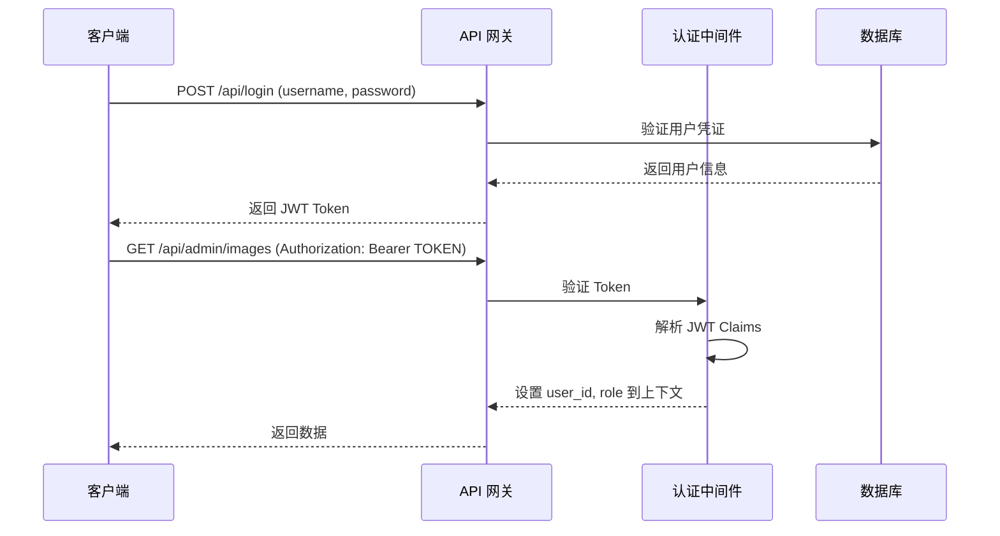
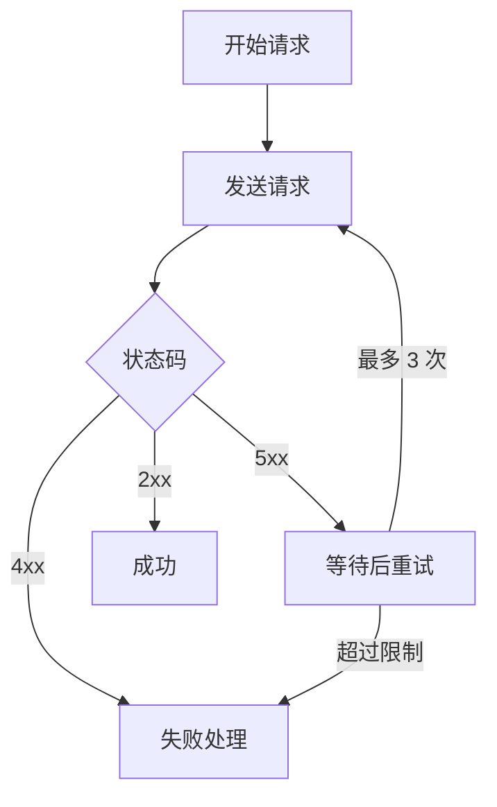
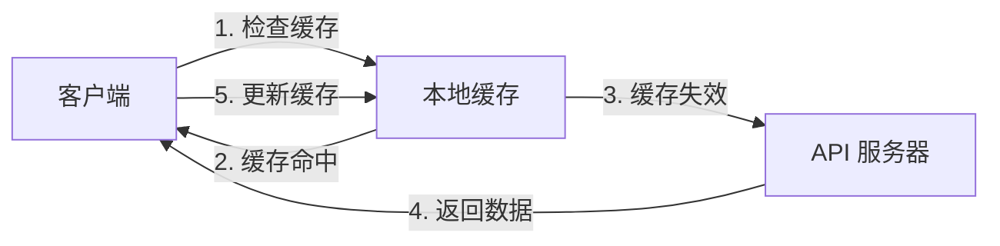

# API 参考文档

**本文档中引用的文件**
- [routes.go](../../../../backend/routes/routes.go)
- [auth.go](../../../../backend/middleware/auth.go)
- [user_controller.go](../../../../backend/controllers/user_controller.go)
- [image_controller.go](../../../../backend/controllers/image_controller.go)
- [content_controller.go](../../../../backend/controllers/content_controller.go)
- [module_controller.go](../../../../backend/controllers/module_controller.go)
- [language_controller.go](../../../../backend/controllers/language_controller.go)
- [models.go](../../../../backend/models/models.go)

## 目录
1. [简介](#简介)
2. [认证和授权](#认证和授权)
3. [公开接口 API](#公开接口-api)
4. [管理接口 API](#管理接口-api)
5. [错误处理](#错误处理)
6. [最佳实践](#最佳实践)

---

## 简介

本系统是一个医疗设备内容管理系统（CMS），提供多语言内容管理、图片管理、模块配置等功能。API 采用 RESTful 风格设计，基于 Gin 框架构建。

### 版本控制策略
- API 版本：v1.0
- URL 格式：`/api/{endpoint}`（公开接口）或 `/api/admin/{endpoint}`（管理接口）
- 内容协商：支持 JSON 格式
- 缓存策略：客户端缓存，通过 HTTP 头控制

### 基础配置
- 服务器端口：8080
- 管理端口：无（共用 8080 端口）
- 数据库连接池：GORM（SQLite/MySQL）
- 请求超时：默认 Gin 配置

### API 路由结构

```mermaid
graph TB
    Root[/:8080]
    API[/api]
    Public[公开接口]
    Admin[管理接口 /admin]
    
    Root --> API
    API --> Public
    API --> Admin
    
    Public --> Login[POST /login]
    Public --> Config[GET /public/config]
    Public --> Modules[GET /public/modules]
    Public --> Images[GET /public/images]
    Public --> Content[GET /public/content]
    Public --> Lang[GET /public/lang]
    
    Admin --> Auth[认证中间件]
    Admin --> AdminImages[图片管理]
    Admin --> AdminConfig[配置管理]
    Admin --> AdminModules[模块管理]
    Admin --> AdminContent[内容管理]
    Admin --> AdminLang[语言管理]
```

**图表来源**
- [routes.go](../../../../backend/routes/routes.go)

---

## 认证和授权

### 认证机制

系统采用 JWT（JSON Web Token）认证方式。管理接口需要携带有效的 JWT Token，公开接口无需认证（除登录接口外）。



**图表来源**
- [auth.go](../../../../backend/middleware/auth.go)(L13-L44)

### 角色定义

| 角色 | 描述 | 权限范围 |
|------|------|----------|
| admin | 管理员 | 所有管理接口访问权限 |

用户角色在 JWT Claims 中存储，认证通过后设置到上下文中供后续使用。

### 认证头部要求

所有需要认证的 API 请求必须包含以下头部信息：

```
Authorization: Bearer <TOKEN>
Content-Type: application/json
```

**章节来源**
- [auth.go](../../../../backend/middleware/auth.go)
- [models.go](../../../../backend/models/models.go)(L10-L14)

---

## 公开接口 API

### 用户登录 API

**端点：** `POST /api/login`

**描述：** 用户登录，获取 JWT Token

**认证要求：** 无需认证

**请求体格式：**
```json
{
  "username": "string (必填)",
  "password": "string (必填)"
}
```

**响应格式：**
```json
{
  "code": 200,
  "data": {
    "token": "JWT_TOKEN_STRING",
    "user": {
      "id": 1,
      "username": "admin",
      "role": "admin"
    }
  }
}
```

**章节来源**
- [user_controller.go](../../../../backend/controllers/user_controller.go)(L19-L44)

### 公共配置 API

**端点：** `GET /api/public/config`

**描述：** 获取所有页面配置（公开访问）

**认证要求：** 无需认证

**查询参数：** 无

**响应格式：**
```json
{
  "code": 200,
  "data": [
    {
      "id": 1,
      "pageName": "home",
      "configData": "{}"
    }
  ]
}
```

**章节来源**
- [module_controller.go](../../../../backend/controllers/module_controller.go)(L57-L64)

### 公共模块配置 API

**端点：** `GET /api/public/modules`

**描述：** 获取所有启用的模块配置（公开访问）

**认证要求：** 无需认证

**响应格式：**
```json
{
  "code": 200,
  "data": [
    {
      "id": 1,
      "moduleName": "banner",
      "enabled": true,
      "zhTitle": "横幅",
      "enTitle": "Banner",
      "imagePath": "/uploads/banner.jpg"
    }
  ]
}
```

**章节来源**
- [module_controller.go](../../../../backend/controllers/module_controller.go)(L219-L226)

### 公共图片 API

**端点：** `GET /api/public/images`

**描述：** 获取公开图片列表

**认证要求：** 无需认证

**查询参数：**
- `category`: 图片分类（可选）

**响应格式：**
```json
{
  "code": 200,
  "data": [
    {
      "id": 1,
      "filename": "banner.jpg",
      "filePath": "uploads/banner.jpg",
      "category": "banner",
      "sortOrder": 0
    }
  ]
}
```

**章节来源**
- [image_controller.go](../../../../backend/controllers/image_controller.go)(L25-L33)

### 公共内容 API

**端点：** `GET /api/public/content`

**描述：** 获取公开内容项列表

**认证要求：** 无需认证

**查询参数：**
- `section`: 内容分区（可选）

**响应格式：**
```json
{
  "code": 200,
  "data": [
    {
      "id": 1,
      "section": "products",
      "zhTitle": "产品",
      "enTitle": "Products",
      "zhDescription": "产品描述",
      "enDescription": "Product description"
    }
  ]
}
```

**章节来源**
- [content_controller.go](../../../../backend/controllers/content_controller.go)(L125-L133)

### 公共语言文本 API

**端点：** `GET /api/public/lang`

**描述：** 获取公开语言文本（支持多语言）

**认证要求：** 无需认证

**查询参数：**
- `module`: 模块名称（可选）

**响应格式：**
```json
{
  "code": 200,
  "data": [
    {
      "id": 1,
      "key": "home.welcome",
      "module": "home",
      "zhText": "欢迎",
      "enText": "Welcome"
    }
  ]
}
```

**章节来源**
- [language_controller.go](../../../../backend/controllers/language_controller.go)(L21-L29)

---

## 管理接口 API

所有管理接口需要 JWT 认证，请求头需包含 `Authorization: Bearer <TOKEN>`。

### 图片管理 API

#### 获取图片列表

**端点：** `GET /api/admin/images`

**描述：** 获取所有图片（管理员）

**认证要求：** 需要认证

**查询参数：**
- `category`: 图片分类（可选）

**响应格式：** 同公共图片 API

**章节来源**
- [image_controller.go](../../../../backend/controllers/image_controller.go)(L25-L33)
- [routes.go](../../../../backend/routes/routes.go)(L38)

#### 上传图片

**端点：** `POST /api/admin/images`

**描述：** 上传单张图片

**认证要求：** 需要认证

**请求体格式（multipart/form-data）：**
- `image`: 图片文件（必填）
- `description`: 图片描述（可选）
- `category`: 分类（可选）
- `sort_order`: 排序号（可选，默认 0）

**响应格式：**
```json
{
  "code": 200,
  "data": {
    "id": 1,
    "filename": "12345_image.jpg",
    "filePath": "uploads/12345_image.jpg",
    "category": "banner"
  }
}
```

**章节来源**
- [image_controller.go](../../../../backend/controllers/image_controller.go)(L35-L62)
- [routes.go](../../../../backend/routes/routes.go)(L39)

#### 批量上传图片

**端点：** `POST /api/admin/images/batch`

**描述：** 批量上传多张图片

**认证要求：** 需要认证

**请求体格式（multipart/form-data）：**
- `images[]`: 图片文件数组（必填）
- `category`: 分类（可选）
- `descriptions[]`: 描述数组（可选）

**章节来源**
- [image_controller.go](../../../../backend/controllers/image_controller.go)(L64-L108)
- [routes.go](../../../../backend/routes/routes.go)(L40)

#### 更新图片

**端点：** `PUT /api/admin/images/:id`

**描述：** 更新图片信息

**认证要求：** 需要认证

**路径参数：**
- `id`: 图片 ID

**请求体格式（JSON）：**
```json
{
  "description": "新描述",
  "long_description": "详细描述",
  "category": "新分类",
  "sort_order": 1
}
```

**章节来源**
- [image_controller.go](../../../../backend/controllers/image_controller.go)(L130-L178)
- [routes.go](../../../../backend/routes/routes.go)(L41)

#### 删除图片

**端点：** `DELETE /api/admin/images/:id`

**描述：** 根据 ID 删除图片

**认证要求：** 需要认证

**路径参数：**
- `id`: 图片 ID

**章节来源**
- [image_controller.go](../../../../backend/controllers/image_controller.go)(L110-L118)
- [routes.go](../../../../backend/routes/routes.go)(L43)

#### 根据文件名删除图片

**端点：** `DELETE /api/admin/images/by-filename/:filename`

**描述：** 根据文件名删除图片

**认证要求：** 需要认证

**路径参数：**
- `filename`: 文件名

**章节来源**
- [image_controller.go](../../../../backend/controllers/image_controller.go)(L120-L128)
- [routes.go](../../../../backend/routes/routes.go)(L42)

### 配置管理 API

#### 获取页面配置

**端点：** `GET /api/admin/config`

**描述：** 获取页面配置列表

**认证要求：** 需要认证

**查询参数：**
- `page`: 页面名称（可选）

**响应格式：**
```json
{
  "code": 200,
  "data": [
    {
      "id": 1,
      "pageName": "home",
      "configData": "{}"
    }
  ]
}
```

**章节来源**
- [module_controller.go](../../../../backend/controllers/module_controller.go)(L24-L41)
- [routes.go](../../../../backend/routes/routes.go)(L45)

#### 更新页面配置

**端点：** `PUT /api/admin/config`

**描述：** 更新页面配置

**认证要求：** 需要认证

**请求体格式（JSON）：**
```json
{
  "pageName": "home",
  "configData": "{}"
}
```

**章节来源**
- [module_controller.go](../../../../backend/controllers/module_controller.go)(L43-L55)
- [routes.go](../../../../backend/routes/routes.go)(L46)

### 模块管理 API

#### 获取模块配置列表

**端点：** `GET /api/admin/modules`

**描述：** 获取所有模块配置

**认证要求：** 需要认证

**查询参数：**
- `module`: 模块名称（可选）

**章节来源**
- [module_controller.go](../../../../backend/controllers/module_controller.go)(L66-L74)
- [routes.go](../../../../backend/routes/routes.go)(L48)

#### 获取单个模块配置

**端点：** `GET /api/admin/modules/:name`

**描述：** 获取指定模块的配置

**认证要求：** 需要认证

**路径参数：**
- `name`: 模块名称

**章节来源**
- [module_controller.go](../../../../backend/controllers/module_controller.go)(L76-L84)
- [routes.go](../../../../backend/routes/routes.go)(L49)

#### 保存模块配置

**端点：** `POST /api/admin/modules`

**描述：** 创建新模块配置

**认证要求：** 需要认证

**请求体格式（JSON 或 multipart/form-data）：**
```json
{
  "moduleName": "banner",
  "enabled": true,
  "zhTitle": "横幅",
  "enTitle": "Banner",
  "zhSubtitle": "副标题",
  "enSubtitle": "Subtitle",
  "zhContent": "内容",
  "enContent": "Content",
  "sortOrder": 0,
  "imagePath": "/uploads/banner.jpg"
}
```

**章节来源**
- [module_controller.go](../../../../backend/controllers/module_controller.go)(L86-L197)
- [routes.go](../../../../backend/routes/routes.go)(L50)

#### 更新模块配置

**端点：** `PUT /api/admin/modules/:name`

**描述：** 更新现有模块配置

**认证要求：** 需要认证

**路径参数：**
- `name`: 模块名称

**章节来源**
- [module_controller.go](../../../../backend/controllers/module_controller.go)(L86-L197)
- [routes.go](../../../../backend/routes/routes.go)(L51)

#### 删除模块配置

**端点：** `DELETE /api/admin/modules/:name`

**描述：** 删除模块配置

**认证要求：** 需要认证

**路径参数：**
- `name`: 模块名称

**章节来源**
- [module_controller.go](../../../../backend/controllers/module_controller.go)(L199-L207)
- [routes.go](../../../../backend/routes/routes.go)(L52)

#### 删除模块图片

**端点：** `DELETE /api/admin/modules/:name/image`

**描述：** 删除模块关联的图片

**认证要求：** 需要认证

**路径参数：**
- `name`: 模块名称

**章节来源**
- [module_controller.go](../../../../backend/controllers/module_controller.go)(L209-L217)
- [routes.go](../../../../backend/routes/routes.go)(L53)

### 内容管理 API

#### 获取内容项列表

**端点：** `GET /api/admin/content`

**描述：** 获取所有内容项

**认证要求：** 需要认证

**查询参数：**
- `section`: 内容分区（可选）

**章节来源**
- [content_controller.go](../../../../backend/controllers/content_controller.go)(L22-L30)
- [routes.go](../../../../backend/routes/routes.go)(L55)

#### 创建内容项

**端点：** `POST /api/admin/content`

**描述：** 创建新内容项

**认证要求：** 需要认证

**请求体格式（multipart/form-data）：**
- `section`: 分区（必填）
- `title`: 标题
- `description`: 描述
- `zhTitle`: 中文标题
- `enTitle`: 英文标题
- `zhDescription`: 中文描述
- `enDescription`: 英文描述
- `image`: 图片文件（可选）
- `image_path`: 图片路径（可选）
- `sort_order`: 排序号

**章节来源**
- [content_controller.go](../../../../backend/controllers/content_controller.go)(L32-L61)
- [routes.go](../../../../backend/routes/routes.go)(L56)

#### 更新内容项

**端点：** `PUT /api/admin/content/:id`

**描述：** 更新内容项

**认证要求：** 需要认证

**路径参数：**
- `id`: 内容项 ID

**请求体格式（multipart/form-data）：**
- `section`: 分区
- `title`: 标题
- `description`: 描述
- `zhTitle`: 中文标题
- `enTitle`: 英文标题
- `zhDescription`: 中文描述
- `enDescription`: 英文描述
- `image`: 图片文件（可选）
- `image_path`: 图片路径（可选）
- `sort_order`: 排序号

**章节来源**
- [content_controller.go](../../../../backend/controllers/content_controller.go)(L63-L113)
- [routes.go](../../../../backend/routes/routes.go)(L57)

#### 删除内容项

**端点：** `DELETE /api/admin/content/:id`

**描述：** 删除内容项

**认证要求：** 需要认证

**路径参数：**
- `id`: 内容项 ID

**章节来源**
- [content_controller.go](../../../../backend/controllers/content_controller.go)(L115-L123)
- [routes.go](../../../../backend/routes/routes.go)(L58)

### 语言管理 API

#### 获取语言文本列表

**端点：** `GET /api/admin/lang`

**描述：** 获取所有语言文本

**认证要求：** 需要认证

**查询参数：**
- `module`: 模块名称（可选）

**章节来源**
- [language_controller.go](../../../../backend/controllers/language_controller.go)(L31-L39)
- [routes.go](../../../../backend/routes/routes.go)(L60)

#### 获取单个语言文本

**端点：** `GET /api/admin/lang/:id`

**描述：** 获取指定 ID 的语言文本

**认证要求：** 需要认证

**路径参数：**
- `id`: 语言文本 ID

**章节来源**
- [language_controller.go](../../../../backend/controllers/language_controller.go)(L41-L49)
- [routes.go](../../../../backend/routes/routes.go)(L61)

#### 创建语言文本

**端点：** `POST /api/admin/lang`

**描述：** 创建新语言文本

**认证要求：** 需要认证

**请求体格式（JSON）：**
```json
{
  "key": "home.welcome",
  "module": "home",
  "enText": "Welcome",
  "zhText": "欢迎",
  "description": "首页欢迎语"
}
```

**章节来源**
- [language_controller.go](../../../../backend/controllers/language_controller.go)(L51-L71)
- [routes.go](../../../../backend/routes/routes.go)(L62)

#### 更新语言文本

**端点：** `PUT /api/admin/lang/:id`

**描述：** 更新语言文本

**认证要求：** 需要认证

**路径参数：**
- `id`: 语言文本 ID

**请求体格式（JSON）：**
```json
{
  "enText": "Updated Welcome",
  "zhText": "更新后的欢迎语",
  "description": "更新描述"
}
```

**章节来源**
- [language_controller.go](../../../../backend/controllers/language_controller.go)(L73-L93)
- [routes.go](../../../../backend/routes/routes.go)(L63)

#### 删除语言文本

**端点：** `DELETE /api/admin/lang/:id`

**描述：** 删除语言文本

**认证要求：** 需要认证

**路径参数：**
- `id`: 语言文本 ID

**章节来源**
- [language_controller.go](../../../../backend/controllers/language_controller.go)(L95-L103)
- [routes.go](../../../../backend/routes/routes.go)(L64)

#### 获取语言文本版本历史

**端点：** `GET /api/admin/lang/:id/versions`

**描述：** 获取语言文本的历史版本

**认证要求：** 需要认证

**路径参数：**
- `id`: 语言文本 ID

**章节来源**
- [language_controller.go](../../../../backend/controllers/language_controller.go)(L105-L113)
- [routes.go](../../../../backend/routes/routes.go)(L65)

#### 恢复语言文本版本

**端点：** `POST /api/admin/lang/:id/restore/:version`

**描述：** 恢复到指定的历史版本

**认证要求：** 需要认证

**路径参数：**
- `id`: 语言文本 ID
- `version`: 版本号

**章节来源**
- [language_controller.go](../../../../backend/controllers/language_controller.go)(L115-L125)
- [routes.go](../../../../backend/routes/routes.go)(L66)

---

## 错误处理

### HTTP 状态码

| 状态码 | 含义 | 使用场景 |
|--------|------|----------|
| 200 | OK | 请求成功 |
| 204 | No Content | OPTIONS 预检请求 |
| 400 | Bad Request | 请求参数错误或缺失 |
| 401 | Unauthorized | 未认证或 Token 无效 |
| 403 | Forbidden | 权限不足 |
| 404 | Not Found | 资源不存在 |
| 409 | Conflict | 资源冲突（如 Key 已存在） |
| 500 | Internal Server Error | 服务器内部错误 |

### 错误响应格式

```json
{
  "code": 400,
  "message": "错误描述"
}
```

或带数据的成功响应：

```json
{
  "code": 200,
  "data": { ... },
  "message": "可选消息"
}
```

### 常见错误类型

#### 认证失败
- **状态码**：401
- **场景**：Token 缺失、过期或无效
- **响应**：`{"code": 401, "message": "Unauthorized"}`

#### 参数错误
- **状态码**：400
- **场景**：必填参数缺失或格式错误
- **响应**：`{"code": 400, "message": "Invalid request parameters"}`

#### 资源不存在
- **状态码**：404
- **场景**：请求的资源 ID 不存在
- **响应**：`{"code": 404, "message": "Not found"}`

#### 服务器错误
- **状态码**：500
- **场景**：数据库操作失败、文件上传失败等
- **响应**：`{"code": 500, "message": "错误详情"}`

---

## 最佳实践

### 请求重试策略



### 速率限制

- 当前版本未实现服务器端速率限制
- 建议客户端实现请求节流
- 批量操作建议使用批量接口而非循环调用

### 缓存策略



### 错误恢复

1. **自动重试**：对于 5xx 错误，建议实现指数退避重试策略
2. **降级处理**：公开接口失败时，可使用本地缓存或默认配置
3. **监控告警**：建议集成日志监控，及时发现异常

### 性能优化建议

1. **批量操作**：使用 `/api/admin/images/batch` 批量上传接口
2. **分页查询**：对于大量数据，建议在服务端实现分页（当前版本待实现）
3. **条件过滤**：使用 `category`、`section`、`module` 等查询参数缩小结果集
4. **缓存利用**：公开配置、语言文本等不常变数据可在客户端缓存

### 安全最佳实践

1. **HTTPS 传输**：生产环境必须使用 HTTPS
2. **输入验证**：所有用户输入在服务端进行验证
3. **输出编码**：防止 XSS 攻击
4. **日志审计**：记录所有管理操作日志
5. **权限最小化**：Token 仅授予必要权限，定期轮换 JWT 密钥
6. **敏感信息脱敏**：密码等敏感字段不在响应中返回

---

## 数据模型参考

### User（用户）

```json
{
  "id": 1,
  "username": "admin",
  "role": "admin"
}
```

### Image（图片）

```json
{
  "id": 1,
  "filename": "banner.jpg",
  "filePath": "uploads/banner.jpg",
  "fileSize": 102400,
  "description": "横幅图片",
  "category": "banner",
  "sortOrder": 0,
  "createdAt": "2024-01-01T00:00:00Z",
  "updatedAt": "2024-01-01T00:00:00Z"
}
```

### ModuleConfig（模块配置）

```json
{
  "id": 1,
  "moduleName": "banner",
  "enabled": true,
  "zhTitle": "横幅",
  "enTitle": "Banner",
  "zhSubtitle": "副标题",
  "enSubtitle": "Subtitle",
  "zhContent": "内容",
  "enContent": "Content",
  "imagePath": "/uploads/banner.jpg",
  "sortOrder": 0
}
```

### ContentItem（内容项）

```json
{
  "id": 1,
  "section": "products",
  "zhTitle": "产品",
  "enTitle": "Products",
  "zhDescription": "产品描述",
  "enDescription": "Product description",
  "icon": "icon-product",
  "imagePath": "/uploads/product.jpg",
  "sortOrder": 0
}
```

### LanguageText（语言文本）

```json
{
  "id": 1,
  "key": "home.welcome",
  "module": "home",
  "enText": "Welcome",
  "zhText": "欢迎",
  "description": "首页欢迎语",
  "version": 1
}
```

**章节来源**
- [models.go](../../../../backend/models/models.go)