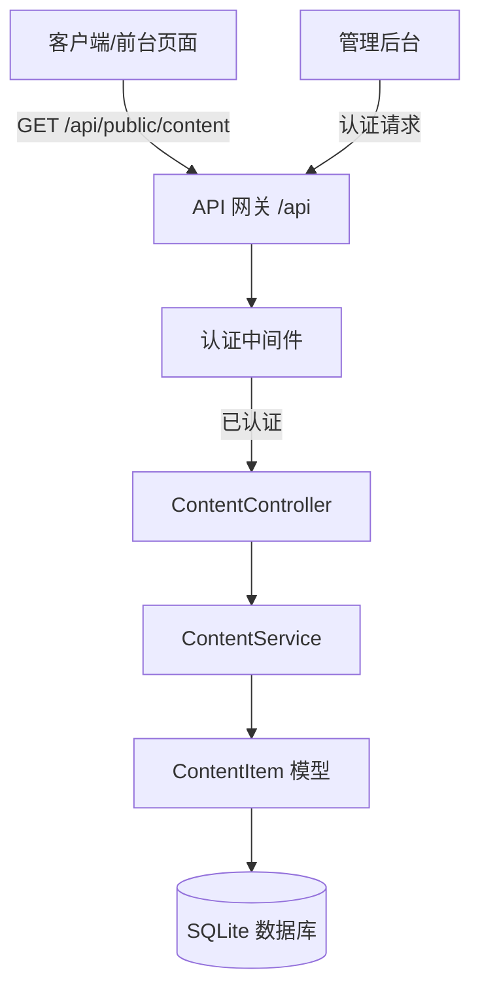
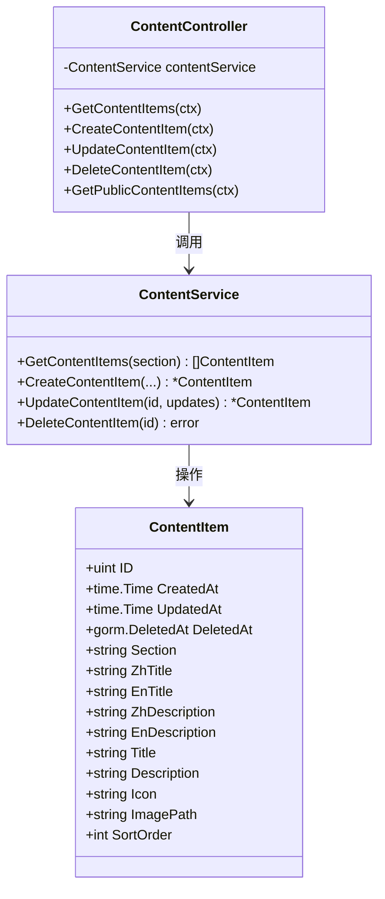
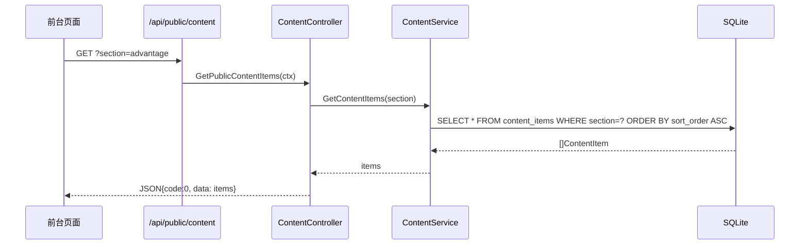
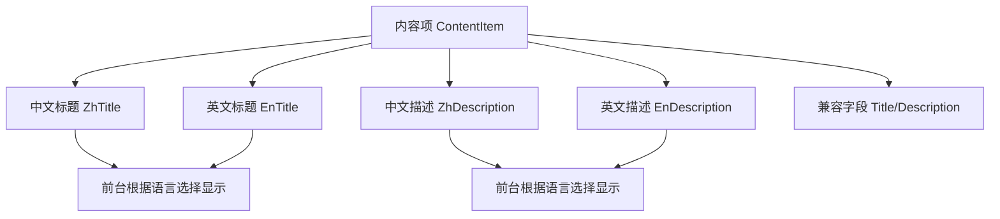
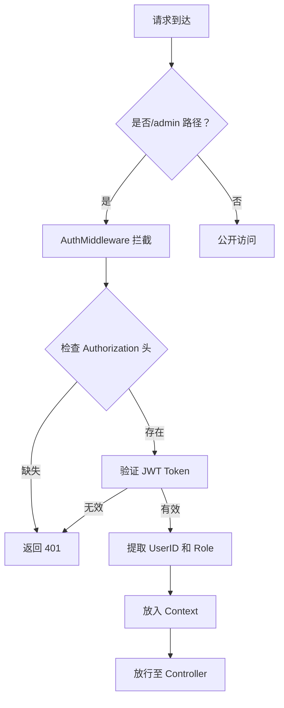

# 内容管理 API

**本文档中引用的文件**
- [content_controller.go](../../../../backend/controllers/content_controller.go)
- [content_service.go](../../../../backend/services/content_service.go)
- [models.go](../../../../backend/models/models.go)(L64-L76)
- [routes.go](../../../../backend/routes/routes.go)(L55-L58)
- [README.md](../../../../README.md)

## 目录
1. [简介](#简介)
2. [项目架构概览](#项目架构概览)
3. [核心数据模型](#核心数据模型)
4. [API 端点](#api 端点)
5. [多语言支持](#多语言支持)
6. [权限控制与角色管理](#权限控制与角色管理)
7. [错误处理与异常管理](#错误处理与异常管理)
8. [性能考虑](#性能考虑)
9. [总结](#总结)

## 简介

- **系统描述**: 内容管理 API 是医疗设备官网 CMS 系统的核心模块，负责管理网站各板块的内容项（如优势展示、统计数据、产品特性等），支持多语言字段存储，为前台页面提供动态内容数据源。
- **核心功能**: 
  - 内容项的 CRUD 操作（创建、查询、更新、删除）
  - 按板块（section）分类管理内容
  - 中英文双语字段支持（zhTitle/enTitle, zhDescription/enDescription）
  - 图片关联与排序控制
- **技术架构**: 基于 Go + Gin 框架构建，采用 Controller-Service-Model 分层架构，数据持久化使用 GORM + SQLite。
- **用户角色**: 主要面向后台管理员，提供内容配置能力；同时提供公开接口供前台页面读取内容。

**图表来源**
- [content_controller.go](../../../../backend/controllers/content_controller.go)
- [content_service.go](../../../../backend/services/content_service.go)

## 项目架构概览



**图表来源**
- [routes.go](../../../../backend/routes/routes.go)(L20-L32)
- [content_controller.go](../../../../backend/controllers/content_controller.go)(L12-L30)

## 核心数据模型



### 关键属性说明

| 字段 | 类型 | 说明 |
|------|------|------|
| ID | uint | 主键，自增 |
| Section | string | 内容板块标识（如"advantage"、"stats"等），必填 |
| ZhTitle | string | 中文标题 |
| EnTitle | string | 英文标题 |
| ZhDescription | string | 中文描述 |
| EnDescription | string | 英文描述 |
| Title | string | 兼容字段（向后兼容） |
| Description | string | 兼容字段（向后兼容） |
| Icon | string | 图标类名或路径 |
| ImagePath | string | 关联图片路径（存储于 uploads/目录） |
| SortOrder | int | 排序序号，默认 0，ASC 排序 |

**章节来源**
- [models.go](../../../../backend/models/models.go)(L64-L76)
- [content_service.go](../../../../backend/services/content_service.go)(L27-L42)

## API 端点

### 公开访问端点

无需认证，供前台页面调用。

#### 获取公开内容



**请求示例**
```http
GET /api/public/content?section=advantage
Host: localhost:8080
```

**响应示例**
```json
{
  "code": 0,
  "data": [
    {
      "id": 1,
      "section": "advantage",
      "zhTitle": "专业认证",
      "enTitle": "Professional Certification",
      "zhDescription": "通过多项国际医疗认证",
      "enDescription": "Passed multiple international medical certifications",
      "icon": "certification",
      "imagePath": "12345_advantage.jpg",
      "sortOrder": 1
    }
  ]
}
```

**章节来源**
- [routes.go](../../../../backend/routes/routes.go)(L30)
- [content_controller.go](../../../../backend/controllers/content_controller.go)(L125-L133)

### 管理端访问端点

需要 JWT 认证，通过 `Authorization` 头传递 Token。

| 方法 | 路径 | 说明 | 权限要求 |
|------|------|------|----------|
| GET | /api/admin/content | 获取所有内容项（可带 section 参数） | 已认证管理员 |
| POST | /api/admin/content | 创建新内容项 | 已认证管理员 |
| PUT | /api/admin/content/:id | 更新指定内容项 | 已认证管理员 |
| DELETE | /api/admin/content/:id | 删除指定内容项 | 已认证管理员 |

#### 创建内容项

**请求示例**
```http
POST /api/admin/content
Authorization: Bearer <jwt_token>
Content-Type: multipart/form-data

section=advantage
zhTitle=专业认证
enTitle=Professional Certification
zhDescription=通过多项国际医疗认证
enDescription=Passed multiple international medical certifications
sort_order=1
image=<file>
```

**响应示例**
```json
{
  "code": 0,
  "data": {
    "id": 1,
    "section": "advantage",
    "zhTitle": "专业认证",
    "enTitle": "Professional Certification",
    "zhDescription": "通过多项国际医疗认证",
    "enDescription": "Passed multiple international medical certifications",
    "sortOrder": 1,
    "imagePath": "12345_advantage.jpg"
  }
}
```

#### 更新内容项

**请求示例**
```http
PUT /api/admin/content/1
Authorization: Bearer <jwt_token>
Content-Type: multipart/form-data

zhTitle=更新后的中文标题
enTitle=Updated English Title
sort_order=2
```

**响应示例**
```json
{
  "code": 0,
  "data": {
    "id": 1,
    "zhTitle": "更新后的中文标题",
    "enTitle": "Updated English Title",
    "sortOrder": 2
  }
}
```

#### 删除内容项

**请求示例**
```http
DELETE /api/admin/content/1
Authorization: Bearer <jwt_token>
```

**响应示例**
```json
{
  "code": 0,
  "message": "Item deleted successfully"
}
```

**章节来源**
- [routes.go](../../../../backend/routes/routes.go)(L55-L58)
- [content_controller.go](../../../../backend/controllers/content_controller.go)(L32-L123)
- [auth.go](../../../../backend/middleware/auth.go)

## 多语言支持

内容管理 API 原生支持中英文双语字段，满足国际化网站需求。

### 多语言字段设计



### 使用建议

1. **创建时**: 同时填写 zhTitle/enTitle 和 zhDescription/enDescription，确保双语内容完整
2. **更新时**: 可单独更新某一语言字段，不影响其他语言
3. **前台展示**: 根据用户选择的语言动态切换显示对应字段

**章节来源**
- [models.go](../../../../backend/models/models.go)(L64-L76)
- [content_controller.go](../../../../backend/controllers/content_controller.go)(L37-L40)

## 权限控制与角色管理

### 认证流程



### 权限矩阵

| 端点 | 公开用户 | 认证管理员 |
|------|----------|------------|
| GET /api/public/content | ✓ | ✓ |
| GET /api/admin/content | ✗ | ✓ |
| POST /api/admin/content | ✗ | ✓ |
| PUT /api/admin/content/:id | ✗ | ✓ |
| DELETE /api/admin/content/:id | ✗ | ✓ |

**章节来源**
- [auth.go](../../../../backend/middleware/auth.go)
- [routes.go](../../../../backend/routes/routes.go)(L34-L36)

## 错误处理与异常管理

### 异常类型分类

| 场景 | HTTP 状态码 | 响应格式 |
|------|-------------|----------|
| 服务器内部错误 | 500 | `{"code": 500, "message": "错误描述"}` |
| 资源未找到 | 404 | `{"code": 404, "message": "Item not found"}` |
| 未授权访问 | 401 | `{"code": 401, "message": "Unauthorized"}` |
| 图片上传失败 | 500 | `{"code": 500, "message": "Failed to save image"}` |

### 错误响应格式

```json
{
  "code": 500,
  "message": "数据库操作失败"
}
```

### 状态码说明

| 状态码 | 含义 |
|--------|------|
| 200 | 请求成功 |
| 401 | 未授权，需登录后重试 |
| 404 | 请求的资源不存在 |
| 500 | 服务器内部错误 |

**章节来源**
- [content_controller.go](../../../../backend/controllers/content_controller.go)(L25-L28)
- [response.go](../../../../backend/common/response.go)

## 性能考虑

### 缓存策略

- 公开内容接口 `/api/public/content` 可考虑在前端或 CDN 层添加缓存
- 管理端接口实时读取数据库，确保数据一致性

### 分页优化

当前实现返回全部匹配记录，对于大数据量场景建议：
- 添加 `limit` 和 `offset` 参数支持分页查询
- 在 Service 层实现分页逻辑

### 并发控制

- GORM 默认使用数据库连接池管理并发
- 图片上传时通过 PID + 文件名避免冲突

**章节来源**
- [content_service.go](../../../../backend/services/content_service.go)(L17-L25)
- [database.go](../../../../backend/config/database.go)

## 总结

### 主要特点

1. **完整 CRUD**: 提供内容项的创建、查询、更新、删除全量操作
2. **多语言支持**: 原生支持中英文双语字段，满足国际化需求
3. **板块分类**: 通过 section 字段实现内容的板块化管理
4. **图片关联**: 支持内容项关联图片，自动存储至 uploads 目录
5. **排序控制**: 支持自定义排序序号，前端可按序展示

### 技术亮点

1. **分层架构**: Controller-Service-Model 清晰分层，便于维护
2. **GORM 集成**: 使用 GORM ORM 简化数据库操作
3. **中间件认证**: 通过 AuthMiddleware 统一管理权限
4. **兼容设计**: 保留 Title/Description 兼容字段，支持平滑迁移
5. **错误统一**: 使用 common 包统一 JSON 响应格式

### 业务价值

内容管理 API 使非技术人员可通过后台界面直接管理网站内容，无需修改代码即可更新优势展示、统计数据、产品特性等关键信息，大幅提升网站运营效率，同时多语言支持确保国际化网站的灵活部署。

**章节来源**
- [README.md](../../../../README.md)
- [content_controller.go](../../../../backend/controllers/content_controller.go)
- [content_service.go](../../../../backend/services/content_service.go)