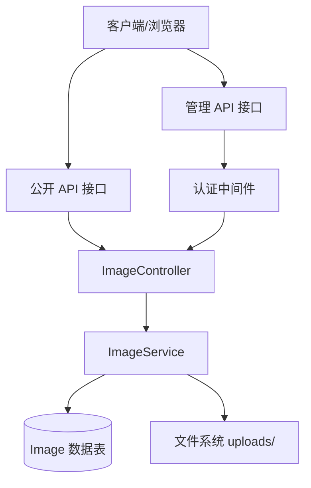
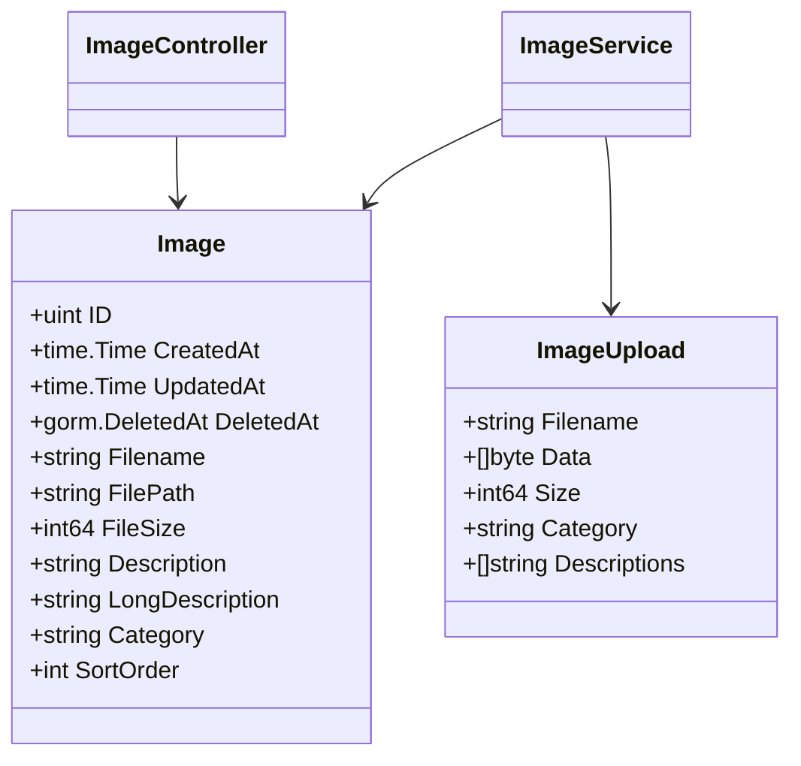
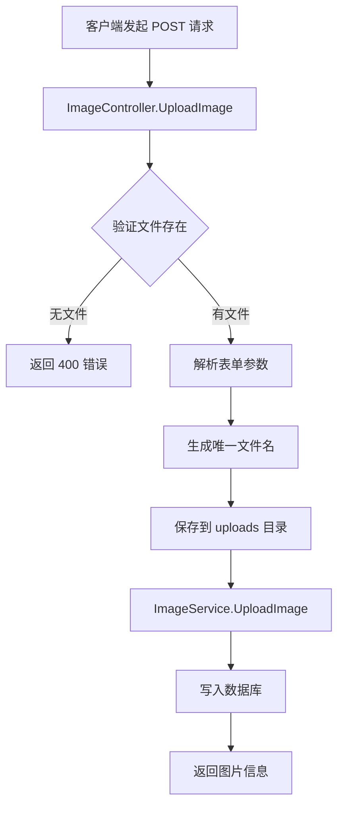
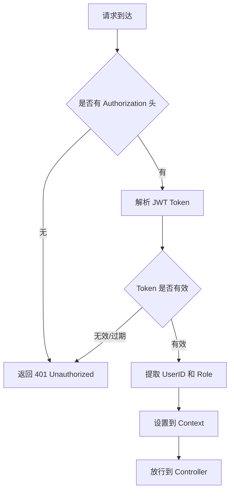

# 图片管理 API

**本文档中引用的文件**
- [image_controller.go](../../../../backend/controllers/image_controller.go)
- [image_service.go](../../../../backend/services/image_service.go)
- [models.go](../../../../backend/models/models.go)(L23-L35)
- [routes.go](../../../../backend/routes/routes.go)(L29-L43)
- [response.go](../../../../backend/common/response.go)
- [README.md](../../../../README.md)

## 目录
1. [简介](#简介)
2. [项目架构概览](#项目架构概览)
3. [核心数据模型](#核心数据模型)
4. [API 端点](#api 端点)
5. [图片上传功能](#图片上传功能)
6. [权限控制与角色管理](#权限控制与角色管理)
7. [错误处理与异常管理](#错误处理与异常管理)
8. [性能考虑](#性能考虑)
9. [总结](#总结)

## 简介

- **系统描述**: 图片管理模块是医疗设备官网 CMS 系统的核心组件之一，负责管理网站展示所需的所有图片资源。该模块提供图片的上传、查询、更新、删除等完整生命周期管理能力，支持按分类组织图片，并为前台官网和后台管理系统提供统一的图片数据服务。

- **核心功能**:
  - 单张图片上传，支持自定义描述、分类和排序
  - 批量图片上传，支持多文件同时提交
  - 按分类筛选查询图片列表
  - 图片信息更新（描述、分类、排序等）
  - 按 ID 或文件名删除图片
  - 自动文件存储与数据库记录同步

- **技术架构**: 基于 Go + Gin 框架构建，采用典型的三层架构设计：
  - **Controller 层**: `ImageController` 处理 HTTP 请求与响应
  - **Service 层**: `ImageService` 封装业务逻辑与数据操作
  - **Model 层**: `Image` 结构体定义数据模型，使用 GORM 操作 SQLite 数据库

- **用户角色**:
  - **公开用户**: 可通过 `/api/public/images` 接口浏览图片（只读）
  - **管理员**: 可通过 `/api/admin/images/*` 接口执行完整 CRUD 操作（需 JWT 认证）

**图表来源**
- [image_controller.go](../../../../backend/controllers/image_controller.go)
- [routes.go](../../../../backend/routes/routes.go)

## 项目架构概览



**架构层次说明**:
- **客户端层**: 官网前台页面和后台管理界面
- **API 网关层**: Gin 路由分组（/api/public 和 /api/admin）
- **业务服务层**: ImageController 处理请求参数校验与响应格式化
- **应用服务层**: ImageService 封装图片处理业务逻辑
- **领域模型层**: Image 结构体定义数据 schema
- **数据访问层**: GORM ORM 框架操作 SQLite 数据库
- **外部集成**: 本地文件系统存储上传的图片文件

**图表来源**
- [routes.go](../../../../backend/routes/routes.go)
- [image_controller.go](../../../../backend/controllers/image_controller.go)
- [image_service.go](../../../../backend/services/image_service.go)

## 核心数据模型



### 关键属性说明

| 字段 | 类型 | 说明 |
|------|------|------|
| ID | uint | 主键，自增 |
| CreatedAt | time.Time | 创建时间（GORM 自动管理） |
| UpdatedAt | time.Time | 更新时间（GORM 自动管理） |
| DeletedAt | gorm.DeletedAt | 软删除时间戳 |
| Filename | string | 存储的文件名（带时间戳前缀） |
| FilePath | string | 文件相对路径（如 `uploads/xxx.jpg`） |
| FileSize | int64 | 文件大小（字节） |
| Description | string | 图片简短描述 |
| LongDescription | string | 图片详细描述 |
| Category | string | 分类标识，用于筛选 |
| SortOrder | int | 排序权重，默认 0 |

**章节来源**
- [models.go](../../../../backend/models/models.go)(L23-L35)
- [image_service.go](../../../../backend/services/image_service.go)(L82-L88)

## API 端点

### 公开访问端点

公开接口无需认证，适用于前台官网页面加载图片资源。

| 方法 | 路径 | 说明 | 参数 |
|------|------|------|------|
| GET | `/api/public/images` | 获取公开图片列表 | `category` (可选，分类筛选) |

**请求示例**:
```http
GET /api/public/images?category=banner
Host: localhost:8080
```

**响应示例**:
```json
{
  "code": 200,
  "message": "success",
  "data": [
    {
      "id": 1,
      "filename": "1234567890_banner.jpg",
      "filePath": "uploads/1234567890_banner.jpg",
      "fileSize": 102400,
      "description": "首页轮播图",
      "category": "banner",
      "sortOrder": 0,
      "createdAt": "2024-01-01T10:00:00Z"
    }
  ],
  "timestamp": 1704103200
}
```

### 管理端访问端点

管理接口需要 JWT 认证，请求时需携带 `Authorization: Bearer <token>` 头。

| 方法 | 路径 | 说明 | 请求体/参数 |
|------|------|------|-------------|
| GET | `/api/admin/images` | 获取所有图片 | `category` (可选) |
| POST | `/api/admin/images` | 上传单张图片 | `image` (文件), `description`, `category`, `sort_order` |
| POST | `/api/admin/images/batch` | 批量上传图片 | `images[]` (多文件), `category`, `descriptions[]` |
| PUT | `/api/admin/images/:id` | 更新图片信息 | JSON 或 multipart/form-data |
| DELETE | `/api/admin/images/:id` | 按 ID 删除图片 | 路径参数 `id` |
| DELETE | `/api/admin/images/by-filename/:filename` | 按文件名删除 | 路径参数 `filename` |

**权限要求**: 所有 `/api/admin/*` 接口均需通过 `AuthMiddleware` 认证，未授权请求返回 401。

**章节来源**
- [routes.go](../../../../backend/routes/routes.go)(L29-L43)
- [image_controller.go](../../../../backend/controllers/image_controller.go)
- [auth.go](../../../../backend/middleware/auth.go)

## 图片上传功能

### 单图上传流程



**请求示例** (multipart/form-data):
```http
POST /api/admin/images
Content-Type: multipart/form-data

--boundary
Content-Disposition: form-data; name="image"; filename="product.jpg"
Content-Type: image/jpeg

<二进制文件数据>
--boundary
Content-Disposition: form-data; name="description"

产品展示图
--boundary
Content-Disposition: form-data; name="category"

products
--boundary
Content-Disposition: form-data; name="sort_order"

1
--boundary--
```

### 批量上传功能

**章节来源**
- [image_controller.go](../../../../backend/controllers/image_controller.go)(L64-L108)
- [image_service.go](../../../../backend/services/image_service.go)(L50-L80)

**批量上传请求示例**:
```http
POST /api/admin/images/batch
Content-Type: multipart/form-data

--boundary
Content-Disposition: form-data; name="images"; filename="img1.jpg"
<文件 1 数据>
--boundary
Content-Disposition: form-data; name="images"; filename="img2.jpg"
<文件 2 数据>
--boundary
Content-Disposition: form-data; name="category"

products
--boundary
Content-Disposition: form-data; name="descriptions"

产品图 1
--boundary
Content-Disposition: form-data; name="descriptions"

产品图 2
--boundary--
```

### 图片更新功能

支持两种更新方式：

1. **JSON 方式** (适用于元数据更新):
```json
{
  "description": "更新后的描述",
  "long_description": "详细描述",
  "category": "new_category",
  "sort_order": 5
}
```

2. **Multipart 方式** (适用于同时更新文件):
```http
PUT /api/admin/images/123
Content-Type: multipart/form-data

--boundary
Content-Disposition: form-data; name="image"; filename="new_image.jpg"
<新文件数据>
--boundary
Content-Disposition: form-data; name="description"

新描述
--boundary--
```

**章节来源**
- [image_controller.go](../../../../backend/controllers/image_controller.go)(L130-L178)
- [image_service.go](../../../../backend/services/image_service.go)(L110-L155)

## 权限控制与角色管理

### 角色权限矩阵

| 接口 | 公开用户 | 管理员 |
|------|----------|--------|
| GET `/api/public/images` | ✅ 允许 | ✅ 允许 |
| GET `/api/admin/images` | ❌ 禁止 | ✅ 允许 |
| POST `/api/admin/images` | ❌ 禁止 | ✅ 允许 |
| POST `/api/admin/images/batch` | ❌ 禁止 | ✅ 允许 |
| PUT `/api/admin/images/:id` | ❌ 禁止 | ✅ 允许 |
| DELETE `/api/admin/images/:id` | ❌ 禁止 | ✅ 允许 |

### 认证流程



**章节来源**
- [auth.go](../../../../backend/middleware/auth.go)
- [routes.go](../../../../backend/routes/routes.go)(L34-L36)

## 错误处理与异常管理

### 异常类型分类

| 错误码 | HTTP 状态 | 说明 | 触发场景 |
|--------|-----------|------|----------|
| 200 | 200 OK | 成功 | 操作正常完成 |
| 400 | 400 Bad Request | 请求参数错误 | 未上传文件、表单解析失败 |
| 401 | 401 Unauthorized | 未授权 | 缺少或无效 JWT Token |
| 404 | 404 Not Found | 资源不存在 | 图片 ID 或文件名不存在 |
| 500 | 500 Internal Server Error | 服务器错误 | 文件保存失败、数据库错误 |

### 错误响应格式

所有错误响应遵循统一格式：

```json
{
  "code": 400,
  "message": "No file uploaded",
  "data": null,
  "timestamp": 1704103200
}
```

**常见错误场景**:
- `No file uploaded`: 请求中未包含 `image` 字段
- `Failed to parse multipart form`: Content-Type 不是 multipart/form-data
- `Could not save file`: 文件系统写入失败
- `Image not found`: 指定的图片 ID 或文件名不存在

**章节来源**
- [response.go](../../../../backend/common/response.go)
- [image_controller.go](../../../../backend/controllers/image_controller.go)

## 性能考虑

### 文件存储策略
- 上传目录 `uploads/` 自动创建（`os.MkdirAll`）
- 文件名添加时间戳前缀避免冲突：`{timestamp}_{originalName}`
- 批量上传时逐个处理文件，内存中暂存文件数据

### 并发控制
- Gin 框架默认支持高并发请求处理
- 数据库操作使用 GORM 连接池管理
- 文件读写无显式锁，依赖操作系统文件锁机制

### 分页与查询优化
- 查询结果按 `created_at DESC` 排序
- 支持按 `category` 字段过滤
- 软删除机制（`DeletedAt`）避免物理删除开销

**章节来源**
- [image_service.go](../../../../backend/services/image_service.go)(L25-L33)
- [models.go](../../../../backend/models/models.go)(L27)

## 总结

### 主要特点
1. **完整的 CRUD 支持**: 提供图片查询、上传、更新、删除的全套 API
2. **双模式上传**: 支持单图上传和批量上传两种场景
3. **分类管理**: 通过 `category` 字段实现图片分类组织
4. **双接口设计**: 公开接口供前台使用，管理接口需认证
5. **软删除机制**: 使用 GORM 软删除保留数据可追溯性

### 技术亮点
1. **统一响应格式**: 基于 `APIResponse` 结构体标准化所有响应
2. **中间件架构**: JWT 认证、错误处理、CORS 等通过中间件解耦
3. **灵活更新策略**: 支持 JSON 和 multipart 两种更新方式
4. **自动文件管理**: 上传目录自动创建，文件名自动去重
5. **GORM 集成**: 利用 GORM 特性自动管理时间戳和软删除

### 业务价值
图片管理模块为医疗设备官网提供了可靠的视觉资源管理能力，支持运营人员通过后台系统自主管理网站图片内容，无需技术人员介入。分类和排序功能确保图片能够按业务需求有序展示，批量上传能力提升了大量图片导入的效率。

**章节来源**
- [README.md](../../../../README.md)
- [image_controller.go](../../../../backend/controllers/image_controller.go)
- [image_service.go](../../../../backend/services/image_service.go)