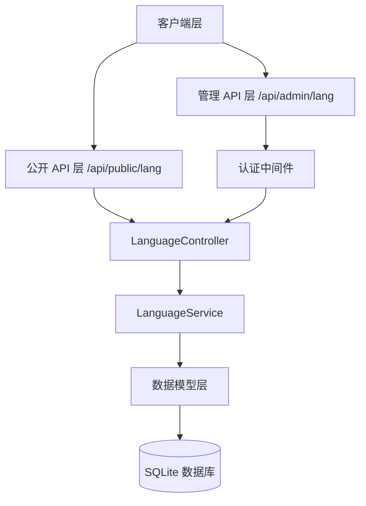
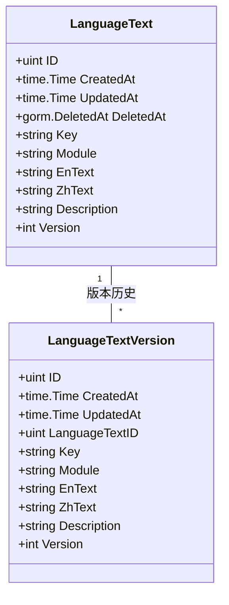
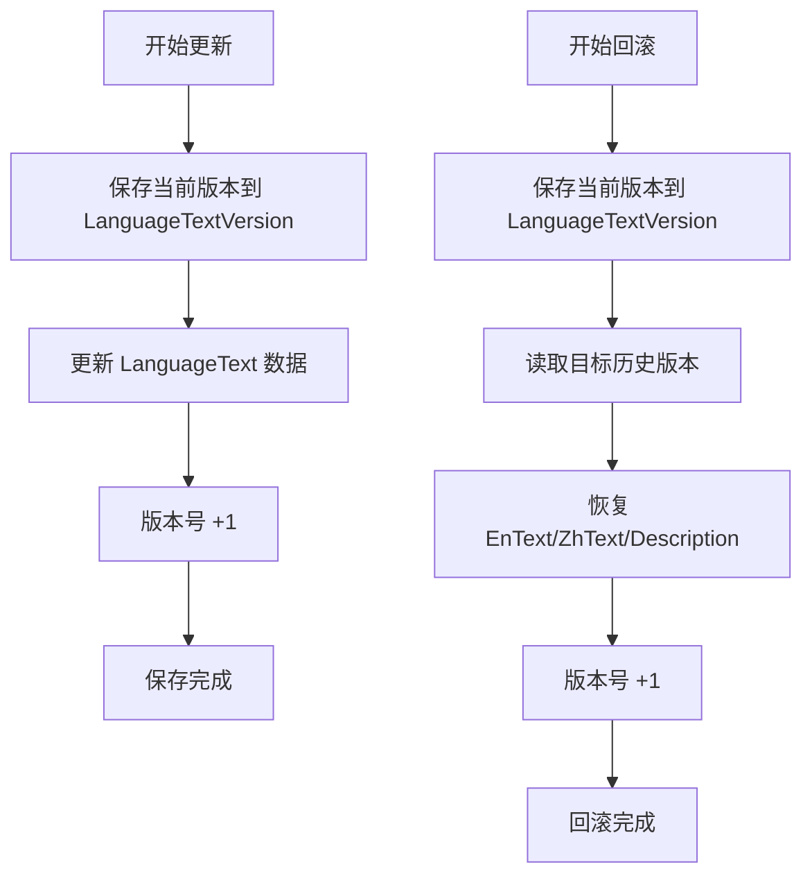

# 多语言管理 API

**本文档中引用的文件**
- [language_controller.go](../../../../backend/controllers/language_controller.go)
- [language_service.go](../../../../backend/services/language_service.go)
- [models.go](../../../../backend/models/models.go)(L78-L98)
- [routes.go](../../../../backend/routes/routes.go)(L60-L66)
- [README.md](../../../../README.md)

## 目录
1. [简介](#简介)
2. [项目架构概览](#项目架构概览)
3. [核心数据模型](#核心数据模型)
4. [API 端点](#api 端点)
5. [版本控制与回滚](#版本控制与回滚)
6. [错误处理与异常管理](#错误处理与异常管理)
7. [总结](#总结)

## 简介

- **系统描述**: 多语言管理模块是医疗设备官网 CMS 系统的核心功能之一，负责管理系统中所有中英文语言文本的存储、查询、更新和版本控制。该模块支持按模块（module）分类管理语言文本，确保网站内容可以灵活切换中英文展示。
- **核心功能**:
  - 语言文本的 CRUD 操作（创建、读取、更新、删除）
  - 按模块分类查询语言文本
  - 公开接口供前台获取多语言内容
  - 版本控制与历史版本回滚
- **技术架构**: 基于 Go + Gin 框架实现 RESTful API，使用 GORM 操作 SQLite 数据库，采用服务层与控制器层分离的分层架构设计。
- **用户角色**:
  - **前台用户**: 通过公开接口获取多语言文本（只读）
  - **管理员**: 通过管理接口进行语言文本的增删改查及版本管理

## 项目架构概览



**图表来源**
- [language_controller.go](../../../../backend/controllers/language_controller.go)
- [language_service.go](../../../../backend/services/language_service.go)
- [routes.go](../../../../backend/routes/routes.go)

## 核心数据模型



### 关键属性说明

| 字段 | 类型 | 说明 |
|------|------|------|
| Key | string | 语言文本的唯一标识键，全局唯一索引 |
| Module | string | 所属模块名称，用于分类管理（如 banner、products、about 等） |
| EnText | string | 英文文本内容，支持长文本 |
| ZhText | string | 中文文本内容，支持长文本 |
| Description | string | 文本描述或备注，用于说明该键的用途 |
| Version | int | 当前版本号，每次更新自增 |
| LanguageTextID | uint | 版本记录关联的主文本 ID |

**章节来源**
- [models.go](../../../../backend/models/models.go)(L78-L98)

## API 端点

### 公开访问端点

公开端点无需认证，供前台网站获取多语言文本。

| 方法 | 路径 | 说明 | 参数 |
|------|------|------|------|
| GET | `/api/public/lang` | 获取所有模块的公开语言文本 | `module` (可选): 按模块筛选 |

**请求示例**
```http
GET /api/public/lang?module=banner
```

**响应示例**
```json
{
  "success": true,
  "data": {
    "en": {
      "banner_title": "Welcome to Our Company",
      "banner_subtitle": "Leading Medical Device Manufacturer"
    },
    "zh": {
      "banner_title": "欢迎来到我们公司",
      "banner_subtitle": "领先的医疗设备制造商"
    }
  }
}
```

### 管理端访问端点

管理端点需要 JWT 认证，通过 `Authorization: Bearer <token>` 头传递令牌。

| 方法 | 路径 | 说明 | 参数 |
|------|------|------|------|
| GET | `/api/admin/lang` | 获取语言文本列表 | `module` (可选): 按模块筛选 |
| GET | `/api/admin/lang/:id` | 获取单个语言文本 | `id`: 文本 ID |
| POST | `/api/admin/lang` | 创建语言文本 | 见下方请求体 |
| PUT | `/api/admin/lang/:id` | 更新语言文本 | `id`: 文本 ID |
| DELETE | `/api/admin/lang/:id` | 删除语言文本 | `id`: 文本 ID |
| GET | `/api/admin/lang/:id/versions` | 获取版本历史 | `id`: 文本 ID |
| POST | `/api/admin/lang/:id/restore/:version` | 回滚到指定版本 | `id`: 文本 ID, `version`: 版本号 |

**创建语言文本 - 请求示例**
```http
POST /api/admin/lang
Content-Type: application/json
Authorization: Bearer <token>

{
  "key": "banner_title",
  "module": "banner",
  "enText": "Welcome to Our Company",
  "zhText": "欢迎来到我们公司",
  "description": "首页 Banner 标题"
}
```

**创建语言文本 - 响应示例**
```json
{
  "success": true,
  "data": {
    "id": 1,
    "key": "banner_title",
    "module": "banner",
    "enText": "Welcome to Our Company",
    "zhText": "欢迎来到我们公司",
    "description": "首页 Banner 标题",
    "version": 1,
    "createdAt": "2026-05-27T10:00:00Z",
    "updatedAt": "2026-05-27T10:00:00Z"
  }
}
```

**更新语言文本 - 请求示例**
```http
PUT /api/admin/lang/1
Content-Type: application/json
Authorization: Bearer <token>

{
  "enText": "Welcome to Our Global Company",
  "zhText": "欢迎来到我们的全球公司",
  "description": "首页 Banner 标题（已更新）"
}
```

**权限要求**
- 所有 `/api/admin/*` 端点需要有效的 JWT Token
- Token 通过 `Authorization: Bearer <token>` 头传递
- 认证中间件验证 Token 有效性，无效则返回 401

**章节来源**
- [routes.go](../../../../backend/routes/routes.go)(L60-L66)
- [language_controller.go](../../../../backend/controllers/language_controller.go)

## 版本控制与回滚

多语言管理模块支持完整的版本控制功能，每次更新文本时自动保存历史版本，支持回滚到任意历史版本。



**图表来源**
- [language_service.go](../../../../backend/services/language_service.go)(L75-L145)

### 版本控制流程说明

1. **更新时自动存档**: 调用 `UpdateLanguageText` 时，系统先将当前版本数据复制到 `LanguageTextVersion` 表，然后再更新主表数据并递增版本号。

2. **版本查询**: 通过 `GET /api/admin/lang/:id/versions` 获取指定文本的所有历史版本，按版本号降序排列。

3. **版本回滚**: 调用 `POST /api/admin/lang/:id/restore/:version` 时，系统先保存当前版本，然后将指定历史版本的数据恢复到主表，并生成新的版本号。

**获取版本历史 - 响应示例**
```json
{
  "success": true,
  "data": [
    {
      "id": 5,
      "languageTextId": 1,
      "key": "banner_title",
      "module": "banner",
      "enText": "Welcome to Our Company",
      "zhText": "欢迎来到我们公司",
      "version": 3,
      "updatedAt": "2026-05-27T09:00:00Z"
    },
    {
      "id": 4,
      "languageTextId": 1,
      "key": "banner_title",
      "module": "banner",
      "enText": "Welcome to Our Company",
      "zhText": "欢迎",
      "version": 2,
      "updatedAt": "2026-05-27T08:00:00Z"
    },
    {
      "id": 3,
      "languageTextId": 1,
      "key": "banner_title",
      "module": "banner",
      "enText": "Welcome",
      "zhText": "欢迎",
      "version": 1,
      "updatedAt": "2026-05-27T07:00:00Z"
    }
  ]
}
```

## 错误处理与异常管理

### 异常类型分类

| 场景 | HTTP 状态码 | 响应说明 |
|------|------------|----------|
| 请求参数无效 | 400 Bad Request | JSON 格式错误或必填字段缺失 |
| 未授权访问 | 401 Unauthorized | JWT Token 无效或缺失 |
| 资源不存在 | 404 Not Found | 文本 ID 或版本号不存在 |
| 键冲突 | 409 Conflict | 创建时 Key 已存在 |
| 服务器错误 | 500 Internal Server Error | 数据库操作失败 |

### 错误响应格式

```json
{
  "success": false,
  "error": "错误信息描述"
}
```

### 状态码说明

| 状态码 | 含义 | 触发场景 |
|--------|------|----------|
| 200 | OK | 请求成功 |
| 400 | Bad Request | 请求参数格式错误 |
| 401 | Unauthorized | 认证失败 |
| 404 | Not Found | 资源不存在 |
| 409 | Conflict | 键已存在 |
| 500 | Internal Server Error | 服务器内部错误 |

## 总结

### 主要特点

1. **完整的 CRUD 支持**: 提供语言文本的创建、读取、更新、删除全生命周期管理
2. **版本控制**: 每次更新自动保存历史版本，支持无限次回滚
3. **模块分类**: 按 module 字段分类管理，便于按页面或功能模块组织文本
4. **双语文本**: 同时支持英文（EnText）和中文（ZhText）内容存储
5. **公开/管理分离**: 公开接口供前台使用，管理接口需认证保护

### 技术亮点

1. **GORM 模型设计**: 利用 `gorm.Model` 自动管理 ID、时间戳和软删除
2. **事务安全**: 版本存档与更新操作在同一事务中完成，保证数据一致性
3. **唯一索引**: Key 字段设置唯一索引，防止重复键冲突
4. **版本追溯**: `LanguageTextVersion` 表完整记录每次变更的时间点和内容
5. **RESTful 设计**: 遵循 REST 规范，URL 清晰、语义明确

### 业务价值

多语言管理模块为医疗设备官网提供了灵活的中英文内容管理能力，支持：
- 前台网站根据用户语言偏好动态切换展示语言
- 管理员无需修改代码即可更新网站文案
- 历史版本追溯与回滚，降低误操作风险
- 按模块分类管理，便于多页面内容组织

---

**章节来源**
- [language_controller.go](../../../../backend/controllers/language_controller.go)
- [language_service.go](../../../../backend/services/language_service.go)
- [models.go](../../../../backend/models/models.go)(L78-L98)
- [routes.go](../../../../backend/routes/routes.go)(L60-L66)