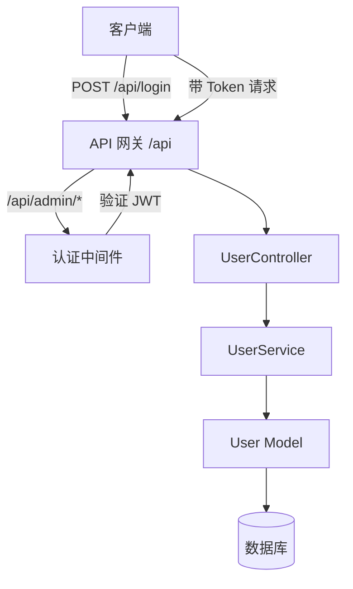
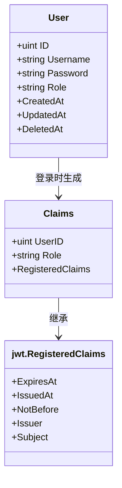
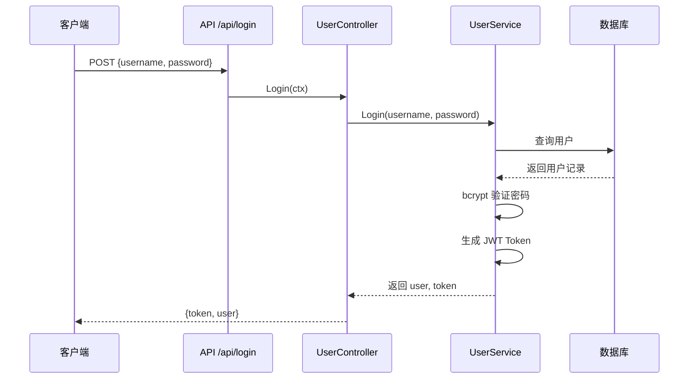
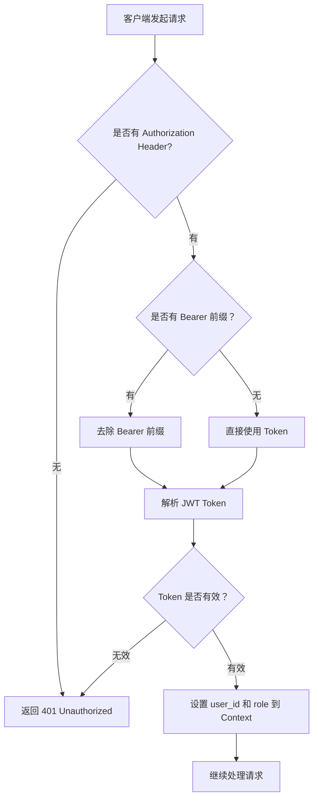

# 用户认证 API

**本文档中引用的文件**
- [user_controller.go](../../../../backend/controllers/user_controller.go)
- [auth.go](../../../../backend/middleware/auth.go)
- [user_service.go](../../../../backend/services/user_service.go)
- [models.go](../../../../backend/models/models.go)
- [routes.go](../../../../backend/routes/routes.go)

## 目录
1. [简介](#简介)
2. [项目架构概览](#项目架构概览)
3. [核心数据模型](#核心数据模型)
4. [API 端点](#api 端点)
5. [权限控制与角色管理](#权限控制与角色管理)
6. [错误处理与异常管理](#错误处理与异常管理)
7. [总结](#总结)

## 简介

- **系统描述**: 用户认证模块负责处理用户的登录认证和 JWT Token 管理，为整个 CMS 系统提供安全的访问控制机制。
- **核心功能**: 
  - 用户登录认证
  - JWT Token 生成与验证
  - 基于角色的访问控制
- **技术架构**: 采用 Gin 框架作为 HTTP 服务器，使用 JWT (JSON Web Token) 进行无状态认证，密码存储采用 bcrypt 加密。
- **用户角色**: 系统管理员（admin 角色）

## 项目架构概览



**图表来源**
- [routes.go](../../../../backend/routes/routes.go)(L20-L36)
- [auth.go](../../../../backend/middleware/auth.go)(L13-L44)

## 核心数据模型



### 关键属性说明

| 模型 | 字段 | 类型 | 说明 |
|------|------|------|------|
| User | ID | uint | 用户唯一标识，GORM 主键 |
| User | Username | string | 用户名，唯一索引，必填 |
| User | Password | string | 密码，bcrypt 加密存储，必填 |
| User | Role | string | 用户角色，默认为 'admin' |
| Claims | UserID | uint | 用户 ID，用于 JWT 中识别用户 |
| Claims | Role | string | 用户角色，用于权限控制 |
| Claims | ExpiresAt | time | Token 过期时间，默认 24 小时 |

**章节来源**
- [models.go](../../../../backend/models/models.go)(L10-L21)

## API 端点

### 公共访问端点

#### 登录接口

**序列图**


**请求说明**

| 项目 | 说明 |
|------|------|
| HTTP 方法 | POST |
| 请求路径 | `/api/login` |
| Content-Type | `application/json` |
| 认证要求 | 无需认证 |

**请求参数**

```json
{
  "username": "admin",
  "password": "password123"
}
```

| 字段 | 类型 | 必填 | 说明 |
|------|------|------|------|
| username | string | 是 | 用户名 |
| password | string | 是 | 密码 |

**成功响应 (200)**

```json
{
  "code": 0,
  "message": "success",
  "data": {
    "token": "eyJhbGciOiJIUzI1NiIsInR5cCI6IkpXVCJ9...",
    "user": {
      "id": 1,
      "username": "admin",
      "role": "admin"
    }
  }
}
```

**失败响应 (400/401)**

```json
{
  "code": 400,
  "message": "Invalid request parameters",
  "data": null
}
```

```json
{
  "code": 401,
  "message": "Invalid credentials",
  "data": null
}
```

**章节来源**
- [user_controller.go](../../../../backend/controllers/user_controller.go)(L19-L44)
- [user_service.go](../../../../backend/services/user_service.go)(L18-L43)
- [routes.go](../../../../backend/routes/routes.go)(L26)

## 权限控制与角色管理

### JWT Token 认证流程



**图表来源**
- [auth.go](../../../../backend/middleware/auth.go)(L13-L44)

### 认证中间件说明

| 配置项 | 说明 |
|--------|------|
| Token 来源 | HTTP Header `Authorization` |
| Token 格式 | `Bearer <token>` 或直接 `<token>` |
| 签名算法 | HS256 |
| Token 有效期 | 24 小时 |
| 密钥来源 | `config.JWTSecret` |

### 受保护的路由

所有 `/api/admin/*` 路径都需要通过认证中间件：

| 路由组 | 前缀 | 认证要求 |
|--------|------|----------|
| 图片管理 | `/api/admin/images` | 需要 Token |
| 配置管理 | `/api/admin/config` | 需要 Token |
| 模块管理 | `/api/admin/modules` | 需要 Token |
| 内容管理 | `/api/admin/content` | 需要 Token |
| 语言管理 | `/api/admin/lang` | 需要 Token |

**章节来源**
- [routes.go](../../../../backend/routes/routes.go)(L34-L67)

## 错误处理与异常管理

### 异常类型分类

| 异常场景 | HTTP 状态码 | 响应消息 |
|----------|-------------|----------|
| 请求参数无效 | 400 | Invalid request parameters |
| 用户名或密码错误 | 401 | Invalid credentials |
| 未提供 Token | 401 | Unauthorized |
| Token 无效或过期 | 401 | Invalid token |

### 错误响应格式

所有错误响应遵循统一格式：

```json
{
  "code": 401,
  "message": "错误描述",
  "data": null
}
```

### 状态码说明

| 状态码 | 含义 | 处理建议 |
|--------|------|----------|
| 400 | 请求参数错误 | 检查请求体格式和必填字段 |
| 401 | 未授权 | 检查是否已登录或 Token 是否过期 |

**章节来源**
- [user_controller.go](../../../../backend/controllers/user_controller.go)(L25-L33)
- [auth.go](../../../../backend/middleware/auth.go)(L17-L38)
- [common/response.go](../../../../backend/common/response.go)

## 总结

### 主要特点

1. **无状态认证**: 使用 JWT Token 实现无状态认证，适合分布式部署
2. **密码加密**: 采用 bcrypt 算法加密存储用户密码
3. **自动过期**: Token 默认 24 小时过期，保障安全性
4. **角色控制**: 支持基于角色的访问控制（当前默认 admin 角色）
5. **统一响应**: 所有 API 返回统一的 JSON 格式

### 技术亮点

1. **Gin 框架**: 高性能 HTTP 框架，支持中间件链
2. **JWT v5**: 使用最新的 golang-jwt/jwt/v5 库
3. **GORM ORM**: 类型安全的数据库操作
4. **bcrypt 加密**: 工业级密码哈希算法
5. **CORS 支持**: 内置跨域中间件，支持前端跨域请求

### 业务价值

用户认证模块为整个 CMS 系统提供了基础的安全保障，确保只有授权用户才能访问管理后台功能，保护内容管理、配置修改等敏感操作不被未授权访问。