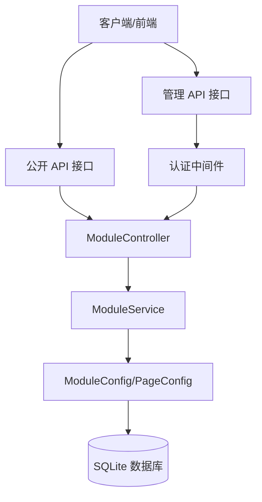
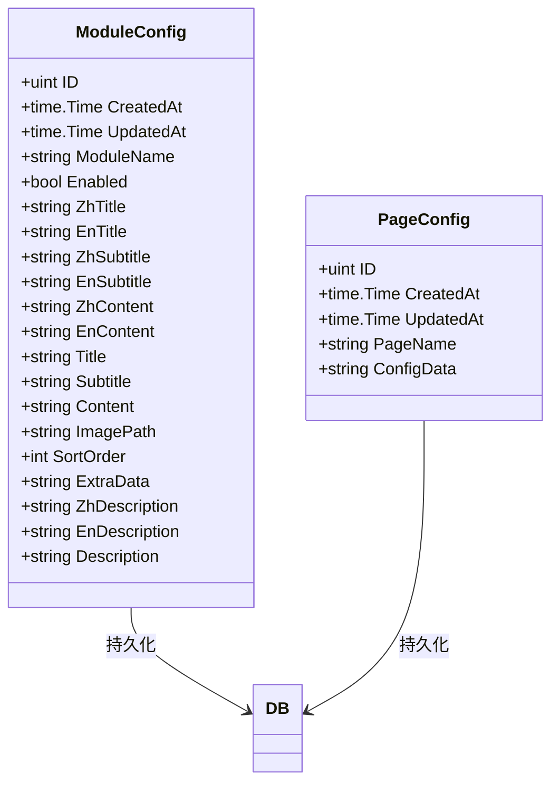
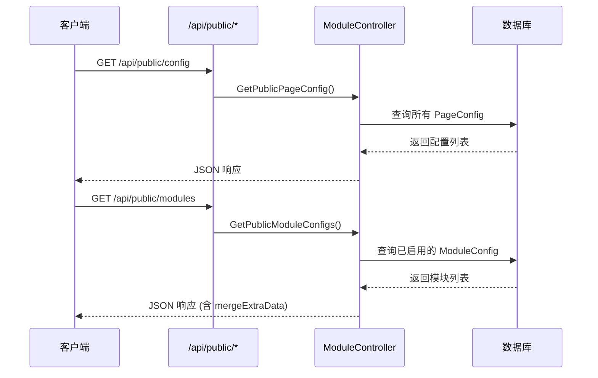
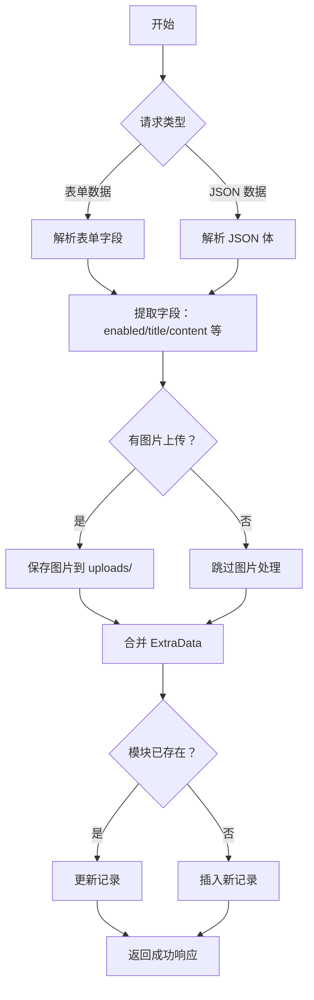
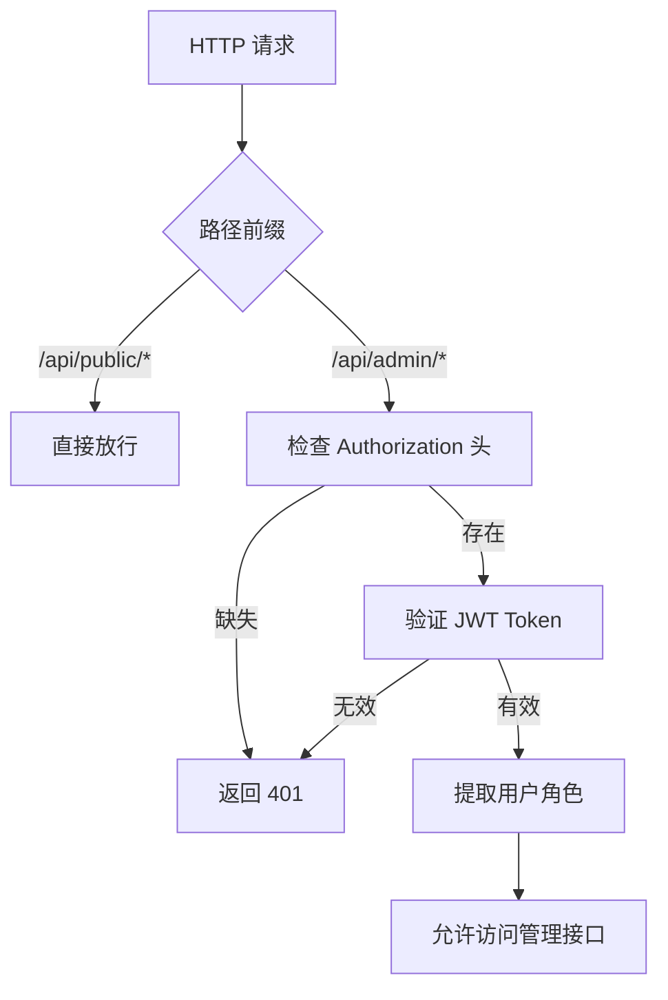

# 页面配置 API

**本文档中引用的文件**
- [module_controller.go](../../../../backend/controllers/module_controller.go)
- [module_service.go](../../../../backend/services/module_service.go)
- [models.go](../../../../backend/models/models.go)
- [routes.go](../../../../backend/routes/routes.go)
- [database.go](../../../../backend/config/database.go)

## 目录
1. [简介](#简介)
2. [项目架构概览](#项目架构概览)
3. [核心数据模型](#核心数据模型)
4. [API 端点](#api 端点)
5. [模块配置管理](#模块配置管理)
6. [权限控制与角色管理](#权限控制与角色管理)
7. [错误处理与异常管理](#错误处理与异常管理)
8. [总结](#总结)

## 简介

- **系统描述**: 页面配置 API 提供医疗设备 CMS 系统的动态页面配置和模块配置管理能力，支持 Banner、About、Products 等页面模块的动态配置，实现内容与代码分离。
- **核心功能**:
  - 页面配置查询与更新（Banner、About、Products 等）
  - 模块配置的增删改查
  - 模块图片上传与管理
  - 多语言内容支持（中英文）
  - 公开接口与管理接口分离
- **技术架构**: 基于 Gin 框架的 RESTful API，采用 Controller-Service-Model 分层架构，数据持久化使用 SQLite + GORM。
- **用户角色**:
  - **匿名用户**: 可访问公开配置接口
  - **管理员**: 可访问全部管理接口进行配置管理

## 项目架构概览



**图表来源**
- [routes.go](../../../../backend/routes/routes.go)(L25-L32) - 公开路由定义
- [routes.go](../../../../backend/routes/routes.go)(L34-L67) - 管理路由定义
- [module_controller.go](../../../../backend/controllers/module_controller.go) - 控制器实现
- [module_service.go](../../../../backend/services/module_service.go) - 服务层实现

## 核心数据模型



### 关键属性说明

**ModuleConfig 模块配置**
| 字段 | 类型 | 说明 |
|------|------|------|
| ModuleName | string | 模块名称（唯一索引） |
| Enabled | bool | 是否启用（默认 true） |
| ZhTitle/EnTitle | string | 中英文标题 |
| ZhSubtitle/EnSubtitle | string | 中英文副标题 |
| ZhContent/EnContent | string | 中英文内容（支持长文本） |
| Title/Subtitle/Content | string | 向后兼容字段 |
| ImagePath | string | 关联图片路径 |
| SortOrder | int | 排序顺序（默认 0） |
| ExtraData | string | 额外数据（JSON 格式） |
| ZhDescription/EnDescription | string | 中英文描述 |

**PageConfig 页面配置**
| 字段 | 类型 | 说明 |
|------|------|------|
| PageName | string | 页面名称（唯一索引，如 banner/about/products） |
| ConfigData | string | 配置数据（JSON 格式） |

**章节来源**
- [models.go](../../../../backend/models/models.go)(L37-L62) - 数据模型定义

## API 端点

### 公开访问端点（无需认证）



| 方法 | 路径 | 说明 | 参数 |
|------|------|------|------|
| GET | `/api/public/config` | 获取所有页面配置 | 无 |
| GET | `/api/public/modules` | 获取已启用的模块配置 | 无 |

**章节来源**
- [routes.go](../../../../backend/routes/routes.go)(L25-L32) - 公开路由定义

### 管理端访问端点（需要认证）

| 方法 | 路径 | 说明 | 请求参数 |
|------|------|------|----------|
| GET | `/api/admin/config` | 获取页面配置 | `page` (可选，页面名称) |
| PUT | `/api/admin/config` | 更新页面配置 | `pageName`, `configData` (JSON) |
| GET | `/api/admin/modules` | 获取模块配置列表 | `module` (可选，模块名称) |
| GET | `/api/admin/modules/:name` | 获取单个模块配置 | 路径参数：name |
| POST | `/api/admin/modules` | 保存模块配置 | 表单或 JSON |
| PUT | `/api/admin/modules/:name` | 更新模块配置 | 路径参数：name |
| DELETE | `/api/admin/modules/:name` | 删除模块配置 | 路径参数：name |
| DELETE | `/api/admin/modules/:name/image` | 删除模块图片 | 路径参数：name |

**权限要求**: 所有 `/api/admin/*` 接口需要通过 `AuthMiddleware()` 认证。

**章节来源**
- [routes.go](../../../../backend/routes/routes.go)(L34-L67) - 管理路由定义
- [module_controller.go](../../../../backend/controllers/module_controller.go) - 接口实现

### 请求/响应示例

**获取模块配置列表**
```http
GET /api/admin/modules HTTP/1.1
Authorization: Bearer <token>
```

```json
{
  "code": 200,
  "data": [
    {
      "id": 1,
      "moduleName": "banner",
      "enabled": true,
      "zhTitle": "专业医疗设备制造商",
      "enTitle": "Professional Medical Device Manufacturer",
      "zhSubtitle": "CE、FDA、ISO 认证的医疗设备",
      "enSubtitle": "CE, FDA, ISO Certified Medical Devices",
      "imagePath": "banner_1234567890.jpg",
      "sortOrder": 0,
      "extraData": "{\"booth\": \"A123\", \"start_date\": \"2024-01-01\"}"
    }
  ]
}
```

**保存模块配置（JSON 方式）**
```http
POST /api/admin/modules HTTP/1.1
Content-Type: application/json
Authorization: Bearer <token>

{
  "moduleName": "about",
  "enabled": true,
  "zhTitle": "关于我们",
  "enTitle": "About Us",
  "zhContent": "公司成立于 2010 年...",
  "enContent": "Founded in 2010...",
  "sortOrder": 1
}
```

**保存模块配置（表单方式，支持图片上传）**
```http
POST /api/admin/modules HTTP/1.1
Content-Type: multipart/form-data
Authorization: Bearer <token>

moduleName: products
enabled: true
zhTitle: 产品中心
enTitle: Products
image: <binary_file>
zhContent: 我们的主要产品...
extraData: {"show_count": 6}
```

## 模块配置管理

### 功能流程图



**图表来源**
- [module_controller.go](../../../../backend/controllers/module_controller.go)(L86-L197) - SaveModuleConfig 实现
- [module_service.go](../../../../backend/services/module_service.go)(L87-L159) - 服务层保存逻辑

### 多语言支持

模块配置支持完整的中英文双语字段：

| 字段类型 | 中文字段 | 英文字段 | 兼容字段 |
|----------|----------|----------|----------|
| 标题 | zhTitle | enTitle | title |
| 副标题 | zhSubtitle | enSubtitle | subtitle |
| 内容 | zhContent | enContent | content |
| 描述 | zhDescription | enDescription | description |

**ExtraData 扩展字段**
`extraData` 字段支持存储任意 JSON 数据，常用于：
- 展位信息：`booth`, `zh_location`, `en_location`
- 活动日期：`start_date`, `end_date`
- 展示数量：`show_count`
- 其他自定义字段

### 图片管理

模块图片存储在 `./uploads/` 目录下，支持：
- 上传新图片（通过 multipart/form-data）
- 删除图片（DELETE `/api/admin/modules/:name/image`）
- 更新图片（上传新图片时自动删除旧图片）

**章节来源**
- [module_service.go](../../../../backend/services/module_service.go)(L132-L141) - 图片处理逻辑
- [module_service.go](../../../../backend/services/module_service.go)(L183-L197) - 删除图片逻辑

## 权限控制与角色管理

### 角色权限矩阵

| 接口路径 | 匿名用户 | 管理员 |
|----------|----------|--------|
| GET `/api/public/config` | ✅ 允许 | ✅ 允许 |
| GET `/api/public/modules` | ✅ 允许 | ✅ 允许 |
| GET `/api/admin/config` | ❌ 禁止 | ✅ 允许 |
| PUT `/api/admin/config` | ❌ 禁止 | ✅ 允许 |
| GET `/api/admin/modules` | ❌ 禁止 | ✅ 允许 |
| POST/PUT `/api/admin/modules` | ❌ 禁止 | ✅ 允许 |
| DELETE `/api/admin/modules/*` | ❌ 禁止 | ✅ 允许 |

### 权限验证流程



**章节来源**
- [routes.go](../../../../backend/routes/routes.go)(L36) - 认证中间件注册
- [auth.go](../../../../backend/middleware/auth.go) - 认证中间件实现

## 错误处理与异常管理

### 异常类型分类

| 异常场景 | HTTP 状态码 | 响应格式 |
|----------|-------------|----------|
| 认证成功/操作成功 | 200 | `{"code": 200, "data": ...}` |
| 参数验证失败 | 400 | `{"code": 400, "message": "Invalid request parameters"}` |
| 未授权访问 | 401 | `{"code": 401, "message": "Unauthorized"}` |
| 资源不存在 | 404 | `{"code": 404, "message": "Module config not found"}` |
| 服务器内部错误 | 500 | `{"code": 500, "message": "..."}` |

### 错误响应格式

```json
{
  "code": 400,
  "message": "moduleName is required"
}
```

```json
{
  "code": 500,
  "message": "database error details"
}
```

**章节来源**
- [module_controller.go](../../../../backend/controllers/module_controller.go)(L49-L55) - 参数验证
- [response.go](../../../../backend/common/response.go) - 统一响应格式

## 总结

### 主要特点
1. **双接口设计**: 公开接口与管理接口分离，满足前端展示与后台管理需求
2. **多语言支持**: 完整的中英文双语字段，支持国际化内容管理
3. **灵活配置**: ExtraData 字段支持任意 JSON 扩展，适应不同业务场景
4. **图片管理**: 内置图片上传、删除、更新功能
5. **向后兼容**: 保留单语字段（title/subtitle/content）确保兼容性

### 技术亮点
1. **分层架构**: Controller-Service-Model 清晰分层，便于维护与测试
2. **数据合并**: mergeExtraData 函数自动将 ExtraData 合并到返回结果
3. **双格式支持**: SaveModuleConfig 同时支持表单和 JSON 两种请求格式
4. **软删除**: 基于 GORM 的 DeletedAt 实现软删除
5. **自动迁移**: 数据库表结构通过 AutoMigrate 自动创建

### 业务价值
- 实现页面内容的动态配置，无需修改代码即可更新网站内容
- 支持多语言内容管理，满足国际化业务需求
- 模块化的配置管理，便于扩展新的页面模块
- 统一的 API 接口规范，便于前端集成与第三方对接