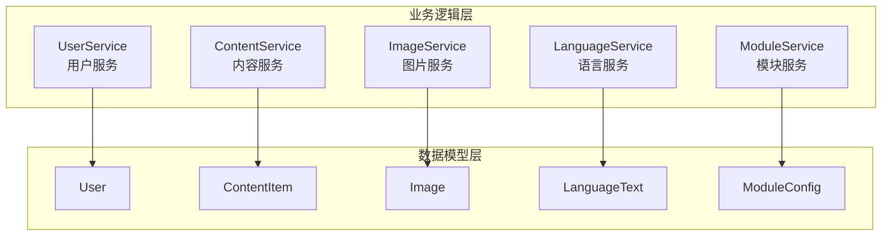
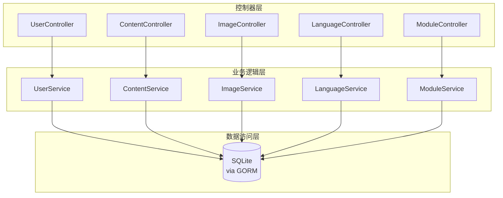
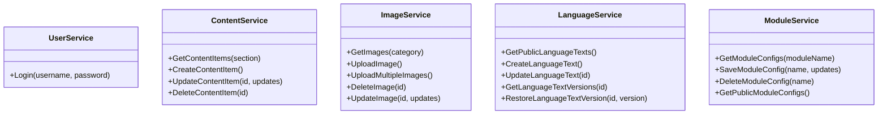
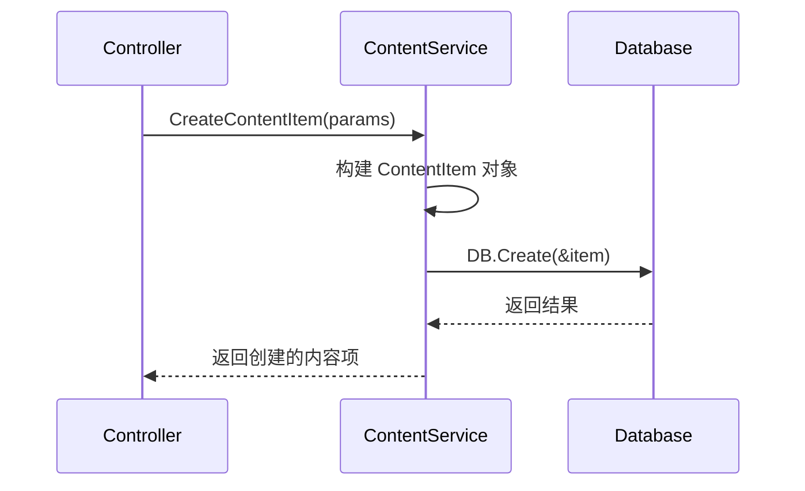
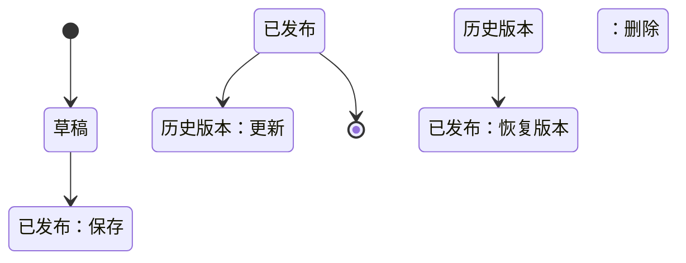
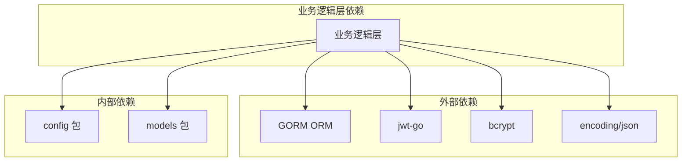

# 业务逻辑层

**本文档中引用的文件**
- [user_service.go](../../../../backend/services/user_service.go)
- [content_service.go](../../../../backend/services/content_service.go)
- [image_service.go](../../../../backend/services/image_service.go)
- [language_service.go](../../../../backend/services/language_service.go)
- [module_service.go](../../../../backend/services/module_service.go)
- [models.go](../../../../backend/models/models.go)
- [routes.go](../../../../backend/routes/routes.go)
- [user_controller.go](../../../../backend/controllers/user_controller.go)

## 目录
1. [简介](#简介)
2. [项目结构概述](#项目结构概述)
3. [核心应用服务](#核心应用服务)
4. [架构概览](#架构概览)
5. [详细组件分析](#详细组件分析)
6. [依赖关系分析](#依赖关系分析)
7. [性能考虑](#性能考虑)
8. [结论](#结论)

## 简介

业务逻辑层是医疗设备官网 CMS 系统的核心处理层，位于控制器层与数据模型层之间，负责实现所有核心业务逻辑。

**核心职责**
- 处理用户认证与 JWT 令牌生成
- 管理内容项的增删改查操作
- 处理图片上传、分类与存储
- 提供多语言文本管理与版本控制
- 管理模块配置与动态页面内容

**主要设计模式**
- 服务层模式（Service Layer Pattern）：每个业务模块对应独立的服务结构体
- 依赖注入：控制器通过 `NewServiceXxx()` 函数获取服务实例
- 仓储模式：通过 GORM ORM 封装数据库操作

**业务价值**
- 将业务逻辑与 HTTP 处理逻辑分离，提高代码可维护性
- 统一数据访问入口，便于事务管理和错误处理
- 支持多语言内容管理，满足国际化需求

## 项目结构概述



**图表来源**
- [services 目录](../../../../backend/services/)
- [models.go](../../../../backend/models/models.go)

## 核心应用服务

### UserService 用户服务

用户服务负责处理用户认证相关的所有业务逻辑。

**主要功能**
- 用户登录验证（用户名 + 密码）
- bcrypt 密码哈希比对
- JWT Token 生成与签发
- 24 小时令牌有效期设置

**代码示例**
```go
func (s *UserService) Login(username, password string) (*models.User, string, error) {
    var user models.User
    if err := config.DB.Where("username = ?", username).First(&user).Error; err != nil {
        return nil, "", err
    }

    if err := bcrypt.CompareHashAndPassword([]byte(user.Password), []byte(password)); err != nil {
        return nil, "", err
    }

    expirationTime := time.Now().Add(24 * time.Hour)
    claims := &models.Claims{
        UserID: user.ID,
        Role:   user.Role,
        RegisteredClaims: jwt.RegisteredClaims{
            ExpiresAt: jwt.NewNumericDate(expirationTime),
        },
    }

    token := jwt.NewWithClaims(jwt.SigningMethodHS256, claims)
    tokenString, err := token.SignedString(config.JWTSecret)
    if err != nil {
        return nil, "", err
    }

    return &user, tokenString, nil
}
```

### ContentService 内容服务

内容服务负责管理网站动态内容项的完整生命周期。

**主要功能**
- 按模块/分类获取内容项
- 创建支持多语言的内容项（中英文标题和描述）
- 更新内容项（支持图片替换）
- 删除内容项
- 按排序字段自动排序

**代码示例**
```go
func (s *ContentService) CreateContentItem(section, title, description, imagePath string, 
    sortOrder int, icon string, zhTitle, enTitle, zhDescription, enDescription string) (*models.ContentItem, error) {
    item := models.ContentItem{
        Section:       section,
        Title:         title,
        Description:   description,
        ImagePath:     imagePath,
        SortOrder:     sortOrder,
        Icon:          icon,
        ZhTitle:       zhTitle,
        EnTitle:       enTitle,
        ZhDescription: zhDescription,
        EnDescription: enDescription,
    }
    err := config.DB.Create(&item).Error
    return &item, err
}
```

### ImageService 图片服务

图片服务负责处理所有图片资源的管理操作。

**主要功能**
- 按分类获取图片列表
- 单张图片上传（自动生成时间戳文件名）
- 批量图片上传
- 图片删除（同步删除文件系统）
- 图片信息更新（描述、分类、排序）

**代码示例**
```go
func (s *ImageService) UploadMultipleImages(files []ImageUpload) ([]models.Image, error) {
    os.MkdirAll("uploads", 0755)
    var uploadedImages []models.Image

    for i, file := range files {
        filename := fmt.Sprintf("%d_%s", time.Now().UnixNano(), file.Filename)
        filepathStr := filepath.Join("uploads", filename)

        if err := os.WriteFile(filepathStr, file.Data, 0644); err != nil {
            return nil, err
        }

        image := models.Image{
            Filename:    filename,
            FilePath:    filepathStr,
            FileSize:    file.Size,
            Description: file.Descriptions[i],
            Category:    file.Category,
            SortOrder:   i,
        }
        config.DB.Create(&image)
        uploadedImages = append(uploadedImages, image)
    }

    return uploadedImages, nil
}
```

### LanguageService 语言服务

语言服务提供多语言文本管理与版本控制功能。

**主要功能**
- 获取公开多语言文本（按模块筛选）
- 创建/更新/删除语言文本
- 版本历史记录（LanguageTextVersion）
- 版本恢复功能
- 自动版本号递增

**代码示例**
```go
func (s *LanguageService) UpdateLanguageText(id uint, enText, zhText, description string) (*models.LanguageText, error) {
    var text models.LanguageText
    if err := config.DB.First(&text, id).Error; err != nil {
        return nil, err
    }

    // 保存当前版本到历史表
    config.DB.Create(&models.LanguageTextVersion{
        LanguageTextID: text.ID,
        Key:            text.Key,
        Module:         text.Module,
        EnText:         text.EnText,
        ZhText:         text.ZhText,
        Description:    text.Description,
        Version:        text.Version,
        UpdatedAt:      text.UpdatedAt,
    })

    text.EnText = enText
    text.ZhText = zhText
    text.Description = description
    text.Version++

    err := config.DB.Save(&text).Error
    return &text, err
}
```

### ModuleService 模块服务

模块服务管理网站各功能模块的配置信息。

**主要功能**
- 获取模块配置（单个或全部）
- 保存模块配置（支持多语言字段）
- ExtraData JSON 扩展字段合并
- 模块启用/禁用控制
- 模块图片管理

**代码示例**
```go
func mergeExtraData(mc *models.ModuleConfig) map[string]interface{} {
    result := make(map[string]interface{})
    // 复制基础字段
    result["moduleName"] = mc.ModuleName
    result["enabled"] = mc.Enabled
    result["zhTitle"] = mc.ZhTitle
    result["enTitle"] = mc.EnTitle
    result["content"] = mc.Content
    result["imagePath"] = mc.ImagePath
    
    // 解析并合并 ExtraData
    if mc.ExtraData != "" {
        var extra map[string]interface{}
        if err := json.Unmarshal([]byte(mc.ExtraData), &extra); err == nil {
            for k, v := range extra {
                result[k] = v
            }
        }
    }
    return result
}
```

**章节来源**
- [user_service.go](../../../../backend/services/user_service.go)
- [content_service.go](../../../../backend/services/content_service.go)
- [image_service.go](../../../../backend/services/image_service.go)
- [language_service.go](../../../../backend/services/language_service.go)
- [module_service.go](../../../../backend/services/module_service.go)

## 架构概览



**图表来源**
- [routes.go](../../../../backend/routes/routes.go)
- [controllers 目录](../../../../backend/controllers/)

## 详细组件分析

### 服务层类关系



### 内容创建流程



### 语言文本版本状态



**章节来源**
- [models.go](../../../../backend/models/models.go)
- [language_service.go](../../../../backend/services/language_service.go)

## 依赖关系分析



**依赖特点**
- 所有服务均依赖 `config.DB` 全局数据库连接
- UserService 依赖 `golang-jwt/jwt/v5` 和 `bcrypt` 进行安全认证
- ModuleService 和 LanguageService 使用标准库 `encoding/json` 处理扩展数据
- 服务层不直接依赖控制器层，保持单向依赖关系

**来源**
- [user_service.go](../../../../backend/services/user_service.go)(L6-L9)
- [routes.go](../../../../backend/routes/routes.go)

## 性能考虑

### 缓存策略
- 公开接口（`/api/public/*`）可直接读取数据库，无需额外缓存
- 模块配置可通过 `GetPublicModuleConfigs()` 批量获取，减少查询次数
- 语言文本支持按模块筛选，避免全量加载

### 并发控制
- GORM 内置连接池管理数据库并发访问
- JWT 令牌无状态设计，支持水平扩展
- 文件上传操作使用 `os.MkdirAll` 确保目录安全创建

### 数据访问优化
- 所有查询支持按 `sort_order` 排序，避免应用层排序
- 图片删除时同步清理文件系统，避免孤儿文件
- 使用 GORM 的软删除（`DeletedAt`）保留数据可恢复性

## 结论

### 设计优势
- **职责分离**：每个服务专注于单一业务领域，便于维护和测试
- **多语言支持**：核心数据模型内置中英文字段，支持国际化部署
- **版本控制**：语言文本支持版本历史和恢复，满足审计需求
- **扩展性**：ExtraData 字段允许动态扩展模块配置

### 最佳实践
- 服务层不处理 HTTP 相关逻辑，保持业务纯粹性
- 所有数据库操作通过 GORM 封装，统一错误处理
- 敏感操作（如密码验证）使用成熟库（bcrypt）
- 文件名生成使用时间戳避免冲突

### 技术特色
- 基于 Go + Gin + GORM 的轻量级架构
- JWT 无状态认证，适合分布式部署
- SQLite 内嵌数据库，零配置启动
- 前后端分离设计，API 驱动开发

---

**章节来源**
- [README.md](../../../../README.md)
- [backend/services/](../../../../backend/services/)
- [backend/models/models.go](../../../../backend/models/models.go)