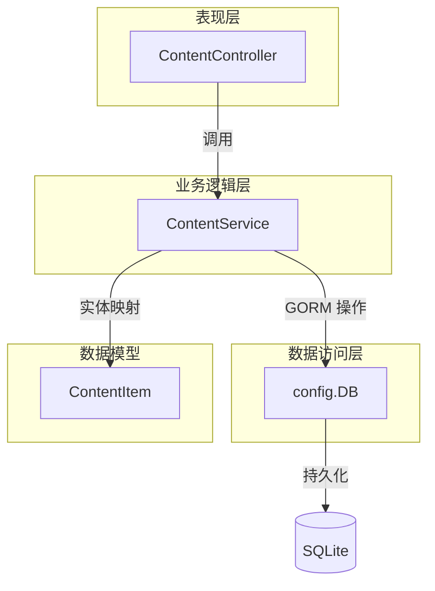
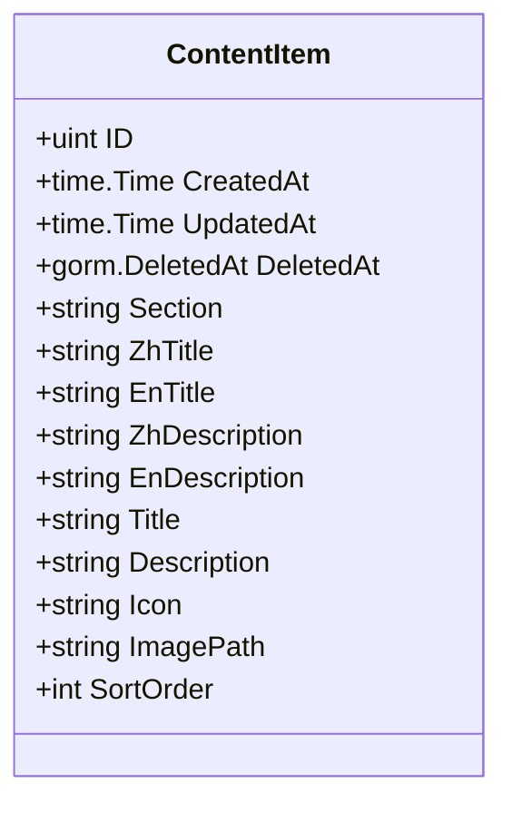
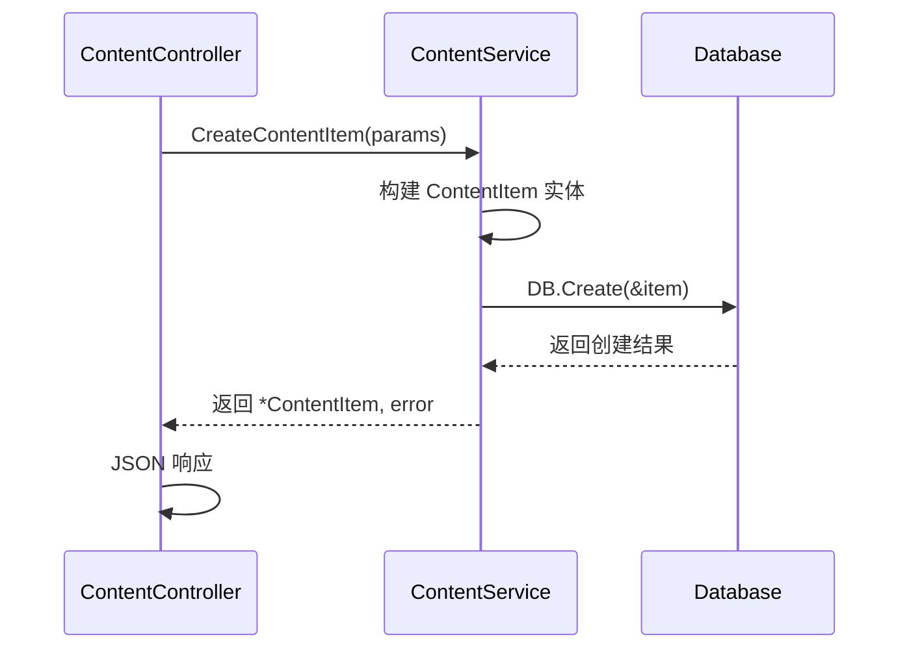
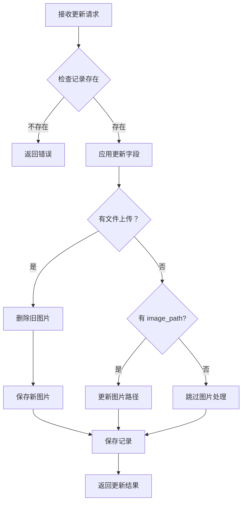
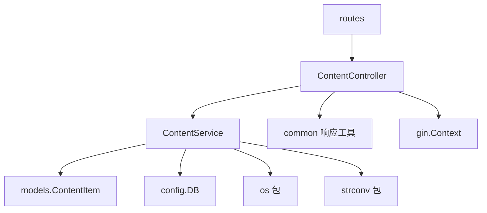

# 业务逻辑层 / 内容服务

**本文档中引用的文件**
- [content_service.go](../../../../backend/services/content_service.go)
- [models.go](../../../../backend/models/models.go)(L64-L76)
- [content_controller.go](../../../../backend/controllers/content_controller.go)
- [routes.go](../../../../backend/routes/routes.go)(L55-L58)
- [README.md](../../../../README.md)

## 目录
1. [简介](#简介)
2. [项目结构概述](#项目结构概述)
3. [核心应用服务](#核心应用服务)
4. [架构概览](#架构概览)
5. [详细组件分析](#详细组件分析)
6. [依赖关系分析](#依赖关系分析)
7. [性能考虑](#性能考虑)
8. [故障排除指南](#故障排除指南)
9. [结论](#结论)

## 简介

内容服务（ContentService）是医疗设备官网 CMS 系统的核心业务逻辑层组件，负责管理网站各区块的内容项数据。该服务位于后端 `backend/services/` 目录下，为内容管理提供完整的 CRUD 操作支持。

**模块定位和职责说明**
- 作为业务逻辑层，承接控制器层的请求，处理内容项的核心业务逻辑
- 通过 GORM 操作 SQLite 数据库，实现内容项的持久化存储
- 支持多语言字段（中文/英文），满足国际化内容管理需求

**主要功能列表**
- 按区块（section）查询内容项列表
- 创建新的内容项，支持标题、描述、图标、图片路径等多语言字段
- 更新现有内容项，支持部分字段更新和文件上传处理
- 删除内容项，支持软删除（GORM DeletedAt）

**采用的设计模式说明**
- **服务层模式**：将业务逻辑从控制器中分离，提高代码可维护性和可测试性
- **依赖注入**：通过 `NewContentService()` 构造函数创建服务实例，便于扩展和测试

**章节来源**
- [content_service.go](../../../../backend/services/content_service.go)
- [README.md](../../../../README.md)

## 项目结构概述

```mermaid
graph TB
    subgraph 内容服务模块
        A[ContentController] --> B[ContentService]
        B --> C[ContentItem 模型]
        B --> D[config.DB]
    end
    
    subgraph 数据层
        C --> E[SQLite 数据库]
        D --> E
    end
    
    subgraph 路由层
        F[/api/admin/content] --> A
        G[/api/public/content] --> A
    end
```

**各子模块及组件说明**
- **ContentService**：核心服务类，包含所有业务逻辑方法
- **ContentItem**：数据模型，定义内容项的字段结构
- **ContentController**：控制器层，处理 HTTP 请求并调用服务层
- **config.DB**：全局数据库连接，由 GORM 管理

**图表来源**
- [content_service.go](../../../../backend/services/content_service.go)(L11-L102)
- [models.go](../../../../backend/models/models.go)(L64-L76)
- [routes.go](../../../../backend/routes/routes.go)(L55-L58)

## 核心应用服务

### ContentService 服务

ContentService 是内容管理的核心服务类，提供以下方法：

**设计模式说明**
- 采用无状态服务设计，方法直接操作数据库
- 通过构造函数 `NewContentService()` 创建实例

**核心方法列表**

| 方法 | 参数 | 返回值 | 说明 |
|------|------|--------|------|
| `GetContentItems` | section string | []ContentItem, error | 按区块获取内容项列表 |
| `CreateContentItem` | section, title, description 等 | *ContentItem, error | 创建新内容项 |
| `UpdateContentItem` | id uint, updates map | *ContentItem, error | 更新内容项 |
| `DeleteContentItem` | id uint | error | 删除内容项 |

**主要功能说明**

1. **查询功能** - `GetContentItems(section string)`
   - 支持按区块筛选，空字符串返回所有内容项
   - 结果按 `sort_order` 升序排列
   - 用于后台列表展示和前台内容渲染

2. **创建功能** - `CreateContentItem(...)`
   - 支持完整字段创建，包括多语言字段
   - 多语言字段：ZhTitle/EnTitle、ZhDescription/EnDescription
   - 兼容字段：Title/Description（向后兼容）

3. **更新功能** - `UpdateContentItem(id, updates)`
   - 支持部分字段更新，通过 map 传递更新内容
   - 处理文件上传逻辑，自动删除旧图片文件
   - 支持多语言字段单独更新

4. **删除功能** - `DeleteContentItem(id)`
   - 先查询确认记录存在
   - 使用 GORM 软删除，保留 DeletedAt 时间戳

**章节来源**
- [content_service.go](../../../../backend/services/content_service.go)(L17-L102)

## 架构概览



**各层职责说明**
- **表现层（ContentController）**：处理 HTTP 请求/响应，参数校验，调用服务层
- **业务逻辑层（ContentService）**：实现核心业务逻辑，数据转换，事务处理
- **数据访问层（config.DB）**：GORM 数据库连接，执行 SQL 操作
- **数据模型（ContentItem）**：定义数据结构，映射数据库表

**图表来源**
- [content_controller.go](../../../../backend/controllers/content_controller.go)
- [content_service.go](../../../../backend/services/content_service.go)

## 详细组件分析

### ContentItem 数据模型

ContentItem 是内容项的数据模型，定义在 `backend/models/models.go` 中。



**字段说明**

| 字段 | 类型 | 说明 |
|------|------|------|
| ID | uint | 主键，自增 |
| Section | string | 区块标识，必填 |
| ZhTitle | string | 中文标题 |
| EnTitle | string | 英文标题 |
| ZhDescription | string | 中文描述 |
| EnDescription | string | 英文描述 |
| Title | string | 兼容字段（向后兼容） |
| Description | string | 兼容字段（向后兼容） |
| Icon | string | 图标标识 |
| ImagePath | string | 图片存储路径 |
| SortOrder | int | 排序序号，默认 0 |

**多语言支持说明**
- 中文内容：ZhTitle、ZhDescription
- 英文内容：EnTitle、EnDescription
- 兼容字段：Title、Description 用于向后兼容旧数据

### 创建内容项流程



### 更新内容项流程



**章节来源**
- [models.go](../../../../backend/models/models.go)(L64-L76)
- [content_service.go](../../../../backend/services/content_service.go)(L27-L94)

## 依赖关系分析



**依赖特点分析**
1. **内部依赖**
   - 依赖 `models.ContentItem` 作为数据实体
   - 依赖 `config.DB` 进行数据库操作
   - 被 `ContentController` 调用

2. **外部依赖**
   - `os` 包：处理文件删除操作
   - `strconv` 包：字符串转整数（排序字段）

3. **无外部服务依赖**
   - 不依赖缓存、消息队列等外部服务
   - 所有操作直接操作数据库

**图表来源**
- [content_service.go](../../../../backend/services/content_service.go)(L1-L102)
- [content_controller.go](../../../../backend/controllers/content_controller.go)(L1-L133)

## 性能考虑

**数据访问优化**
1. 查询时按 `sort_order` 排序，避免应用层排序开销
2. 支持按 `section` 过滤，减少不必要的数据传输
3. 使用 GORM 软删除，避免物理删除的数据恢复成本

**并发控制**
1. GORM 内置连接池管理数据库连接
2. SQLite 支持并发读，写操作串行化
3. 更新操作先查询后保存，存在并发更新风险

**缓存策略**
1. 当前实现无缓存层，每次请求直接查询数据库
2. 建议对公开接口（GetPublicContentItems）添加缓存
3. 可考虑使用内存缓存存储热点内容

**优化建议**
1. 为 `section` 字段添加数据库索引
2. 对公开查询接口实现缓存（如 Redis 或内存缓存）
3. 批量操作时考虑使用事务

## 故障排除指南

**常见问题及解决方案**

1. **内容项查询返回空列表**
   - 检查数据库中是否有对应 section 的记录
   - 确认 section 参数拼写正确
   - 检查软删除状态（DeletedAt 是否为空）

2. **创建内容项失败**
   - 检查必填字段 section 是否提供
   - 确认数据库连接正常
   - 查看错误日志获取详细错误信息

3. **更新内容项时图片未更新**
   - 确认文件上传参数名正确（应为 "image"）
   - 检查 uploads 目录是否有写权限
   - 验证文件大小是否超过限制

4. **删除内容项报错"Item not found"**
   - 确认 ID 参数正确
   - 检查记录是否已被删除（软删除）
   - 验证数据库连接状态

**监控指标**
- 内容项总数（按 section 分组）
- 创建/更新/删除操作次数
- 数据库查询响应时间
- 文件上传成功率

**相关源码链接**
- [GetContentItems](../../../../backend/services/content_service.go)(L17-L25)
- [CreateContentItem](../../../../backend/services/content_service.go)(L27-L42)
- [UpdateContentItem](../../../../backend/services/content_service.go)(L44-L94)
- [DeleteContentItem](../../../../backend/services/content_service.go)(L96-L102)

## 结论

**设计优势总结**
- 服务层与控制器层分离，职责清晰
- 支持多语言字段，满足国际化需求
- 兼容字段设计，保证向后兼容性
- 软删除机制，支持数据恢复

**最佳实践总结**
- 使用构造函数创建服务实例
- 更新操作支持部分字段更新
- 文件上传时自动清理旧文件
- 查询结果按排序字段有序返回

**技术特色总结**
- 基于 GORM 的优雅数据库操作
- 灵活的 updates map 参数设计
- 多语言字段与兼容字段并存
- 与控制器层松耦合

**未来展望**
- 可考虑添加内容项版本管理
- 支持内容项的批量操作
- 添加缓存层提升查询性能
- 实现内容项的导入导出功能