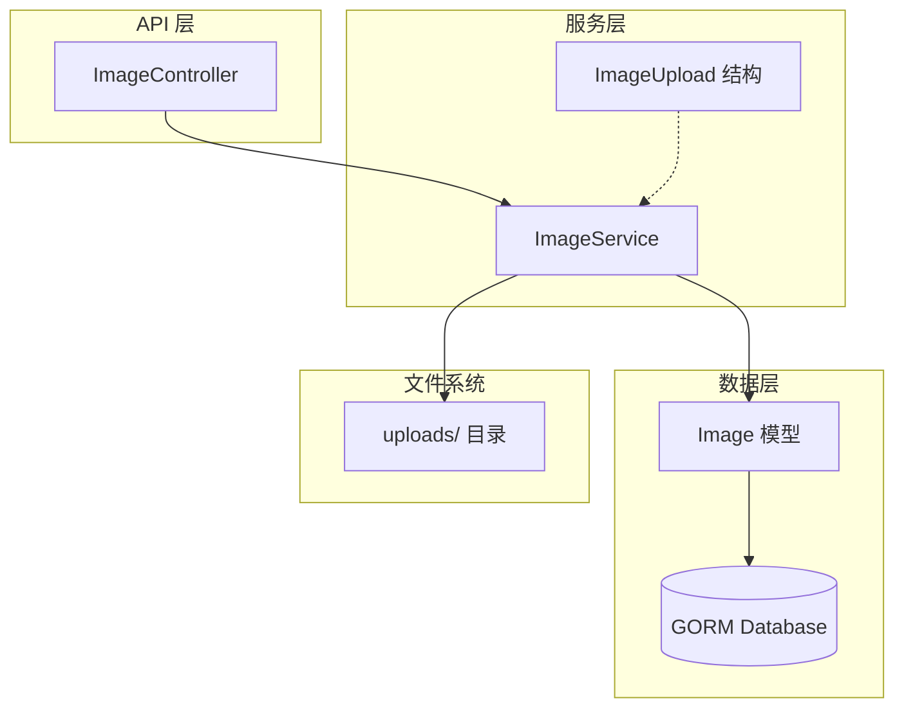
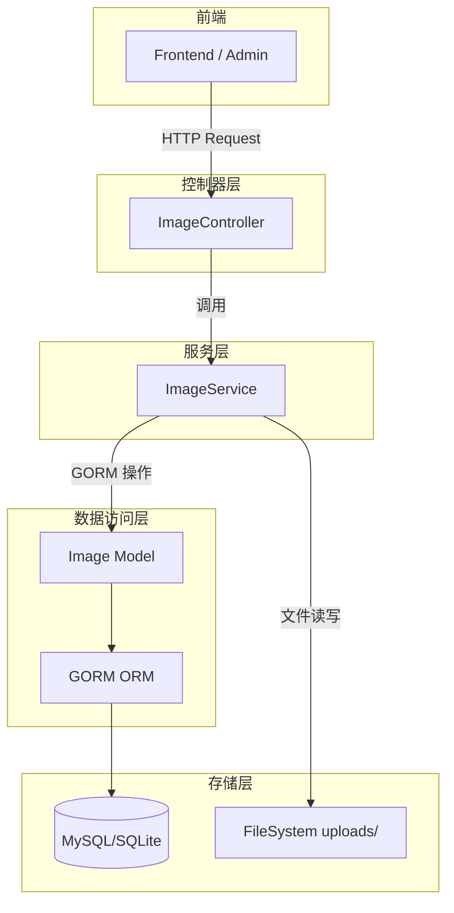
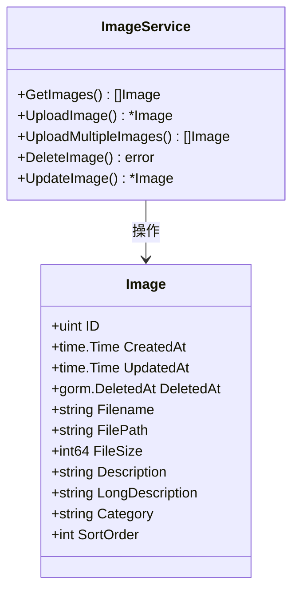
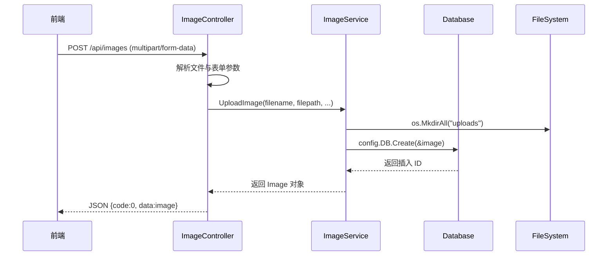
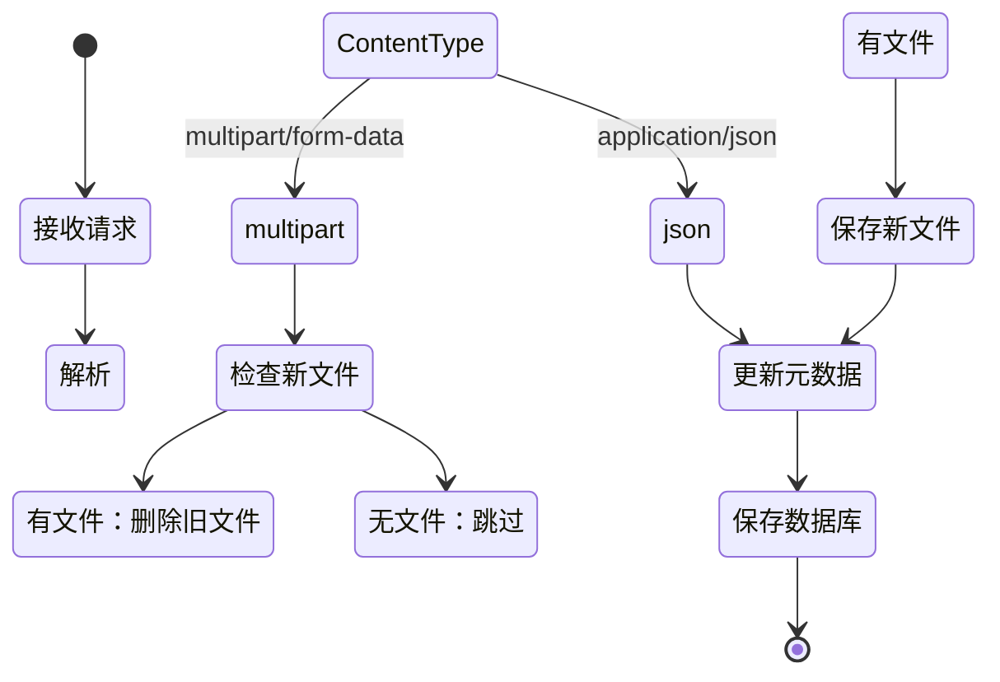
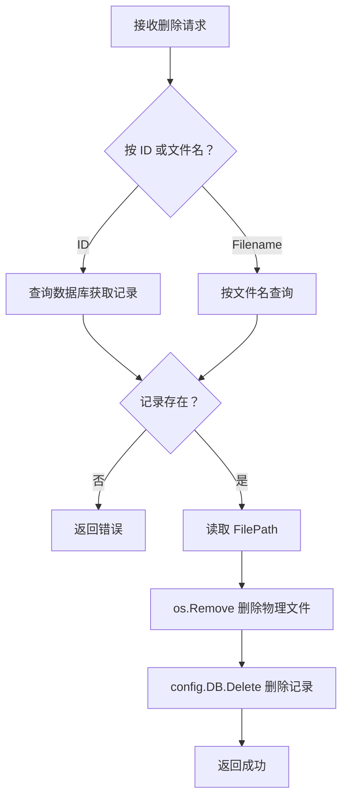
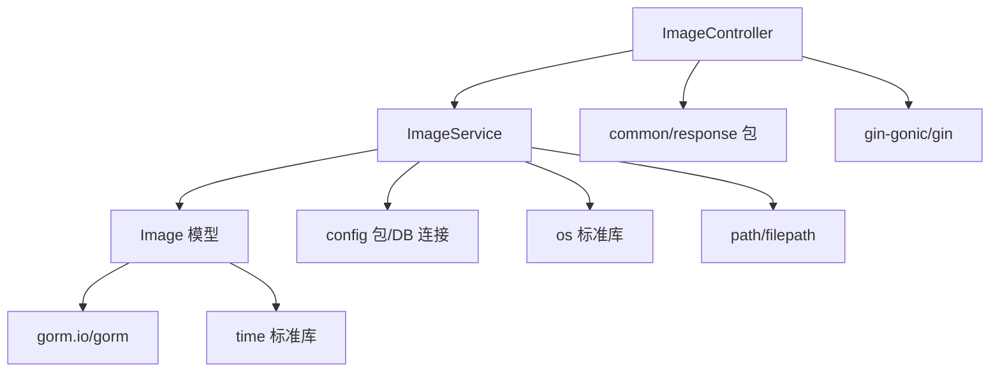

# 图片服务

**本文档中引用的文件**
- [image_service.go](../../../../backend/services/image_service.go)
- [models.go](../../../../backend/models/models.go)(L23-L35)
- [image_controller.go](../../../../backend/controllers/image_controller.go)

## 目录
1. [简介](#简介)
2. [项目结构概述](#项目结构概述)
3. [核心应用服务](#核心应用服务)
4. [架构概览](#架构概览)
5. [详细组件分析](#详细组件分析)
6. [依赖关系分析](#依赖关系分析)
7. [性能考虑](#性能考虑)
8. [故障排除指南](#故障排除指南)
9. [结论](#结论)

## 简介

图片服务（ImageService）是 CMS 系统的核心业务模块之一，负责管理平台中所有图片资源的上传、存储、分类、检索与生命周期管理。

**模块定位和职责说明**
- 位于 `backend/services/` 包，作为业务逻辑层与数据访问层之间的桥梁
- 通过 `ImageController` 暴露 RESTful API 供前端调用
- 操作 `Image` 模型进行持久化存储，文件实际存储于 `uploads/` 目录

**主要功能列表**
- 单图上传：支持单个图片文件上传并记录元数据
- 批量上传：支持多图片并发上传，自动分配排序序号
- 分类检索：按类别筛选图片，支持按创建时间倒序排列
- 图片更新：支持替换文件内容或仅更新元数据（描述、分类、排序）
- 图片删除：支持按 ID 或文件名删除，同步清理物理文件

**采用的设计模式说明**
- **服务层模式（Service Layer Pattern）**：将业务逻辑封装在 `ImageService` 结构中，与 Controller 层解耦
- **依赖注入**：`ImageController` 通过 `NewImageController()` 注入 `ImageService` 实例
- **Repository 模式**：通过 GORM 操作 `Image` 模型，实现数据访问抽象

## 项目结构概述



**各子模块及组件说明**
- **ImageController**：位于 `backend/controllers/`，处理 HTTP 请求，参数校验与响应格式化
- **ImageService**：位于 `backend/services/`，核心业务逻辑实现，包含 6 个主要方法
- **Image 模型**：位于 `backend/models/`，定义图片数据结构与 GORM 映射
- **ImageUpload 结构**：批量上传时的中间数据结构，封装文件二进制与元数据
- **uploads/ 目录**：物理文件存储位置，支持自动创建目录

**图表来源**
- [image_service.go](../../../../backend/services/image_service.go)(L15-L155)
- [models.go](../../../../backend/models/models.go)(L23-L35)
- [image_controller.go](../../../../backend/controllers/image_controller.go)(L15-L178)

## 核心应用服务

### ImageService 服务

**设计模式说明**
- 无状态服务设计，通过 `NewImageService()` 创建单例实例
- 方法接收者使用指针类型 `*ImageService`，支持未来扩展状态字段

**核心代码示例**

```go
// 服务初始化
type ImageService struct{}

func NewImageService() *ImageService {
    return &ImageService{}
}

// 单图上传核心逻辑
func (s *ImageService) UploadImage(filename, filepathStr, description, category string, fileSize int64, sortOrder int) (*models.Image, error) {
    os.MkdirAll("uploads", 0755)

    image := models.Image{
        Filename:    filename,
        FilePath:    filepathStr,
        FileSize:    fileSize,
        Description: description,
        Category:    category,
        SortOrder:   sortOrder,
    }
    err := config.DB.Create(&image).Error
    return &image, err
}
```

**主要功能列表**
- `GetImages(category string)`：按分类获取图片列表，空分类返回全部
- `UploadImage(...)`：单图上传，创建数据库记录
- `UploadMultipleImages(files []ImageUpload)`：批量上传，自动分配排序
- `DeleteImage(id uint)`：按 ID 删除，同步删除物理文件
- `DeleteImageByFilename(filename string)`：按文件名删除
- `UpdateImage(id uint, updates map[string]interface{})`：支持部分更新与文件替换

**关键特性说明**
- **文件命名策略**：使用时间戳前缀生成唯一文件名，避免冲突
- **事务安全**：删除操作先删文件后删记录，确保一致性
- **灵活更新**：支持 JSON 与 multipart/form-data 两种更新模式

**章节来源**
- [image_service.go](../../../../backend/services/image_service.go)

## 架构概览



**各层职责说明**
- **控制器层**：解析 HTTP 请求，提取表单/JSON 参数，调用服务层，返回标准化 JSON 响应
- **服务层**：实现核心业务逻辑，协调数据层与文件系统操作
- **数据访问层**：通过 GORM 框架实现 ORM 映射，支持链式查询与事务
- **存储层**：关系型数据库存储元数据，文件系统存储原始图片

**图表来源**
- [image_controller.go](../../../../backend/controllers/image_controller.go)
- [image_service.go](../../../../backend/services/image_service.go)

## 详细组件分析

### Image 数据模型



### 图片上传流程



### 图片更新流程



### 图片删除操作流程



**章节来源**
- [models.go](../../../../backend/models/models.go)(L23-L35)
- [image_service.go](../../../../backend/services/image_service.go)(L25-L155)
- [image_controller.go](../../../../backend/controllers/image_controller.go)(L35-L178)

## 依赖关系分析



**依赖特点分析**
1. **服务层依赖**
   - `Image` 模型：数据实体定义
   - `config.DB`：全局 GORM 数据库连接
   - `os` / `filepath`：文件系统操作

2. **控制器层依赖**
   - `ImageService`：业务逻辑委托
   - `common` 包：统一响应格式（`JSONSuccess`、`JSONError` 等）
   - `gin`：HTTP 框架上下文与参数绑定

3. **模型层依赖**
   - `gorm.Model`：嵌入 ID、时间戳、软删除字段
   - `jwt`：仅 Claims 结构使用，Image 模型无 JWT 依赖

**图表来源**
- [image_service.go](../../../../backend/services/image_service.go)(L1-L15)
- [image_controller.go](../../../../backend/controllers/image_controller.go)(L1-L15)

## 性能考虑

1. **缓存策略**
   - 当前实现未引入应用层缓存，每次查询直接访问数据库
   - 建议：对 `GetImages()` 结果引入 Redis 缓存，按 category 作为 key

2. **并发控制**
   - 文件写入使用 `os.MkdirAll` 确保目录存在，支持并发安全创建
   - 数据库操作依赖 GORM 内置连接池管理
   - 建议：批量上传时引入互斥锁避免同名文件冲突

3. **数据访问优化**
   - `GetImages()` 使用 `Order("created_at DESC")` 确保最新图片优先
   - 支持按 `category` 字段过滤，建议添加索引：
     ```go
     type Image struct {
         Category string `gorm:"index" json:"category"`
     }
     ```

4. **文件存储优化**
   - 当前使用本地文件系统存储，适合单机部署
   - 建议：生产环境接入对象存储（如 AWS S3、阿里云 OSS）
   - 建议：上传时进行图片压缩与缩略图生成

## 故障排除指南

1. **常见问题及解决方案**

   1. **上传失败 "Could not save file"**
      - 检查 `uploads/` 目录写权限：`chmod 755 uploads`
      - 确认磁盘空间充足

   2. **图片删除后文件仍存在**
      - 检查 `os.Remove()` 路径是否正确拼接
      - 确认应用进程有文件删除权限

   3. **查询返回空列表**
      - 确认 `category` 参数大小写匹配
      - 检查数据库连接是否正常

   4. **更新操作未生效**
      - 确认 `Content-Type` 与请求体格式匹配
      - 检查 `sort_order` 类型转换是否正确

2. **监控指标列表**
   - 上传成功率：`UploadImage` 返回 error 的比例
   - 平均文件大小：监控 `FileSize` 字段统计值
   - 分类分布：按 `Category` 分组统计图片数量
   - 存储占用：定期扫描 `uploads/` 目录总大小

3. **相关源码链接**
   - 上传错误处理：[image_controller.go](../../../../backend/controllers/image_controller.go)(L35-L62)
   - 删除逻辑：[image_service.go](../../../../backend/services/image_service.go)(L90-L108)

## 结论

**设计优势总结**
- 清晰的三层架构（Controller-Service-Model），职责分离明确
- 支持单图与批量上传两种场景，满足不同业务需求
- 删除操作同步清理物理文件，避免存储泄漏

**最佳实践总结**
- 使用时间戳前缀生成唯一文件名，简单有效
- 通过 `map[string]interface{}` 实现灵活的更新参数传递
- 软删除支持（`DeletedAt` 字段），支持数据恢复

**技术特色总结**
- 基于 GORM 实现 ORM 映射，代码简洁
- 支持 multipart/form-data 与 JSON 两种请求格式
- 文件与元数据分离存储，便于扩展

**未来展望**
- 接入对象存储服务，支持分布式部署
- 引入图片处理中间件，支持自动压缩、水印、格式转换
- 增加 CDN 集成，提升图片访问速度
- 实现图片版本管理，支持历史版本回溯