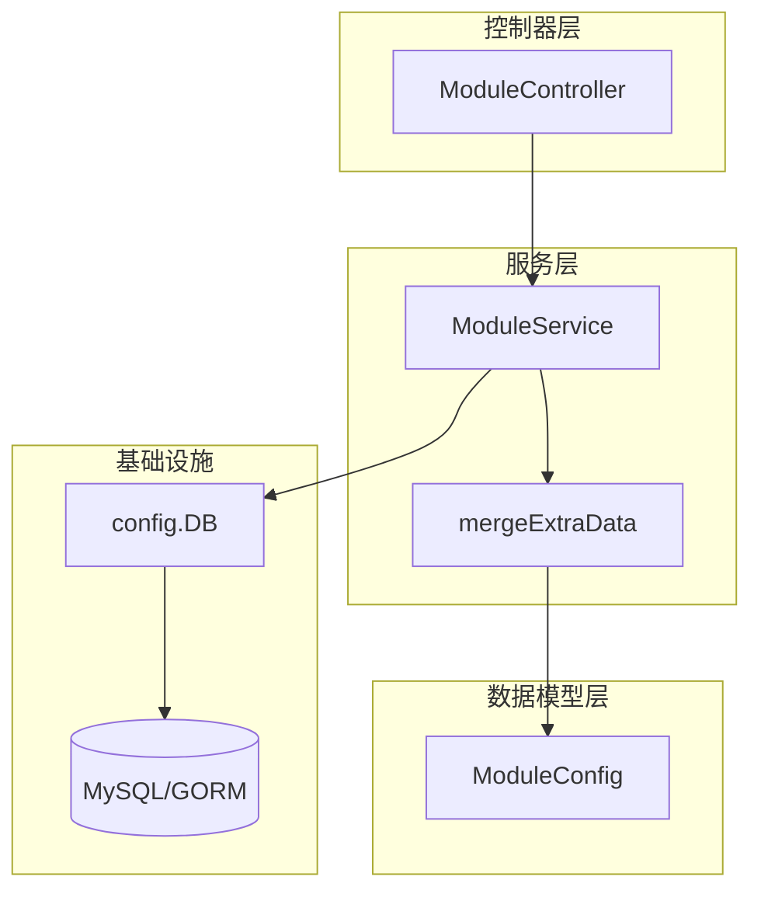
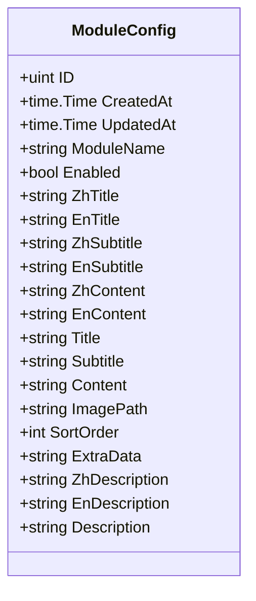
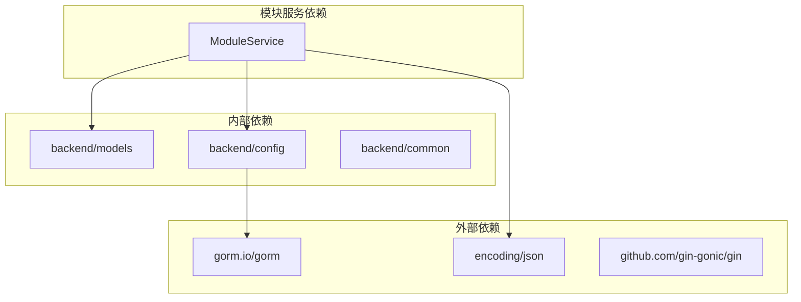

# 业务逻辑层 / 模块服务

**本文档中引用的文件**
- [module_service.go](../../../../backend/services/module_service.go)
- [models.go](../../../../backend/models/models.go)
- [module_controller.go](../../../../backend/controllers/module_controller.go)
- [routes.go](../../../../backend/routes/routes.go)

## 目录
1. [简介](#简介)
2. [项目结构概述](#项目结构概述)
3. [核心应用服务](#核心应用服务)
4. [架构概览](#架构概览)
5. [详细组件分析](#详细组件分析)
6. [依赖关系分析](#依赖关系分析)
7. [性能考虑](#性能考虑)
8. [故障排除指南](#故障排除指南)
9. [结论](#结论)

## 简介

模块服务（ModuleService）是 CMS 系统的核心业务逻辑层组件，负责管理网站各功能模块的配置信息。该服务提供模块配置的增删改查操作，并支持多语言内容和动态扩展字段（ExtraData）的合并处理。

**主要功能列表**
- 获取单个或全部模块配置（支持按模块名称过滤）
- 保存模块配置（支持表单数据和 JSON 两种请求格式）
- 删除模块配置及关联图片
- 获取已启用的公共模块配置（供前端直接调用）
- ExtraData 动态字段合并（将 JSON 扩展字段扁平化到返回结果中）

**采用的设计模式说明**
- **服务层模式**：将业务逻辑与控制器分离，ModuleService 独立处理数据操作
- **依赖注入**：ModuleController 通过 NewModuleService() 注入服务实例
- **数据传输对象**：mergeExtraData 函数将模型数据转换为前端友好的 Map 结构

## 项目结构概述



**图表来源**
- [module_service.go](../../../../backend/services/module_service.go#L13-L79)
- [module_controller.go](../../../../backend/controllers/module_controller.go#L14-L22)

## 核心应用服务

### ModuleService 结构

ModuleService 是无状态服务类，通过 NewModuleService() 工厂函数创建实例。

```go
type ModuleService struct{}

func NewModuleService() *ModuleService {
    return &ModuleService{}
}
```

### GetModuleConfigs 方法

获取模块配置的核心方法，支持两种模式：

1. **单模块查询**：传入 moduleName 参数，返回单个模块配置（含 ExtraData 合并）
2. **全量查询**：不传参数，返回所有模块配置（按 sort_order 排序）

```go
func (s *ModuleService) GetModuleConfigs(moduleName string) (interface{}, error) {
    if moduleName != "" {
        // 单模块查询
        var moduleConfig models.ModuleConfig
        err := config.DB.Where("module_name = ?", moduleName).First(&moduleConfig).Error
        return mergeExtraData(&moduleConfig), nil
    }
    
    // 全量查询
    var moduleConfigs []models.ModuleConfig
    err := config.DB.Order("sort_order ASC").Find(&moduleConfigs).Error
    var results []map[string]interface{}
    for _, mc := range moduleConfigs {
        results = append(results, mergeExtraData(&mc))
    }
    return results, nil
}
```

### SaveModuleConfig 方法

支持两种请求格式的模块配置保存：

1. **multipart/form-data**：处理文件上传和表单字段
2. **application/json**：直接接收 ModuleConfig 对象

**主要功能**
- 自动创建或更新（Upsert）：根据 ModuleName 判断是新建还是更新
- 图片管理：上传新图片时自动删除旧图片文件
- 多语言支持：同时处理中英文标题、副标题、内容和描述
- ExtraData 合并：支持动态扩展字段的 JSON 存储

### DeleteModuleConfig 方法

删除模块配置时同步清理关联的图片文件，避免产生孤儿文件。

### GetPublicModuleConfigs 方法

仅返回已启用（enabled=true）的模块配置，供前端公共接口调用，无需认证。

**章节来源**
- [module_service.go](../../../../backend/services/module_service.go#L19-L211)

## 架构概览

```mermaid
graph TD
    subgraph 客户端
        Frontend[前端应用]
        Admin[管理后台]
    end
    
    subgraph API 层
        PublicAPI[/api/public/modules]
        AdminAPI[/api/admin/modules]
    end
    
    subgraph 控制器层
        ModuleController[ModuleController]
    end
    
    subgraph 服务层
        ModuleService[ModuleService]
        MergeLogic[mergeExtraData]
    end
    
    subgraph 数据访问层
        GORM[GORM ORM]
        ModuleConfig[(ModuleConfig 表)]
    end
    
    Frontend --> PublicAPI
    Admin --> AdminAPI
    PublicAPI --> ModuleController
    AdminAPI --> ModuleController
    ModuleController --> ModuleService
    ModuleService --> MergeLogic
    ModuleService --> GORM
    GORM --> ModuleConfig
```

**各层职责说明**
- **API 层**：定义公共接口和管理接口的路由边界
- **控制器层**：处理 HTTP 请求、参数绑定、响应格式化
- **服务层**：实现核心业务逻辑、数据转换、文件操作
- **数据访问层**：通过 GORM 进行数据库操作

**图表来源**
- [routes.go](../../../../backend/routes/routes.go#L25-L53)
- [module_controller.go](../../../../backend/controllers/module_controller.go)
- [module_service.go](../../../../backend/services/module_service.go)

## 详细组件分析

### ModuleConfig 数据模型

ModuleConfig 是模块配置的核心数据模型，包含以下字段：



**字段说明**
| 字段 | 类型 | 说明 |
|------|------|------|
| ModuleName | string | 模块唯一标识（唯一索引） |
| Enabled | bool | 是否启用（默认 true） |
| ZhTitle/EnTitle | string | 中英文标题 |
| ZhSubtitle/EnSubtitle | string | 中英文副标题 |
| ZhContent/EnContent | string | 中英文内容（text 类型） |
| Title/Subtitle/Content | string | 向后兼容字段 |
| ImagePath | string | 图片相对路径 |
| SortOrder | int | 排序序号（默认 0） |
| ExtraData | string | JSON 格式扩展字段 |
| ZhDescription/EnDescription | string | 中英文描述 |
| Description | string | 向后兼容字段 |

**章节来源**
- [models.go](../../../../backend/models/models.go#L43-L62)

### ExtraData 合并逻辑

mergeExtraData 函数将 ModuleConfig 模型转换为前端友好的 Map 结构，并将 ExtraData JSON 中的字段扁平化合并到结果中。

```mermaid
flowchart TD
    Start[开始] --> Init[创建 result Map]
    Init --> CopyBase[复制基础字段]
    CopyBase --> CheckExtra{ExtraData 非空？}
    CheckExtra -->|是 | ParseJSON[解析 JSON 到 extra Map]
    CheckExtra -->|否 | Return[返回 result]
    ParseJSON --> MergeLoop[遍历 extra 键值对]
    MergeLoop --> MergeItem[result[key] = value]
    MergeItem --> MergeLoop
    MergeLoop --> Return
```

**合并策略**
- 基础字段优先：先复制模型中的所有字段
- 扩展字段覆盖：ExtraData 中的同名字段会覆盖基础字段
- 动态扩展：支持任意 JSON 字段，无需预定义模型

**章节来源**
- [module_service.go](../../../../backend/services/module_service.go#L44-L79)

### API 接口定义

模块服务暴露的 RESTful API 接口：

| 方法 | 路径 | 认证 | 说明 |
|------|------|------|------|
| GET | /api/admin/modules | 需要 | 获取全部模块配置 |
| GET | /api/admin/modules/:name | 需要 | 获取单个模块配置 |
| POST | /api/admin/modules | 需要 | 创建/更新模块配置 |
| PUT | /api/admin/modules/:name | 需要 | 更新模块配置 |
| DELETE | /api/admin/modules/:name | 需要 | 删除模块配置 |
| DELETE | /api/admin/modules/:name/image | 需要 | 删除模块图片 |
| GET | /api/public/modules | 无需 | 获取已启用模块配置 |

**章节来源**
- [routes.go](../../../../backend/routes/routes.go#L25-L53)
- [module_controller.go](../../../../backend/controllers/module_controller.go#L66-L226)

## 依赖关系分析



**依赖特点分析**
- **零外部业务依赖**：ModuleService 仅依赖标准库和基础设施包
- **数据库抽象**：通过 GORM 进行数据访问，便于切换数据库
- **配置集中管理**：数据库连接通过 config.DB 全局访问
- **响应统一格式**：通过 common 包的 JSON 响应函数保证格式一致

**章节来源**
- [module_service.go](../../../../backend/services/module_service.go#L1-L11)

## 性能考虑

### 缓存策略
1. **公共接口缓存**：GetPublicModuleConfigs 结果可缓存，减少数据库查询
2. **单模块查询优化**：ModuleName 有唯一索引，查询效率高

### 并发控制
1. **数据库事务**：GORM 的 Save 操作自动使用事务保证一致性
2. **文件操作原子性**：先保存文件再更新数据库，失败时回滚

### 数据访问优化
1. **排序预定义**：全量查询时使用 Order("sort_order ASC") 避免应用层排序
2. **字段选择**：仅查询必要字段，避免 SELECT *
3. **索引利用**：ModuleName 和 Enabled 字段均有索引

**具体优化措施**
1. 使用 First() 而非 Find().First() 减少查询次数
2. 批量查询时预先分配结果切片容量
3. ExtraData 解析失败时静默忽略，避免阻塞主流程

## 故障排除指南

### 常见问题及解决方案

1. **模块配置无法保存**
   - 检查 ModuleName 是否为空（必填字段）
   - 验证数据库连接是否正常
   - 检查表单 Content-Type 是否正确设置

2. **图片上传失败**
   - 确认 uploads 目录存在且有写权限
   - 检查文件大小是否超过限制
   - 验证文件扩展名是否允许

3. **ExtraData 解析错误**
   - 确保 JSON 格式正确
   - 检查特殊字符是否转义
   - 使用在线 JSON 验证工具检查

4. **多语言字段不生效**
   - 确认前端传递了正确的字段名（zhTitle/enTitle 等）
   - 检查后端是否正确接收表单数据
   - 验证数据库字段长度是否足够

### 监控指标列表
- 模块配置查询响应时间
- 图片上传成功率
- 数据库连接池状态
- ExtraData 解析失败次数

### 相关源码链接
- [错误处理中间件](../../../../backend/middleware/error_handler.go)
- [数据库配置](../../../../backend/config/database.go)

## 结论

### 设计优势总结
- **职责分离**：服务层独立于控制器，便于单元测试
- **灵活扩展**：ExtraData 机制支持动态字段，无需频繁修改模型
- **多语言就绪**：内置中英文字段，支持国际化需求
- **向后兼容**：保留旧字段同时支持新字段，平滑迁移

### 最佳实践总结
- 使用工厂函数创建服务实例，便于依赖注入
- 统一响应格式，通过 common 包封装 JSON 响应
- 文件操作与数据库操作分离，失败时手动清理
- 公共接口与管理接口分离，降低安全风险

### 技术特色总结
- **ExtraData 合并**：将 JSON 扩展字段扁平化到返回结果，前端无需二次解析
- **双格式支持**：同时支持 multipart/form-data 和 application/json 请求
- **图片自动清理**：删除配置时自动删除关联图片，避免存储浪费

### 未来展望
- 引入 Redis 缓存热点模块配置
- 支持模块配置的版本控制和回滚
- 增加模块依赖关系管理
- 提供模块配置导入/导出功能

**章节来源**
- [module_service.go](../../../../backend/services/module_service.go)
- [models.go](../../../../backend/models/models.go)
- [module_controller.go](../../../../backend/controllers/module_controller.go)
- [routes.go](../../../../backend/routes/routes.go)