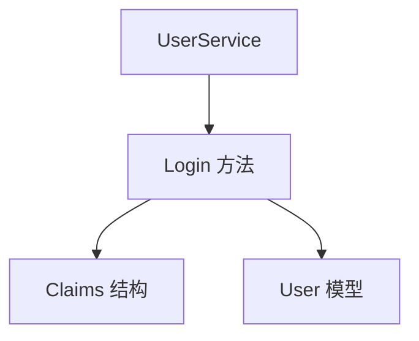
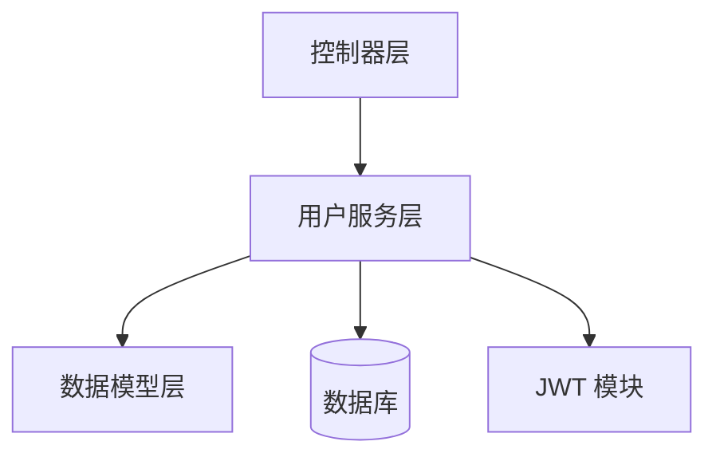
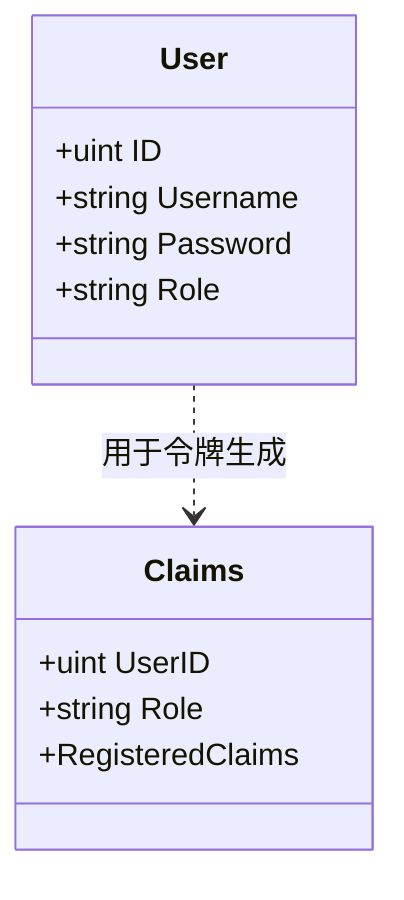
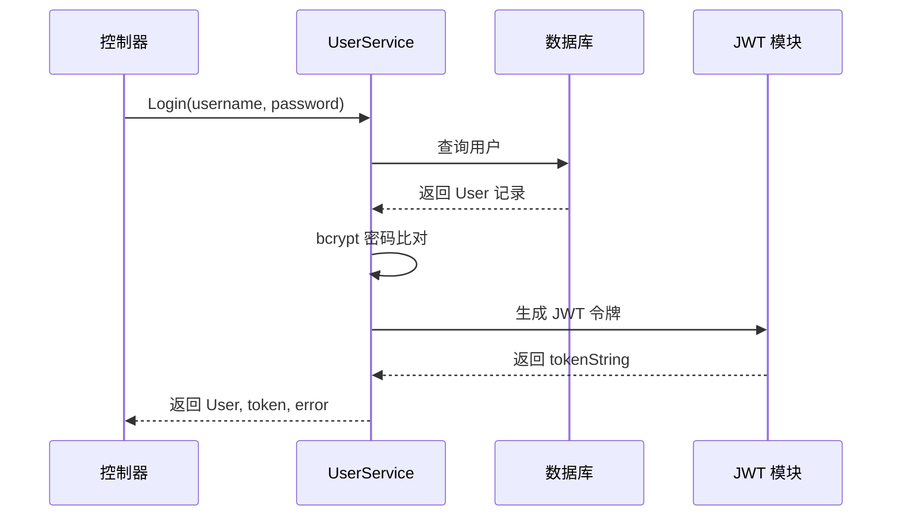
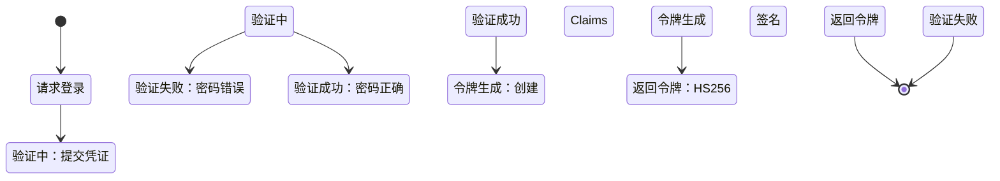
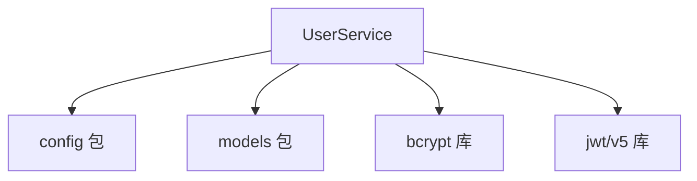

# 用户服务

**本文档中引用的文件**
- [user_service.go](../../../../backend/services/user_service.go)
- [models.go](../../../../backend/models/models.go)

## 目录
1. [简介](#简介)
2. [项目结构概述](#项目结构概述)
3. [核心应用服务](#核心应用服务)
4. [架构概览](#架构概览)
5. [详细组件分析](#详细组件分析)
6. [依赖关系分析](#依赖关系分析)
7. [性能考虑](#性能考虑)
8. [故障排除指南](#故障排除指南)
9. [结论](#结论)

## 简介

用户服务模块是医疗 CMS 系统的核心认证组件，负责用户身份验证和 JWT 令牌生成。

- **模块定位**：位于业务逻辑层（services），为控制器层提供用户认证服务
- **主要功能**：
  - 用户名密码验证
  - 密码哈希比对（bcrypt）
  - JWT 令牌生成与签名
  - 用户角色信息提取

**章节来源**
- [user_service.go](../../../../backend/services/user_service.go)(L1-L44)
- [models.go](../../../../backend/models/models.go)(L10-L21)

## 项目结构概述



**图表来源**
- [user_service.go](../../../../backend/services/user_service.go)(L12-L43)
- [models.go](../../../../backend/models/models.go)(L10-L21)

## 核心应用服务

### UserService

**设计模式**：服务层模式（Service Layer Pattern）

**核心代码示例**：

```go
type UserService struct{}

func NewUserService() *UserService {
    return &UserService{}
}

func (s *UserService) Login(username, password string) (*models.User, string, error) {
    // 1. 从数据库查询用户
    var user models.User
    if err := config.DB.Where("username = ?", username).First(&user).Error; err != nil {
        return nil, "", err
    }

    // 2. bcrypt 密码验证
    if err := bcrypt.CompareHashAndPassword([]byte(user.Password), []byte(password)); err != nil {
        return nil, "", err
    }

    // 3. 生成 JWT 令牌（有效期 24 小时）
    expirationTime := time.Now().Add(24 * time.Hour)
    claims := &models.Claims{
        UserID: user.ID,
        Role:   user.Role,
        RegisteredClaims: jwt.RegisteredClaims{
            ExpiresAt: jwt.NewNumericDate(expirationTime),
        },
    }

    token := jwt.NewWithClaims(jwt.SigningMethodHS256, claims)
    tokenString, err := token.SignedString(config.JWTSecret)
    if err != nil {
        return nil, "", err
    }

    return &user, tokenString, nil
}
```

**主要功能**：
- 用户身份验证
- 密码安全比对
- JWT 令牌生成

**关键特性**：
- 使用 bcrypt 进行密码哈希验证
- JWT 令牌有效期为 24 小时
- 采用 HS256 签名算法
- 令牌中包含用户 ID 和角色信息

**章节来源**
- [user_service.go](../../../../backend/services/user_service.go)(L12-L43)

## 架构概览



**各层职责**：
- **控制器层**：接收 HTTP 请求，调用 UserService 进行认证
- **用户服务层**：执行业务逻辑，包括密码验证和令牌生成
- **数据模型层**：定义 User 和 Claims 数据结构
- **数据库**：存储用户凭证信息
- **JWT 模块**：提供令牌生成和签名能力

**图表来源**
- [user_service.go](../../../../backend/services/user_service.go)
- [models.go](../../../../backend/models/models.go)

## 详细组件分析

### User 模型



### 登录认证流程



### 令牌状态流转



**章节来源**
- [models.go](../../../../backend/models/models.go)(L10-L21)
- [user_service.go](../../../../backend/services/user_service.go)(L18-L43)

## 依赖关系分析



**依赖特点**：
1. **config 包**：提供数据库连接和 JWT 密钥配置
2. **models 包**：定义 User 和 Claims 数据结构
3. **bcrypt 库**：提供密码哈希比对功能
4. **jwt/v5 库**：提供 JWT 令牌生成和签名能力

**章节来源**
- [user_service.go](../../../../backend/services/user_service.go)(L1-L10)

## 性能考虑

1. **密码验证优化**
   - bcrypt 默认 cost 因子平衡安全性与性能
   - 密码比对在内存中完成，无额外 I/O

2. **令牌生成策略**
   - JWT 无状态设计，减少会话存储开销
   - 24 小时有效期平衡安全性与用户体验

3. **数据库查询优化**
   - 使用 `First()` 方法确保单条记录查询
   - username 字段建立唯一索引加速查询

## 故障排除指南

**常见问题及解决方案**：

1. **登录失败 - 用户不存在**
   - 检查数据库中是否存在对应用户记录
   - 验证 username 参数拼写

2. **登录失败 - 密码错误**
   - 确认密码哈希格式正确
   - 检查 bcrypt 版本兼容性

3. **令牌生成失败**
   - 验证 config.JWTSecret 已正确配置
   - 检查 JWT 密钥格式

**监控指标**：
- 登录请求成功率
- 平均认证响应时间
- 令牌生成失败次数

**相关源码**：
- [user_service.go](../../../../backend/services/user_service.go)(L18-L43)

## 结论

**设计优势**：
- 服务层与控制器层解耦，便于单元测试
- 使用成熟的 JWT 标准实现无状态认证
- bcrypt 密码哈希提供安全保障

**最佳实践**：
- 密码永不明文存储
- 令牌设置合理有效期
- 错误信息不泄露敏感细节

**技术特色**：
- 采用 Go 语言标准库与成熟第三方库组合
- 简洁的服务层设计模式
- 完整的错误处理机制

**未来展望**：
- 可考虑添加令牌刷新机制
- 支持多因素认证扩展
- 集成 OAuth2 第三方登录