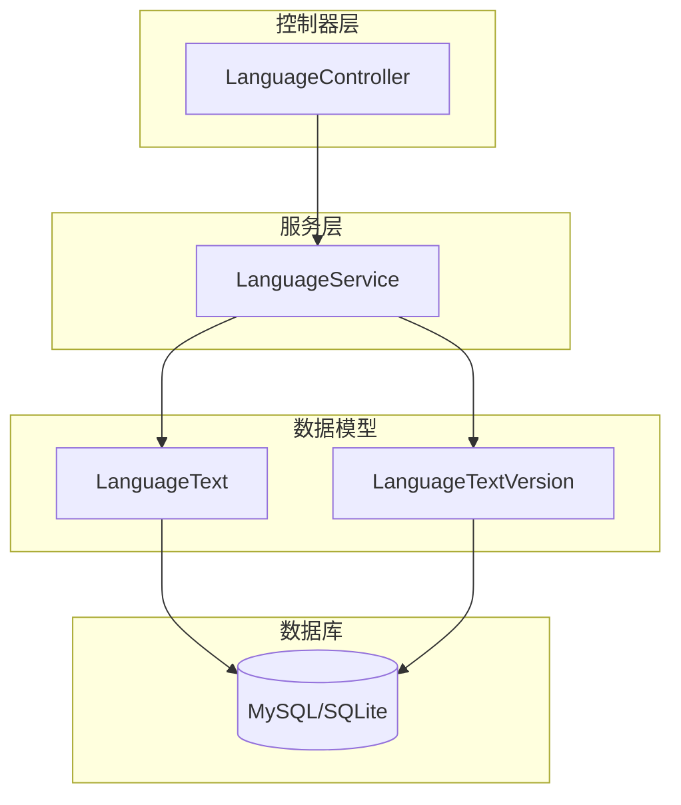
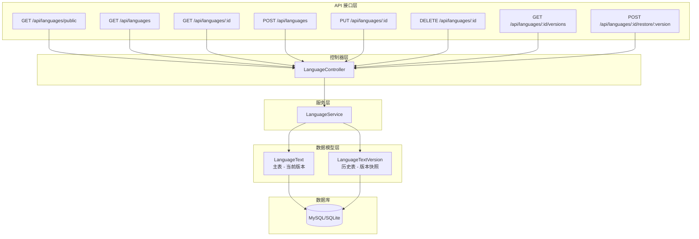
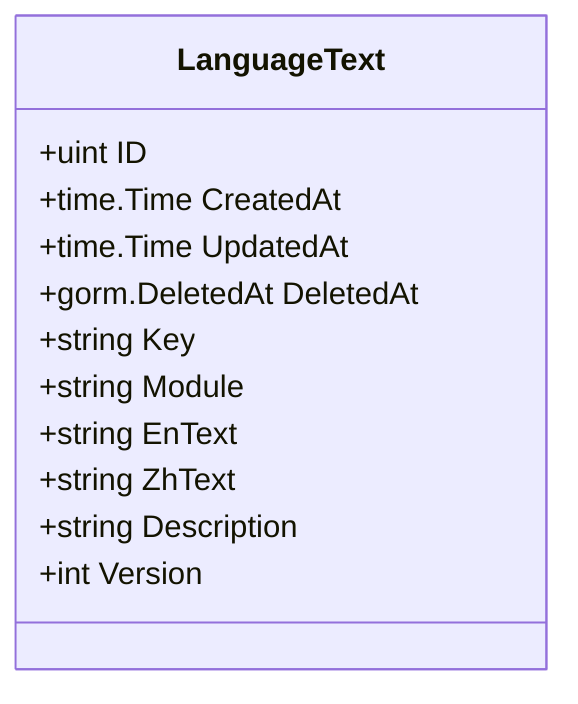
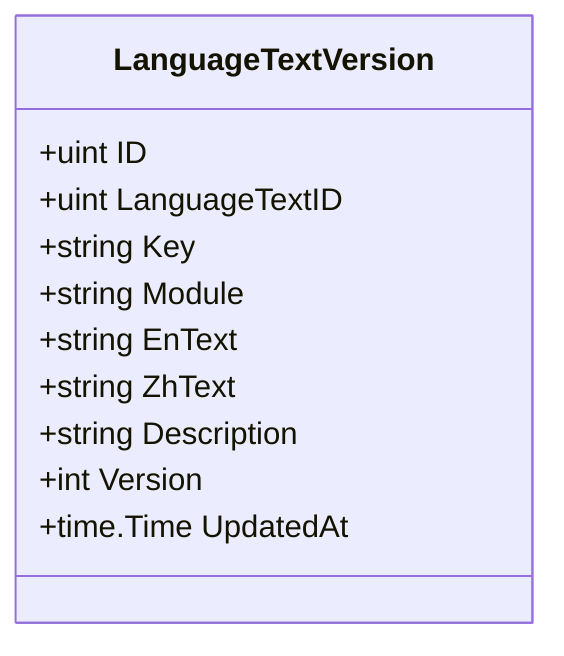
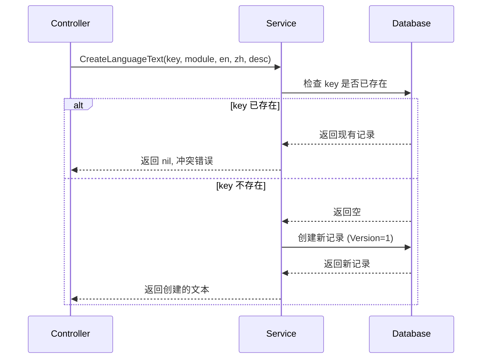
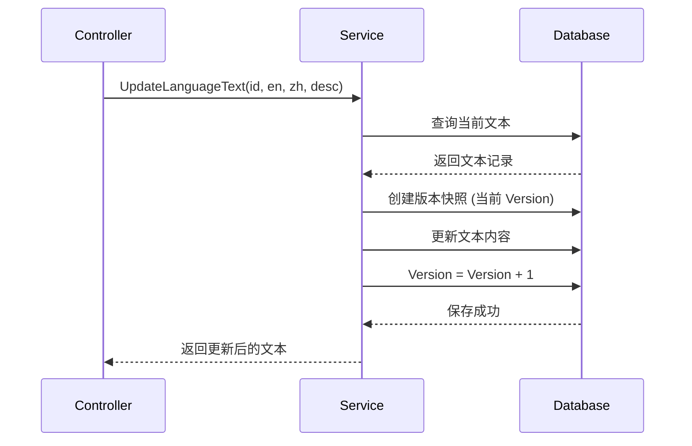
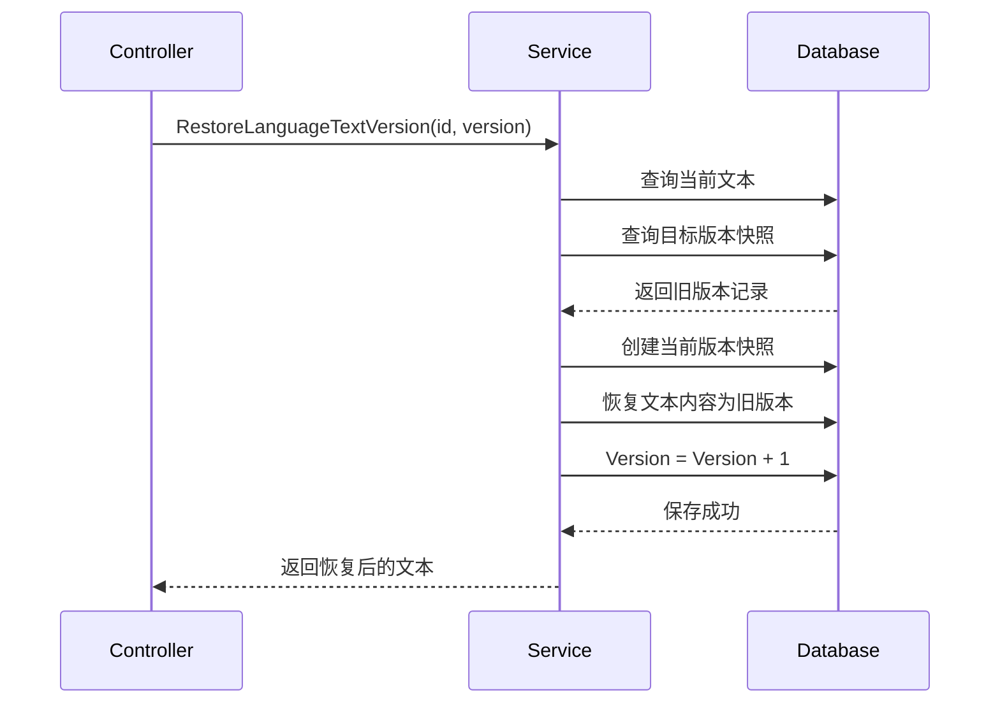
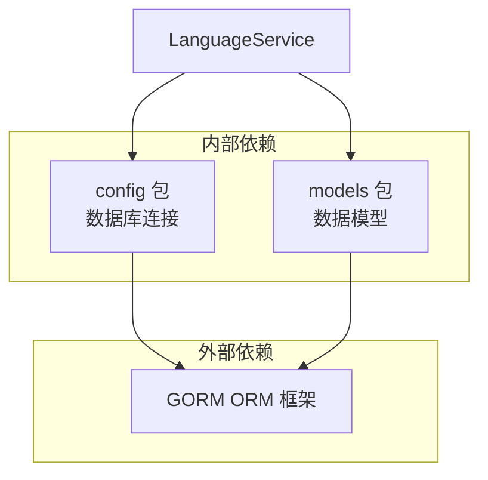

# 语言服务

**本文档中引用的文件**
- [language_service.go](../../../../backend/services/language_service.go)
- [models.go](../../../../backend/models/models.go)(L78-L98)
- [language_controller.go](../../../../backend/controllers/language_controller.go)

## 目录
1. [简介](#简介)
2. [项目结构概述](#项目结构概述)
3. [核心应用服务](#核心应用服务)
4. [架构概览](#架构概览)
5. [详细组件分析](#详细组件分析)
6. [依赖关系分析](#依赖关系分析)
7. [性能考虑](#性能考虑)
8. [故障排除指南](#故障排除指南)
9. [结论](#结论)

## 简介

语言服务（LanguageService）是 CMS 系统的多语言文本管理核心模块，负责中英文双语内容的存储、查询、版本控制与历史恢复功能。

### 模块定位和职责

- **多语言文本管理**：统一管理系统中所有需要国际化的文本内容
- **版本控制**：每次更新自动保存历史版本，支持版本追溯
- **历史恢复**：支持将文本内容恢复到任意历史版本
- **模块隔离**：支持按业务模块（module）组织和查询文本

### 主要功能列表

- 获取公开的多语言文本（支持按模块过滤）
- 按 ID 或模块查询语言文本
- 创建新的语言文本条目（带重复键检查）
- 更新文本内容并自动保存版本快照
- 删除文本及其关联的版本历史
- 查询文本的完整版本历史
- 恢复到指定的历史版本

### 设计模式说明

- **服务层模式**：LanguageService 封装业务逻辑，与 Controller 层解耦
- **版本快照模式**：更新前自动创建 LanguageTextVersion 快照，实现审计追溯
- **仓库模式**：通过 GORM 操作数据库，隐藏底层数据访问细节

## 项目结构概述



**图表来源**
- [language_service.go](../../../../backend/services/language_service.go)(L1-L146)
- [models.go](../../../../backend/models/models.go)(L78-L98)
- [language_controller.go](../../../../backend/controllers/language_controller.go)(L1-L125)

## 核心应用服务

### LanguageService 服务

LanguageService 是语言模块的核心业务服务，提供 9 个主要方法：

#### 1. 查询服务

| 方法 | 功能 | 参数 | 返回值 |
|------|------|------|--------|
| GetPublicLanguageTexts | 获取所有公开文本 | 无 | map[string]map[string]string |
| GetPublicLanguageTextsByModule | 按模块获取公开文本 | module string | map[string]map[string]string |
| GetLanguageTexts | 获取文本列表（含元数据） | module string | []LanguageText |
| GetLanguageText | 按 ID 获取单个文本 | id uint | *LanguageText |

#### 2. 写入服务

| 方法 | 功能 | 参数 | 返回值 |
|------|------|------|--------|
| CreateLanguageText | 创建新文本 | key, module, enText, zhText, description | *LanguageText |
| UpdateLanguageText | 更新文本（带版本快照） | id, enText, zhText, description | *LanguageText |
| DeleteLanguageText | 删除文本及版本历史 | id uint | error |

#### 3. 版本管理服务

| 方法 | 功能 | 参数 | 返回值 |
|------|------|------|--------|
| GetLanguageTextVersions | 获取版本历史 | id uint | []LanguageTextVersion |
| RestoreLanguageTextVersion | 恢复到历史版本 | id, version uint | *LanguageText |

### 核心代码示例

#### 更新文本并保存版本快照

```go
func (s *LanguageService) UpdateLanguageText(id uint, enText, zhText, description string) (*models.LanguageText, error) {
    var text models.LanguageText
    if err := config.DB.First(&text, id).Error; err != nil {
        return nil, err
    }

    // 保存当前版本到历史表
    config.DB.Create(&models.LanguageTextVersion{
        LanguageTextID: text.ID,
        Key:            text.Key,
        Module:         text.Module,
        EnText:         text.EnText,
        ZhText:         text.ZhText,
        Description:    text.Description,
        Version:        text.Version,
        UpdatedAt:      text.UpdatedAt,
    })

    // 更新当前文本并递增版本号
    text.EnText = enText
    text.ZhText = zhText
    text.Description = description
    text.Version++

    err := config.DB.Save(&text).Error
    return &text, err
}
```

**章节来源**
- [language_service.go](../../../../backend/services/language_service.go)(L75-L99)

## 架构概览



**图表来源**
- [language_controller.go](../../../../backend/controllers/language_controller.go)(L1-L125)

## 详细组件分析

### 数据模型

#### LanguageText 主表

存储当前版本的多语言文本内容。



**字段说明**

| 字段 | 类型 | 约束 | 说明 |
|------|------|------|------|
| ID | uint | 主键 | 自增 ID |
| Key | string | 唯一索引，非空 | 文本键名，用于程序引用 |
| Module | string | 非空 | 所属业务模块 |
| EnText | string | text 类型 | 英文文本内容 |
| ZhText | string | text 类型 | 中文文本内容 |
| Description | string | - | 文本用途描述 |
| Version | int | 默认 1 | 当前版本号 |

#### LanguageTextVersion 历史表

存储每次更新前的版本快照，用于审计和恢复。



**字段说明**

| 字段 | 类型 | 约束 | 说明 |
|------|------|------|------|
| LanguageTextID | uint | 非空 | 关联主表 ID |
| Version | int | 非空 | 快照时的版本号 |
| UpdatedAt | time.Time | - | 快照时间 |

**章节来源**
- [models.go](../../../../backend/models/models.go)(L78-L98)

### 业务流程

#### 创建文本流程



#### 更新文本流程（带版本控制）



#### 恢复历史版本流程



**章节来源**
- [language_service.go](../../../../backend/services/language_service.go)(L56-L146)

## 依赖关系分析



### 依赖特点分析

1. **数据库依赖**：通过 `config.DB` 全局变量访问数据库，简化依赖注入
2. **模型依赖**：直接引用 `models.LanguageText` 和 `models.LanguageTextVersion`
3. **无外部服务依赖**：不依赖缓存、消息队列等外部组件
4. **事务支持**：版本创建与更新在同一事务上下文中执行

## 性能考虑

### 缓存策略

1. **公开文本缓存建议**：`GetPublicLanguageTexts` 返回的数据适合在前端或网关层缓存
2. **按模块查询**：支持 `module` 参数过滤，减少不必要的数据传输

### 并发控制

1. **GORM 内置锁**：数据库操作依赖 GORM 的事务和锁机制
2. **版本递增**：每次更新自动递增版本号，避免并发覆盖

### 数据访问优化

1. **按模块索引**：`Module` 字段建议添加数据库索引，加速按模块查询
2. **唯一键索引**：`Key` 字段已有唯一索引，确保快速查找和去重
3. **版本历史查询**：`LanguageTextID` 字段建议添加索引，加速版本追溯

### 具体优化措施

1. 对于高频访问的公开文本，建议在应用层添加 Redis 缓存
2. 批量创建文本时，考虑使用事务批量插入
3. 定期清理过期的版本历史数据（如保留最近 10 个版本）

## 故障排除指南

### 常见问题及解决方案

1. **Key 已存在错误**
   - 现象：创建文本时返回 409 冲突
   - 原因：`key` 字段有唯一索引约束
   - 解决：使用不同的 key 或先删除/更新现有记录

2. **版本恢复失败**
   - 现象：恢复操作返回 "Version not found"
   - 原因：指定的版本号不存在于历史表
   - 解决：先调用 `GetLanguageTextVersions` 查询可用版本列表

3. **文本查询为空**
   - 现象：`GetLanguageTexts` 返回空列表
   - 原因：数据库中无记录或 module 参数不匹配
   - 解决：检查 module 参数是否正确，或查询所有模块

### 监控指标

- 文本总数：`SELECT COUNT(*) FROM language_texts`
- 版本历史总数：`SELECT COUNT(*) FROM language_text_versions`
- 平均版本号：监控文本的平均更新频率
- 模块分布：`SELECT module, COUNT(*) FROM language_texts GROUP BY module`

### 相关源码链接

- [创建文本](../../../../backend/services/language_service.go)(L56-L73)
- [更新文本](../../../../backend/services/language_service.go)(L75-L99)
- [版本恢复](../../../../backend/services/language_service.go)(L117-L146)

## 结论

### 设计优势

1. **版本追溯**：自动保存历史版本，支持审计和回滚
2. **模块隔离**：按业务模块组织文本，便于管理和查询
3. **键名唯一**：通过唯一 key 实现程序化引用，解耦 ID 与业务逻辑
4. **简单接口**：9 个方法覆盖完整的 CRUD 和版本管理需求

### 最佳实践

1. 创建文本时使用有意义的 key（如 `header.title.welcome`）
2. 更新频繁的重要文本定期备份版本历史
3. 按模块组织文本，便于权限控制和批量操作
4. 公开文本适合缓存，减少数据库查询

### 技术特色

- **GORM 集成**：充分利用 GORM 的 Model 钩子和事务支持
- **软删除支持**：继承 `gorm.Model`，支持 DeletedAt 软删除
- **版本快照**：更新前自动创建快照，无需手动触发

### 未来展望

1. 支持更多语言（当前仅中英文）
2. 添加文本差异对比功能
3. 支持批量导入/导出多语言文本
4. 集成翻译 API 实现自动翻译建议

**章节来源**
- [language_service.go](../../../../backend/services/language_service.go)
- [models.go](../../../../backend/models/models.go)
- [language_controller.go](../../../../backend/controllers/language_controller.go)