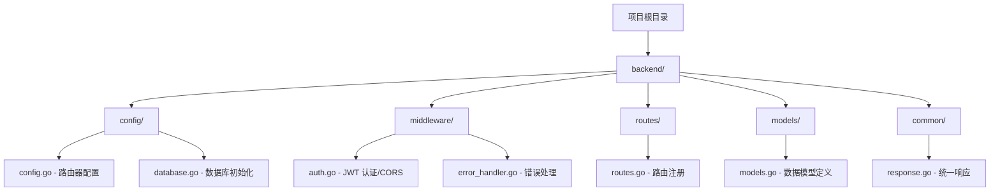
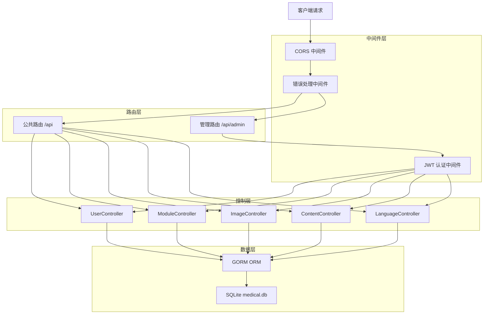
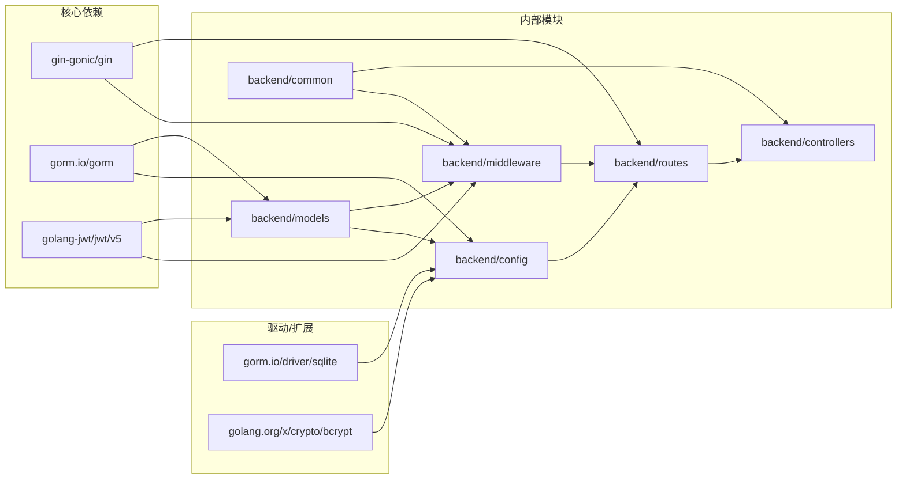

# 基础设施与中间件

**本文档中引用的文件**
- [main.go](../../../../main.go)
- [config.go](../../../../backend/config/config.go)
- [database.go](../../../../backend/config/database.go)
- [auth.go](../../../../backend/middleware/auth.go)
- [error_handler.go](../../../../backend/middleware/error_handler.go)
- [routes.go](../../../../backend/routes/routes.go)
- [models.go](../../../../backend/models/models.go)
- [response.go](../../../../backend/common/response.go)

## 目录

1. [简介](#简介)
2. [项目结构](#项目结构)
3. [核心组件](#核心组件)
4. [架构概览](#架构概览)
5. [详细组件分析](#详细组件分析)
6. [依赖分析](#依赖分析)
7. [性能考虑](#性能考虑)
8. [故障排除指南](#故障排除指南)
9. [结论](#结论)

---

## 简介

本模块负责医疗设备 CMS 系统的基础设施配置与中间件实现，涵盖数据库连接、认证授权、错误处理、CORS 跨域支持及路由注册机制。系统采用 Go 语言结合 Gin 框架构建 RESTful API，使用 GORM 作为 ORM 层操作 SQLite 数据库。

**设计目标**：
- 提供统一的数据库初始化和迁移机制
- 实现基于 JWT 的安全认证中间件
- 建立全局错误处理和统一响应格式
- 支持跨域请求，便于前后端分离部署

**关键技术栈**：
- Web 框架：[Gin](https://github.com/gin-gonic/gin)
- ORM：[GORM](https://gorm.io) with SQLite 驱动
- JWT：[golang-jwt/jwt/v5](https://github.com/golang-jwt/jwt)
- 密码加密：[bcrypt](https://pkg.go.dev/golang.org/x/crypto/bcrypt)

**本节来源**：
- [main.go](../../../../main.go)
- [config.go](../../../../backend/config/config.go)

---

## 项目结构



**图示来源**：
- [backend/config/](../../../../backend/config/)
- [backend/middleware/](../../../../backend/middleware/)
- [backend/routes/](../../../../backend/routes/)

**本节来源**：
- [backend/config/config.go](../../../../backend/config/config.go)
- [backend/middleware/auth.go](../../../../backend/middleware/auth.go)

---

## 核心组件

| 组件 | 文件 | 职责 |
|------|------|------|
| 数据库配置 | [database.go](../../../../backend/config/database.go) | SQLite 连接初始化、自动迁移、默认数据 seeding |
| 路由器配置 | [config.go](../../../../backend/config/config.go) | Gin Engine 创建、全局变量定义 |
| JWT 认证 | [auth.go](../../../../backend/middleware/auth.go) | Token 验证、用户身份提取 |
| CORS 中间件 | [auth.go](../../../../backend/middleware/auth.go) | 跨域请求头设置 |
| 错误处理 | [error_handler.go](../../../../backend/middleware/error_handler.go) | Panic 恢复、Gin 错误分类处理 |
| 路由注册 | [routes.go](../../../../backend/routes/routes.go) | API 路由分组、静态资源映射 |
| 数据模型 | [models.go](../../../../backend/models/models.go) | User、Image、PageConfig 等 7 个模型 |
| 统一响应 | [response.go](../../../../backend/common/response.go) | APIResponse 结构、状态码定义 |

**本节来源**：
- [backend/config/database.go](../../../../backend/config/database.go)
- [backend/middleware/error_handler.go](../../../../backend/middleware/error_handler.go)
- [backend/routes/routes.go](../../../../backend/routes/routes.go)

---

## 架构概览



**图示来源**：
- [routes.go](../../../../backend/routes/routes.go)(L10-L67)
- [auth.go](../../../../backend/middleware/auth.go)(L13-L57)

**本节来源**：
- [main.go](../../../../main.go)
- [routes.go](../../../../backend/routes/routes.go)

---

## 详细组件分析

### 5.1 数据库配置模块

**功能描述**：
负责 SQLite 数据库连接初始化、模型自动迁移和默认数据 seeding。

**实现细节**：
- 使用 `gorm.Open(sqlite.Open("medical.db"))` 连接本地 SQLite 数据库
- 自动迁移 7 个数据模型：User, Image, PageConfig, ModuleConfig, ContentItem, LanguageText, LanguageTextVersion
- 初始化默认管理员账户（用户名：admin，密码经 bcrypt 加密存储）
- 预置页面配置数据（banner、about、products）

**关键代码引用**：
```go
// database.go - 数据库初始化
func InitDB() error {
    DB, err = gorm.Open(sqlite.Open("medical.db"), &gorm.Config{})
    // AutoMigrate 7 个模型
    err = DB.AutoMigrate(
        &models.User{},
        &models.Image{},
        &models.PageConfig{},
        &models.ModuleConfig{},
        &models.ContentItem{},
        &models.LanguageText{},
        &models.LanguageTextVersion{},
    )
    initDefaultUser()
    initDefaultPageConfig()
    return nil
}
```

**图示来源**：
- [database.go](../../../../backend/config/database.go)(L12-L35)

**本节来源**：
- [backend/config/database.go](../../../../backend/config/database.go)
- [backend/models/models.go](../../../../backend/models/models.go)

---

### 5.2 认证中间件

**功能描述**：
实现基于 JWT 的身份验证，保护管理 API 端点。

**实现细节**：
- 从 `Authorization` Header 获取 Token
- 支持 `Bearer ` 前缀自动剥离
- 使用 `config.JWTSecret` 验证 Token 签名
- 验证成功后将 `user_id` 和 `role` 注入 Gin Context
- 验证失败返回 401 Unauthorized

**CORS 支持**：
- 允许所有来源 (`*`)
- 支持方法：GET, POST, PUT, DELETE, OPTIONS
- 允许 Header：Content-Type, Authorization
- OPTIONS 请求直接返回 204

**关键代码引用**：
```go
// auth.go - JWT 认证
func AuthMiddleware() gin.HandlerFunc {
    return func(c *gin.Context) {
        tokenString := c.GetHeader("Authorization")
        // 处理 Bearer 前缀
        if len(tokenString) > 7 && tokenString[:7] == "Bearer " {
            tokenString = tokenString[7:]
        }
        // 验证 Token
        token, err := jwt.ParseWithClaims(tokenString, claims, ...)
        if err != nil || !token.Valid {
            common.JSONUnauthorized(c, "Invalid token")
            c.Abort()
            return
        }
        c.Set("user_id", claims.UserID)
        c.Set("role", claims.Role)
        c.Next()
    }
}
```

**图示来源**：
- [auth.go](../../../../backend/middleware/auth.go)(L13-L45)

**本节来源**：
- [backend/middleware/auth.go](../../../../backend/middleware/auth.go)
- [backend/config/config.go](../../../../backend/config/config.go)

---

### 5.3 错误处理中间件

**功能描述**：
提供全局错误捕获和统一错误响应格式。

**实现细节**：
- 使用 `defer/recover` 捕获 panic
- 根据 `gin.ErrorType` 分类处理：
  - `Bind` → 400 Bad Request
  - `Render` → 500 Internal Server Error
  - `Private` → 500 Internal Server Error
  - `Public` → 400 Bad Request

**错误码定义**：
| 错误码 | 名称 | HTTP 状态 |
|--------|------|----------|
| 400 | ErrBadRequest | 400 |
| 401 | ErrUnauthorized | 401 |
| 403 | ErrForbidden | 403 |
| 404 | ErrNotFound | 404 |
| 500 | ErrInternalServerError | 500 |
| 501 | ErrDatabaseError | 500 |
| 502 | ErrValidationError | 500 |
| 503 | ErrServiceUnavailable | 503 |

**图示来源**：
- [error_handler.go](../../../../backend/middleware/error_handler.go)(L11-L57)

**本节来源**：
- [backend/middleware/error_handler.go](../../../../backend/middleware/error_handler.go)
- [backend/common/response.go](../../../../backend/common/response.go)

---

### 5.4 路由注册机制

**功能描述**：
统一管理所有 API 路由的注册，区分公共接口和管理接口。

**路由结构**：

```mermaid
flowchart TD
    Root[/] --> Static[静态资源]
    Root --> API[/api]
    
    Static --> Uploads[/uploads]
    Static --> Frontend[/frontend]
    Static --> Admin[/admin]
    
    API --> Public[公共路由]
    API --> AdminAPI[管理路由 /admin]
    
    Public --> Login[POST /login]
    Public --> PublicConfig[GET /public/config]
    Public --> PublicModules[GET /public/modules]
    Public --> PublicImages[GET /public/images]
    Public --> PublicContent[GET /public/content]
    Public --> PublicLang[GET /public/lang]
    
    AdminAPI --> Auth{JWT 认证}
    Auth --> AdminImages[GET/POST/PUT/DELETE /images]
    Auth --> AdminConfig[GET/PUT /config]
    Auth --> AdminModules[GET/POST/PUT/DELETE /modules]
    Auth --> AdminContent[GET/POST/PUT/DELETE /content]
    Auth --> AdminLang[GET/POST/PUT/DELETE /lang]
```

**图示来源**：
- [routes.go](../../../../backend/routes/routes.go)(L10-L67)

**本节来源**：
- [backend/routes/routes.go](../../../../backend/routes/routes.go)

---

### 5.5 统一响应格式

**功能描述**：
定义标准化的 API 响应结构和辅助函数。

**响应结构**：
```go
type APIResponse struct {
    Code      int         `json:"code"`
    Message   string      `json:"message"`
    Data      interface{} `json:"data,omitempty"`
    Timestamp int64       `json:"timestamp"`
}
```

**成功响应示例**：
```json
{
    "code": 200,
    "message": "success",
    "data": {...},
    "timestamp": 1716825600
}
```

**错误响应示例**：
```json
{
    "code": 401,
    "message": "Unauthorized",
    "data": null,
    "timestamp": 1716825600
}
```

**本节来源**：
- [backend/common/response.go](../../../../backend/common/response.go)

---

## 依赖分析



**图示来源**：
- [go.mod](../../../../go.mod) - 依赖声明
- 各源码文件 import 语句

**本节来源**：
- [backend/config/config.go](../../../../backend/config/config.go)
- [backend/config/database.go](../../../../backend/config/database.go)
- [backend/middleware/auth.go](../../../../backend/middleware/auth.go)

---

## 性能考虑

- **SQLite 适用场景**：适合中小型 CMS 系统，单文件数据库便于部署和备份
- **GORM 自动迁移**：启动时自动同步模型结构，减少手动维护成本
- **JWT 无状态认证**：服务端无需存储 session，支持水平扩展
- **中间件链式处理**：Gin 中间件按注册顺序执行，避免重复逻辑
- **静态资源直连**：`/uploads`、`/frontend`、`/admin` 路径直接映射到文件系统，减少 Go 处理开销
- **统一响应结构**：减少序列化逻辑重复，便于前端统一处理

---

## 故障排除指南

### 常见问题

| 问题 | 可能原因 | 解决方案 |
|------|----------|----------|
| 数据库连接失败 | medical.db 文件权限问题 | 检查文件权限，确保应用有读写权限 |
| JWT 验证失败 | Token 过期或 Secret 不匹配 | 检查 Token 有效期，确认 JWTSecret 配置一致 |
| CORS 预检失败 | 浏览器缓存或 Header 缺失 | 清除浏览器缓存，检查请求 Header |
| 401 Unauthorized | 缺少 Authorization Header | 确保请求携带有效的 Bearer Token |
| 500 Internal Server Error | Panic 未捕获或数据库错误 | 查看日志输出，检查 ErrorHandler 中间件 |

### 调试建议

1. **查看启动日志**：确认 `Server starting on :8080` 是否正常输出
2. **检查数据库文件**：确认 `medical.db` 是否在项目根目录生成
3. **验证默认用户**：尝试使用 `admin/admin123` 登录获取 Token
4. **中间件顺序**：确保 CORS 和 ErrorHandler 在 Auth 之前注册
5. **日志输出**：AuthMiddleware 会记录无效 Token 请求的 URL

**相关文件引用**：
- [main.go](../../../../main.go) - 启动入口
- [database.go](../../../../backend/config/database.go) - 数据库初始化
- [auth.go](../../../../backend/middleware/auth.go) - 认证逻辑

---

## 结论

本模块为医疗设备 CMS 系统提供了完整的基础设施支持：

**核心特点**：
- 基于 SQLite + GORM 的轻量级数据持久化方案
- JWT 无状态认证，支持 Bearer Token 标准
- 全局错误处理和统一响应格式
- 清晰的路由分组（公共/管理）

**对开发者的建议**：
- 生产环境应将 JWTSecret 移至环境变量
- 考虑添加请求限流中间件防止暴力破解
- 对于高并发场景，建议迁移到 PostgreSQL 或 MySQL

**未来扩展方向**：
- 支持多数据库驱动切换（PostgreSQL/MySQL）
- 添加 Redis 缓存层提升性能
- 实现更细粒度的 RBAC 权限控制
- 集成 OpenTelemetry 进行链路追踪

**本节来源**：
- [backend/config/database.go](../../../../backend/config/database.go)
- [backend/middleware/auth.go](../../../../backend/middleware/auth.go)
- [backend/routes/routes.go](../../../../backend/routes/routes.go)