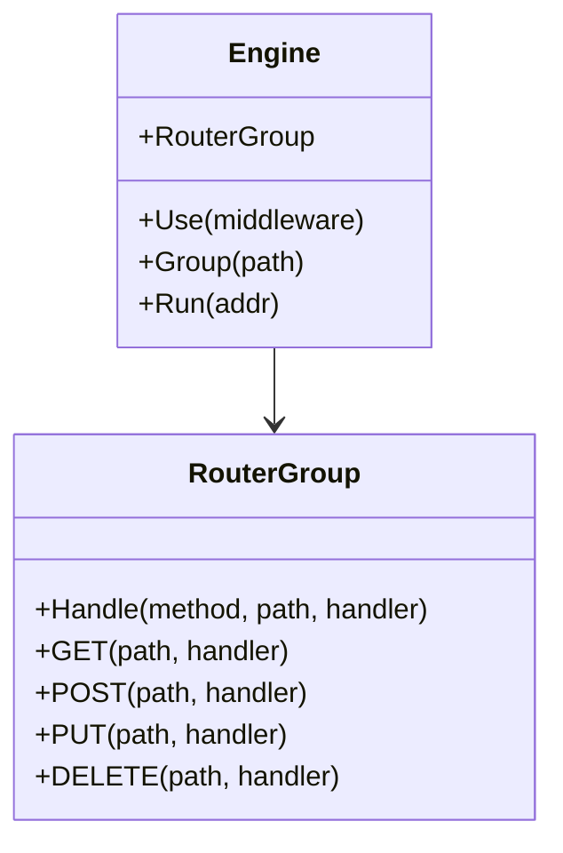
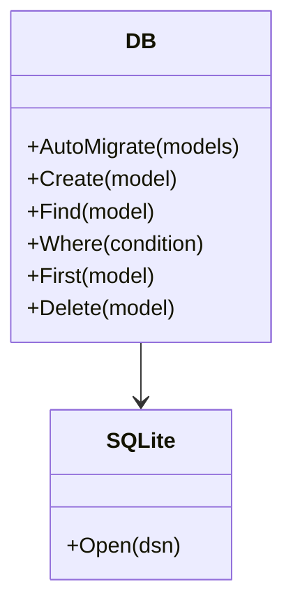
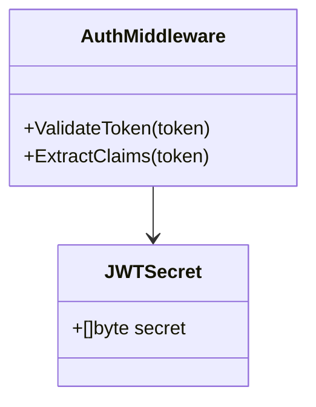

# 外部系统集成

**本文档引用文件**
- [README.md](../../../../README.md)
- [go.mod](../../../../go.mod)
- [main.go](../../../../main.go)
- [backend/config/config.go](../../../../backend/config/config.go)
- [backend/config/database.go](../../../../backend/config/database.go)
- [backend/routes/routes.go](../../../../backend/routes/routes.go)

## 目录
1. [简介](#简介)
2. [集成架构](#集成架构)
3. [核心组件分析](#核心组件分析)
4. [配置管理](#配置管理)
5. [总结](#总结)

## 简介

本系统是一个独立的医疗设备官网内容管理系统（CMS），基于 Go + Gin + SQLite 构建。作为独立部署的 CMS 系统，本项目**不依赖传统的外部系统集成**（如第三方 API、消息队列、邮件服务等），所有核心功能均通过内置组件实现。

### 技术实现方式

系统采用以下第三方库作为核心依赖：

| 依赖项 | 版本 | 用途 |
|--------|------|------|
| github.com/gin-gonic/gin | v1.22.0 | Web 框架，提供 HTTP 路由和中间件支持 |
| gorm.io/gorm | v1.25.5 | ORM 框架，用于数据库操作 |
| gorm.io/driver/sqlite | v1.5.4 | SQLite 数据库驱动 |
| github.com/golang-jwt/jwt/v5 | v5.2.0 | JWT Token 认证 |
| golang.org/x/crypto | v0.48.0 | 密码加密（bcrypt） |
| github.com/stretchr/testify | v1.11.1 | 单元测试框架 |

来源：[go.mod](../../../../go.mod)(L5-L11)

### 项目定位

- **项目名称**：medical-device-cms
- **Go 版本**：1.25.0
- **服务端口**：8080
- **数据库**：SQLite（内嵌，无需额外配置）

来源：[README.md](../../../../README.md)、[go.mod](../../../../go.mod)

## 集成架构

本系统为独立 CMS，无外部系统集成。整体架构如下：

```mermaid
graph TB
    A[客户端浏览器] --> B[Gin Web 服务器 :8080]
    B --> C[路由层 routes]
    C --> D[控制器层 controllers]
    D --> E[服务层 services]
    E --> F[GORM ORM]
    F --> G[SQLite 数据库 medical.db]
    B --> H[静态资源]
    H --> I[/frontend 前端页面]
    H --> J[/admin 管理后台]
    H --> K[/uploads 上传图片]
```

**Diagram sources**
- [main.go](../../../../main.go)
- [backend/routes/routes.go](../../../../backend/routes/routes.go)

### 系统边界说明

| 边界类型 | 说明 |
|----------|------|
| 外部 API 集成 | 无。系统不依赖任何第三方 API 服务 |
| 消息队列 | 无。所有操作均为同步处理 |
| 邮件服务 | 无。系统不包含邮件发送功能 |
| 缓存服务 | 无。未集成 Redis 等缓存中间件 |
| 数据库 | SQLite（内嵌文件数据库，非外部服务） |
| 认证方式 | JWT Token（本地生成和验证，无外部认证服务） |

## 核心组件分析

### Gin Web 框架

`gin` 是本系统的核心 Web 框架，负责处理 HTTP 请求、路由分发和中间件管理。



**Diagram sources**
- [backend/config/config.go](../../../../backend/config/config.go)

**Section sources**
- [backend/config/config.go](../../../../backend/config/config.go)(L13-L16)

### GORM ORM

`gorm` 提供数据库抽象层，支持 SQLite 数据库的 CRUD 操作和自动迁移。



**Diagram sources**
- [backend/config/database.go](../../../../backend/config/database.go)

**Section sources**
- [backend/config/database.go](../../../../backend/config/database.go)(L12-L35)

### JWT 认证模块

系统使用 `github.com/golang-jwt/jwt/v5` 实现 Token 认证，认证逻辑在中间件层处理。



**Diagram sources**
- [backend/config/config.go](../../../../backend/config/config.go)

**Section sources**
- [backend/config/config.go](../../../../backend/config/config.go)(L8-L11)
- [backend/middleware/auth.go](../../../../backend/middleware/auth.go)

### 路由注册

路由分为公共路由和管理路由两部分，管理路由需要 JWT 认证中间件保护。

```mermaid
graph LR
    A[/api] --> B[公共路由 public]
    A --> C[管理路由 admin]
    B --> D[/login, /config, /images]
    C --> E[AuthMiddleware]
    E --> F[/images, /config, /modules, /content, /lang]
```

**Diagram sources**
- [backend/routes/routes.go](../../../../backend/routes/routes.go)

**Section sources**
- [backend/routes/routes.go](../../../../backend/routes/routes.go)(L20-L67)

## 配置管理

### 数据库配置

系统使用 SQLite 作为内嵌数据库，数据库文件为 `medical.db`，位于项目根目录。

| 配置项 | 说明 | 默认值 | 配置位置 |
|--------|------|--------|----------|
| 数据库类型 | SQLite 嵌入式数据库 | - | [database.go](../../../../backend/config/database.go) |
| 数据库文件 | SQLite 数据文件 | medical.db | [database.go](../../../../backend/config/database.go)(L14) |
| 自动迁移 | 启动时自动创建表结构 | 启用 | [database.go](../../../../backend/config/database.go)(L19-L27) |

### 数据模型

系统通过 GORM AutoMigrate 自动创建以下数据表：

| 模型 | 说明 |
|------|------|
| User | 用户账户（用户名、密码、角色） |
| Image | 图片资源（文件名、分类、描述） |
| PageConfig | 页面配置（Banner、About、Products 等） |
| ModuleConfig | 模块配置（动态模块内容） |
| ContentItem | 内容项（通用内容存储） |
| LanguageText | 多语言文本 |
| LanguageTextVersion | 多语言文本版本历史 |

来源：[backend/config/database.go](../../../../backend/config/database.go)(L19-L27)

### JWT 配置

| 配置项 | 说明 | 默认值 | 配置位置 |
|--------|------|--------|----------|
| JWT Secret | JWT 签名密钥 | medical-device-cms-secret-key-2024（已脱敏） | [config.go](../../../../backend/config/config.go)(L9) |

### 默认用户配置

系统启动时自动创建默认管理员账户：

| 字段 | 值 |
|------|-----|
| 用户名 | admin |
| 密码 | admin123（首次启动后建议修改） |
| 角色 | admin |

来源：[backend/config/database.go](../../../../backend/config/database.go)(L37-L48)

## 总结

### 技术特点

1. **独立部署**：系统为独立 CMS，无需外部服务依赖，单二进制文件即可运行
2. **内嵌数据库**：使用 SQLite 作为数据存储，无需额外配置数据库服务
3. **轻量级架构**：基于 Gin 框架，启动快速，资源占用低
4. **JWT 认证**：无状态认证机制，适合前后端分离架构

### 核心优势

- **零外部依赖**：无需配置 MySQL、Redis、MQ 等外部中间件
- **开箱即用**：默认用户和页面配置自动初始化
- **易于扩展**：模块化设计，可按需添加新功能模块

### 扩展建议

如需集成外部系统，可考虑以下方向：

| 集成类型 | 建议方案 |
|----------|----------|
| 邮件通知 | 集成 SMTP 库（如 gopkg.in/gomail.v2） |
| 对象存储 | 集成 AWS S3 或阿里云 OSS SDK |
| 缓存加速 | 集成 Redis（github.com/go-redis/redis） |
| 消息队列 | 集成 RabbitMQ 或 Kafka |
| 外部认证 | 集成 OAuth2.0 或 LDAP 认证 |

---