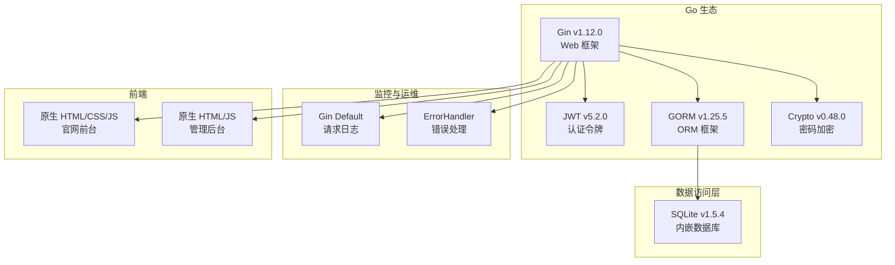
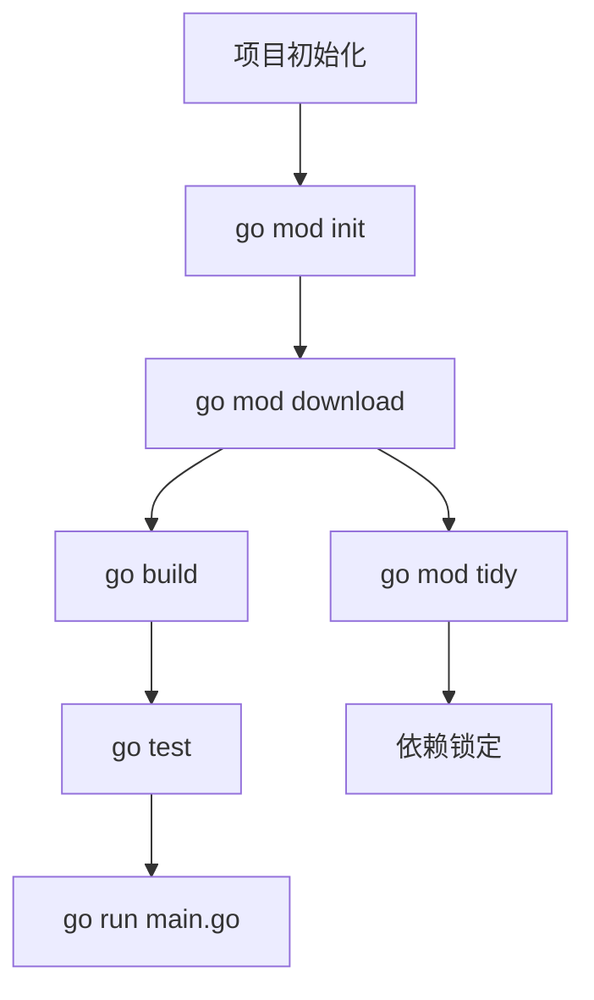
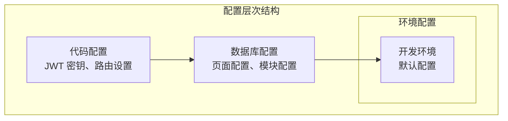
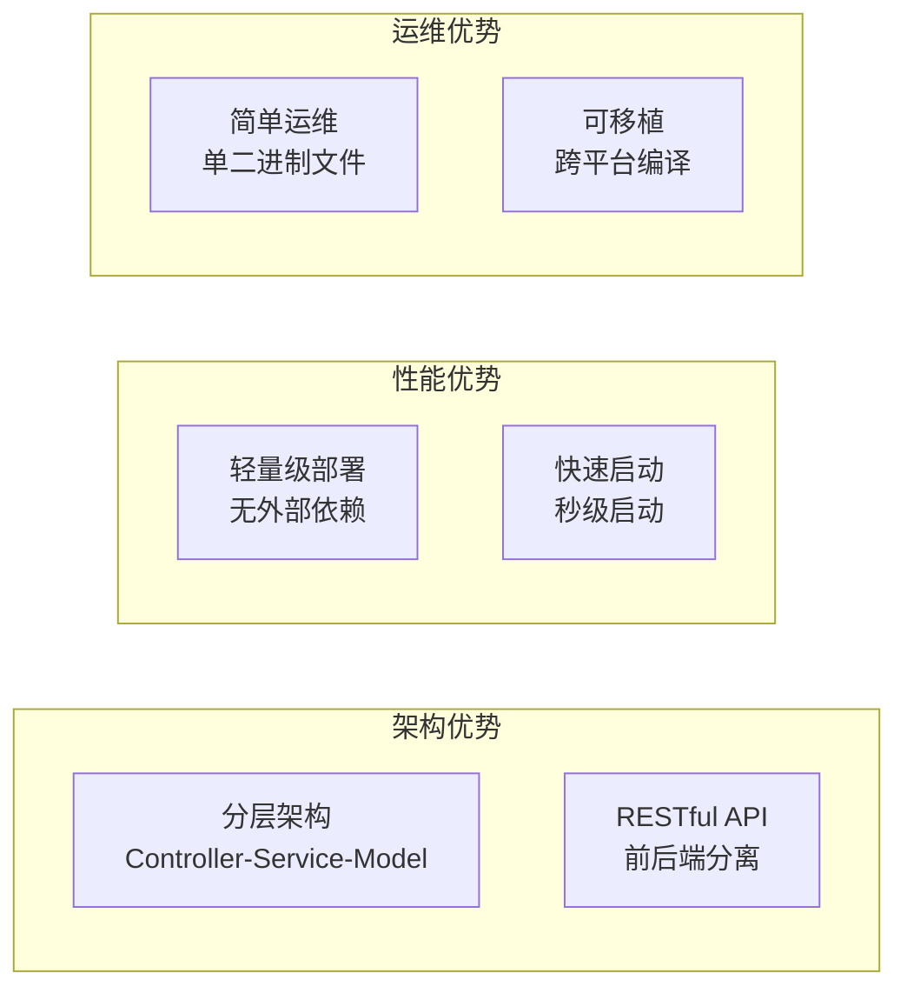

# 技术栈与依赖

**本文档中引用的文件**
- [README.md](../../../README.md)
- [go.mod](../../../go.mod)
- [main.go](../../../main.go)
- [backend/config/database.go](../../../backend/config/database.go)
- [backend/routes/routes.go](../../../backend/routes/routes.go)

## 目录
1. [项目概述](#项目概述)
2. [核心技术栈](#核心技术栈)
3. [构建与依赖管理](#构建与依赖管理)
4. [配置管理](#配置管理)
5. [代码质量工具](#代码质量工具)
6. [技术选型分析](#技术选型分析)
7. [最佳实践建议](#最佳实践建议)

## 项目概述

本项目是一个基于 Go + Gin + SQLite 构建的医疗设备官网内容管理系统，专门为医疗设备制造商和供应商设计。项目采用分层架构模式，支持内容管理、图片管理、多语言配置等功能，具备轻量级部署、无需额外数据库配置的技术特点。

### 核心特性
- **用户认证**: JWT Token 认证，支持登录/登出
- **权限管理**: 基于用户角色的访问控制
- **图片管理**: 支持图片上传、分类、删除
- **页面配置**: 动态管理 Banner、关于我们、产品展示等内容
- **SQLite 内嵌数据库**: 无需额外配置数据库
- **多语言支持**: 支持国际化文本管理
- **内容管理**: 动态管理官网各模块内容

## 核心技术栈

### Go 生态系统

**图表来源**
- [go.mod](../../../go.mod)
- [backend/config/database.go](../../../backend/config/database.go)

### 技术选型详解

#### Gin v1.12.0
- **版本选择原因**: 高性能 HTTP Web 框架，API 简洁，中间件支持完善
- **核心功能**: 路由管理、中间件链、请求绑定、JSON 渲染
- **应用场景**: RESTful API 服务、后台管理系统

#### JWT v5.2.0
- **认证授权**: 基于 JWT Token 的无状态认证
- **安全控制**: Token 过期验证、角色权限校验
- **会话管理**: 无需服务端会话存储，适合分布式部署

#### GORM v1.25.5
- **优势**: 全功能 ORM，支持自动迁移、关联查询、事务处理
- **使用场景**: 数据模型持久化、复杂查询构建
- **配置特点**: 支持 SQLite 内嵌数据库，零配置启动

#### bcrypt 密码加密
- **加密策略**: 使用 bcrypt 算法对密码进行哈希加密
- **安全强度**: 可配置加密成本因子，抵御暴力破解
- **集成方式**: 通过 golang.org/x/crypto 包提供

#### SQLite
- **部署优势**: 无需独立数据库服务，单文件存储
- **适用场景**: 中小型项目、快速原型开发
- **性能特点**: 读写性能优秀，支持事务和并发控制

## 构建与依赖管理

### Go Modules 构建系统

项目采用 Go Modules 作为依赖管理工具，Go 版本为 1.25.0，配合 go.mod/go.sum 确保依赖版本的一致性。

**图表来源**
- [go.mod](../../../go.mod)
- [main.go](../../../main.go)

### 依赖管理策略

#### 核心依赖版本
- **Go**: 1.25.0（最新稳定版本）
- **Gin**: v1.12.0（高性能 Web 框架）
- **GORM**: v1.25.5（全功能 ORM）
- **JWT**: v5.2.0（安全的令牌认证）
- **SQLite Driver**: v1.5.4（数据库驱动）
- **Crypto**: v0.48.0（密码学工具）

#### 依赖升级策略
1. **渐进式升级**: 先升级非核心依赖，验证后再升级核心框架
2. **向后兼容**: 确保 API 接口兼容，避免破坏性变更
3. **性能评估**: 升级后进行基准测试，确保性能无退化
4. **回滚计划**: 保留 go.mod 历史版本，支持快速回滚

## 配置管理

### 配置文件结构

项目采用代码内配置与数据库配置相结合的方式：

**图表来源**
- [backend/config/config.go](../../../backend/config/config.go)
- [backend/config/database.go](../../../backend/config/database.go)

### 配置项详解

#### JWT 配置
- **密钥**: 配置于 `backend/config/config.go`（已脱敏处理）
- **Token 生成**: 登录成功后生成 JWT Token
- **Token 验证**: 通过 AuthMiddleware 中间件验证

#### 数据库配置
- **数据库文件**: medical.db（自动创建）
- **ORM 配置**: GORM 自动迁移数据模型
- **默认数据**: 启动时自动创建默认管理员用户和页面配置

#### 路由配置
- **静态资源**: /uploads, /frontend, /admin
- **API 分组**: /api/public（公开）, /api/admin（需认证）
- **中间件**: CORS、错误处理、认证中间件

#### 配置加载优先级
1. 代码内默认配置（最低优先级）
2. 数据库存储配置（中优先级）
3. 运行时动态更新（最高优先级）

## 代码质量工具

### 测试框架

项目使用 testify v1.11.1 作为测试断言库：

- **单元测试**: 支持各服务层函数的单元测试
- **断言库**: 提供丰富的断言方法
- **测试报告**: 配合 go test 生成测试覆盖率报告

### 静态分析

Go 语言内置工具链支持：
- **go vet**: 检测可疑代码结构
- **go fmt**: 自动格式化代码
- **go mod tidy**: 清理未使用依赖

## 技术选型分析

### 为什么选择这些技术？

#### Gin vs 其他 Go Web 框架
- **性能优势**: 基于 httprouter，性能优于标准库
- **中间件生态**: 丰富的中间件支持（CORS、JWT、日志等）
- **API 友好**: 链式调用，代码简洁易读

#### GORM vs 其他 ORM
- **功能完整**: 支持关联、事务、钩子、预加载
- **类型安全**: 基于 Go 结构体，编译期检查
- **学习成本低**: API 设计直观，文档完善

#### SQLite vs 其他数据库
- **零配置**: 无需安装数据库服务
- **部署简单**: 单文件存储，便于备份迁移
- **性能足够**: 对于中小型 CMS 系统性能充足

### 技术组合的优势

## 最佳实践建议

### 开发最佳实践

#### 代码组织
- **模块化设计**: 按功能划分 controller/service/model 包
- **接口隔离**: 控制器只负责请求处理，业务逻辑下沉到服务层
- **单一职责**: 每个文件/函数职责单一，便于测试维护

#### 配置管理
- **敏感信息**: JWT 密钥等敏感配置不应硬编码，建议使用环境变量
- **配置校验**: 启动时校验必要配置项是否存在
- **配置文档**: 维护配置项说明文档

#### 测试策略
- **单元测试**: 服务层函数应编写单元测试
- **集成测试**: API 接口应编写集成测试
- **测试覆盖**: 核心业务逻辑覆盖率应达到 80% 以上

### 运维最佳实践

#### 监控告警
- **应用指标**: 请求量、响应时间、错误率
- **业务指标**: 登录次数、内容更新频率
- **资源监控**: CPU、内存、磁盘使用率

#### 日志管理
- **结构化日志**: 使用 JSON 格式便于日志分析
- **日志分级**: 开发环境 DEBUG，生产环境 INFO/WARN
- **日志轮转**: 定期归档旧日志，避免磁盘占满

#### 数据备份
- **数据库备份**: 定期备份 medical.db 文件
- **文件备份**: uploads 目录图片文件定期备份
- **备份验证**: 定期验证备份文件可恢复

### 性能优化建议

#### 数据库优化
- **索引设计**: 为常用查询字段添加索引
- **查询优化**: 避免 N+1 查询，使用预加载
- **连接池**: SQLite 无需连接池，但可优化写入批量操作

#### 缓存策略
- **静态资源**: 使用 CDN 或反向代理缓存静态文件
- **配置缓存**: 页面配置可缓存在内存中
- **缓存失效**: 配置更新时主动失效缓存

#### 系统调优
- **GOMAXPROCS**: 根据 CPU 核心数调整并发度
- **Gin 模式**: 生产环境使用 release 模式
- **压缩响应**: 启用 gzip 压缩减少传输体积

### 安全最佳实践

#### 访问控制
- **最小权限**: 管理员与普通用户权限分离
- **Token 过期**: 设置合理的 Token 过期时间
- **密码策略**: 密码复杂度要求，定期更换

#### 数据保护
- **传输加密**: 生产环境使用 HTTPS
- **密码加密**: 使用 bcrypt 加密存储密码
- **输入校验**: 所有用户输入进行校验和转义

#### 安全监控
- **登录审计**: 记录登录尝试，检测异常行为
- **错误处理**: 生产环境不暴露详细错误信息
- **依赖扫描**: 定期扫描依赖漏洞并升级

通过遵循这些最佳实践，可以确保系统的稳定性、安全性和可维护性，为业务发展提供坚实的技术基础。