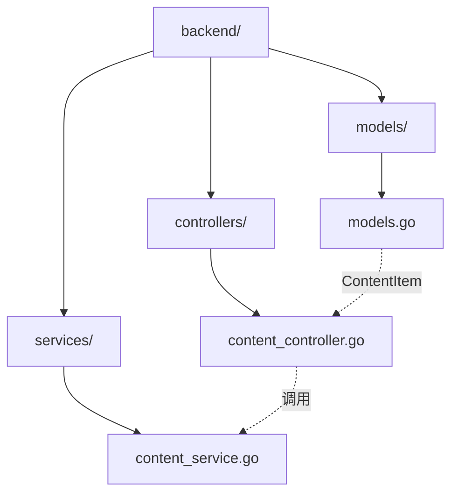
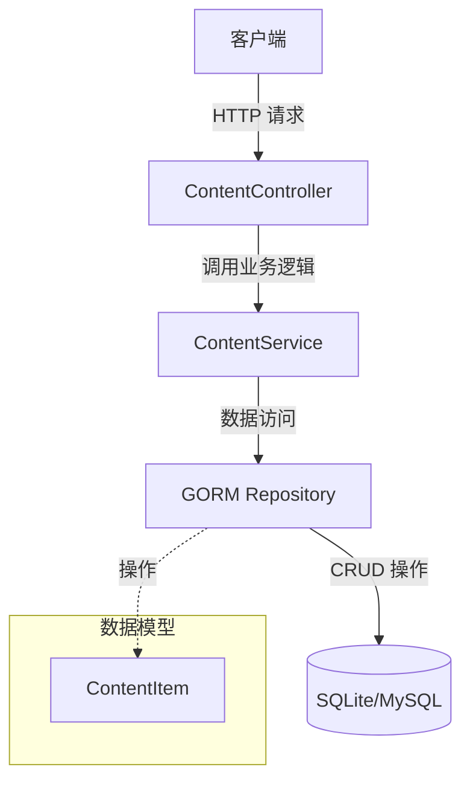
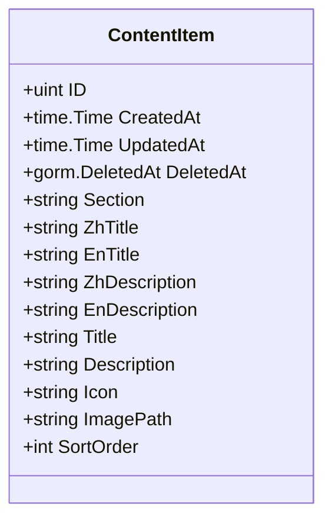
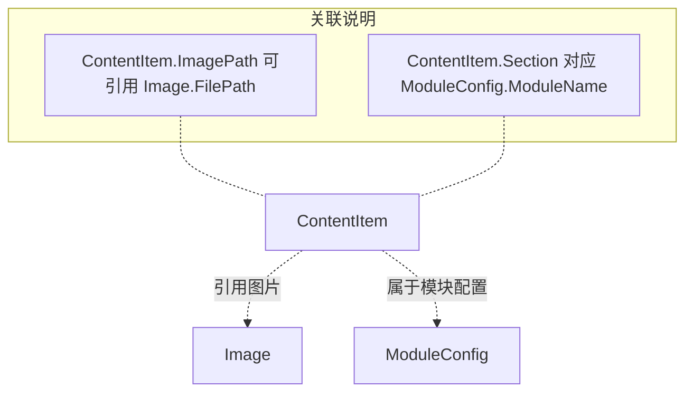
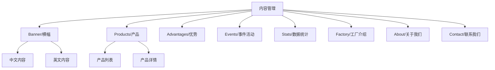
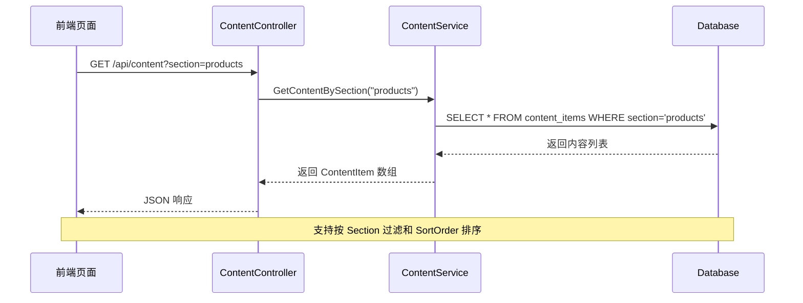
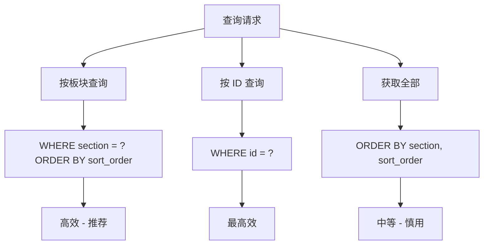

# 内容管理模型 (ContentItem)

**本文档引用的文件**
- [模型定义文件](../../../../backend/models/models.go)

## 目录
1. [简介](#简介)
2. [项目结构](#项目结构)
3. [核心组件](#核心组件)
4. [架构概述](#架构概述)
5. [详细组件分析](#详细组件分析)
6. [依赖分析](#依赖分析)
7. [数据库表结构](#数据库表结构)
8. [业务规则](#业务规则)
9. [使用示例](#使用示例)
10. [性能考虑](#性能考虑)
11. [结论](#结论)

## 简介

内容管理模型 (ContentItem) 是 CMS 系统中用于管理网站各板块内容项的核心数据模型。它支持中英文双语内容存储，为网站的不同区域（如产品展示、优势介绍、事件活动等）提供统一的内容管理接口。

**核心功能**：
- 按板块 (Section) 组织内容项
- 支持中英文双语标题和描述
- 提供图标和图片路径配置
- 支持内容排序控制
- 保留向后兼容字段以支持旧版本数据

**本节来源** - [模型定义文件](../../../../backend/models/models.go)

## 项目结构

内容管理相关代码位于 `backend/models/` 目录下，与控制器、服务层共同构成完整的内容管理模块。



**图示来源** - [模型定义文件](../../../../backend/models/models.go)

**本节来源** - [模型定义文件](../../../../backend/models/models.go)

## 核心组件

内容管理模块包含以下核心组件：

| 组件类型 | 文件位置 | 说明 |
|---------|---------|------|
| 数据模型 | `backend/models/models.go` | 定义 ContentItem 结构体及字段 |
| 控制器 | `backend/controllers/content_controller.go` | 处理内容相关的 HTTP 请求 |
| 服务层 | `backend/services/content_service.go` | 实现内容管理的业务逻辑 |

**本节来源** - [模型定义文件](../../../../backend/models/models.go)

## 架构概述

内容管理模块采用典型的三层架构设计：



**图示来源** - [模型定义文件](../../../../backend/models/models.go)

**本节来源** - [模型定义文件](../../../../backend/models/models.go)

## 详细组件分析

### ContentItem 实体

ContentItem 是内容管理的核心实体，用于存储网站各板块的内容项信息。

**实体字段表格**

| 字段名 | 类型 | 描述 |
|-------|------|------|
| ID | uint | 主键 ID (GORM 自动管理) |
| CreatedAt | time.Time | 创建时间 (GORM 自动管理) |
| UpdatedAt | time.Time | 更新时间 (GORM 自动管理) |
| DeletedAt | gorm.DeletedAt | 软删除时间 (GORM 自动管理) |
| Section | string | 内容所属板块（必填），用于区分不同区域的内容 |
| ZhTitle | string | 中文标题 |
| EnTitle | string | 英文标题 |
| ZhDescription | string | 中文描述 |
| EnDescription | string | 英文描述 |
| Title | string | 标题（向后兼容字段） |
| Description | string | 描述（向后兼容字段） |
| Icon | string | 图标路径或图标类名 |
| ImagePath | string | 图片存储路径 |
| SortOrder | int | 排序顺序，默认为 0 |

**类图**



**图示来源** - [模型定义文件](../../../../backend/models/models.go)

**本节来源** - [模型定义文件](../../../../backend/models/models.go)

## 依赖分析

ContentItem 与其他模型的关联关系：



**图示来源** - [模型定义文件](../../../../backend/models/models.go)

**本节来源** - [模型定义文件](../../../../backend/models/models.go)

## 数据库表结构

基于 GORM 的 ContentItem 模型将生成如下数据库表结构：

```sql
CREATE TABLE content_items (
    id INTEGER PRIMARY KEY AUTOINCREMENT,
    created_at DATETIME,
    updated_at DATETIME,
    deleted_at DATETIME,
    section TEXT NOT NULL,
    zh_title TEXT,
    en_title TEXT,
    zh_description TEXT,
    en_description TEXT,
    title TEXT,
    description TEXT,
    icon TEXT,
    image_path TEXT,
    sort_order INTEGER DEFAULT 0
);

-- 索引
CREATE INDEX idx_content_items_deleted_at ON content_items(deleted_at);
```

**字段说明**：
- `section`: 必填字段，用于标识内容所属板块
- `zh_title`/`en_title`: 中英文标题，支持国际化
- `zh_description`/`en_description`: 中英文描述，支持国际化
- `title`/`description`: 向后兼容字段，用于支持旧版本数据迁移
- `sort_order`: 控制内容展示顺序，数值越小越靠前

**本节来源** - [模型定义文件](../../../../backend/models/models.go)

## 业务规则

**内容管理规则**：

- **板块隔离**：不同 Section 的内容相互独立，便于按页面区域管理
- **双语支持**：中英文内容独立存储，前端根据语言设置选择显示
- **排序控制**：通过 SortOrder 字段控制同一板块内内容的展示顺序
- **软删除**：使用 DeletedAt 字段实现软删除，支持数据恢复
- **向后兼容**：保留 Title/Description 字段以兼容旧版本数据结构

**内容项分类结构**：



**图示来源** - [模型定义文件](../../../../backend/models/models.go)

**本节来源** - [模型定义文件](../../../../backend/models/models.go)

## 使用示例

**典型的内容管理调用流程**：



**图示来源** - [模型定义文件](../../../../backend/models/models.go)

**本节来源** - [模型定义文件](../../../../backend/models/models.go)

## 性能考虑

**查询优化策略**：

- **板块索引**：Section 字段作为常用查询条件，建议添加索引
- **软删除过滤**：GORM 自动处理 DeletedAt 过滤，无需手动添加条件
- **排序优化**：SortOrder 字段用于 ORDER BY 子句，小数据量下性能良好

**不同查询方法对比**：



**本节来源** - [模型定义文件](../../../../backend/models/models.go)

## 结论

内容管理模型 (ContentItem) 是 CMS 系统的核心数据模型之一，具有以下设计特点：

**设计优势**：
- **灵活的板块管理**：通过 Section 字段实现内容的逻辑分组
- **完整的国际化支持**：中英文内容独立存储，便于多语言切换
- **向后兼容性**：保留旧字段确保平滑升级
- **GORM 集成**：充分利用 GORM 的自动迁移、软删除等特性

**系统价值**：
- 为前端页面提供统一的内容数据源
- 支持动态配置网站各板块内容，无需修改代码
- 通过排序字段实现内容展示的灵活控制

**本节来源** - [模型定义文件](../../../../backend/models/models.go)