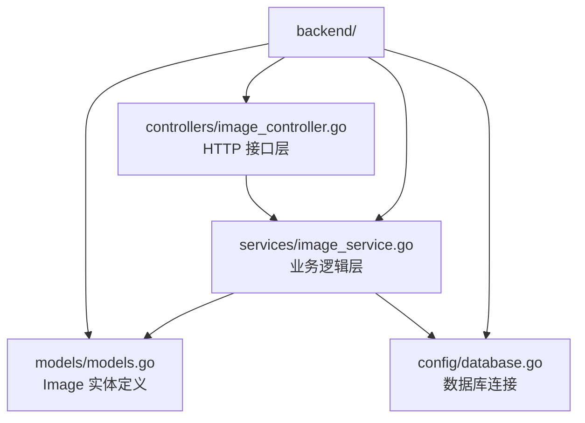
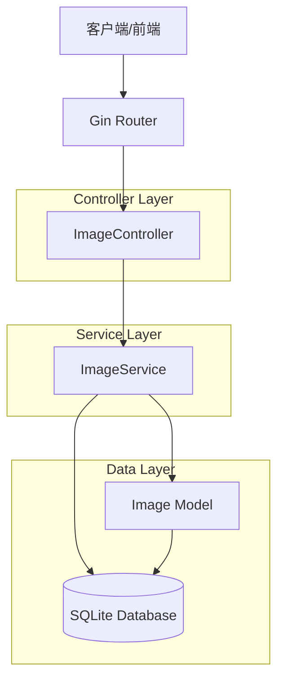
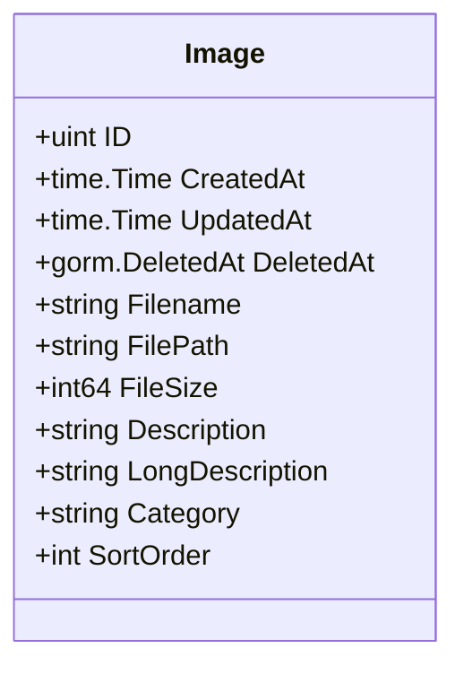
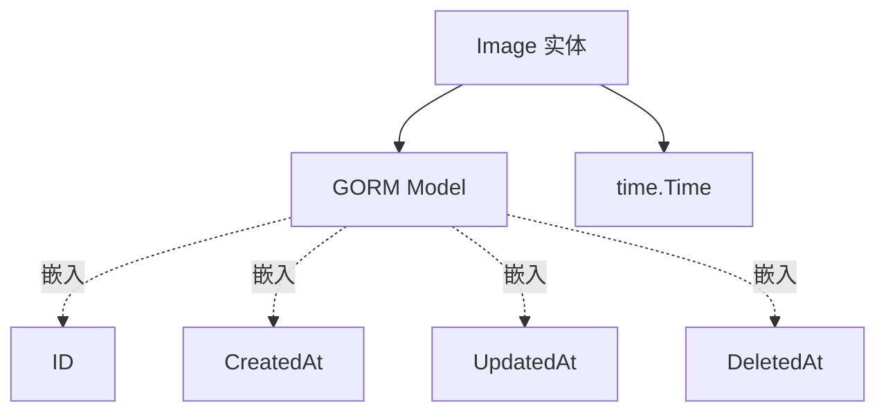
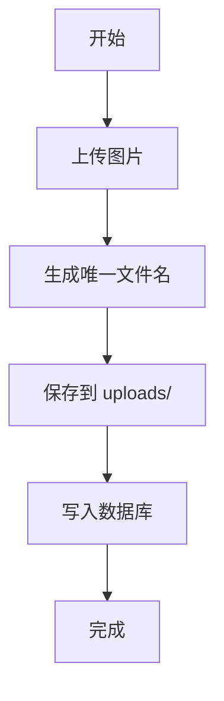
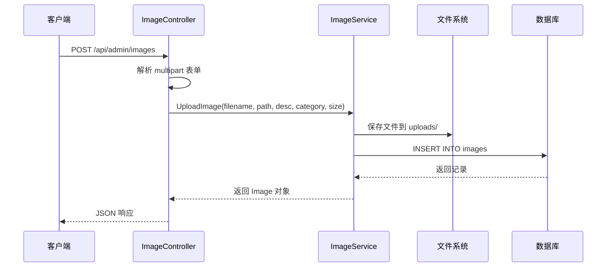
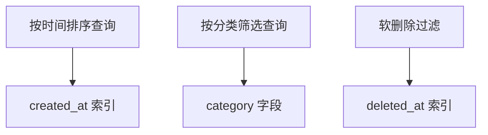

# 图片管理模型 (Image)

**本文档引用的文件**
- [README.md](../../../../README.md)
- [models.go](../../../../backend/models/models.go)(L23-L35)
- [image_controller.go](../../../../backend/controllers/image_controller.go)
- [image_service.go](../../../../backend/services/image_service.go)

## 目录
1. [简介](#简介)
2. [项目结构](#项目结构)
3. [核心组件](#核心组件)
4. [架构概述](#架构概述)
5. [详细组件分析](#详细组件分析)
6. [依赖分析](#依赖分析)
7. [数据库表结构](#数据库表结构)
8. [业务规则](#业务规则)
9. [使用示例](#使用示例)
10. [性能考虑](#性能考虑)
11. [结论](#结论)

## 简介

Image 模型是医疗设备官网 CMS 系统中图片管理的核心数据实体，用于存储和管理网站展示所需的各类图片资源。该模型支持图片的分类管理、排序控制以及多语言描述，为前台官网的 Banner、产品展示、关于我们等模块提供图片数据支撑。

**核心功能：**
- 图片文件元数据存储（文件名、路径、大小）
- 分类管理（支持自定义分类筛选）
- 排序控制（SortOrder 字段）
- 多语言描述支持（Description/LongDescription）
- 软删除支持（DeletedAt 字段）

**本节来源** - [README.md](../../../../README.md)

## 项目结构

图片管理相关代码位于 `backend` 目录下，遵循 MVC 分层架构：



**图示来源** - [backend/models/models.go](../../../../backend/models/models.go)

**本节来源** - [models.go](../../../../backend/models/models.go)

## 核心组件

| 组件类型 | 文件路径 | 说明 |
|---------|---------|------|
| 实体类 | `backend/models/models.go` | Image 结构体定义，包含所有字段映射 |
| Controller | `backend/controllers/image_controller.go` | ImageController，处理 HTTP 请求 |
| Service | `backend/services/image_service.go` | ImageService，实现业务逻辑 |
| 数据库配置 | `backend/config/database.go` | GORM 数据库连接 |

**本节来源** - [image_controller.go](../../../../backend/controllers/image_controller.go)

## 架构概述



**图示来源** - [image_controller.go](../../../../backend/controllers/image_controller.go)

**各层职责：**
- **Controller 层**：处理 HTTP 请求、参数解析、响应封装
- **Service 层**：业务逻辑实现、文件操作、数据库操作
- **Model 层**：数据结构定义、GORM 映射

**本节来源** - [image_service.go](../../../../backend/services/image_service.go)

## 详细组件分析

### Image 实体字段定义

| 字段名 | 类型 | 约束 | 描述 |
|-------|------|------|------|
| ID | uint | primaryKey | 主键 ID，自增 |
| CreatedAt | time.Time | - | 创建时间（GORM 自动管理） |
| UpdatedAt | time.Time | - | 更新时间（GORM 自动管理） |
| DeletedAt | gorm.DeletedAt | index | 软删除时间戳 |
| Filename | string | not null | 文件名 |
| FilePath | string | not null | 文件存储路径 |
| FileSize | int64 | - | 文件大小（字节） |
| Description | string | - | 简短描述 |
| LongDescription | string | - | 详细描述 |
| Category | string | - | 分类标识 |
| SortOrder | int | default:0 | 排序序号 |

**本节来源** - [models.go](../../../../backend/models/models.go)(L23-L35)

### Image 类图



**图示来源** - [models.go](../../../../backend/models/models.go)

## 依赖分析



**实体关联关系：**
- Image 嵌入 `gorm.Model`，自动获得 ID、CreatedAt、UpdatedAt、DeletedAt 字段
- Image 与 `time.Time` 关联，用于时间戳管理
- Image 与 `gorm.DeletedAt` 关联，支持软删除功能

**本节来源** - [models.go](../../../../backend/models/models.go)

## 数据库表结构

根据 Image 实体定义，对应的 SQLite 表结构如下：

```sql
CREATE TABLE images (
    id INTEGER PRIMARY KEY AUTOINCREMENT,
    created_at DATETIME,
    updated_at DATETIME,
    deleted_at DATETIME,
    filename TEXT NOT NULL,
    file_path TEXT NOT NULL,
    file_size INTEGER,
    description TEXT,
    long_description TEXT,
    category TEXT,
    sort_order INTEGER DEFAULT 0
);

-- 索引
CREATE INDEX idx_images_deleted_at ON images(deleted_at);
```

**字段说明：**
- `id`: 主键，自增
- `filename`: 图片文件名，不能为空
- `file_path`: 存储路径（如 `uploads/123456_image.jpg`）
- `file_size`: 文件大小（字节）
- `category`: 分类标识，用于筛选
- `sort_order`: 排序序号，默认 0

**本节来源** - [models.go](../../../../backend/models/models.go)

## 业务规则

**图片管理规则：**
- 图片上传时自动生成唯一文件名（时间戳 + 原文件名）
- 图片存储在 `uploads/` 目录下
- 支持按分类筛选图片
- 支持软删除（DeletedAt 标记，物理文件同时删除）
- 排序序号默认为 0，可自定义

**分类管理：**
- 分类名称由前端传入，后端不做限制
- 支持动态添加新分类
- 查询时可通过 category 参数筛选



**图示来源** - [image_service.go](../../../../backend/services/image_service.go)

**本节来源** - [image_service.go](../../../../backend/services/image_service.go)

## 使用示例

### 上传图片时序图



**图示来源** - [image_controller.go](../../../../backend/controllers/image_controller.go)

**API 接口示例：**

| 方法 | 路径 | 说明 |
|------|------|------|
| GET | /api/admin/images | 获取所有图片（支持 category 筛选） |
| POST | /api/admin/images | 上传单张图片 |
| POST | /api/admin/images (multipart) | 上传多张图片 |
| DELETE | /api/admin/images/:id | 删除指定 ID 的图片 |
| DELETE | /api/admin/images/filename/:filename | 按文件名删除 |
| PUT | /api/admin/images/:id | 更新图片信息 |

**本节来源** - [image_controller.go](../../../../backend/controllers/image_controller.go)

## 性能考虑

**查询优化策略：**
- 按 `created_at DESC` 默认排序，确保最新图片优先展示
- DeletedAt 字段建立索引，优化软删除查询
- 支持按 Category 字段过滤，减少不必要的数据传输

**存储优化：**
- 图片文件存储在本地 `uploads/` 目录
- 数据库仅存储元数据，不存储二进制数据
- 删除操作同时清理物理文件，避免磁盘空间浪费



**本节来源** - [image_service.go](../../../../backend/services/image_service.go)

## 结论

Image 模型是医疗设备官网 CMS 系统的核心数据实体之一，具有以下设计特点：

**设计优势：**
- 结构简洁，字段定义清晰
- 支持软删除，数据安全有保障
- 分类管理和排序功能满足业务需求
- 与 GORM 深度集成，开发效率高

**系统价值：**
- 为前台官网提供统一的图片数据源
- 支持后台可视化图片管理
- 无需额外配置，SQLite 内嵌存储
- 扩展性强，可轻松添加新字段或分类

**本节来源** - [README.md](../../../../README.md)