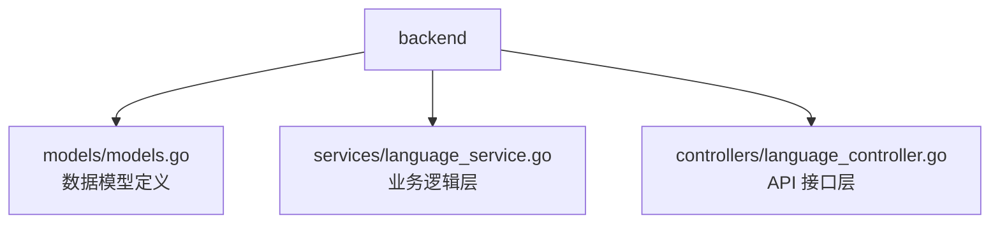
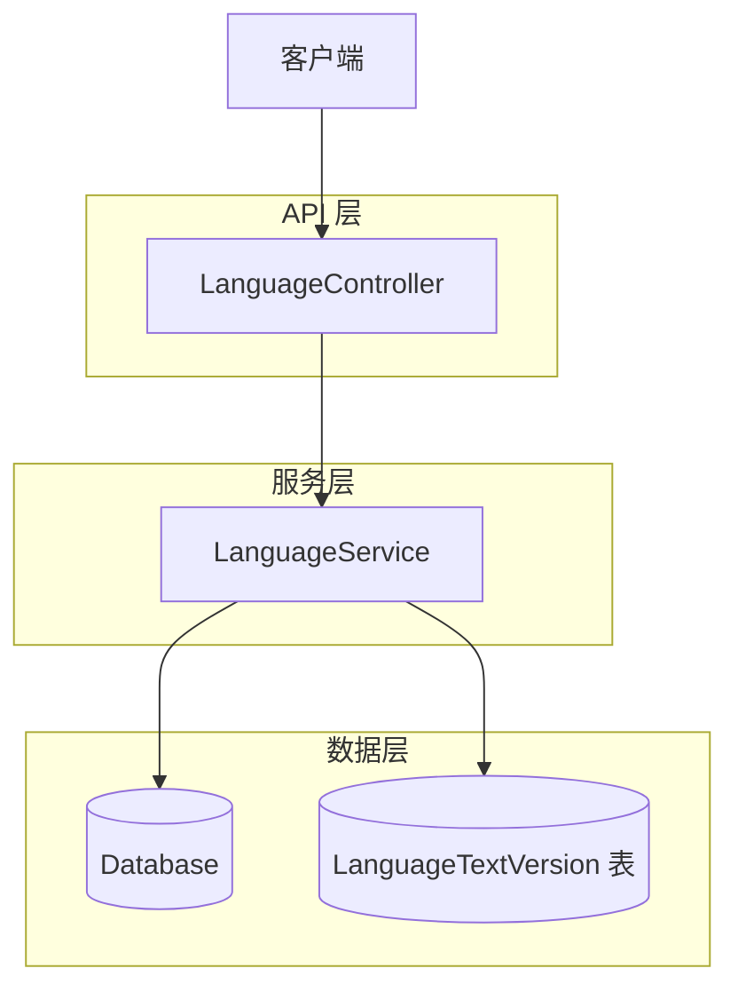
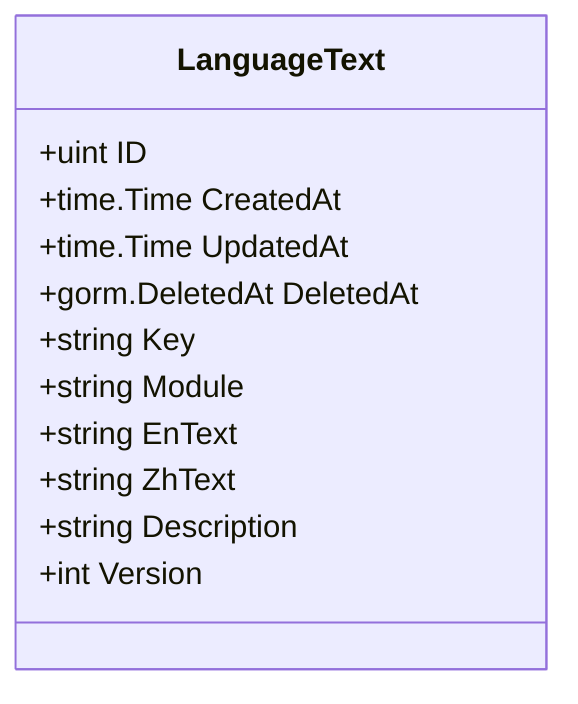
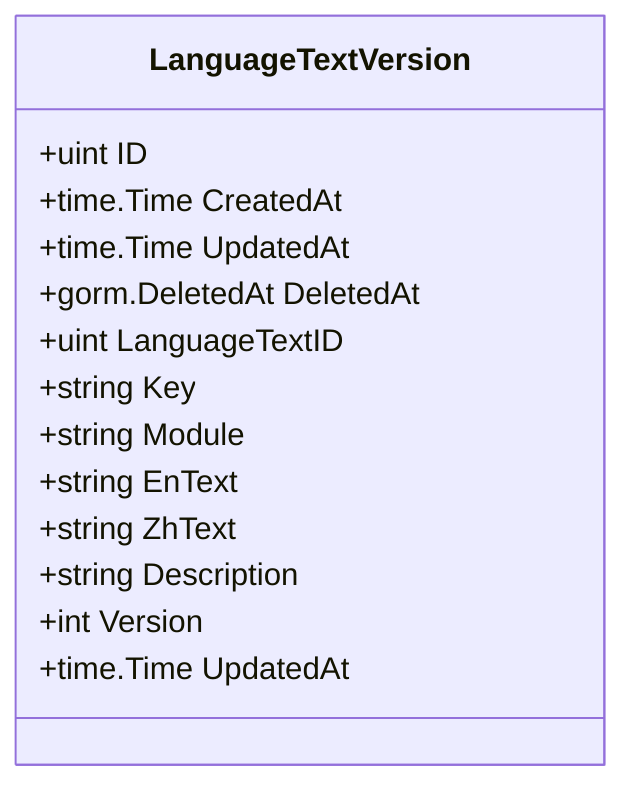
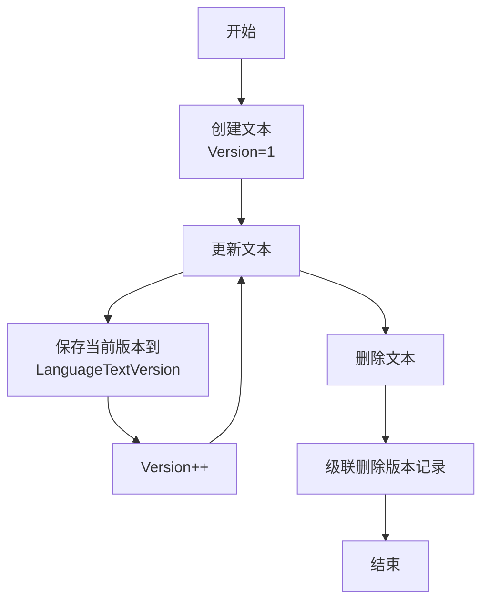
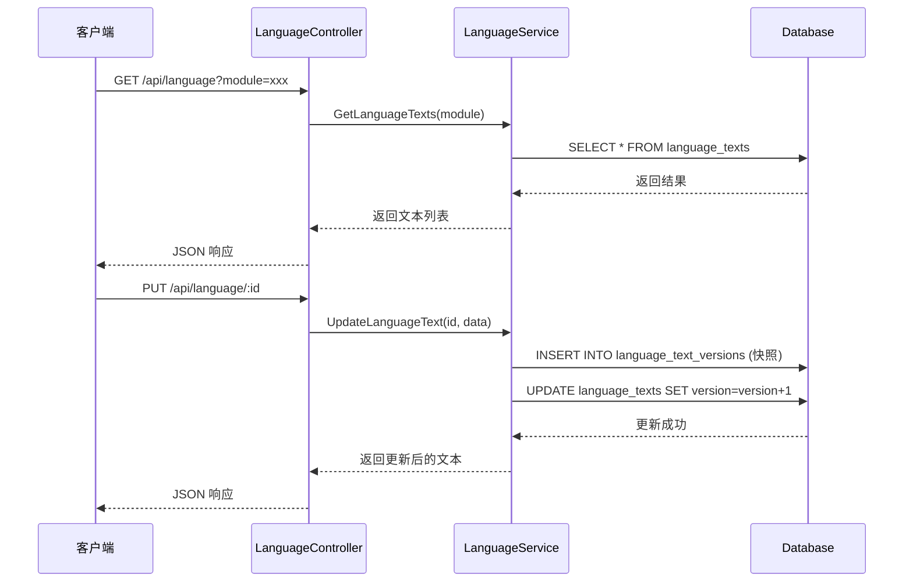
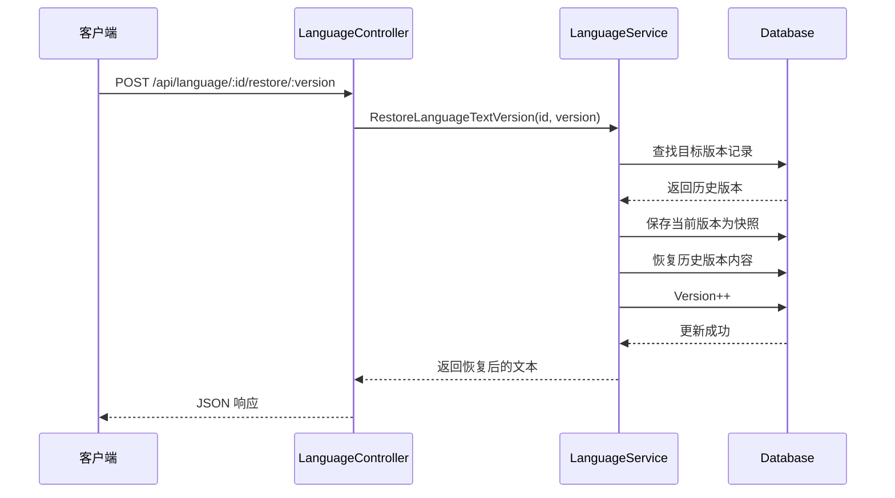
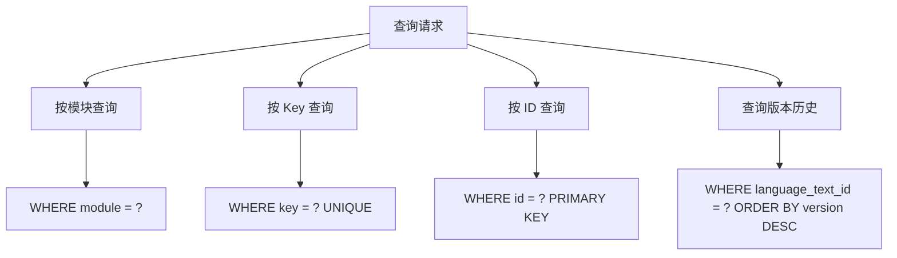

# 多语言模型 (LanguageText & LanguageTextVersion)

**本文档引用的文件**
- [models.go](../../../../backend/models/models.go)
- [language_service.go](../../../../backend/services/language_service.go)
- [language_controller.go](../../../../backend/controllers/language_controller.go)

## 目录
1. [简介](#简介)
2. [项目结构](#项目结构)
3. [核心组件](#核心组件)
4. [架构概述](#架构概述)
5. [详细组件分析](#详细组件分析)
6. [依赖分析](#依赖分析)
7. [数据库表结构](#数据库表结构)
8. [业务规则](#业务规则)
9. [使用示例](#使用示例)
10. [性能考虑](#性能考虑)
11. [结论](#结论)

## 简介

多语言模型是 CMS 系统中用于管理国际化文本内容的核心数据模型，支持中英文双语内容的存储与版本管理。

**核心功能**：
- 存储和管理系统中所有多语言文本内容
- 通过 Key 唯一标识每个文本项，支持按模块 (Module) 分类
- 提供完整的版本管理机制，记录每次内容变更历史
- 支持版本恢复功能，可回滚到任意历史版本

**实体关系**：
- `LanguageText`：主表，存储当前生效的多语言文本
- `LanguageTextVersion`：版本历史表，记录每次更新前的快照

**本节来源** - [models.go](../../../../backend/models/models.go)(L78-L98)

## 项目结构

多语言模型相关代码位于 `backend` 目录下，遵循典型的分层架构：



**图示来源** - 基于 [backend 目录结构](../../../../backend/) 整理

## 核心组件

| 组件名称 | 文件路径 | 职责描述 |
|---------|---------|---------|
| LanguageText | [models.go](../../../../backend/models/models.go)(L78-L86) | 主实体类，存储当前生效的多语言文本 |
| LanguageTextVersion | [models.go](../../../../backend/models/models.go)(L88-L98) | 版本历史实体类，记录变更快照 |
| LanguageService | [language_service.go](../../../../backend/services/language_service.go)(L8-L146) | 业务逻辑层，处理 CRUD 和版本管理 |
| LanguageController | [language_controller.go](../../../../backend/controllers/language_controller.go)(L11-L125) | API 接口层，处理 HTTP 请求 |

## 架构概述



**图示来源** - 基于 [language_controller.go](../../../../backend/controllers/language_controller.go) 和 [language_service.go](../../../../backend/services/language_service.go) 整理

## 详细组件分析

### LanguageText 实体

**实体字段表格**

| 字段名 | 类型 | 描述 |
|-------|------|------|
| ID | uint | 主键，自增 |
| CreatedAt | time.Time | 创建时间 |
| UpdatedAt | time.Time | 更新时间 |
| DeletedAt | gorm.DeletedAt | 软删除时间戳 |
| Key | string | 文本键名，唯一索引，必填 |
| Module | string | 所属模块，必填 |
| EnText | string | 英文文本内容 |
| ZhText | string | 中文文本内容 |
| Description | string | 描述信息 |
| Version | int | 版本号，默认 1 |

**类图**



**图示来源** - [models.go](../../../../backend/models/models.go)(L78-L86)

### LanguageTextVersion 实体

**实体字段表格**

| 字段名 | 类型 | 描述 |
|-------|------|------|
| ID | uint | 主键，自增 |
| CreatedAt | time.Time | 记录创建时间 |
| UpdatedAt | time.Time | 记录更新时间 |
| DeletedAt | gorm.DeletedAt | 软删除时间戳 |
| LanguageTextID | uint | 关联的 LanguageText ID，外键 |
| Key | string | 文本键名 |
| Module | string | 所属模块 |
| EnText | string | 英文文本内容（快照） |
| ZhText | string | 中文文本内容（快照） |
| Description | string | 描述信息（快照） |
| Version | int | 版本号 |
| UpdatedAt | time.Time | 原记录的更新时间 |

**类图**



**图示来源** - [models.go](../../../../backend/models/models.go)(L88-L98)

## 依赖分析

```mermaid
graph TD
    LT[LanguageText<br/>主表]
    LTV[LanguageTextVersion<br/>版本历史表]
    
    LT -->|1:N| LTV
    
    subgraph 一对多关系
        LT
        LTV
    end
    
    note for LT "每条记录可对应多条版本历史"
    note for LTV "通过 LanguageTextID 关联主表"
```

**图示来源** - [models.go](../../../../backend/models/models.go)(L78-L98)

## 数据库表结构

**LanguageText 表**

```sql
CREATE TABLE language_texts (
  id INTEGER PRIMARY KEY AUTOINCREMENT,
  created_at DATETIME,
  updated_at DATETIME,
  deleted_at DATETIME,
  key TEXT NOT NULL,
  module TEXT NOT NULL,
  en_text TEXT,
  zh_text TEXT,
  description TEXT,
  version INTEGER DEFAULT 1,
  UNIQUE (key)
);
```

**LanguageTextVersion 表**

```sql
CREATE TABLE language_text_versions (
  id INTEGER PRIMARY KEY AUTOINCREMENT,
  created_at DATETIME,
  updated_at DATETIME,
  deleted_at DATETIME,
  language_text_id INTEGER NOT NULL,
  key TEXT NOT NULL,
  module TEXT NOT NULL,
  en_text TEXT,
  zh_text TEXT,
  description TEXT,
  version INTEGER NOT NULL,
  updated_at_time DATETIME
);
```

**本节来源** - [models.go](../../../../backend/models/models.go)(L78-L98)

## 业务规则

**版本管理规则**：
- 创建新文本时，Version 初始化为 1
- 每次更新文本时，先将当前版本存入 LanguageTextVersion 表，然后 Version 自增
- 删除文本时，级联删除所有关联的版本历史记录
- 恢复历史版本时，同样会创建新的版本记录，Version 继续递增

**查询规则**：
- 支持按模块 (Module) 过滤查询
- 支持按 Key 唯一性约束
- 版本历史按 Version 降序排列

**业务流程图**



**图示来源** - [language_service.go](../../../../backend/services/language_service.go)(L56-L146)

## 使用示例

### API 调用时序图



**图示来源** - [language_controller.go](../../../../backend/controllers/language_controller.go) 和 [language_service.go](../../../../backend/services/language_service.go)

### 版本恢复流程



**图示来源** - [language_service.go](../../../../backend/services/language_service.go)(L117-L146)

## 性能考虑

**查询优化策略**：
- Key 字段建立唯一索引，加速按 Key 查询
- DeletedAt 字段建立索引，支持软删除查询
- 版本历史查询按 Version 降序，快速获取最新版本
- 按 Module 字段过滤，支持模块级缓存

**不同查询方法**



**本节来源** - [language_service.go](../../../../backend/services/language_service.go)(L18-L48, L111-L115)

## 结论

多语言模型是 CMS 系统国际化支持的核心基础设施，具有以下设计特点：

**设计优势**：
- 采用主表 + 版本历史表的双表结构，平衡查询性能与审计需求
- 通过 Key 唯一标识，支持灵活的文本引用和管理
- 完整的版本管理机制，支持内容追溯和回滚
- 按模块分类，便于组织和缓存

**系统价值**：
- 为前端提供统一的多语言文本服务接口
- 支持运营人员动态管理文案内容，无需重新部署
- 版本历史功能保障内容安全，降低误操作风险