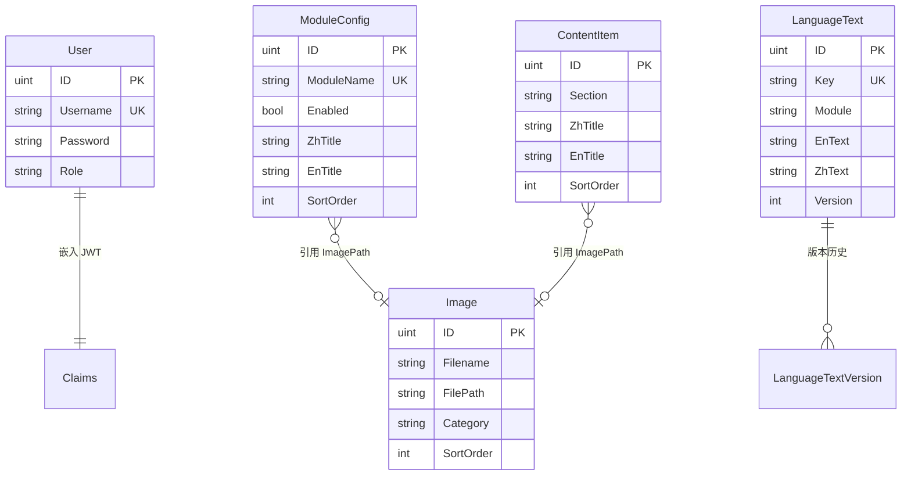

# 数据模型

**本文档中引用的文件**
- [README.md](../../../../README.md)
- [backend/models/models.go](../../../../backend/models/models.go)

## 目录
1. [引言](#引言)
2. [核心领域实体](#核心领域实体)
   1. [用户认证模型](#用户认证模型)
   2. [图片管理模型](#图片管理模型)
   3. [页面配置模型](#页面配置模型)
   4. [内容管理模型](#内容管理模型)
   5. [多语言模型](#多语言模型)
3. [实体关系](#实体关系)
4. [数据验证与业务规则](#数据验证与业务规则)
5. [数据访问模式与性能考虑](#数据访问模式与性能考虑)
6. [结论](#结论)

## 引言

本文档描述医疗设备官网 CMS 系统的数据模型结构。系统基于 Go + Gin + SQLite 构建，采用 GORM 作为 ORM 框架，支持用户认证、图片管理、页面配置、内容管理及多语言五大核心功能领域。

**系统概述：**
- 项目名称：医疗设备官网 CMS 系统
- 技术栈：Go + Gin + SQLite (GORM) + JWT
- 数据库：SQLite 内嵌数据库（`medical.db`，自动生成）
- 认证方式：JWT Token 认证

**主要实体分类：**
| 领域 | 模型 | 说明 |
|------|------|------|
| 用户认证 | Claims, User | JWT 声明与用户账户管理 |
| 图片管理 | Image | 图片上传、分类与元数据管理 |
| 页面配置 | PageConfig, ModuleConfig | 动态页面与模块配置 |
| 内容管理 | ContentItem | 结构化内容项管理 |
| 多语言 | LanguageText, LanguageTextVersion | 多语言文本及版本历史 |

## 核心领域实体

### 用户认证模型

#### Claims
JWT 认证声明结构，用于 Token 中携带用户身份信息。

**字段定义与约束**
- **UserID** (uint): 用户 ID
- **Role** (string): 用户角色
- **RegisteredClaims** (jwt.RegisteredClaims): JWT 标准声明（包含过期时间、签发者等）

**来源：** [backend/models/models.go](../../../../backend/models/models.go)(L10-L14)

#### User
用户账户模型，支持基于角色的访问控制。

**字段定义与约束**
- **ID** (uint): 主键（GORM 自动管理）
- **Username** (string): 用户名，唯一索引，非空
- **Password** (string): 密码，非空
- **Role** (string): 角色，默认值 'admin'
- **CreatedAt** (time.Time): 创建时间（GORM 自动管理）
- **UpdatedAt** (time.Time): 更新时间（GORM 自动管理）
- **DeletedAt** (gorm.DeletedAt): 软删除时间（GORM 自动管理）

**索引：**
- 唯一索引：`UNIQUE INDEX idx_username ON users (username)`

**数据来源：** [backend/models/models.go](../../../../backend/models/models.go)(L16-L21)

---

### 图片管理模型

#### Image
图片资源管理模型，支持分类、排序与元数据描述。

**字段定义与约束**
- **ID** (uint): 主键
- **Filename** (string): 文件名，非空
- **FilePath** (string): 文件存储路径，非空
- **FileSize** (int64): 文件大小（字节）
- **Description** (string): 简短描述
- **LongDescription** (string): 详细描述
- **Category** (string): 分类标识
- **SortOrder** (int): 排序顺序，默认值 0
- **CreatedAt** (time.Time): 创建时间
- **UpdatedAt** (time.Time): 更新时间
- **DeletedAt** (gorm.DeletedAt): 软删除时间

**索引：**
- 主键索引：`PRIMARY KEY (id)`
- 普通索引：`INDEX idx_deleted_at ON images (deleted_at)`

**数据来源：** [backend/models/models.go](../../../../backend/models/models.go)(L23-L35)

---

### 页面配置模型

#### PageConfig
页面级配置模型，用于存储各页面的动态配置数据（JSON 格式）。

**字段定义与约束**
- **ID** (uint): 主键（GORM 自动管理）
- **PageName** (string): 页面名称，唯一索引，非空
- **ConfigData** (string): 配置数据（TEXT 类型）
- **CreatedAt/UpdatedAt/DeletedAt**: GORM 自动管理

**索引：**
- 唯一索引：`UNIQUE INDEX idx_page_name ON page_configs (page_name)`

**数据来源：** [backend/models/models.go](../../../../backend/models/models.go)(L37-L41)

#### ModuleConfig
模块级配置模型，支持多语言内容与向后兼容字段。

**字段定义与约束**
- **ID** (uint): 主键（GORM 自动管理）
- **ModuleName** (string): 模块名称，唯一索引，非空
- **Enabled** (bool): 启用状态，默认值 true
- **ZhTitle/EnTitle** (string): 中/英文标题
- **ZhSubtitle/EnSubtitle** (string): 中/英文副标题
- **ZhContent/EnContent** (string): 中/英文内容（TEXT 类型）
- **Title/Subtitle/Content** (string): 向后兼容字段
- **ImagePath** (string): 关联图片路径
- **SortOrder** (int): 排序顺序，默认值 0
- **ExtraData** (string): 扩展数据（TEXT 类型）
- **ZhDescription/EnDescription** (string): 中/英文描述
- **Description** (string): 向后兼容描述字段

**索引：**
- 唯一索引：`UNIQUE INDEX idx_module_name ON module_configs (module_name)`

**数据来源：** [backend/models/models.go](../../../../backend/models/models.go)(L43-L62)

---

### 内容管理模型

#### ContentItem
结构化内容项模型，用于管理网站各区块的内容展示。

**字段定义与约束**
- **ID** (uint): 主键（GORM 自动管理）
- **Section** (string): 所属区块，非空
- **ZhTitle/EnTitle** (string): 中/英文标题
- **ZhDescription/EnDescription** (string): 中/英文描述
- **Title/Description** (string): 向后兼容字段
- **Icon** (string): 图标标识
- **ImagePath** (string): 关联图片路径
- **SortOrder** (int): 排序顺序，默认值 0
- **CreatedAt/UpdatedAt/DeletedAt**: GORM 自动管理

**数据来源：** [backend/models/models.go](../../../../backend/models/models.go)(L64-L76)

---

### 多语言模型

#### LanguageText
多语言文本模型，支持版本管理。

**字段定义与约束**
- **ID** (uint): 主键（GORM 自动管理）
- **Key** (string): 文本键，唯一索引，非空
- **Module** (string): 所属模块，非空
- **EnText** (string): 英文文本（TEXT 类型）
- **ZhText** (string): 中文文本（TEXT 类型）
- **Description** (string): 描述说明
- **Version** (int): 版本号，默认值 1

**索引：**
- 唯一索引：`UNIQUE INDEX idx_key ON language_texts (key)`

**数据来源：** [backend/models/models.go](../../../../backend/models/models.go)(L78-L86)

#### LanguageTextVersion
多语言文本版本历史模型，用于审计与回滚。

**字段定义与约束**
- **ID** (uint): 主键（GORM 自动管理）
- **LanguageTextID** (uint): 关联的 LanguageText ID，非空
- **Key** (string): 文本键，非空
- **Module** (string): 所属模块，非空
- **EnText/ZhText** (string): 中/英文文本（TEXT 类型）
- **Description** (string): 描述说明
- **Version** (int): 版本号，非空
- **UpdatedAt** (time.Time): 更新时间

**数据来源：** [backend/models/models.go](../../../../backend/models/models.go)(L88-L98)

---

## 实体关系

**关系说明：**
- **User → Claims**: 一对一，User 的 ID 和 Role 嵌入 JWT Claims
- **ModuleConfig → Image**: 多对一，多个模块可引用同一图片（通过 ImagePath）
- **ContentItem → Image**: 多对一，多个内容项可引用同一图片（通过 ImagePath）
- **LanguageText → LanguageTextVersion**: 一对多，一个文本可有多个版本历史

**ER 图：**

---

## 数据验证与业务规则

### 字段级验证规则

**必填字段：**
| 模型 | 必填字段 |
|------|----------|
| User | Username, Password |
| Image | Filename, FilePath |
| PageConfig | PageName |
| ModuleConfig | ModuleName |
| ContentItem | Section |
| LanguageText | Key, Module |

**唯一性约束：**
- `User.Username`: 用户名全局唯一
- `PageConfig.PageName`: 页面名称唯一
- `ModuleConfig.ModuleName`: 模块名称唯一
- `LanguageText.Key`: 文本键唯一

**数据格式要求：**
- 所有时间字段由 GORM 自动管理（CreatedAt/UpdatedAt）
- 软删除字段使用 `gorm.DeletedAt` 类型

### 实体级业务规则

**状态规则：**
- `ModuleConfig.Enabled`: 默认启用（true）
- `LanguageText.Version`: 初始版本为 1，每次修改递增

**关联完整性：**
- `LanguageTextVersion.LanguageTextID` 必须指向有效的 LanguageText 记录

### 跨实体业务规则

**级联操作：**
- 删除 Image 时，需检查是否有 ModuleConfig 或 ContentItem 引用该图片
- 删除 LanguageText 时，建议同步清理其所有版本记录

---

## 数据访问模式与性能考虑

### 查询优化

**常用查询模式：**
- 按分类查询图片：`WHERE category = ? ORDER BY sort_order`
- 按模块查询配置：`WHERE module_name = ?`
- 按区块查询内容：`WHERE section = ? ORDER BY sort_order`
- 按键查询多语言文本：`WHERE key = ?`

**索引使用建议：**
- 利用 GORM 自动创建的唯一索引进行精确查询
- 对 `DeletedAt` 字段的索引支持软删除查询

### 缓存策略

**可缓存数据类型：**
- `PageConfig`: 页面配置变更频率低，适合缓存
- `ModuleConfig`: 模块配置可缓存，按 ModuleName 作为缓存键
- `LanguageText`: 多语言文本适合缓存，按 Key 作为缓存键

**缓存失效策略：**
- 配置更新时失效对应缓存
- 建议使用版本号（Version）作为缓存失效标识

### 并发控制

**乐观锁：**
- `LanguageText.Version` 字段可用于乐观锁控制
- 更新时检查版本号，避免并发覆盖

**事务隔离：**
- SQLite 默认支持 SERIALIZABLE 隔离级别
- 批量操作建议使用 GORM 事务包裹

---

## 结论

**数据模型核心特点：**
1. 采用 GORM 自动管理主键、时间戳与软删除
2. 多语言支持完善，包含版本历史追溯
3. 向后兼容设计，新旧字段共存
4. 唯一索引保障数据一致性

**扩展性考虑：**
- 新增页面配置：在 PageConfig 中添加新 PageName 记录
- 新增图片分类：直接在 Image.Category 中使用新值
- 新增多语言：在 LanguageText 中添加新 Key 记录

**维护建议：**
- 定期清理软删除记录（DeletedAt 非空）
- 监控 LanguageTextVersion 表增长，必要时归档历史版本
- 图片文件与数据库记录需保持一致性校验

**相关文档链接：**
- [项目概述](../../../../README.md)
- [架构总览](../../架构总览.md)