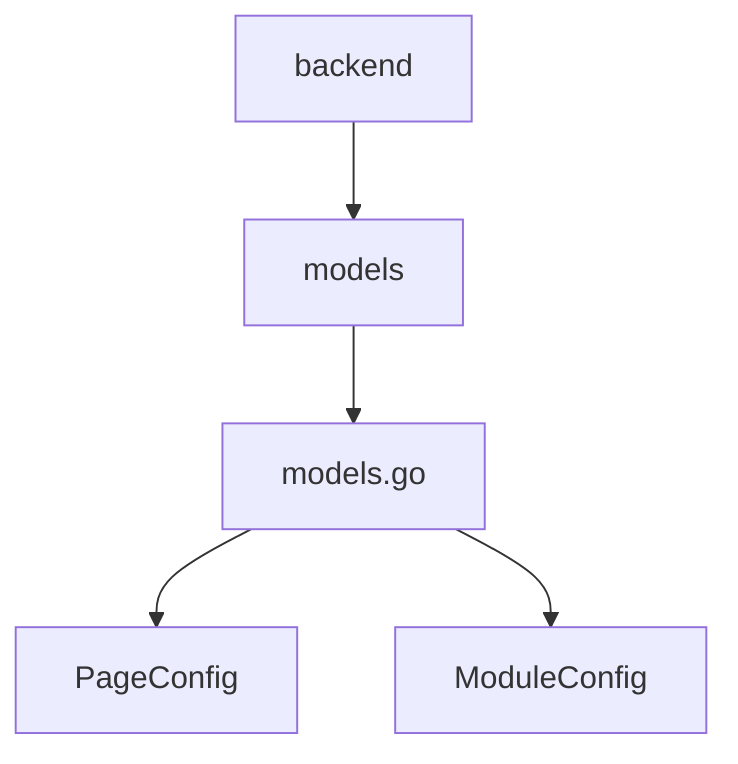
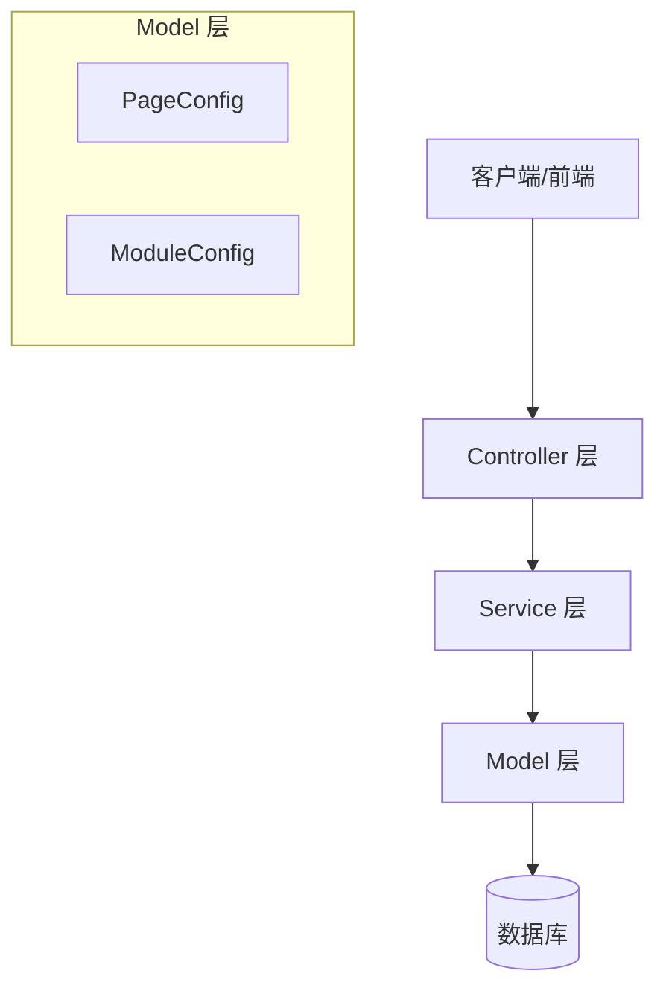
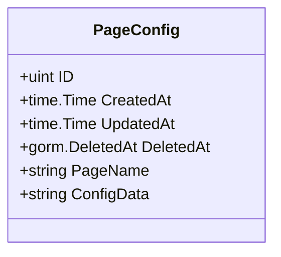
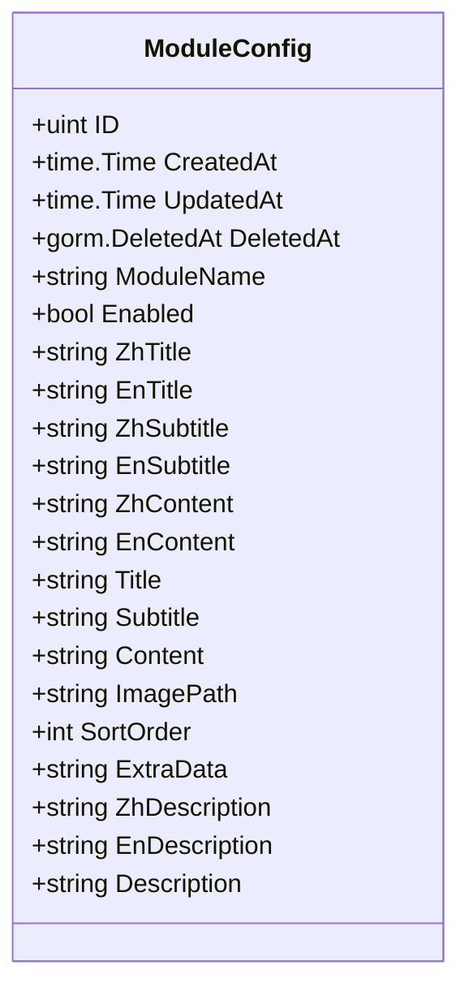
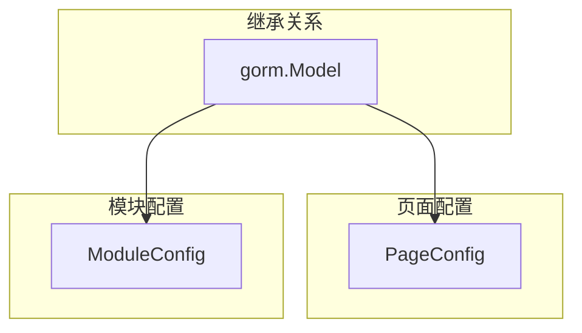
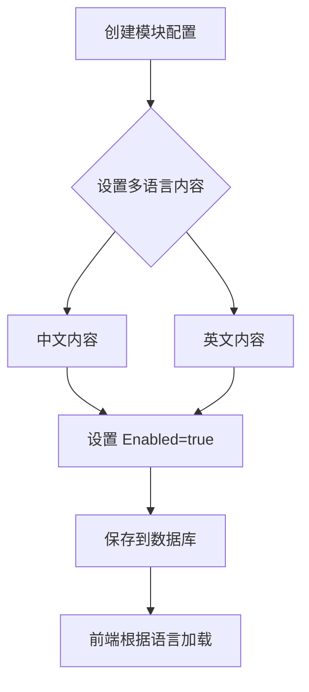
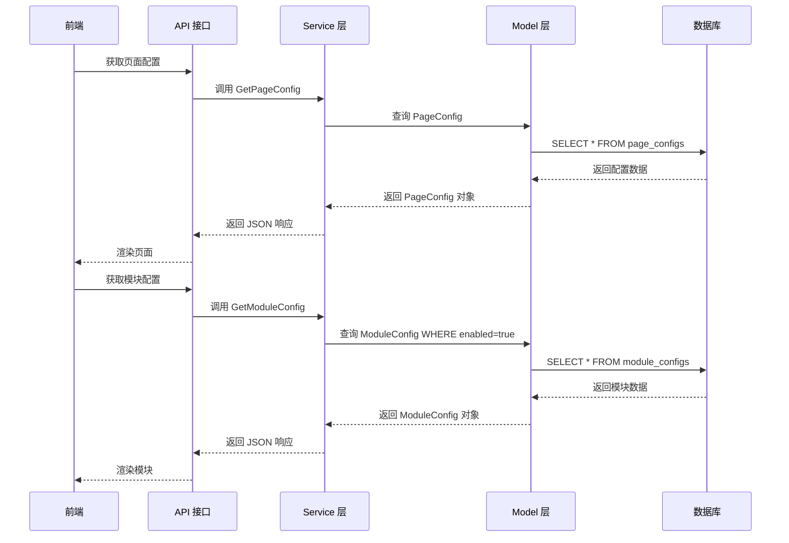

# 页面配置模型 (PageConfig & ModuleConfig)

**本文档引用的文件**
- [models.go](../../../../backend/models/models.go)

## 目录
1. [简介](#简介)
2. [项目结构](#项目结构)
3. [核心组件](#核心组件)
4. [架构概述](#架构概述)
5. [详细组件分析](#详细组件分析)
6. [数据库表结构](#数据库表结构)
7. [业务规则](#业务规则)
8. [使用示例](#使用示例)
9. [结论](#结论)

## 简介

页面配置模型用于管理 CMS 系统中的页面级配置和模块级配置，支持多语言内容存储和动态页面组装。

**核心实体**：
- **PageConfig**：页面级别配置，存储页面的整体配置数据（JSON 格式）
- **ModuleConfig**：模块级别配置，存储可复用模块的内容和状态，支持中英文双语

**与视图对象的映射关系**：
- PageConfig 的 ConfigData 字段存储 JSON 格式的配置数据，前端解析后渲染页面
- ModuleConfig 的多语言字段（ZhTitle/EnTitle 等）直接映射到前端展示内容

**本节来源** - [models.go](../../../../backend/models/models.go)(L37-L62)

## 项目结构

模型相关代码位于 `backend/models/` 目录下，采用 Go 语言 GORM 框架定义数据模型。



**图示来源** - [models.go](../../../../backend/models/models.go)

**本节来源** - [models.go](../../../../backend/models/models.go)

## 核心组件

**主要实体类**：
- **PageConfig**：页面配置实体，位于 `backend/models/models.go`
- **ModuleConfig**：模块配置实体，位于 `backend/models/models.go`

**基础模型**：
- 两个实体均嵌入 `gorm.Model`，自动包含以下字段：
  - `ID`：主键（uint 类型）
  - `CreatedAt`：创建时间（time.Time）
  - `UpdatedAt`：更新时间（time.Time）
  - `DeletedAt`：软删除时间（gorm.DeletedAt）

**本节来源** - [models.go](../../../../backend/models/models.go)(L37-L62)

## 架构概述



**图示来源** - [models.go](../../../../backend/models/models.go)

**本节来源** - [models.go](../../../../backend/models/models.go)

## 详细组件分析

### PageConfig

**实体字段表格**

| 字段名 | 类型 | 描述 |
|-------|------|------|
| ID | uint | 主键，自增 |
| CreatedAt | time.Time | 记录创建时间 |
| UpdatedAt | time.Time | 记录更新时间 |
| DeletedAt | gorm.DeletedAt | 软删除时间戳 |
| PageName | string | 页面名称，唯一索引，非空 |
| ConfigData | string | 配置数据，text 类型，JSON 格式 |

**类图**



**图示来源** - [models.go](../../../../backend/models/models.go)(L37-L41)

### ModuleConfig

**实体字段表格**

| 字段名 | 类型 | 描述 |
|-------|------|------|
| ID | uint | 主键，自增 |
| CreatedAt | time.Time | 记录创建时间 |
| UpdatedAt | time.Time | 记录更新时间 |
| DeletedAt | gorm.DeletedAt | 软删除时间戳 |
| ModuleName | string | 模块名称，唯一索引，非空 |
| Enabled | bool | 是否启用，默认 true |
| ZhTitle | string | 中文标题 |
| EnTitle | string | 英文标题 |
| ZhSubtitle | string | 中文副标题 |
| EnSubtitle | string | 英文副标题 |
| ZhContent | string | 中文内容，text 类型 |
| EnContent | string | 英文内容，text 类型 |
| Title | string | 标题（向后兼容） |
| Subtitle | string | 副标题（向后兼容） |
| Content | string | 内容（向后兼容），text 类型 |
| ImagePath | string | 图片路径 |
| SortOrder | int | 排序顺序，默认 0 |
| ExtraData | string | 额外数据，text 类型，JSON 格式 |
| ZhDescription | string | 中文描述 |
| EnDescription | string | 英文描述 |
| Description | string | 描述（向后兼容） |

**类图**



**图示来源** - [models.go](../../../../backend/models/models.go)(L43-L62)

**本节来源** - [models.go](../../../../backend/models/models.go)(L37-L62)

### 依赖分析



**图示来源** - [models.go](../../../../backend/models/models.go)

**本节来源** - [models.go](../../../../backend/models/models.go)

## 数据库表结构

### PageConfig 表

```sql
CREATE TABLE page_configs (
    id INTEGER PRIMARY KEY AUTOINCREMENT,
    created_at DATETIME,
    updated_at DATETIME,
    deleted_at DATETIME,
    page_name TEXT NOT NULL UNIQUE,
    config_data TEXT
);
```

### ModuleConfig 表

```sql
CREATE TABLE module_configs (
    id INTEGER PRIMARY KEY AUTOINCREMENT,
    created_at DATETIME,
    updated_at DATETIME,
    deleted_at DATETIME,
    module_name TEXT NOT NULL UNIQUE,
    enabled BOOLEAN DEFAULT 1,
    zh_title TEXT,
    en_title TEXT,
    zh_subtitle TEXT,
    en_subtitle TEXT,
    zh_content TEXT,
    en_content TEXT,
    title TEXT,
    subtitle TEXT,
    content TEXT,
    image_path TEXT,
    sort_order INTEGER DEFAULT 0,
    extra_data TEXT,
    zh_description TEXT,
    en_description TEXT,
    description TEXT
);
```

**图示来源** - [models.go](../../../../backend/models/models.go)

**本节来源** - [models.go](../../../../backend/models/models.go)(L37-L62)

## 业务规则

**状态管理规则**：
- ModuleConfig 的 `Enabled` 字段控制模块是否启用，默认值为 `true`
- 所有模型支持软删除，通过 `DeletedAt` 字段标记删除状态
- `PageName` 和 `ModuleName` 均具有唯一索引，确保名称不重复
- `SortOrder` 字段用于控制模块显示顺序，默认值为 0

**多语言规则**：
- ModuleConfig 提供完整的中英文双语支持
- 中文内容存储于 `ZhTitle`、`ZhSubtitle`、`ZhContent`、`ZhDescription`
- 英文内容存储于 `EnTitle`、`EnSubtitle`、`EnContent`、`EnDescription`
- 保留 `Title`、`Subtitle`、`Content`、`Description` 字段用于向后兼容旧数据

**业务流程**



**图示来源** - [models.go](../../../../backend/models/models.go)

**本节来源** - [models.go](../../../../backend/models/models.go)(L43-L62)

## 使用示例

**典型调用链路**：



**图示来源** - [models.go](../../../../backend/models/models.go)

**本节来源** - [models.go](../../../../backend/models/models.go)

## 结论

**设计特点**：
- PageConfig 采用灵活的 JSON 存储方式，支持动态页面配置
- ModuleConfig 提供完整的多语言支持，满足国际化需求
- 通过 `Enabled` 字段实现模块的启用/禁用控制
- 保留向后兼容字段，确保系统升级的平滑过渡

**系统价值**：
- 支持动态页面组装，无需修改代码即可调整页面结构
- 多语言配置使系统能够服务中英文用户
- 模块化管理提高内容复用性和维护效率

**本节来源** - [models.go](../../../../backend/models/models.go)(L37-L62)