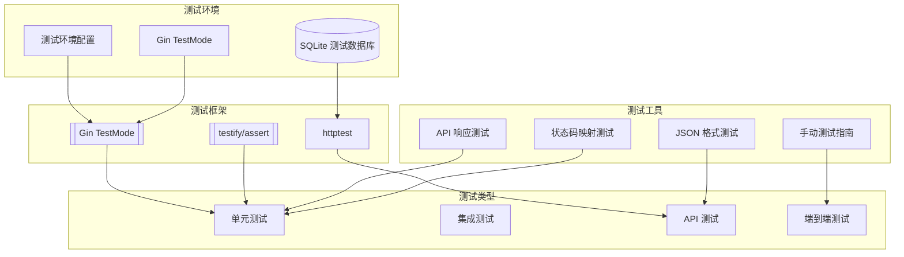
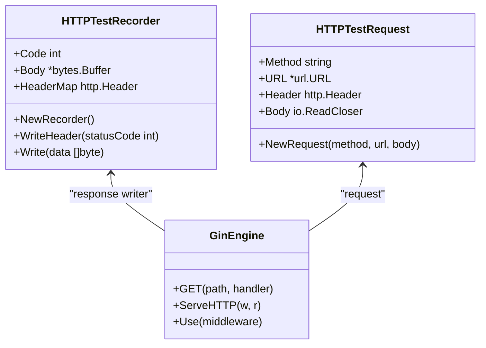
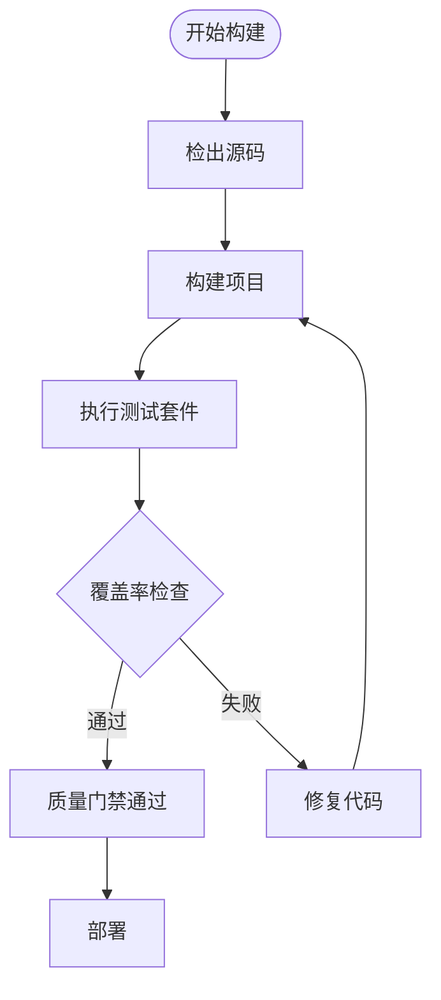
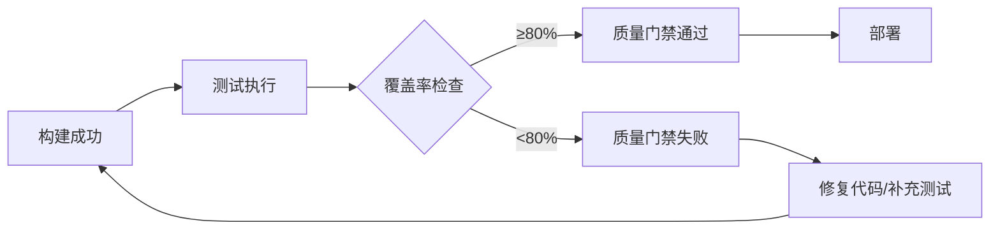

# 测试策略文档

**本文档中引用的文件**
- [README.md](../../../README.md)
- [go.mod](../../../go.mod)
- [response_test.go](../../../backend/common/response_test.go)
- [response.go](../../../backend/common/response.go)
- [TESTING_GUIDE.md](../../../TESTING_GUIDE.md)

## 目录
1. [项目概述](#项目概述)
2. [测试架构概览](#测试架构概览)
3. [测试框架与工具](#测试框架与工具)
4. [测试代码组织结构](#测试代码组织结构)
5. [测试类型与策略](#测试类型与策略)
6. [测试最佳实践](#测试最佳实践)
7. [持续集成与测试流程](#持续集成与测试流程)
8. [测试覆盖率与质量保证](#测试覆盖率与质量保证)
9. [故障排除指南](#故障排除指南)
10. [总结](#总结)

## 项目概述

本项目是**医疗设备官网 CMS 系统**，采用 **Go + Gin + SQLite** 技术栈构建，具有完整的测试策略体系。项目当前包含单元测试，覆盖了 API 响应结构、JSON 格式验证和错误状态码映射等核心功能，确保系统的稳定性和可靠性。

项目特点：
- **后端框架**: Gin v1.12.0
- **测试框架**: testify/assert v1.11.1
- **数据库**: SQLite (GORM)
- **认证**: JWT Token (golang-jwt/jwt/v5)

## 测试架构概览



**图表来源**
- [response_test.go](../../../backend/common/response_test.go) - 测试代码结构分析
- [response.go](../../../backend/common/response.go) - 被测试的响应处理代码

## 测试框架与工具

### 核心测试框架

项目使用以下核心测试框架：

1. **testify/assert (v1.11.1)**: 主要的断言库，提供简洁的断言语法
2. **Gin TestMode**: Gin 框架的测试模式，禁用日志输出
3. **net/http/httptest**: Go 标准库的 HTTP 测试工具
4. **encoding/json**: Go 标准库的 JSON 编解码测试支持

### 测试依赖配置

根据 [go.mod](../../../go.mod) 配置，项目测试相关依赖：

```go
require (
    github.com/gin-gonic/gin v1.12.0
    github.com/stretchr/testify v1.11.1
)
```

### 特殊测试工具

#### httptest HTTP 测试工具

项目使用 `httptest.NewRequest` 和 `httptest.NewRecorder` 进行 HTTP 请求/响应测试：



**图表来源**
- [response_test.go](../../../backend/common/response_test.go)(L137-L142)

## 测试代码组织结构

### 目录结构

```
backend/
├── common/
│   ├── response.go           # 响应处理代码
│   └── response_test.go      # 响应处理测试
├── config/
│   ├── config.go             # 配置管理
│   └── database.go           # 数据库配置
├── controllers/
│   ├── content_controller.go # 内容控制器
│   ├── image_controller.go   # 图片控制器
│   ├── language_controller.go# 语言控制器
│   ├── module_controller.go  # 模块控制器
│   └── user_controller.go    # 用户控制器
├── middleware/
│   ├── auth.go               # 认证中间件
│   └── error_handler.go      # 错误处理中间件
├── models/
│   └── models.go             # 数据模型
├── routes/
│   └── routes.go             # 路由配置
└── services/
    ├── content_service.go    # 内容服务
    ├── image_service.go      # 图片服务
    ├── language_service.go   # 语言服务
    ├── module_service.go     # 模块服务
    └── user_service.go       # 用户服务
```

### 测试基类设计

当前项目测试采用简洁的测试模式，每个测试函数独立执行：

```mermaid
classDiagram
class ResponseTest {
    +TestAPIResponseStructure()
    +TestJSONResponseFormat()
    +TestErrorStatusCodeMapping()
}
class APIResponse {
    +Code int
    +Message string
    +Data interface{}
    +Timestamp int64
}
class GinTestMode {
    +SetMode(mode string)
    +TestMode constant
}
ResponseTest --> APIResponse : "tests"
ResponseTest --> GinTestMode : "uses"
```

**图表来源**
- [response_test.go](../../../backend/common/response_test.go) - 测试函数结构
- [response.go](../../../backend/common/response.go) - API 响应结构定义

## 测试类型与策略

### 单元测试

单元测试专注于测试单个组件或方法的行为，使用 testify/assert 进行断言。

#### 测试特点：
- 使用 `gin.SetMode(gin.TestMode)` 禁用日志
- 测试独立性高
- 快速执行
- 覆盖核心业务逻辑

#### 示例：API 响应结构测试

```go
func TestAPIResponseStructure(t *testing.T) {
    gin.SetMode(gin.TestMode)

    testCases := []struct {
        name           string
        response       APIResponse
        expectedCode   int
        expectedMsg    string
        expectData     bool
    }{
        {
            name:         "success response with data",
            response:     Success(map[string]string{"key": "value"}),
            expectedCode: SuccessCode,
            expectedMsg:  "success",
            expectData:   true,
        },
        // ... 更多测试用例
    }

    for _, tc := range testCases {
        t.Run(tc.name, func(t *testing.T) {
            assert.Equal(t, tc.expectedCode, tc.response.Code)
            assert.Equal(t, tc.expectedMsg, tc.response.Message)
            assert.NotZero(t, tc.response.Timestamp)
        })
    }
}
```

**章节来源**
- [response_test.go](../../../backend/common/response_test.go)(L14-L82)

### 集成测试

集成测试验证多个组件之间的交互，使用 httptest 进行 HTTP 级别测试。

#### 测试特点：
- 使用真实 HTTP 请求/响应
- 测试完整请求处理流程
- 验证 JSON 序列化格式
- 使用表格驱动测试组织用例

#### 示例：JSON 响应格式测试

```go
func TestJSONResponseFormat(t *testing.T) {
    gin.SetMode(gin.TestMode)

    testCases := []struct {
        name         string
        handlerFunc  gin.HandlerFunc
        expectedCode int
        expectedHTTP int
    }{
        {
            name: "JSONSuccess",
            handlerFunc: func(c *gin.Context) {
                JSONSuccess(c, map[string]string{"key": "value"})
            },
            expectedCode: SuccessCode,
            expectedHTTP: http.StatusOK,
        },
        // ... 更多测试用例
    }

    for _, tc := range testCases {
        t.Run(tc.name, func(t *testing.T) {
            req := httptest.NewRequest("GET", "/test", nil)
            w := httptest.NewRecorder()

            r := gin.New()
            r.GET("/test", tc.handlerFunc)
            r.ServeHTTP(w, req)

            assert.Equal(t, tc.expectedHTTP, w.Code)
            
            var response APIResponse
            err := json.Unmarshal(w.Body.Bytes(), &response)
            assert.NoError(t, err)
        })
    }
}
```

**章节来源**
- [response_test.go](../../../backend/common/response_test.go)(L84-L153)

### API 测试

API 测试通过 httptest 进行 HTTP 接口测试，验证完整的请求响应流程。

#### 测试特点：
- 端到端 HTTP 测试
- 验证状态码映射
- 模拟真实请求场景
- 使用表格驱动测试

#### 示例：错误状态码映射测试

```go
func TestErrorStatusCodeMapping(t *testing.T) {
    tests := []struct {
        name     string
        errCode  int
        httpCode int
    }{
        {"success", SuccessCode, http.StatusOK},
        {"bad request", ErrBadRequest, http.StatusBadRequest},
        {"unauthorized", ErrUnauthorized, http.StatusUnauthorized},
        {"forbidden", ErrForbidden, http.StatusForbidden},
        {"not found", ErrNotFound, http.StatusNotFound},
        {"conflict", ErrConflict, http.StatusConflict},
        {"internal error", ErrInternalServerError, http.StatusInternalServerError},
    }

    for _, tc := range tests {
        t.Run(tc.name, func(t *testing.T) {
            req := httptest.NewRequest("GET", "/test", nil)
            w := httptest.NewRecorder()

            r := gin.New()
            r.GET("/test", func(c *gin.Context) {
                JSON(c, tc.httpCode, Error(tc.errCode, "test"))
            })
            r.ServeHTTP(w, req)

            assert.Equal(t, tc.httpCode, w.Code)
        })
    }
}
```

**章节来源**
- [response_test.go](../../../backend/common/response_test.go)(L155-L189)

## 测试最佳实践

### 1. 测试命名规范

- 使用描述性的测试名称
- 遵循表格驱动测试模式
- 明确表达测试意图

```go
testCases := []struct {
    name string  // 测试用例名称，使用描述性命名
    // ... 其他字段
}{
    {
        name: "success response with data",  // 清晰描述测试场景
        // ...
    },
}
```

### 2. 测试数据管理

#### 使用表格驱动测试的优势：
- 结构化测试数据
- 易于扩展新用例
- 代码复用性高
- 可读性强

### 3. 测试隔离

```go
func TestXXX(t *testing.T) {
    gin.SetMode(gin.TestMode)  // 设置测试模式，禁用日志
    
    // 每个测试用例独立创建请求和响应记录器
    req := httptest.NewRequest("GET", "/test", nil)
    w := httptest.NewRecorder()
    
    // 独立创建 Gin 引擎实例
    r := gin.New()
    r.GET("/test", handlerFunc)
    r.ServeHTTP(w, req)
    
    // 断言验证
    assert.Equal(t, expectedHTTP, w.Code)
}
```

### 4. 断言最佳实践

```go
// 使用 testify/assert 提高可读性
assert.Equal(t, expected, actual)
assert.NoError(t, err)
assert.NotZero(t, value)
assert.Nil(t, data)
assert.NotNil(t, data)
assert.True(t, condition)
assert.False(t, condition)

// 组合断言验证多个条件
assert.Equal(t, tc.expectedCode, tc.response.Code)
assert.Equal(t, tc.expectedMsg, tc.response.Message)
assert.NotZero(t, tc.response.Timestamp)
```

### 5. 前端测试指南

项目提供了详细的前端测试指南 [TESTING_GUIDE.md](../../../TESTING_GUIDE.md)，包括：

- 数据加载闪现问题测试
- 多网络环境测试（正常/弱网/离线）
- 性能指标验证（FCP、TTI、Layout Shift）
- 自动化测试脚本（Puppeteer）

## 持续集成与测试流程

### CI/CD 管道配置



### 测试执行配置

项目使用 Go 内置测试工具进行测试管理：

```bash
# 运行所有测试
go test ./...

# 运行特定包的测试
go test ./backend/common/...

# 运行测试并生成覆盖率报告
go test -coverprofile=coverage.out ./...

# 查看覆盖率报告
go tool cover -html=coverage.out
```

### 测试报告发布

CI 系统可发布以下测试报告：
- Go 测试执行报告
- 代码覆盖率报告（Jacoco 类似工具）
- 依赖检查报告

## 测试覆盖率与质量保证

### 覆盖率要求

项目使用 Go 内置覆盖率工具进行代码覆盖率分析：

```bash
# 生成覆盖率报告
go test -coverprofile=coverage.out ./backend/...

# 查看覆盖率统计
go tool cover -func=coverage.out

# 生成 HTML 可视化报告
go tool cover -html=coverage.out
```

### 质量门禁



### 代码质量工具

- **go vet**: Go 代码静态分析
- **golangci-lint**: 综合代码风格检查
- **go mod tidy**: 依赖清理和验证
- **gofmt**: 代码格式化

## 故障排除指南

### 常见测试问题

#### 1. 测试失败：断言不匹配
**症状**: `assert.Equal` 断言失败
**解决方案**:
- 检查期望值和实际值的类型是否一致
- 验证时间戳等动态字段的处理方式
- 使用 `assert.InDelta` 处理浮点数比较

#### 2. Gin TestMode 未生效
**症状**: 测试输出大量日志
**解决方案**:
- 确保在测试函数开始处调用 `gin.SetMode(gin.TestMode)`
- 检查是否有其他代码重置了 Gin 模式

#### 3. JSON 解析错误
**症状**: `json.Unmarshal` 返回错误
**解决方案**:
- 检查响应体格式是否符合预期
- 验证结构体字段标签（json tag）是否正确
- 使用 `w.Body.String()` 查看原始响应内容

### 调试技巧

1. **启用详细输出**: 使用 `go test -v` 查看详细测试执行过程
2. **使用断点调试**: 在 IDE 中设置断点逐步跟踪
3. **打印响应内容**: 在测试中添加 `fmt.Println(w.Body.String())` 调试
4. **验证依赖版本**: 确保所有测试依赖版本兼容

### 前端测试问题

参考 [TESTING_GUIDE.md](../../../TESTING_GUIDE.md) 中的问题排查指南：
- 检查浏览器缓存
- 查看控制台错误
- 验证 Network 面板请求状态

## 总结

本项目建立了完善的测试策略体系，涵盖了从单元测试到集成测试的多层次测试覆盖。通过合理的测试架构设计、丰富的测试工具选择和严格的代码质量要求，确保了系统的高质量交付。

### 关键优势

1. **表格驱动测试**: 使用 Go 的表格驱动测试模式，代码简洁易维护
2. **强大的断言库**: 使用 testify/assert 提供丰富的断言方法
3. **HTTP 测试支持**: 通过 httptest 实现完整的 HTTP 请求/响应测试
4. **Gin TestMode**: 利用 Gin 框架的测试模式，禁用日志干扰
5. **前端测试指南**: 提供详细的手动测试指南和自动化测试脚本

### 未来改进方向

1. **增加集成测试**: 扩展数据库和外部服务的集成测试
2. **Mock 外部依赖**: 使用 mock 库隔离外部服务依赖
3. **性能测试集成**: 添加基准测试（benchmark）和压力测试
4. **测试自动化**: 在 CI/CD 中集成自动化测试执行
5. **监控和告警**: 建立测试执行监控和异常告警机制

通过持续优化测试策略和工具，项目将继续保持高质量的软件交付能力，为医疗设备官网提供可靠的技术保障。