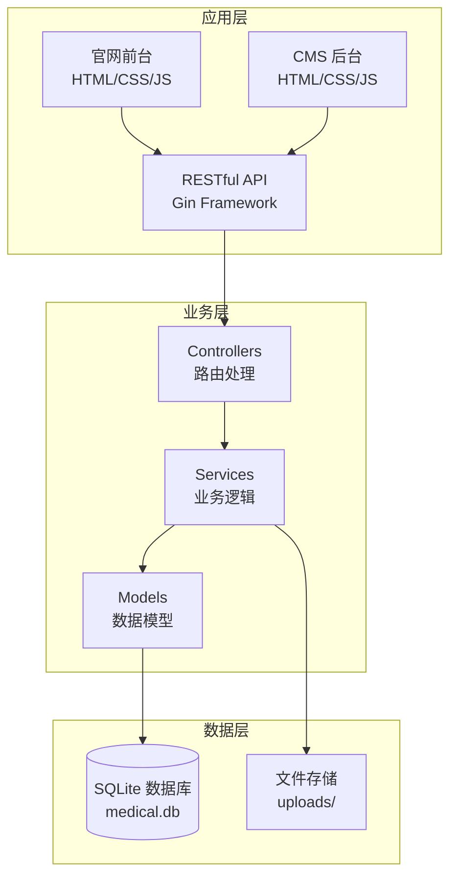

# 部署与运维指南

**本文档中引用的文件**
- [README.md](../../../README.md)
- [main.go](../../../main.go)
- [backend/config/database.go](../../../backend/config/database.go)
- [backend/config/config.go](../../../backend/config/config.go)

## 目录
1. [概述](#概述)
2. [项目架构](#项目架构)
3. [环境配置管理](#环境配置管理)
4. [部署说明](#部署说明)
5. [故障排查指南](#故障排查指南)
6. [运维最佳实践](#运维最佳实践)

## 概述

本指南详细介绍了医疗设备官网 CMS 系统的部署与运维流程。该系统采用 Go + Gin + SQLite 技术栈构建，是一个功能完整的内容管理系统，支持医疗设备展示、图片管理、页面配置等功能。

项目的核心特性包括：
- 基于 Go + Gin 的轻量级 Web 应用架构
- SQLite 内嵌数据库，无需额外配置数据库服务
- JWT Token 认证机制，支持用户登录/登出
- 多语言内容支持（中英文）
- 响应式官网前台与后台管理界面

系统默认运行端口为 `8080`，启动后可通过以下地址访问：
- **官网首页**: http://localhost:8080
- **CMS 后台**: http://localhost:8080/admin

## 项目架构



**架构说明**：
- **应用层**：包含官网前台展示页面和 CMS 后台管理界面，均通过 RESTful API 与后端交互
- **业务层**：采用典型的 MVC 架构，Controllers 处理路由请求，Services 封装业务逻辑，Models 定义数据结构
- **数据层**：使用 SQLite 作为嵌入式数据库，数据持久化到 `medical.db` 文件；上传的图片存储在 `uploads/` 目录

**图表来源**
- [README.md](../../../README.md)
- [main.go](../../../main.go)

## 环境配置管理

### 技术栈与依赖

| 组件 | 技术选型 | 说明 |
|------|----------|------|
| 后端框架 | Go + Gin | 轻量级高性能 Web 框架 |
| 数据库 | SQLite (GORM) | 嵌入式数据库，无需额外部署 |
| 认证机制 | JWT | 基于 Token 的身份认证 |
| 前端技术 | 原生 HTML/CSS/JS | 无需构建工具，直接部署 |

### 关键配置项

#### 服务器配置

服务器配置在 [backend/config/config.go](../../../backend/config/config.go) 中定义：

```go
var (
    JWTSecret = []byte("medical-device-cms-secret-key-2024") // 已脱敏
    DB        *gorm.DB
)

func SetupRouter() *gin.Engine {
    r := gin.Default()
    return r
}
```

**配置说明**：
- `JWTSecret`：JWT 令牌签名密钥（生产环境应使用环境变量配置）
- `SetupRouter()`：初始化 Gin 引擎，使用默认中间件

#### 数据库配置

数据库配置在 [backend/config/database.go](../../../backend/config/database.go) 中定义：

```go
func InitDB() error {
    var err error
    DB, err = gorm.Open(sqlite.Open("medical.db"), &gorm.Config{})
    if err != nil {
        return err
    }

    err = DB.AutoMigrate(
        &models.User{},
        &models.Image{},
        &models.PageConfig{},
        &models.ModuleConfig{},
        &models.ContentItem{},
        &models.LanguageText{},
        &models.LanguageTextVersion{},
    )
    // ...
}
```

**配置说明**：
- 数据库文件：`medical.db`（应用启动时自动创建）
- 自动迁移：启动时自动创建/更新数据表结构
- 数据模型：User、Image、PageConfig、ModuleConfig、ContentItem、LanguageText、LanguageTextVersion

#### 默认用户配置

系统启动时自动创建默认管理员用户：

```go
func initDefaultUser() {
    var count int64
    DB.Model(&models.User{}).Count(&count)
    if count == 0 {
        hashedPassword, _ := bcrypt.GenerateFromPassword([]byte("admin123"), bcrypt.DefaultCost)
        DB.Create(&models.User{
            Username: "admin",
            Password: string(hashedPassword),
            Role:     "admin",
        })
    }
}
```

**默认登录信息**：
- 用户名：`admin`
- 密码：`admin123`（首次登录后建议修改）

## 部署说明

### 前置要求

- Go 1.16+ 运行环境
- 足够的磁盘空间用于存储 SQLite 数据库和上传的图片
- 8080 端口可用（或修改配置使用其他端口）

### 部署步骤

#### 1. 安装依赖

```bash
go mod download
```

#### 2. 启动服务

```bash
go run main.go
```

服务启动后会输出：
```
Server starting on :8080
```

#### 3. 验证部署

访问以下地址验证服务是否正常：
- http://localhost:8080 - 官网首页
- http://localhost:8080/admin - CMS 后台登录

#### 4. 生产环境部署建议

对于生产环境部署，建议使用以下方式：

```bash
# 编译为可执行文件
go build -o medical-device-cms main.go

# 后台运行
nohup ./medical-device-cms > app.log 2>&1 &
```

**节来源**
- [README.md](../../../README.md)
- [main.go](../../../main.go)

## 故障排查指南

### 常见问题诊断

#### 1. 应用启动失败

**症状**: 服务启动后立即退出或报错

**排查步骤**:
```bash
# 查看启动日志
go run main.go 2>&1 | tee app.log

# 检查端口占用
lsof -i :8080

# 检查 Go 模块依赖
go mod verify
```

**可能原因**：
- 端口 8080 被占用
- Go 模块依赖未正确安装
- 数据库文件权限问题

#### 2. 数据库连接问题

**症状**: 应用无法读写数据

**排查步骤**:
```bash
# 检查数据库文件是否存在
ls -la medical.db

# 检查文件权限
chmod 644 medical.db

# 查看数据库表结构
sqlite3 medical.db ".schema"
```

**可能原因**：
- 数据库文件损坏
- 文件权限不足
- 自动迁移失败

#### 3. 图片上传失败

**症状**: 后台上传图片时报错

**排查步骤**:
```bash
# 检查 uploads 目录是否存在
ls -la uploads/

# 检查目录权限
chmod 755 uploads/

# 查看应用日志中的错误信息
tail -f app.log
```

**可能原因**：
- `uploads/` 目录不存在
- 目录写入权限不足
- 磁盘空间不足

#### 4. 认证失败

**症状**: 无法登录或 Token 验证失败

**排查步骤**:
```bash
# 检查 JWT 密钥配置
# 确认 config.go 中 JWTSecret 配置正确

# 重置管理员密码（需要直接操作数据库）
sqlite3 medical.db "UPDATE users SET password = '<new_hashed_password>' WHERE username = 'admin';"
```

**可能原因**：
- JWT 密钥配置不一致
- Token 过期
- 用户数据损坏

### 性能优化建议

#### 数据库优化

```sql
-- 为常用查询字段添加索引
CREATE INDEX IF NOT EXISTS idx_images_category ON images(category);
CREATE INDEX IF NOT EXISTS idx_content_section ON content_items(section);
```

#### 静态资源优化

- 启用 Gzip 压缩
- 配置浏览器缓存
- 使用 CDN 加速静态资源

## 运维最佳实践

### 1. 部署前准备

#### 环境检查清单
- [ ] Go 运行环境已安装并可用
- [ ] 8080 端口未被占用
- [ ] 磁盘空间充足（数据库 + 图片存储）
- [ ] `uploads/` 目录存在且有写入权限

#### 配置验证
```bash
# 验证 Go 模块依赖
go mod verify

# 检查端口占用
netstat -tulpn | grep :8080

# 检查磁盘空间
df -h
```

### 2. 监控告警配置

#### 关键指标监控
- 应用进程状态
- HTTP 响应时间
- 数据库文件大小
- 磁盘使用率
- 上传目录空间使用

#### 健康检查端点

虽然系统未集成 Actuator，但可以通过以下方式实现健康检查：

```bash
# 检查服务是否响应
curl -f http://localhost:8080/api/public/config || echo "Service unhealthy"

# 检查数据库连接
curl -f http://localhost:8080/api/public/images || echo "Database connection failed"
```

### 3. 日常维护任务

#### 定期任务清单
- [ ] 每日检查应用日志
- [ ] 每周备份 SQLite 数据库
- [ ] 每月清理无用图片文件
- [ ] 每季度评估系统性能
- [ ] 每年进行数据归档

#### 数据库备份脚本

```bash
#!/bin/bash
# backup-db.sh

BACKUP_DIR="./backups"
TIMESTAMP=$(date +%Y%m%d_%H%M%S)

mkdir -p $BACKUP_DIR
cp medical.db "$BACKUP_DIR/medical_db_$TIMESTAMP.db"

# 保留最近 30 天的备份
find $BACKUP_DIR -name "medical_db_*.db" -mtime +30 -delete

echo "Backup completed: medical_db_$TIMESTAMP.db"
```

#### 日志清理脚本

```bash
#!/bin/bash
# cleanup-logs.sh

# 压缩 7 天前的日志
find . -name "*.log" -mtime +7 -exec gzip {} \;

# 删除 30 天前的压缩日志
find . -name "*.log.gz" -mtime +30 -delete

echo "Log cleanup completed"
```

### 4. 安全加固措施

#### 网络安全
- 使用防火墙限制访问端口
- 启用 HTTPS（通过反向代理如 Nginx）
- 实施 API 限流保护

#### 访问控制
- 修改默认管理员密码
- 定期轮换 JWT 密钥
- 监控异常登录行为

#### 数据安全
```bash
# 设置数据库文件权限
chmod 600 medical.db

# 设置 uploads 目录权限
chmod 700 uploads/
```

### 5. 故障恢复流程

#### 应急响应流程
1. **故障发现**: 监控告警触发或用户报告
2. **影响评估**: 确定故障范围和影响程度
3. **应急处理**: 重启服务或回滚配置
4. **根因分析**: 查看日志定位问题原因
5. **预防措施**: 制定改进方案避免复发

#### 服务恢复操作

```bash
# 重启服务
pkill -f medical-device-cms
nohup ./medical-device-cms > app.log 2>&1 &

# 验证服务状态
curl -f http://localhost:8080/api/public/config

# 查看最新日志
tail -50 app.log
```

#### 数据恢复操作

```bash
# 从备份恢复数据库
cp ./backups/medical_db_20240101_120000.db medical.db

# 重启服务使更改生效
pkill -f medical-device-cms
./medical-device-cms &
```

通过遵循这些最佳实践和故障排查指南，运维团队可以确保系统的稳定运行和快速故障恢复。定期的维护和监控是保障系统可靠性的关键。

**节来源**
- [README.md](../../../README.md)
- [main.go](../../../main.go)
- [backend/config/database.go](../../../backend/config/database.go)
- [backend/config/config.go](../../../backend/config/config.go)