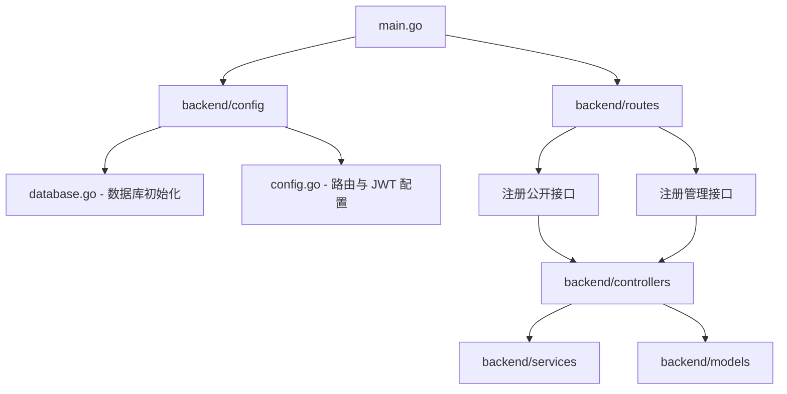
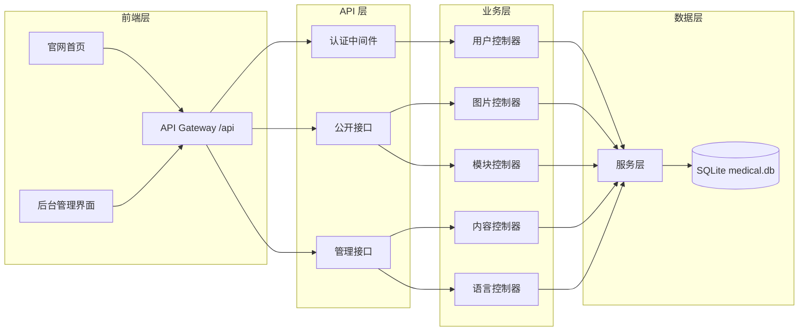

# 项目概述

**本文档引用的文件**
- [README.md](../../../README.md)
- [main.go](../../../main.go)
- [backend/config/config.go](../../../backend/config/config.go)
- [backend/config/database.go](../../../backend/config/database.go)
- [backend/models/models.go](../../../backend/models/models.go)
- [backend/routes/routes.go](../../../backend/routes/routes.go)
- [backend/controllers/user_controller.go](../../../backend/controllers/user_controller.go)

## 目录
1. [简介](#简介)
2. [项目结构](#项目结构)
3. [核心组件](#核心组件)
4. [架构概述](#架构概述)
5. [详细组件分析](#详细组件分析)
6. [依赖分析](#依赖分析)
7. [性能考虑](#性能考虑)
8. [故障排除指南](#故障排除指南)
9. [结论](#结论)

## 简介

- **项目名称**：医疗设备官网 CMS 系统
- **项目定位**：一个功能完整的医疗设备官网内容管理系统，支持动态内容管理、图片管理和多语言配置。
- **核心特性**：
  1. **用户认证** — JWT Token 认证，支持登录/登出，基于角色的访问控制 — 来源：[README.md](../../../README.md)
  2. **图片管理** — 支持图片上传、分类、删除，按分类管理 — 来源：[README.md](../../../README.md)
  3. **页面配置** — 动态管理 Banner、关于我们、产品展示等内容，无需修改代码即可更新网站内容 — 来源：[README.md](../../../README.md)
  4. **多语言支持** — 中英文双语配置，支持语言文本版本管理 — 来源：[backend/models/models.go](../../../backend/models/models.go)
  5. **SQLite 内嵌数据库** — 无需额外配置数据库，开箱即用 — 来源：[README.md](../../../README.md)
- **技术栈**：
  - 后端：Go + Gin — 来源：[main.go](../../../main.go)
  - 数据库：SQLite (GORM) — 来源：[backend/config/database.go](../../../backend/config/database.go)
  - 认证：JWT (golang-jwt/jwt/v5) — 来源：[backend/models/models.go](../../../backend/models/models.go)
  - 密码加密：bcrypt — 来源：[backend/config/database.go](../../../backend/config/database.go)
  - 前端：原生 HTML/CSS/JS — 来源：[README.md](../../../README.md)

## 项目结构



### 目录结构
```
lihui/
├── main.go                    # Go 后端主程序
├── go.mod                     # Go 模块依赖
├── inde.html                  # 官网首页
├── admin/                     # CMS 后台管理界面
├── uploads/                   # 上传的图片存储目录
├── medical.db                 # SQLite 数据库文件（自动生成）
├── backend/                   # 后端源码
│   ├── common/                # 公共响应工具
│   ├── config/                # 配置与数据库初始化
│   ├── controllers/           # API 控制器
│   ├── middleware/            # 中间件（认证、错误处理、CORS）
│   ├── models/                # 数据模型定义
│   ├── routes/                # 路由注册
│   └── services/              # 业务逻辑层
├── frontend/                  # 前端静态资源
└── README.md
```

### 本节来源
- [README.md](../../../README.md)
- [main.go](../../../main.go)

## 核心组件

| 组件 | 职责 | 来源文件 |
|------|------|----------|
| **用户认证模块** | 负责用户登录、JWT Token 生成与验证、角色权限校验 | [user_controller.go](../../../backend/controllers/user_controller.go)，[auth.go](../../../backend/middleware/auth.go) |
| **图片管理模块** | 负责图片上传、分类管理、删除、更新操作 | [image_controller.go](../../../backend/controllers/image_controller.go)，[image_service.go](../../../backend/services/image_service.go) |
| **页面配置模块** | 负责 Banner、关于我们、产品展示等页面动态配置 | [module_controller.go](../../../backend/controllers/module_controller.go)，[module_service.go](../../../backend/services/module_service.go) |
| **内容管理模块** | 负责网站内容项（如优势、统计数据等）的 CRUD 操作 | [content_controller.go](../../../backend/controllers/content_controller.go)，[content_service.go](../../../backend/services/content_service.go) |
| **多语言模块** | 负责中英文语言文本管理与版本控制 | [language_controller.go](../../../backend/controllers/language_controller.go)，[language_service.go](../../../backend/services/language_service.go) |

### 本节来源
- 控制器文件：[backend/controllers/](../../../backend/controllers/)
- 服务文件：[backend/services/](../../../backend/services/)
- 模型文件：[backend/models/](../../../backend/models/)

## 架构概述



### 系统分层说明
1. **前端层**：官网首页 (`inde.html`) 与后台管理界面 (`admin/`)，通过静态文件服务提供。
2. **API 层**：基于 Gin 框架的路由分组，分为公开接口 (`/api/public/*`) 和管理接口 (`/api/admin/*`)，管理接口需通过 JWT 认证中间件。
3. **业务层**：Controllers 负责请求处理与参数校验，Services 负责核心业务逻辑。
4. **数据层**：SQLite 数据库存储用户、图片、配置、内容项、语言文本等数据，使用 GORM 进行 ORM 映射。

### 本节来源
- [backend/routes/routes.go](../../../backend/routes/routes.go)
- [backend/middleware/auth.go](../../../backend/middleware/auth.go)

## 详细组件分析

### 用户管理模块
- **职责**：用户认证、JWT Token 生成、角色权限校验。
- **核心方法**：`Login(username, password)` — 验证用户凭据并返回 JWT Token。
- **领域模型**：
  - `User`：包含 ID、Username、Password（bcrypt 加密）、Role 字段 — 来源：[backend/models/models.go](../../../backend/models/models.go)(L16-L21)
- **认证流程**：
  1. 用户提交用户名和密码至 `/api/login`
  2. UserService 验证凭据（使用 bcrypt 比对密码哈希）
  3. 生成 JWT Token（包含 user_id 和 role 声明）
  4. 返回 Token 与用户信息

### 图片管理模块
- **职责**：图片上传、分类管理、元数据维护。
- **领域模型**：`Image` — 包含 Filename、FilePath、FileSize、Description、LongDescription、Category、SortOrder 等字段 — 来源：[backend/models/models.go](../../../backend/models/models.go)(L23-L35)
- **API 接口**：
  - `GET /api/admin/images` — 获取所有图片
  - `POST /api/admin/images` — 上传图片
  - `PUT /api/admin/images/:id` — 更新图片信息
  - `DELETE /api/admin/images/:id` — 删除图片

### 页面配置模块
- **职责**：管理网站各模块的动态配置（Banner、About、Products 等）。
- **领域模型**：
  - `PageConfig`：PageName + ConfigData（JSON 格式） — 来源：[backend/models/models.go](../../../backend/models/models.go)(L37-L41)
  - `ModuleConfig`：支持多语言标题、内容、开关控制 — 来源：[backend/models/models.go](../../../backend/models/models.go)(L43-L62)
- **默认配置**：系统启动时自动初始化 Banner、About、Products 的默认配置 — 来源：[backend/config/database.go](../../../backend/config/database.go)(L50-L67)

### 多语言模块
- **职责**：支持中英文双语内容管理，提供版本控制功能。
- **领域模型**：
  - `LanguageText`：Key、Module、EnText、ZhText、Version — 来源：[backend/models/models.go](../../../backend/models/models.go)(L78-L86)
  - `LanguageTextVersion`：历史版本记录，支持回滚 — 来源：[backend/models/models.go](../../../backend/models/models.go)(L88-L98)
- **版本管理**：每次更新语言文本时创建新版本记录，支持通过 `RestoreLanguageTextVersion` 接口回滚至历史版本。

### 本节来源
- 领域模型文件：[backend/models/models.go](../../../backend/models/models.go)
- 服务实现类：[backend/services/](../../../backend/services/)

## 依赖分析

| 依赖类型 | 具体组件 | 配置线索 |
|----------|----------|----------|
| **数据库** | SQLite (GORM) | 数据库文件：`medical.db`，使用 `gorm.io/driver/sqlite` — 来源：[backend/config/database.go](../../../backend/config/database.go)(L14) |
| **Web 框架** | Gin | `github.com/gin-gonic/gin`，端口 8080 — 来源：[backend/config/config.go](../../../backend/config/config.go)(L13-L16) |
| **认证** | JWT | `github.com/golang-jwt/jwt/v5`，密钥配置在 config.go — 来源：[backend/config/config.go](../../../backend/config/config.go)(L9) |
| **密码加密** | bcrypt | `golang.org/x/crypto/bcrypt`，用于用户密码哈希 — 来源：[backend/config/database.go](../../../backend/config/database.go)(L41) |
| **ORM** | GORM | `gorm.io/gorm`，负责数据模型映射与迁移 — 来源：[backend/config/database.go](../../../backend/config/database.go)(L19-L27) |
| **静态资源** | 本地文件系统 | `/uploads`、`/frontend`、`/admin` 目录 — 来源：[backend/routes/routes.go](../../../backend/routes/routes.go)(L14-L18) |

### 本节来源
- [backend/config/database.go](../../../backend/config/database.go)
- [backend/config/config.go](../../../backend/config/config.go)

## 性能考虑

- **SQLite 内嵌数据库**：无需额外数据库服务部署，适合中小型网站；数据库文件 `medical.db` 自动生成。
- **静态文件服务**：图片、前端资源直接通过 Gin 的 `Static` 中间件提供，减少应用层处理开销。
- **JWT 无状态认证**：Token 验证无需查询数据库，提升认证效率。
- **GORM 自动迁移**：启动时自动执行 `AutoMigrate` 确保表结构一致 — 来源：[backend/config/database.go](../../../backend/config/database.go)(L19-L27)

> 注：对于高并发场景，建议评估 SQLite 的并发写入限制，必要时可迁移至 MySQL/PostgreSQL。

### 本节来源
- [backend/config/database.go](../../../backend/config/database.go)
- [README.md](../../../README.md)

## 故障排除指南

### 常见问题排查

| 问题 | 排查步骤 | 来源 |
|------|----------|------|
| **服务无法启动** | 1. 检查端口 8080 是否被占用<br>2. 确认 `go.mod` 依赖已下载 (`go mod download`)<br>3. 检查 `medical.db` 文件权限 | [README.md](../../../README.md) |
| **登录失败** | 1. 确认默认账号：`admin` / `admin123`<br>2. 检查 JWT 密钥配置<br>3. 查看控制台错误日志 | [backend/config/database.go](../../../backend/config/database.go)(L37-L48) |
| **图片上传失败** | 1. 确认 `uploads/` 目录存在且有写权限<br>2. 检查请求 Content-Type 是否为 `multipart/form-data`<br>3. 查看文件大小限制 | [backend/routes/routes.go](../../../backend/routes/routes.go)(L14) |
| **页面配置不生效** | 1. 刷新官网首页缓存<br>2. 检查 `/api/public/config` 接口返回<br>3. 确认 PageConfig 表中有对应记录 | [backend/config/database.go](../../../backend/config/database.go)(L50-L67) |

### 日志与调试
- 启动日志：`Server starting on :8080` — 来源：[main.go](../../../main.go)(L18)
- 错误处理：使用 `middleware.ErrorHandler()` 统一处理异常 — 来源：[backend/routes/routes.go](../../../backend/routes/routes.go)(L12)

### 本节来源
- [README.md](../../../README.md)
- [backend/config/database.go](../../../backend/config/database.go)
- [main.go](../../../main.go)

## 结论

- **架构特点**：采用经典的分层架构（Controller-Service-Model），基于 Gin 框架构建 RESTful API，使用 SQLite 作为内嵌数据库，适合快速部署的中小型官网场景。
- **技术选型**：Go 语言提供高性能后端服务，GORM 简化数据库操作，JWT 实现无状态认证，bcrypt 保障密码安全。
- **业务价值**：通过可视化的后台管理界面，非技术人员可独立维护网站内容（图片、文案、配置），降低运维成本。
- **扩展方向**：当前系统已支持多语言版本管理，可进一步扩展为多租户 SaaS 模式或对接 CDN 提升静态资源加载速度。

> 以上结论基于当前工程源码分析得出，具体扩展需结合实际业务需求评估。