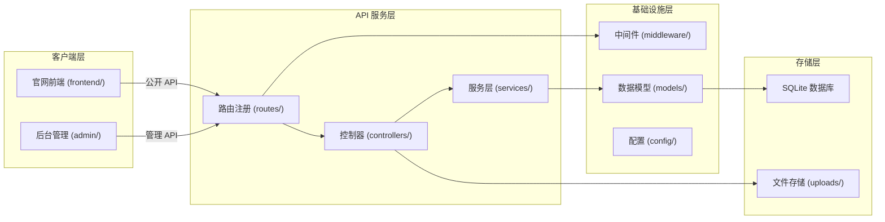

# 架构总览

## 系统概览

本项目是一个**医疗设备官网内容管理系统**，基于 Go + Gin + SQLite 构建，提供完整的官网内容管理和展示能力。

系统采用前后端分离架构：
- **后端**：Go + Gin 提供 RESTful API 服务，使用 SQLite 作为嵌入式数据库
- **前端官网**：原生 HTML/CSS/JS 构建的响应式展示页面
- **后台管理**：独立的管理界面，支持图片管理、页面配置、多语言内容管理

核心功能包括用户认证、图片管理、页面配置、多语言支持和内容版本管理。系统启动后默认运行在 `http://localhost:8080`。

项目入口和启动方式见 [main.go](../../main.go)，详细说明参考 [README.md](../../README.md)。

## 顶层架构图


## 顶层模块

### 后端模块 (backend/)

后端采用典型的分层架构，包含以下子模块：

| 目录 | 职责 |
|------|------|
| `config/` | 数据库初始化、路由器配置、全局变量定义 |
| `routes/` | API 路由注册，区分公开接口和管理接口 |
| `controllers/` | 请求处理，包含用户、图片、模块、内容、语言等控制器 |
| `services/` | 业务逻辑封装，提供图片、语言、模块、内容、用户等服务 |
| `models/` | GORM 数据模型定义，包含 7 个核心实体 |
| `middleware/` | 中间件实现，包括 JWT 认证和 CORS 支持 |
| `common/` | 公共工具函数，如统一响应格式 |

入口文件 [main.go](../../main.go) 负责初始化数据库、设置路由器并注册路由。

### 前端模块 (frontend/)

前台官网模块，提供响应式页面展示：

| 目录 | 职责 |
|------|------|
| `js/` | 前端 JavaScript 逻辑，包含组件、服务、工具函数 |
| `css/` | 样式文件，按页面模块划分（header、banner、products 等） |
| `components/` | 可复用的前端组件 |

前端通过调用 `/api/public/*` 接口获取动态内容，实现官网内容的实时更新。

### 后台管理模块 (admin/)

独立的管理后台，提供：
- 图片上传与管理（支持分类、批量上传）
- 页面配置管理（Banner、About、Products 等模块）
- 多语言内容管理（支持版本历史和回滚）
- 内容项管理

### 存储层

| 资源 | 说明 |
|------|------|
| `medical.db` | SQLite 数据库文件，存储所有业务数据 |
| `uploads/` | 图片文件存储目录，通过静态路由 `/uploads` 对外提供访问 |

## 关键边界

### API 边界

系统 API 分为两个明确的边界：

1. **公开接口** (`/api/public/*`)：无需认证，供前台官网调用
   - `/api/public/config` - 页面配置
   - `/api/public/images` - 公开图片
   - `/api/public/modules` - 模块配置
   - `/api/public/content` - 内容项
   - `/api/public/lang` - 多语言文本

2. **管理接口** (`/api/admin/*`)：需要 JWT 认证，供后台管理调用
   - 图片管理（增删改查）
   - 页面配置管理
   - 模块配置管理
   - 内容项管理
   - 多语言文本管理（含版本控制）

认证中间件 [auth.go](../../backend/middleware/auth.go) 负责拦截管理接口请求，验证 JWT Token 有效性。

### 数据模型边界

系统定义 7 个核心数据模型（见 [models.go](../../backend/models/models.go)）：

| 模型 | 职责 |
|------|------|
| `User` | 用户账户，支持角色管理 |
| `Image` | 图片资源，支持分类和排序 |
| `PageConfig` | 页面级配置（JSON 存储） |
| `ModuleConfig` | 模块级配置，支持多语言和版本 |
| `ContentItem` | 内容项，支持分区块管理 |
| `LanguageText` | 多语言文本，支持版本控制 |
| `LanguageTextVersion` | 语言文本的历史版本记录 |

### 路由边界

路由注册在 [routes.go](../../backend/routes/routes.go) 中完成，主要边界：
- 静态资源：`/uploads`、`/frontend`、`/admin`
- 首页：`/` 指向 `inde.html`
- API 分组：`/api` 下分为 `/public` 和 `/admin` 两个子分组

## 主要链路

### 请求处理链路

```
客户端请求 → Gin 引擎 → 中间件 (CORS/认证) → 路由匹配 → 控制器 → 服务层 → 数据模型 → SQLite
```

1. 请求进入 Gin 引擎（[config.go](../../backend/config/config.go) 中 `SetupRouter`）
2. 经过 CORS 中间件处理跨域
3. 管理接口请求经过 JWT 认证中间件验证
4. 路由匹配到对应控制器方法
5. 控制器调用服务层处理业务逻辑
6. 服务层操作数据模型完成持久化

### 数据初始化链路

启动时执行 [database.go](../../backend/config/database.go) 中的 `InitDB`：
1. 打开 SQLite 数据库连接
2. 自动迁移 7 个数据表
3. 初始化默认管理员账户（admin/admin123）
4. 初始化默认页面配置（banner、about、products）

### 多语言版本管理链路

多语言文本支持版本控制：
1. 创建/更新 `LanguageText` 时自动创建版本记录
2. 通过 `LanguageTextVersion` 表存储历史版本
3. 支持查询历史版本和回滚到指定版本

## 建议阅读顺序

对于希望深入了解系统的开发者，建议按以下顺序阅读：

1. **[快速开始.md](./wiki/快速开始.md)** - 了解如何启动和运行项目
2. **[技术栈与依赖.md](./wiki/技术栈与依赖.md)** - 了解技术选型和依赖关系
3. **[数据模型.md](./wiki/数据模型/数据模型.md)** - 了解核心数据结构
4. **[业务逻辑层.md](./wiki/业务逻辑层/业务逻辑层.md)** - 了解服务层实现
5. **[API 参考.md](./wiki/API参考/API参考.md)** - 了解接口定义
6. **[部署与运维.md](./wiki/部署与运维.md)** - 了解部署和监控

---

## 本文档引用的文件

| 文件 | 说明 |
|------|------|
| [README.md](../../README.md) | 项目说明和快速开始指南 |
| [main.go](../../main.go) | 应用启动入口 |
| [backend/routes/routes.go](../../backend/routes/routes.go) | 路由注册和 API 定义 |
| [backend/models/models.go](../../backend/models/models.go) | 数据模型定义 |
| [backend/config/database.go](../../backend/config/database.go) | 数据库初始化和配置 |
| [backend/middleware/auth.go](../../backend/middleware/auth.go) | JWT 认证中间件实现 |