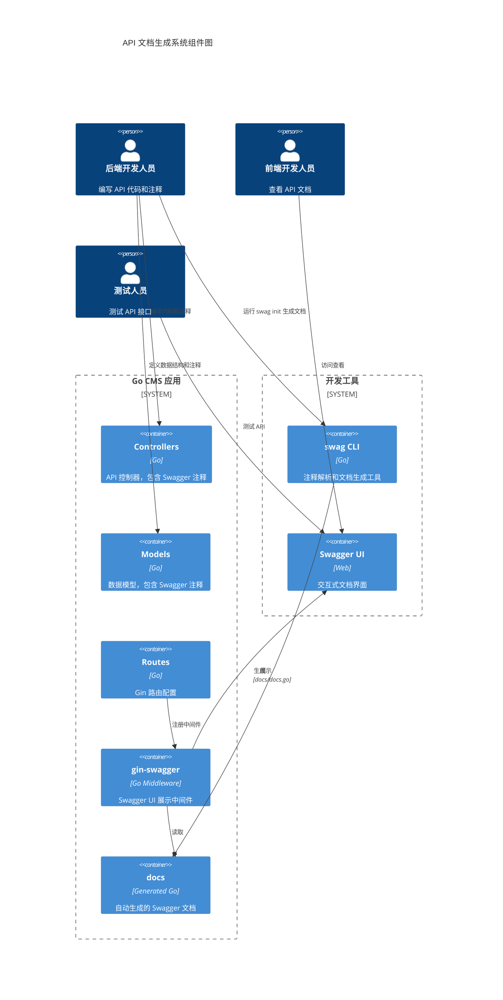
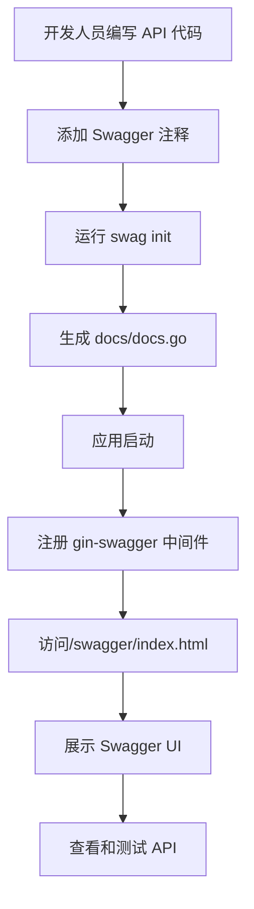
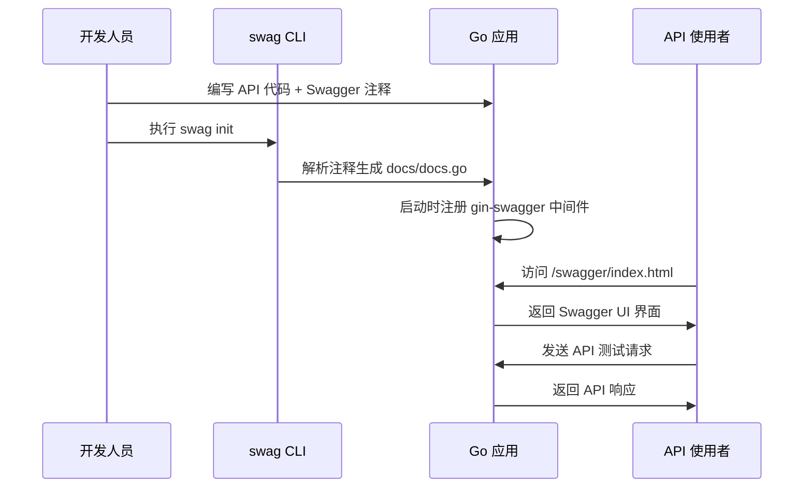
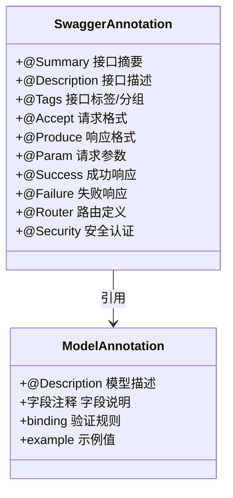

# Go API 接口文档生成技术设计文档

## 1. 概述

### 系统/功能总结

本设计文档描述如何在现有 Go + Gin 项目中集成 **swaggo/swag** 和 **gin-swagger**，实现类似 Java Swagger + Knife4j 的自动化 API 文档生成功能。

### 目的与价值

- **自动化文档**：通过代码注释自动生成 OpenAPI/Swagger 规范文档
- **交互式界面**：提供 Swagger UI 界面，支持 API 在线测试
- **最小改造**：利用现有 Gin 框架，仅需添加注释和少量配置

### 目标用户与使用场景

| 用户角色 | 使用场景 |
|----------|----------|
| 后端开发 | 编写 API 时添加注释，自动生成文档 |
| 前端开发 | 访问 `/swagger/index.html` 查看接口定义 |
| 测试人员 | 通过 Swagger UI 直接发送请求测试 API |

### 关键技术与架构方法

- **文档生成**：swaggo/swag（命令行工具解析注释生成 docs）
- **UI 展示**：gin-swagger（Gin 中间件展示 Swagger UI）
- **规范标准**：OpenAPI 2.0 (Swagger 2.0)

---

## 2. 技术架构

### 2.1 C4 组件图



### 2.2 关键技术选型

| 组件 | 技术选型 | 版本 | 说明 |
|------|----------|------|------|
| Web 框架 | gin-gonic/gin | v1.12.0 | 已有 |
| 文档生成 | swaggo/swag | v1.16+ | 解析注释生成 Swagger |
| UI 中间件 | swaggo/gin-swagger | v1.6+ | Gin 集成 Swagger UI |
| UI 资源 | swaggo/files | 最新 | Swagger UI 静态文件 |

### 2.3 架构流程图



---

## 3. 业务实现

### 3.1 模块/服务职责

| 模块 | 职责 |
|------|------|
| `backend/controllers` | API 控制器，添加 Swagger 路由注释 |
| `backend/models` | 数据模型，添加 Swagger 模型注释 |
| `backend/routes` | 注册 Swagger UI 中间件 |
| `docs/` | 自动生成的 Swagger 文档目录 |

### 3.2 REST API 端点（文档相关）

| 方法 | 路径 | 说明 |
|------|------|------|
| GET | `/swagger/index.html` | Swagger UI 主界面 |
| GET | `/swagger/doc.json` | Swagger JSON 文档 |
| GET | `/swagger/doc.yaml` | Swagger YAML 文档 |

### 3.3 数据流转时序图



### 3.4 核心业务方法示例

#### 3.4.1 Controller 注释示例

```go
// @Summary      用户登录
// @Description  用户通过用户名和密码登录，返回 JWT Token
// @Tags         用户管理
// @Accept       json
// @Produce      json
// @Param        request  body      LoginRequest  true  "登录请求"
// @Success      200      {object}  common.Response{data=LoginResponse}
// @Failure      400      {object}  common.Response
// @Failure      401      {object}  common.Response
// @Router       /api/login [post]
func (c *UserController) Login(ctx *gin.Context) {
    // ... 实现代码
}
```

#### 3.4.2 Model 注释示例

```go
// LoginRequest 登录请求结构
// @Description 用户登录请求参数
type LoginRequest struct {
    // 用户名
    Username string `json:"username" binding:"required" example:"admin"`
    // 密码
    Password string `json:"password" binding:"required" example:"123456"`
}

// LoginResponse 登录响应结构
// @Description 用户登录成功后的响应数据
type LoginResponse struct {
    // JWT Token
    Token string `json:"token"`
    // 用户信息
    User UserInfo `json:"user"`
}
```

### 3.5 与外部服务的通信样例

无需与外部服务通信，文档生成在本地完成。

---

## 4. 数据设计

### 4.1 Swagger 注释规范



### 4.2 核心数据结构

#### 4.2.1 统一响应结构（已有，需添加注释）

```go
// Response 统一 API 响应结构
// @Description 所有 API 响应的统一包装格式
type Response struct {
    // 状态码，0 表示成功
    Code int `json:"code"`
    // 消息提示
    Message string `json:"message"`
    // 响应数据
    Data interface{} `json:"data,omitempty"`
}
```

#### 4.2.2 分页请求结构

```go
// PageRequest 分页请求参数
// @Description 分页查询通用参数
type PageRequest struct {
    // 页码，从 1 开始
    Page int `json:"page" example:"1"`
    // 每页数量
    PageSize int `json:"page_size" example:"10"`
}
```

### 4.3 数据实体关系

现有模型文件 `backend/models/models.go` 中的结构体需要添加 Swagger 注释。

---

## 5. 错误处理

### 5.1 错误分类与响应格式

| HTTP 状态码 | 说明 | 响应示例 |
|-------------|------|----------|
| 200 | 成功 | `{"code": 0, "message": "success", "data": {...}}` |
| 400 | 请求参数错误 | `{"code": 400, "message": "参数验证失败", "data": null}` |
| 401 | 未授权 | `{"code": 401, "message": "未登录或 Token 过期", "data": null}` |
| 403 | 禁止访问 | `{"code": 403, "message": "权限不足", "data": null}` |
| 404 | 资源不存在 | `{"code": 404, "message": "资源不存在", "data": null}` |
| 500 | 服务器错误 | `{"code": 500, "message": "服务器内部错误", "data": null}` |

### 5.2 错误处理策略

```go
// @Summary      错误响应示例
// @Description  展示错误响应的标准格式
// @Tags         系统
// @Produce      json
// @Success      200  {object}  Response
// @Failure      400  {object}  Response  "请求参数错误"
// @Failure      401  {object}  Response  "未授权访问"
// @Failure      500  {object}  Response  "服务器内部错误"
// @Router       /api/error-example [get]
```

---

## 6. 测试策略

### 6.1 单元测试

- 测试 Swagger 注释的正确性
- 验证生成的 docs.go 文件是否有效

### 6.2 集成测试

- 访问 `/swagger/index.html` 验证 UI 正常展示
- 访问 `/swagger/doc.json` 验证 JSON 文档有效
- 通过 Swagger UI 测试各 API 端点

### 6.3 文档完整性检查

```bash
# 生成文档后验证
swag init --parseDependency --parseInternal
swag fmt  # 格式化注释
```

---

## 7. 安全考虑

### 7.1 认证与授权

- **开发环境**：Swagger UI 开放访问
- **生产环境**：通过配置禁用 Swagger 中间件

### 7.2 环境隔离配置

```go
// 仅在开发环境启用 Swagger
if config.Env == "development" {
    r.GET("/swagger/*any", ginSwagger.WrapHandler(swaggerFiles.Handler))
}
```

### 7.3 敏感信息保护

- 注释中不包含数据库密码、密钥等敏感信息
- 生产环境构建时排除 docs 目录

---

## 8. 实施步骤概览

### 8.1 依赖安装

```bash
# 安装 swag CLI 工具
go install github.com/swaggo/swag/cmd/swag@latest

# 添加 Go 依赖
go get -u github.com/swaggo/swag
go get -u github.com/swaggo/gin-swagger
go get -u github.com/swaggo/files
```

### 8.2 代码改造

1. 在 `main.go` 中添加 Swagger 初始化注释
2. 在 `backend/routes/routes.go` 中注册 Swagger 中间件
3. 为所有 Controller 方法添加 Swagger 注释
4. 为所有 Model 结构体添加 Swagger 注释

### 8.3 文档生成

```bash
# 生成文档
swag init -g main.go -o ./docs

# 格式化注释（可选）
swag fmt
```

### 8.4 访问文档

启动服务后访问：`http://localhost:8080/swagger/index.html`

---

## 9. 文件结构

```
project/
├── main.go                 # 入口文件，添加 Swagger 初始化注释
├── docs/                   # 自动生成的文档目录
│   ├── docs.go
│   ├── swagger.json
│   └── swagger.yaml
├── backend/
│   ├── controllers/        # 添加 API 注释
│   ├── models/             # 添加模型注释
│   └── routes/             # 注册 Swagger 中间件
└── go.mod