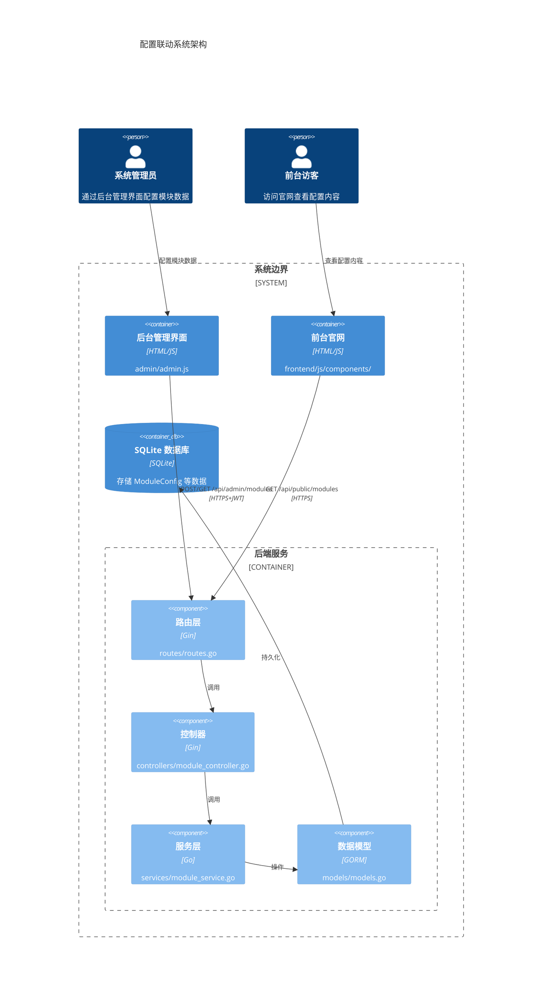
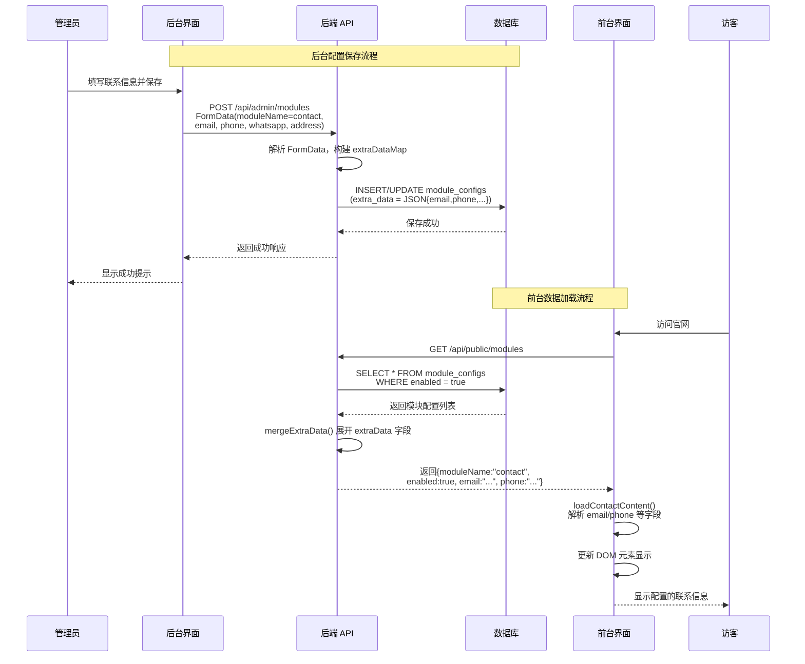
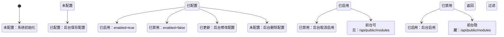
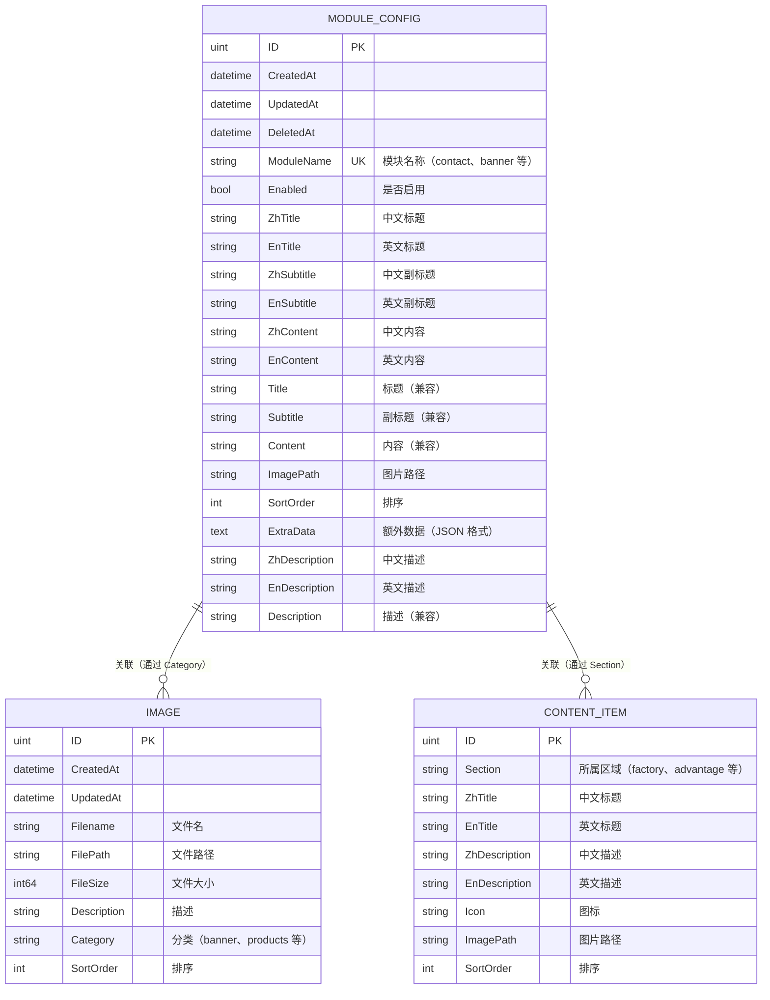

# 前台后台配置联动检查 - 技术设计文档

## 1. 概述

### 系统/功能总结

本设计文档针对前台后台配置联动问题提供技术解决方案，确保后台（admin）配置的模块数据能够正确同步到前台（frontend）展示。重点解决 Contact 模块及其他核心模块的配置同步问题。

### 目的与价值

1. 建立完整的配置联动检查机制
2. 修复后台配置数据无法在前台正确显示的问题
3. 提供标准化的数据流转方案

### 目标用户与使用场景

| 用户 | 场景 |
|------|------|
| 系统管理员 | 在后台配置联系方式、Banner 内容等 |
| 前台访客 | 访问官网查看最新配置信息 |
| 开发人员 | 排查配置联动问题，验证数据流 |

### 关键技术与架构方法

- **后端**：Go + Gin + GORM，提供 RESTful API
- **前端**：原生 JavaScript ES6 模块
- **数据格式**：JSON，支持 extraData 动态字段扩展

---

## 2. 技术架构

### C4 组件图



### 关键技术选型

| 层级 | 技术栈 | 说明 |
|------|--------|------|
| 前端官网 | 原生 HTML/CSS/JS (ES6 模块) | 响应式页面，通过 fetch API 获取数据 |
| 后台管理 | 原生 HTML/CSS/JS | 独立管理界面，JWT 认证 |
| 后端框架 | Go + Gin | RESTful API 服务 |
| ORM | GORM | SQLite 数据库操作 |
| 数据库 | SQLite | 嵌入式数据库，存储配置数据 |

---

## 3. 业务实现

### 模块职责

#### 3.1 后台管理模块 (admin/admin.js)

```javascript
// 加载 Contact 配置
function loadContactConfig(contact) {
  document.getElementById('contactEnabled').checked = contact.enabled !== false;
  document.getElementById('contactEmail').value = contact.email || '';
  document.getElementById('contactPhone').value = contact.phone || '';
  document.getElementById('contactWhatsApp').value = contact.whatsapp || '';
  document.getElementById('contactAddress').value = contact.address || '';
}

// 保存 Contact 配置
async function saveContactConfig() {
  const formData = new FormData();
  formData.append('moduleName', 'contact');
  formData.append('enabled', document.getElementById('contactEnabled').checked);
  formData.append('email', document.getElementById('contactEmail').value);
  formData.append('phone', document.getElementById('contactPhone').value);
  formData.append('whatsapp', document.getElementById('contactWhatsApp').value);
  formData.append('address', document.getElementById('contactAddress').value);
  await saveModuleConfig('contact', formData);
}
```

#### 3.2 后端服务层 (backend/services/module_service.go)

```go
// mergeExtraData 将 ExtraData JSON 中的字段合并到模块配置中
func mergeExtraData(mc *models.ModuleConfig) map[string]interface{} {
    result := make(map[string]interface{})
    // 复制基础字段
    result["id"] = mc.ID
    result["moduleName"] = mc.ModuleName
    result["enabled"] = mc.Enabled
    result["zhTitle"] = mc.ZhTitle
    result["enTitle"] = mc.EnTitle
    // ... 其他字段
    
    // 解析并合并 ExtraData 中的字段（关键：展开到顶层）
    if mc.ExtraData != "" {
        var extra map[string]interface{}
        if err := json.Unmarshal([]byte(mc.ExtraData), &extra); err == nil {
            for k, v := range extra {
                result[k] = v  // 将 email、phone 等字段展开
            }
        }
    }
    return result
}
```

#### 3.3 前台组件 (frontend/js/components/Contact.js)

```javascript
export function loadContactContent() {
    const { modules } = getCMSData();
    const contactModule = modules['contact'];
    
    if (contactModule && contactModule.enabled !== false) {
        let contactData = {};
        
        // 后端 mergeExtraData 已经解析出来的字段（优先）
        if (contactModule.email) contactData.email = contactModule.email;
        if (contactModule.phone) contactData.phone = contactModule.phone;
        if (contactModule.whatsapp) contactData.whatsapp = contactModule.whatsapp;
        if (contactModule.address) contactData.address = contactModule.address;
        
        // 备用：从 extraData JSON 字符串中解析
        if (contactModule.extraData) {
            try {
                const extraData = JSON.parse(contactModule.extraData);
                if (extraData.email && !contactData.email) contactData.email = extraData.email;
                // ...
            } catch (e) { /* 忽略 */ }
        }
        
        // 更新 DOM 元素
        const emailEl = document.getElementById('contactEmail');
        if (emailEl && contactData.email) {
            emailEl.innerHTML = '<strong>Email:</strong><br>' + contactData.email;
        }
        // ... 其他字段
    }
}
```

### 数据流转时序图



### 模块配置状态图



### 核心业务方法签名

```typescript
// 后端服务层接口
interface ModuleService {
    GetModuleConfigs(moduleName: string): Promise<ModuleConfig[]>;
    GetModuleConfig(name: string): Promise<ModuleConfig>;
    SaveModuleConfig(moduleName: string, updates: map[string]interface{}): Promise<ModuleConfig>;
    DeleteModuleConfig(name: string): Promise<void>;
    GetPublicModuleConfigs(): Promise<ModuleConfig[]>;  // 仅返回 enabled=true 的模块
}

// 前端组件接口
interface ContactComponent {
    loadContactContent(): void;  // 加载并显示联系信息
    initContactForm(): void;     // 初始化表单提交处理
}

// CMS 数据服务
interface CMSService {
    loadCMSData(): Promise<void>;  // 加载所有 CMS 数据
    getCMSData(): CMSData;         // 获取已加载的数据
}
```

---

## 4. 数据设计

### 实体关系图



### 核心数据实体关系

| 实体 | 关系 | 说明 |
|------|------|------|
| ModuleConfig | 主配置表 | 存储各模块的配置数据，extraData 字段存储动态字段 |
| Image | 图片资源 | 通过 Category 字段与 ModuleConfig 关联 |
| ContentItem | 内容项 | 通过 Section 字段与 ModuleConfig 关联 |

### Contact 模块 extraData 结构

```json
{
  "email": "info@company.com",
  "phone": "+86 123 4567 8900",
  "whatsapp": "+1 234 567 8900",
  "address": "No. 123, Industrial Park, City, Country"
}
```

---

## 5. 错误处理

### 错误分类与响应格式

| 错误类型 | HTTP 状态码 | 响应格式 |
|----------|------------|----------|
| 请求参数错误 | 400 | `{"code": 400, "message": "Invalid request parameters"}` |
| 未授权 | 401 | `{"code": 401, "message": "Unauthorized"}` |
| 资源不存在 | 404 | `{"code": 404, "message": "Module config not found"}` |
| 服务器错误 | 500 | `{"code": 500, "message": "Internal server error"}` |

### 错误处理策略

```go
// 后端错误处理
func (c *ModuleController) SaveModuleConfig(ctx *gin.Context) {
    moduleName := ctx.PostForm("moduleName")
    if moduleName == "" {
        common.JSONBadRequest(ctx, "moduleName is required")
        return
    }
    
    config, err := c.moduleService.SaveModuleConfig(moduleName, updates)
    if err != nil {
        common.JSONInternalServerError(ctx, err.Error())
        return
    }
    common.JSONSuccess(ctx, config)
}

// 前端错误处理
export async function loadCMSData() {
    try {
        const [configRes, modulesRes, ...] = await Promise.all([...]);
        // 处理成功响应
    } catch(e) {
        console.log('CMS data loading failed, using defaults');
        // 使用默认值
        cmsData.siteSettings = { /* 默认配置 */ };
    }
}
```

---

## 6. 测试策略

### 测试类型

| 测试类型 | 覆盖范围 | 工具 |
|----------|----------|------|
| 单元测试 | 服务层方法、数据模型 | Go testing、testify |
| 集成测试 | API 端点、数据库操作 | Go + Gin 测试框架 |
| 端到端测试 | 前台后台完整流程 | 浏览器自动化 |

### 关键测试用例

```go
// 测试 extraData 合并
func TestMergeExtraData(t *testing.T) {
    mc := &models.ModuleConfig{
        ModuleName: "contact",
        Enabled:    true,
        ExtraData:  `{"email":"test@example.com","phone":"123456"}`,
    }
    
    result := mergeExtraData(mc)
    
    assert.Equal(t, "contact", result["moduleName"])
    assert.Equal(t, "test@example.com", result["email"])
    assert.Equal(t, "123456", result["phone"])
}

// 测试公开接口过滤
func TestGetPublicModuleConfigs(t *testing.T) {
    // 创建启用和禁用的模块
    db.Create(&models.ModuleConfig{ModuleName: "contact", Enabled: true})
    db.Create(&models.ModuleConfig{ModuleName: "banner", Enabled: false})
    
    result, _ := service.GetPublicModuleConfigs()
    
    assert.Len(t, result, 1)  // 只返回 enabled=true 的模块
    assert.Equal(t, "contact", result[0]["moduleName"])
}
```

---

## 7. 安全考虑

### 认证与授权

| 接口类型 | 认证要求 | 实现方式 |
|----------|----------|----------|
| `/api/admin/*` | JWT Token 认证 | middleware.AuthMiddleware() |
| `/api/public/*` | 无需认证 | 公开访问 |

### 输入验证与清理

```go
// 表单数据验证
if moduleName == "" {
    common.JSONBadRequest(ctx, "moduleName is required")
    return
}

// extraData JSON 验证
if extraData := ctx.PostForm("extraData"); extraData != "" {
    if err := json.Unmarshal([]byte(extraData), &extraDataMap); err != nil {
        extraDataMap = make(map[string]interface{})  // 解析失败则使用空对象
    }
}
```

### 数据保护

- 数据库路径：`./medical.db`，需确保文件权限
- 上传文件：存储在 `./uploads/`，通过静态路由提供访问
- 敏感配置：不存储在数据库中（如 API 密钥、数据库密码）

---

## 8. 配置联动问题根因分析

### 问题 1：enabled 字段未传递

**根因**：`saveContactConfig()` 函数中未设置 `enabled` 字段

**修复方案**：
```javascript
// 修复后的 saveContactConfig
async function saveContactConfig() {
  const formData = new FormData();
  formData.append('moduleName', 'contact');
  formData.append('enabled', document.getElementById('contactEnabled').checked);  // 确保传递
  formData.append('email', document.getElementById('contactEmail').value);
  // ...
}
```

### 问题 2：extraData 双重序列化风险

**根因**：后台可能同时设置独立字段和 extraData JSON

**修复方案**：后端统一处理，优先使用独立字段构建 extraDataMap

### 问题 3：前台 enabled 检查逻辑

**根因**：`contactModule.enabled !== false` 可能因 enabled 为 undefined 而失败

**修复方案**：
```javascript
// 更健壮的检查
if (contactModule && (contactModule.enabled === true || contactModule.enabled === undefined)) {
    // 加载内容
}
```

---

## 9. 附录

### 接口完整列表

| 接口 | 方法 | 认证 | 说明 |
|------|------|------|------|
| `/api/admin/modules` | GET | 是 | 获取所有模块配置 |
| `/api/admin/modules` | POST | 是 | 保存模块配置 |
| `/api/admin/modules/:name` | GET | 是 | 获取单个模块配置 |
| `/api/admin/modules/:name` | PUT | 是 | 更新模块配置 |
| `/api/admin/modules/:name` | DELETE | 是 | 删除模块配置 |
| `/api/admin/modules/:name/image` | DELETE | 是 | 删除模块图片 |
| `/api/public/modules` | GET | 否 | 获取公开模块配置 |

### 配置文件位置

| 文件 | 路径 |
|------|------|
| 需求文档 | `.gientech/spec/1780298440335-检查前台跟后台配置的相关代码检查是否存在/specification.md` |
| 设计文档 | `.gientech/spec/1780298440335-检查前台跟后台配置的相关代码检查是否存在/design.md` |
| 待办清单 | `.gientech/spec/1780298440335-检查前台跟后台配置的相关代码检查是否存在/actions.md` |