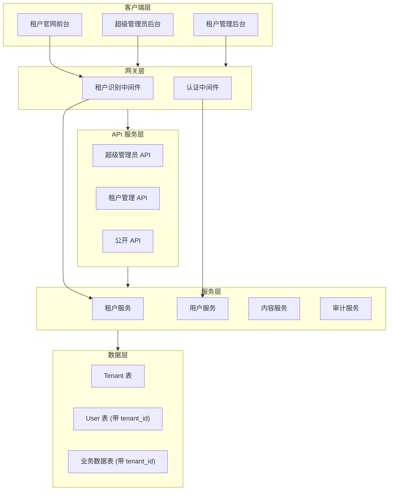
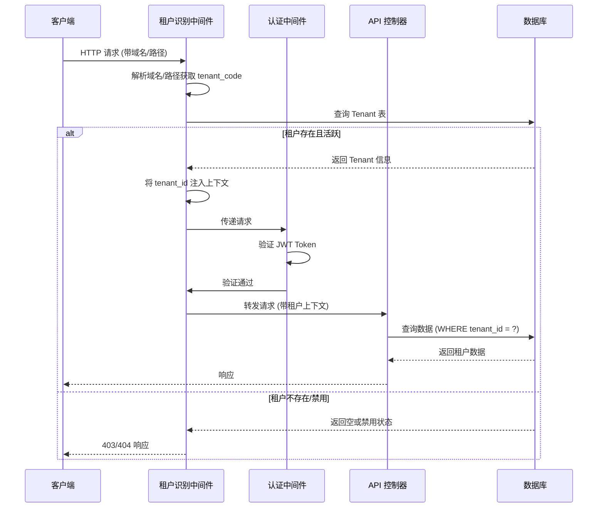
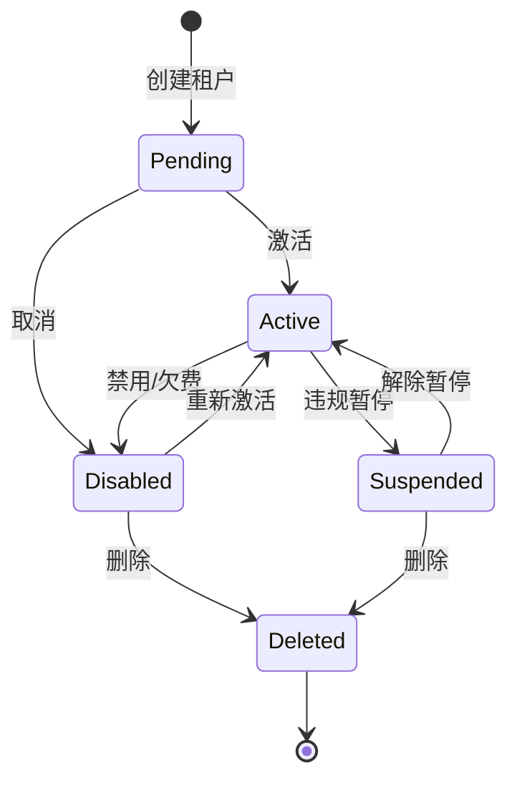
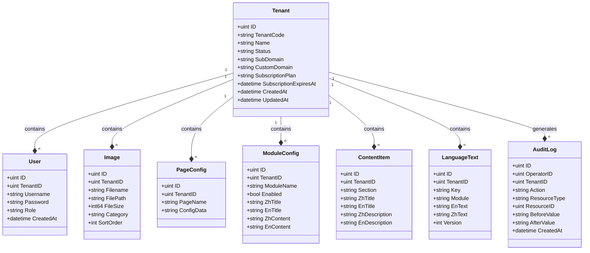
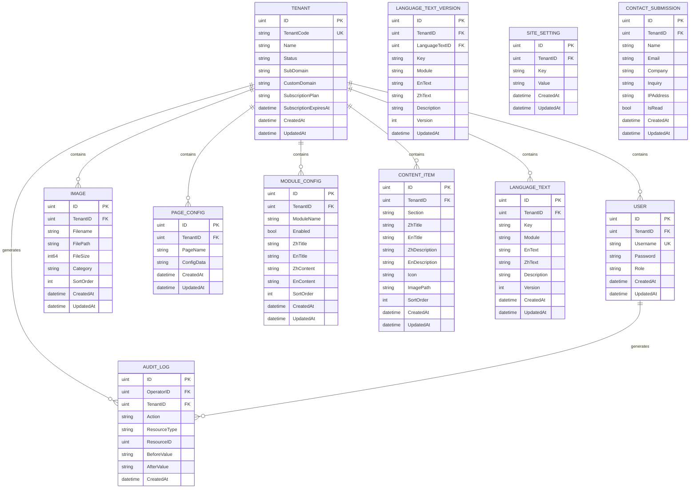

# SaaS 架构改造技术设计文档

## 1. 概述

### 1.1 系统/功能总结

本设计文档描述将现有单租户 CMS 系统改造为多租户 SaaS 架构的技术方案。核心设计包括：
- **租户模型**：新增 Tenant 实体，通过 tenant_id 实现数据行级别隔离
- **超级管理员**：独立于租户的超级管理员角色，管理所有租户
- **租户识别**：支持子域名和路径两种租户识别方式
- **数据迁移**：现有数据迁移为默认租户数据

### 1.2 目的与价值

- 为系统提供多租户 SaaS 能力，支持商业化运营
- 保持现有功能的同时实现租户数据隔离
- 建立可扩展的架构基础

### 1.3 目标用户与使用场景

| 用户类型 | 使用场景 |
|----------|----------|
| 超级管理员 | 创建租户、管理订阅、查看系统统计 |
| 租户管理员 | 管理官网内容、配置、用户 |
| 官网访客 | 访问租户官网 |

### 1.4 关键技术与架构方法

- **数据隔离**：tenant_id 行级别隔离
- **租户识别**：中间件自动识别租户上下文
- **JWT 增强**：Token 中包含租户信息
- **渐进迁移**：保持向后兼容

---

## 2. 技术架构

### 2.1 C4 组件图

```mermaid
C4Context
  title SaaS 架构组件图

  Person(superadmin, "超级管理员", "管理所有租户的系统运营方")
  Person(tenant_admin, "租户管理员", "管理单个租户的管理员")
  Person(visitor, "官网访客", "访问租户官网的用户")

  System_Boundary(saaS, "SaaS CMS 系统") {
    Container(web_app, "Web 应用", "Go + Gin", "SaaS CMS 后端服务")
    
    Container_Boundary(middleware, "中间件层") {
      Component(tenant_middleware, "租户识别中间件", "Go", "根据域名/路径识别租户")
      Component(auth_middleware, "认证中间件", "Go", "JWT 认证与授权")
      Component(audit_middleware, "审计日志中间件", "Go", "记录关键操作")
    }

    Container_Boundary(api, "API 层") {
      Component(superadmin_api, "超级管理员 API", "Go", "租户管理、订阅管理")
      Component(tenant_api, "租户 API", "Go", "内容管理、配置管理")
      Component(public_api, "公开 API", "Go", "官网内容访问")
    }

    Container_Boundary(domain, "领域层") {
      Component(tenant_service, "租户服务", "Go", "租户生命周期管理")
      Component(user_service, "用户服务", "Go", "用户认证与授权")
      Component(content_service, "内容服务", "Go", "内容管理业务逻辑")
    }

    Db(database, "SQLite 数据库", "存储所有业务数据")
  }

  Rel(superadmin, web_app, "使用", "HTTPS")
  Rel(tenant_admin, web_app, "使用", "HTTPS")
  Rel(visitor, web_app, "访问", "HTTPS")

  Rel(web_app, middleware, "调用")
  Rel(middleware, api, "路由")
  Rel(api, domain, "调用")
  Rel(domain, database, "持久化")
```

### 2.2 技术架构流程图



### 2.3 关键技术选型

| 层级 | 技术 | 说明 |
|------|------|------|
| 后端框架 | Go + Gin | 保持现有技术栈 |
| 数据库 | SQLite | 保持现有，支持 tenant_id 隔离 |
| 认证 | JWT | 增强 Token 包含租户信息 |
| 中间件 | Gin Middleware | 租户识别、认证、审计 |
| 域名解析 | DNS + Nginx | 支持子域名和自定义域名 |

---

## 3. 业务实现

### 3.1 模块/服务职责

| 模块 | 职责 |
|------|------|
| Tenant Service | 租户 CRUD、状态管理、订阅管理 |
| User Service | 用户认证、角色管理、租户关联 |
| Content Service | 内容管理、自动 tenant_id 过滤 |
| Audit Service | 审计日志记录与查询 |

### 3.2 REST API 端点

#### 超级管理员 API

| 方法 | 路径 | 说明 |
|------|------|------|
| POST | /api/superadmin/tenants | 创建租户 |
| GET | /api/superadmin/tenants | 获取租户列表 |
| GET | /api/superadmin/tenants/:id | 获取租户详情 |
| PUT | /api/superadmin/tenants/:id | 更新租户 |
| DELETE | /api/superadmin/tenants/:id | 删除租户 |
| POST | /api/superadmin/tenants/:id/impersonate | 切换租户上下文 |
| GET | /api/superadmin/stats | 系统统计 |

#### 租户管理 API

| 方法 | 路径 | 说明 |
|------|------|------|
| POST | /api/tenant/users | 创建租户用户 |
| GET | /api/tenant/users | 获取租户用户列表 |
| PUT | /api/tenant/users/:id | 更新用户 |
| DELETE | /api/tenant/users/:id | 删除用户 |
| GET | /api/tenant/domain | 获取域名配置 |
| PUT | /api/tenant/domain | 更新域名配置 |

### 3.3 时序图 - 租户识别流程



### 3.4 状态图 - 租户生命周期



### 3.5 类图 - 核心数据模型



### 3.6 核心业务方法示例

```go
// Tenant Service
type TenantService interface {
    CreateTenant(ctx context.Context, req *CreateTenantRequest) (*Tenant, error)
    GetTenant(ctx context.Context, id uint) (*Tenant, error)
    ListTenants(ctx context.Context, filter *TenantFilter) ([]*Tenant, int64, error)
    UpdateTenant(ctx context.Context, id uint, req *UpdateTenantRequest) (*Tenant, error)
    DeleteTenant(ctx context.Context, id uint) error
    ActivateTenant(ctx context.Context, id uint) error
    DisableTenant(ctx context.Context, id uint) error
}

// User Service (增强)
type UserService interface {
    // 原有方法
    Login(username, password string) (*User, string, error)
    // 新增方法
    CreateUser(ctx context.Context, tenantID uint, req *CreateUserRequest) (*User, error)
    GetUserByTenant(ctx context.Context, tenantID uint, userID uint) (*User, error)
    ListUsersByTenant(ctx context.Context, tenantID uint, filter *UserFilter) ([]*User, int64, error)
}
```

---

## 4. 数据设计

### 4.1 实体关系图



### 4.2 核心数据表 SQL

```sql
-- 租户表
CREATE TABLE IF NOT EXISTS tenants (
    id INTEGER PRIMARY KEY AUTOINCREMENT,
    tenant_code TEXT UNIQUE NOT NULL,
    name TEXT NOT NULL,
    status TEXT DEFAULT 'active',
    sub_domain TEXT,
    custom_domain TEXT,
    subscription_plan TEXT DEFAULT 'free',
    subscription_expires_at DATETIME,
    created_at DATETIME DEFAULT CURRENT_TIMESTAMP,
    updated_at DATETIME DEFAULT CURRENT_TIMESTAMP
);

-- 用户表 (增加 tenant_id)
ALTER TABLE users ADD COLUMN tenant_id INTEGER REFERENCES tenants(id);
CREATE INDEX IF NOT EXISTS idx_users_tenant_id ON users(tenant_id);

-- 审计日志表
CREATE TABLE IF NOT EXISTS audit_logs (
    id INTEGER PRIMARY KEY AUTOINCREMENT,
    operator_id INTEGER,
    tenant_id INTEGER REFERENCES tenants(id),
    action TEXT NOT NULL,
    resource_type TEXT,
    resource_id INTEGER,
    before_value TEXT,
    after_value TEXT,
    created_at DATETIME DEFAULT CURRENT_TIMESTAMP
);
```

---

## 5. 错误处理

### 5.1 错误分类与响应格式

| 错误码 | HTTP 状态 | 说明 |
|--------|----------|------|
| TENANT_NOT_FOUND | 404 | 租户不存在 |
| TENANT_DISABLED | 403 | 租户已禁用 |
| TENANT_SUBSCRIPTION_EXPIRED | 403 | 租户订阅过期 |
| USER_NOT_IN_TENANT | 403 | 用户不属于该租户 |
| CROSS_TENANT_ACCESS | 403 | 跨租户访问被拒绝 |
| DOMAIN_NOT_CONFIGURED | 400 | 域名未配置 |

### 5.2 错误响应格式

```json
{
    "code": "TENANT_NOT_FOUND",
    "message": "租户不存在",
    "details": {
        "tenant_code": "invalid-tenant"
    }
}
```

### 5.3 错误处理策略

- 租户识别失败：返回 404/403，记录日志
- 认证失败：返回 401，记录审计日志
- 越权访问：返回 403，记录审计日志
- 系统错误：返回 500，记录详细日志

---

## 6. 测试策略

### 6.1 单元测试

- Tenant Service CRUD 测试
- 租户识别中间件测试
- JWT Token 租户信息解析测试
- 租户数据隔离测试

### 6.2 集成测试

- 租户创建到用户登录完整流程
- 跨租户访问拒绝测试
- 超级管理员切换租户测试
- 域名识别测试

### 6.3 端到端测试

- 多租户并发访问测试
- 租户禁用后访问测试
- 数据迁移验证测试

---

## 7. 安全考虑

### 7.1 认证与授权

- JWT Token 包含 tenant_id 和 role
- 中间件验证租户上下文
- RBAC 权限模型

### 7.2 数据隔离

- 所有查询自动添加 tenant_id 过滤
- GORM Scope 实现自动过滤
- 禁止跨租户查询

### 7.3 审计日志

- 记录所有敏感操作
- 超级管理员操作必须记录
- 日志不可篡改

### 7.4 输入验证

- 租户代码格式验证
- 域名格式验证
- SQL 注入防护