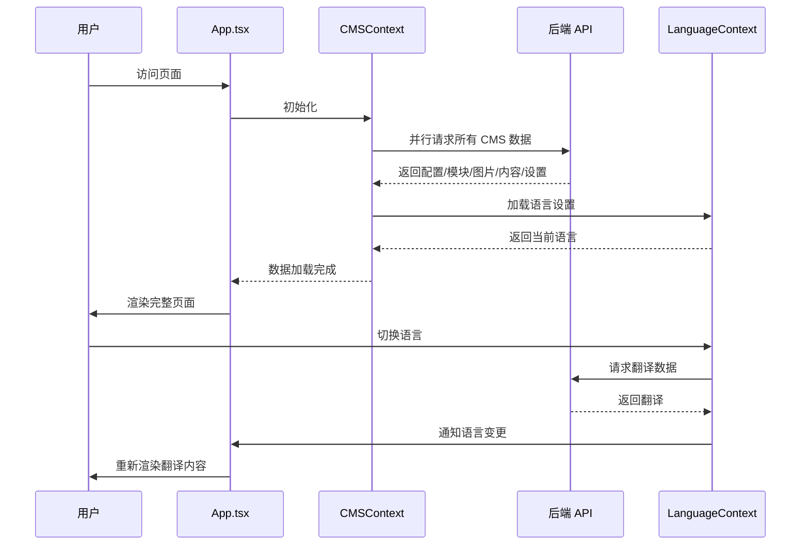
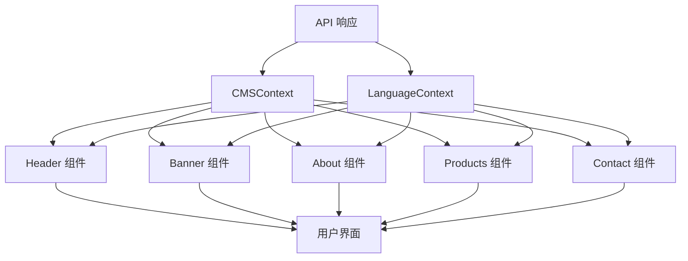
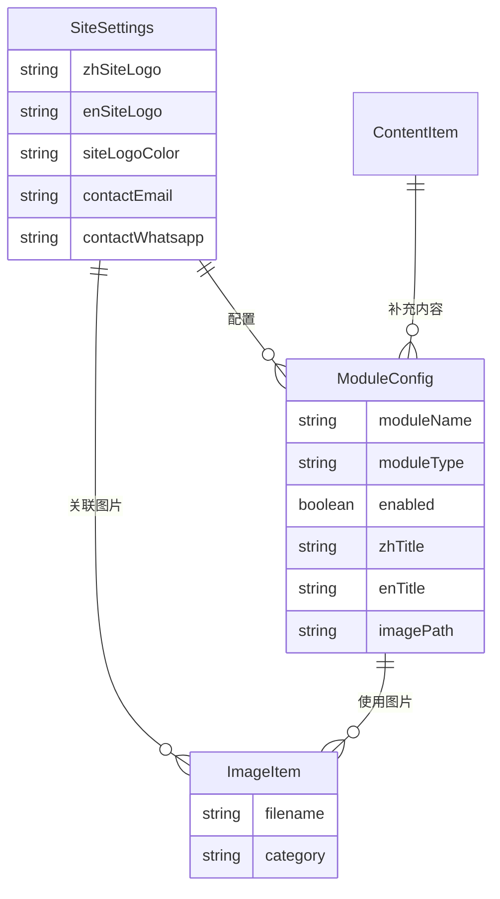

# 前端 React 架构迁移设计文档

## 1. 概述

### 1.1 系统总结

本设计文档描述将现有原生 JavaScript 前端迁移到 React 18 + TypeScript + Vite 架构的完整技术方案。新架构将实现组件化开发、统一状态管理和现代化构建流程。

### 1.2 目的与价值

- **组件化**：将现有 10 个 JS 组件转换为 React 函数组件
- **状态管理**：使用 Context API 统一管理语言和 CMS 数据状态
- **构建优化**：使用 Vite 实现快速开发和生产构建
- **类型安全**：使用 TypeScript 提供编译时类型检查

### 1.3 目标用户与使用场景

- **开发场景**：前端开发者使用 VSCode 进行组件开发
- **用户场景**：终端用户访问企业官网，体验与现有版本一致
- **部署场景**：构建产物部署到静态服务器，与 Go 后端配合

### 1.4 关键技术选型

| 技术 | 版本 | 用途 |
|------|------|------|
| React | 18.x | UI 框架 |
| TypeScript | 5.x | 类型系统 |
| Vite | 5.x | 构建工具 |
| React Router | 6.x | 路由管理（预留多页面扩展） |

## 2. 技术架构

### 2.1 C4 组件图

```mermaid
C4Context
    title 前端 React 架构组件图

    Person(user, "用户", "访问企业官网的访客")
    
    Container_Boundary(frontend, "前端应用") {
        Component(app, "App.tsx", "React 组件", "根组件，协调各子组件")
        Component(header, "Header", "React 组件", "导航栏、Logo、语言切换")
        Component(banner, "Banner", "React 组件", "首页 Banner 展示")
        Component(about, "About", "React 组件", "关于我们模块")
        Component(products, "Products", "React 组件", "产品展示")
        Component(contact, "Contact", "React 组件", "联系表单")
        
        Container_Boundary(contexts, "Contexts") {
            Component(langContext, "LanguageContext", "Context", "语言状态管理")
            Component(cmsContext, "CMSContext", "Context", "CMS 数据管理")
        }
        
        Container_Boundary(services, "Services") {
            Component(apiService, "apiService", "Service", "API 调用封装")
            Component(i18n, "i18n", "Service", "国际化服务")
        }
    }

    External_Boundary(backend, "后端服务") {
        Container(api, "Go Backend API", "Go + Gin", "提供 CMS 数据接口")
    }

    Rel(user, app, "访问")
    Rel(app, header, "渲染")
    Rel(app, banner, "渲染")
    Rel(app, about, "渲染")
    Rel(app, products, "渲染")
    Rel(app, contact, "渲染")
    Rel(header, langContext, "使用")
    Rel(banner, cmsContext, "使用")
    Rel(about, cmsContext, "使用")
    Rel(products, cmsContext, "使用")
    Rel(contact, cmsContext, "使用")
    Rel(apiService, api, "HTTP 请求", "GET /api/public/*")
    Rel(i18n, langContext, "读取/更新")
```

### 2.2 目录结构

```
frontend-react/
├── public/
│   └── index.html
├── src/
│   ├── components/
│   │   ├── common/
│   │   │   ├── Button.tsx
│   │   │   ├── Loading.tsx
│   │   │   └── ErrorBoundary.tsx
│   │   ├── layout/
│   │   │   ├── Header.tsx
│   │   │   └── Footer.tsx
│   │   └── sections/
│   │       ├── Banner.tsx
│   │       ├── Stats.tsx
│   │       ├── About.tsx
│   │       ├── Products.tsx
│   │       ├── Factory.tsx
│   │       ├── Advantage.tsx
│   │       ├── Events.tsx
│   │       └── Contact.tsx
│   ├── contexts/
│   │   ├── LanguageContext.tsx
│   │   └── CMSContext.tsx
│   ├── services/
│   │   ├── api.ts
│   │   └── i18n.ts
│   ├── hooks/
│   │   ├── useLanguage.ts
│   │   └── useCMSData.ts
│   ├── types/
│   │   ├── cms.ts
│   │   └── api.ts
│   ├── styles/
│   │   └── (复用现有 CSS)
│   ├── utils/
│   │   └── lazyLoad.ts
│   ├── App.tsx
│   ├── main.tsx
│   └── vite-env.d.ts
├── index.html
├── package.json
├── tsconfig.json
└── vite.config.ts
```

### 2.3 技术栈详细说明

#### 前端技术栈
- **React 18**：使用函数组件 + Hooks
- **TypeScript 5**：严格模式，提供完整类型定义
- **Vite 5**：ESBuild 快速构建，HMR 热更新

#### 状态管理
- **Context API**：轻量级全局状态
- **useReducer**：复杂状态逻辑

#### 样式方案
- **CSS Modules**：组件级样式隔离
- **复用现有 CSS**：保持视觉一致性

## 3. 业务实现

### 3.1 核心 Context 设计

#### LanguageContext

```typescript
// src/contexts/LanguageContext.tsx
interface LanguageContextType {
    currentLang: 'en' | 'zh';
    setLanguage: (lang: 'en' | 'zh') => void;
    t: (key: string) => string;
    isLoading: boolean;
}

export const LanguageContext = createContext<LanguageContextType | undefined>(undefined);

export function LanguageProvider({ children }: { children: React.ReactNode }) {
    const [currentLang, setCurrentLang] = useState<'en' | 'zh'>(() => {
        return (localStorage.getItem('preferredLang') as 'en' | 'zh') || 'en';
    });
    const [translations, setTranslations] = useState<Record<string, string>>({});
    const [isLoading, setIsLoading] = useState(false);

    const t = useCallback((key: string) => {
        return translations[key] || key;
    }, [translations]);

    const setLanguage = useCallback(async (lang: 'en' | 'zh') => {
        setCurrentLang(lang);
        localStorage.setItem('preferredLang', lang);
        // 触发翻译加载
    }, []);

    return (
        <LanguageContext.Provider value={{ currentLang, setLanguage, t, isLoading }}>
            {children}
        </LanguageContext.Provider>
    );
}
```

#### CMSContext

```typescript
// src/contexts/CMSContext.tsx
interface CMSData {
    config: Record<string, any>;
    modules: Record<string, ModuleConfig>;
    images: ImageItem[];
    contentItems: ContentItem[];
    siteSettings: SiteSettings;
}

interface CMSContextType {
    data: CMSData | null;
    isLoading: boolean;
    error: Error | null;
    refreshData: () => Promise<void>;
    getLangField: <T>(obj: T, field: string) => string;
}

export const CMSContext = createContext<CMSContextType | undefined>(undefined);
```

### 3.2 组件设计

#### Header 组件

```typescript
// src/components/layout/Header.tsx
interface HeaderProps {
    className?: string;
}

export function Header({ className }: HeaderProps) {
    const { currentLang, setLanguage, t } = useLanguage();
    const { data } = useCMSData();
    const [isMenuOpen, setIsMenuOpen] = useState(false);

    const logoText = currentLang === 'zh' 
        ? data?.siteSettings.zhSiteLogo 
        : data?.siteSettings.enSiteLogo;

    const handleLanguageToggle = () => {
        setLanguage(currentLang === 'en' ? 'zh' : 'en');
    };

    return (
        <header className={cn('header', className)}>
            <div className="container nav-wrap">
                <Logo text={logoText} color={data?.siteSettings.siteLogoColor} />
                <NavMenu 
                    isOpen={isMenuOpen}
                    onClose={() => setIsMenuOpen(false)}
                />
                <LanguageSwitcher 
                    currentLang={currentLang}
                    onToggle={handleLanguageToggle}
                />
                <Hamburger 
                    isOpen={isMenuOpen}
                    onClick={() => setIsMenuOpen(!isMenuOpen)}
                />
            </div>
        </header>
    );
}
```

#### Banner 组件

```typescript
// src/components/sections/Banner.tsx
export function Banner() {
    const { data } = useCMSData();
    const { t } = useLanguage();
    
    const bannerModule = data?.modules['banner'];
    const backgroundImage = bannerModule?.imagePath 
        ? `/uploads/${bannerModule.imagePath}`
        : data?.images.find(i => i.category === 'banner')?.filename;

    return (
        <section 
            className="banner"
            style={{
                background: `linear-gradient(135deg,rgba(10,92,173,0.9) 0%,rgba(6,58,117,0.85) 100%),url('/uploads/${backgroundImage}') center/cover no-repeat`
            }}
        >
            <div className="container banner-text">
                <h1 dangerouslySetInnerHTML={{ __html: t('banner.title') }} />
                <p data-i18n="banner.subtitle">{t('banner.subtitle')}</p>
                <div className="banner-actions">
                    <Button href="#products" variant="primary">
                        {t('banner.viewProducts')}
                    </Button>
                    <Button href="#contact" variant="outline">
                        {t('banner.getQuote')}
                    </Button>
                </div>
            </div>
        </section>
    );
}
```

### 3.3 API 服务层

```typescript
// src/services/api.ts
const API_BASE = '/api/public';

export const cmsApi = {
    async getConfig(): Promise<PageConfig[]> {
        const res = await fetch(`${API_BASE}/config`);
        return res.json();
    },
    
    async getModules(): Promise<ModuleConfig[]> {
        const res = await fetch(`${API_BASE}/modules`);
        return res.json();
    },
    
    async getImages(): Promise<ImageItem[]> {
        const res = await fetch(`${API_BASE}/images`);
        return res.json();
    },
    
    async getContent(): Promise<ContentItem[]> {
        const res = await fetch(`${API_BASE}/content`);
        return res.json();
    },
    
    async getSiteSettings(): Promise<SiteSettings> {
        const res = await fetch(`${API_BASE}/site-settings`);
        return res.json();
    },
    
    async getTranslations(): Promise<Translations> {
        const res = await fetch(`${API_BASE}/lang`);
        return res.json();
    }
};

// 统一数据加载
export async function loadAllCMSData(): Promise<CMSData> {
    const [config, modules, images, content, siteSettings] = await Promise.all([
        cmsApi.getConfig(),
        cmsApi.getModules(),
        cmsApi.getImages(),
        cmsApi.getContent(),
        cmsApi.getSiteSettings()
    ]);
    
    return { config, modules, images, content, siteSettings };
}
```

### 3.4 时序图



### 3.5 数据流图



## 4. 数据设计

### 4.1 TypeScript 类型定义

```typescript
// src/types/cms.ts

export interface SiteSettings {
    zhSiteLogo: string;
    enSiteLogo: string;
    siteLogoColor: string;
    zhSiteTitle: string;
    enSiteTitle: string;
    contactEmail: string;
    contactWhatsapp: string;
    contactPhone: string;
    contactAddress: string;
}

export interface ModuleConfig {
    id: number;
    moduleName: string;
    moduleType: string;
    enabled: boolean;
    zhTitle?: string;
    enTitle?: string;
    zhSubtitle?: string;
    enSubtitle?: string;
    zhContent?: string;
    enContent?: string;
    imagePath?: string;
    sortOrder: number;
}

export interface ImageItem {
    id: number;
    filename: string;
    originalName: string;
    category: string;
    uploadedAt: string;
}

export interface ContentItem {
    id: number;
    pageName: string;
    contentType: string;
    zhContent: string;
    enContent: string;
}

export interface PageConfig {
    id: number;
    pageName: string;
    configData: string; // JSON string
}

export interface Translations {
    en: Record<string, string>;
    zh: Record<string, string>;
}
```

### 4.2 实体关系图



## 5. 错误处理

### 5.1 错误分类

| 错误类型 | HTTP 状态码 | 处理策略 |
|---------|------------|---------|
| 网络错误 | - | 使用默认数据降级 |
| 404 Not Found | 404 | 记录日志，显示空状态 |
| 500 Server Error | 500 | 显示友好错误提示 |
| 数据格式错误 | - | 使用默认值替代 |

### 5.2 错误边界组件

```typescript
// src/components/common/ErrorBoundary.tsx
export class ErrorBoundary extends React.Component<
    { children: React.ReactNode },
    { hasError: boolean }
> {
    state = { hasError: false };

    static getDerivedStateFromError() {
        return { hasError: true };
    }

    componentDidCatch(error: Error, info: React.ErrorInfo) {
        console.error('ErrorBoundary caught:', error, info);
    }

    render() {
        if (this.state.hasError) {
            return <FallbackUI />;
        }
        return this.props.children;
    }
}
```

### 5.3 API 错误处理

```typescript
// src/services/api.ts
export async function safeFetch<T>(url: string, defaultValue: T): Promise<T> {
    try {
        const res = await fetch(url);
        if (!res.ok) throw new Error(`HTTP ${res.status}`);
        return await res.json();
    } catch (error) {
        console.warn(`API fetch failed: ${url}`, error);
        return defaultValue;
    }
}
```

## 6. 测试策略

### 6.1 单元测试

- **组件测试**：使用 React Testing Library
- **Hooks 测试**：测试自定义 Hooks 逻辑
- **工具函数测试**：测试 i18n、API 适配器等

### 6.2 集成测试

- **Context 集成**：测试组件与 Context 的交互
- **API 集成**：模拟 API 响应测试数据流

### 6.3 E2E 测试

- **关键用户流程**：页面加载、语言切换、表单提交
- **跨浏览器测试**：Chrome、Firefox、Safari

## 7. 安全考虑

### 7.1 XSS 防护

- 使用 `dangerouslySetInnerHTML` 时严格过滤
- 所有用户输入进行转义处理

### 7.2 CSP 配置

```html
<!-- index.html -->
<meta http-equiv="Content-Security-Policy" 
      content="default-src 'self'; script-src 'self' 'unsafe-inline'; style-src 'self' 'unsafe-inline'; img-src 'self' data: https:;">
```

### 7.3 输入验证

- 表单字段前端验证 + 后端验证
- 邮箱、电话格式校验

## 8. 构建与部署

### 8.1 Vite 配置

```typescript
// vite.config.ts
export default defineConfig({
    plugins: [react()],
    build: {
        outDir: '../frontend',
        emptyOutDir: true,
        rollupOptions: {
            input: {
                main: resolve(__dirname, 'index.html')
            }
        }
    },
    server: {
        proxy: {
            '/api': 'http://localhost:8080'
        }
    }
});
```

### 8.2 构建产物

```
frontend/              # 构建输出目录（与现有后端集成）
├── index.html
├── assets/
│   ├── index-[hash].js
│   ├── index-[hash].css
│   └── chunks/        # 代码分割产物