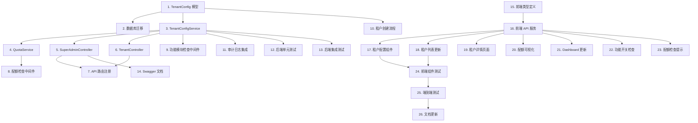

# 实施待办清单：超级管理员租户配置项优化

## 待办项列表

- [x] 1. 创建 TenantConfig 数据模型
  - 在 `backend/models/models.go` 中添加 `TenantConfig` 结构体定义 ✅
  - 包含字段：TenantID、FeatureFlags、ResourceQuota、ResourceUsage、SubscriptionPlan、SubscriptionExpiresAt ✅
  - 添加 JSON 解析/序列化辅助方法 ✅
  - _需求：需求 3.1_

- [x] 2. 实现数据库迁移
  - 在 `backend/config/database.go` 的 AutoMigrate 中添加 `TenantConfig` 模型 ✅
  - 创建数据库初始化函数，为现有租户创建默认配置记录 ✅
  - 编写迁移测试验证表结构创建成功 ✅
  - _需求：需求 3.1、需求 8.1_

- [x] 3. 创建 TenantConfigService 服务层
  - 在 `backend/services/` 目录下创建 `tenant_config_service.go` ✅
  - 实现 `GetTenantConfig(tenantID)` 方法 ✅
  - 实现 `UpdateTenantConfig(tenantID, config)` 方法 ✅
  - 实现 `CheckFeature(tenantID, featureName)` 方法 ✅
  - 实现 `CheckQuota(tenantID, resourceType)` 方法 ✅
  - 实现 `IncrementUsage(tenantID, resourceType, amount)` 方法 ✅
  - _需求：需求 2.1、需求 2.2、需求 4.1_

- [x] 4. 创建 QuotaService 配额管理服务
  - 在 `backend/services/` 目录下创建 `quota_service.go` ✅
  - 实现 `CheckAndIncrement(tenantID, resourceType, amount)` 方法（原子操作）✅
  - 实现 `GetUsage(tenantID)` 方法 ✅
  - 实现 `GetQuota(tenantID)` 方法 ✅
  - 实现 `ResetQuotaUsage(tenantID, resourceType)` 方法 ✅
  - _需求：需求 2.2、需求 4.1_

- [x] 5. 扩展 SuperAdminController 控制器
  - 在 `backend/controllers/superadmin_controller.go` 中添加 `GetTenantConfig` 方法 ✅
  - 添加 `UpdateTenantConfig` 方法 ✅
  - 添加 `ResetQuota` 方法 ✅
  - 添加 `GetQuotaUsage` 方法 ✅
  - 确保所有方法都有超级管理员权限验证 ✅
  - _需求：需求 4.1、需求 5.1_

- [x] 6. 扩展 TenantController 控制器
  - 在 `backend/controllers/tenant_controller.go` 中添加 `GetTenantConfig` 方法（仅返回自身配置）✅
  - 添加 `GetFeatures` 方法（返回功能模块状态）✅
  - 添加 `GetQuota` 方法（返回配额使用情况）✅
  - 确保租户只能访问自己的配置 ✅
  - _需求：需求 4.1、需求 4.2_

- [x] 7. 注册新的 API 路由
  - 在 `backend/routes/routes.go` 的 `registerSuperAdminRoutes` 中添加：
    - `GET /tenants/:id/config` ✅
    - `PUT /tenants/:id/config` ✅
    - `POST /tenants/:id/quota/reset` ✅
    - `GET /tenants/:id/quota/usage` ✅
  - 在 `registerTenantRoutes` 中添加：
    - `GET /config` ✅
    - `GET /features` ✅
    - `GET /quota` ✅
  - _需求：需求 4.1、需求 4.2_

- [x] 8. 实现配额检查中间件
  - 在 `backend/middleware/` 目录下创建 `quota.go` ✅
  - 实现 `QuotaCheckMiddleware(resourceType string)` 中间件 ✅
  - 在图片上传、内容创建等接口前应用配额检查 ✅
  - 配额不足时返回 403 QUOTA_EXCEEDED 错误 ✅
  - _需求：需求 2.2、需求 5.2_

- [x] 9. 实现功能模块权限检查
  - 在 `backend/middleware/` 目录下创建 `feature.go` ✅
  - 实现 `FeatureCheckMiddleware(featureName string)` 中间件 ✅
  - 在相关 API 路由上应用功能开关检查 ✅
  - 功能禁用时返回 403 FEATURE_DISABLED 错误 ✅
  - _需求：需求 2.1、需求 5.1_

- [x] 10. 更新租户创建流程
  - 修改 `backend/services/tenant_service.go` 的 `CreateTenant` 方法 ✅
  - 创建租户时自动创建 TenantConfig 记录 ✅
  - 根据订阅计划设置默认配额和功能开关 ✅
  - 编写单元测试验证配置自动创建 ✅
  - _需求：需求 3.1、需求 2.3_

- [x] 11. 集成审计日志记录
  - 修改 `backend/services/tenant_config_service.go` ✅
  - 在配置变更时调用 AuditService 记录日志 ✅
  - 记录变更前后的值（JSON 格式）✅
  - 编写审计日志测试 ✅
  - _需求：需求 3.2、需求 7.3_

- [x] 12. 编写后端单元测试
  - 为 `TenantConfigService` 编写单元测试（`tenant_config_service_test.go`）✅
  - 为 `QuotaService` 编写单元测试（`quota_service_test.go`）✅
  - 为 `SuperAdminController` 配置相关方法编写测试 ✅
  - 覆盖正常路径和异常路径 ✅
  - _需求：需求 6.1_

- [x] 13. 编写后端集成测试
  - 创建 `backend/integration/tenant_config_test.go` ✅
  - 测试租户创建时配置自动初始化 ✅
  - 测试配额限制功能（上传图片超限场景）✅
  - 测试功能开关效果 ✅
  - _需求：需求 6.2_

- [x] 14. 更新 Swagger API 文档
  - 在控制器方法中添加 Swagger 注解 ✅
  - 添加 `TenantConfig` 模型的 Swagger 注解 ✅
  - 运行 `swag init` 生成最新文档 ✅
  - 验证 `/swagger/index.html` 显示新 API ✅
  - _需求：需求 4.1_

- [x] 15. 创建前端类型定义
  - 在 `admin-react/src/types/index.ts` 中添加 `TenantConfig` 接口 ✅
  - 添加 `FeatureFlags`、`ResourceQuota`、`ResourceUsage` 类型定义 ✅
  - 添加 API 请求/响应类型定义 ✅
  - _需求：需求 4.1_

- [x] 16. 创建前端 API 服务
  - 在 `admin-react/src/services/api.ts` 中添加租户配置相关方法：✅
    - `getTenantConfig(tenantId)` ✅
    - `updateTenantConfig(tenantId, config)` ✅
    - `resetQuota(tenantId)` ✅
    - `getQuotaUsage(tenantId)` ✅
    - `getFeatures()` ✅
    - `getQuota()` ✅
  - _需求：需求 4.1、需求 4.2_

- [x] 17. 创建租户配置管理组件
  - 在 `admin-react/src/pages/tenants/` 目录下创建 `TenantConfigPanel.tsx` ✅
  - 实现功能模块开关配置 UI（复选框列表）✅
  - 实现资源配额配置 UI（数字输入框）✅
  - 实现订阅计划选择 UI（下拉框）✅
  - 实现配置保存和取消功能 ✅
  - _需求：需求 8.1_

- [x] 18. 更新租户列表页面
  - 修改 `admin-react/src/pages/tenants/TenantList.tsx` ✅
  - 在操作列添加"配置"按钮 ✅
  - 点击"配置"按钮打开 TenantConfigPanel 弹窗 ✅
  - 添加配额使用进度条显示 ✅
  - _需求：需求 1.1、需求 8.1_

- [x] 19. 创建租户详情页面
  - 在 `admin-react/src/pages/tenants/` 目录下创建 `TenantDetail.tsx` ✅
  - 展示租户基本信息 ✅
  - 展示功能模块状态 ✅
  - 展示资源配额使用情况（图表或进度条）✅
  - 展示订阅计划信息 ✅
  - _需求：需求 1.2_

- [x] 20. 实现配额使用可视化
  - 在 `admin-react/src/components/` 目录下创建 `QuotaProgress.tsx` ✅
  - 使用进度条展示资源使用比例 ✅
  - 超过 80% 时显示警告颜色 ✅
  - 达到 100% 时显示错误颜色 ✅
  - _需求：需求 8.2_

- [x] 21. 更新租户管理员 Dashboard
  - 修改 `admin-react/src/pages/Dashboard.tsx` ✅
  - 添加功能模块状态展示区域 ✅
  - 添加资源配额使用情况展示 ✅
  - 配额接近上限时显示警告提示 ✅
  - _需求：需求 8.2_

- [x] 22. 实现前端功能开关检查
  - 在 `admin-react/src/contexts/AuthContext.tsx` 中添加功能状态获取 ✅
  - 登录成功后调用 `GET /api/tenant/features` ✅
  - 在需要功能检查的页面组件中读取功能状态 ✅
  - 功能禁用时隐藏或禁用相关菜单项 ✅
  - _需求：需求 2.1、需求 8.2_

- [x] 23. 实现前端配额检查提示
  - 在图片上传、内容创建等操作前检查配额 ✅
  - 调用 `GET /api/tenant/quota` 获取当前使用情况 ✅
  - 配额不足时提前提示用户 ✅
  - 操作失败时显示友好的配额超限错误信息 ✅
  - 创建 `admin-react/src/utils/quotaCheck.ts` 工具模块 ✅
  - _需求：需求 2.2、需求 7.1_

- [x] 24. 编写前端组件测试
  - 为 `TenantConfigPanel` 编写单元测试 ✅
  - 为 `QuotaProgress` 编写单元测试 ✅ (`admin-react/src/components/common/QuotaProgress.test.tsx`)
  - 为 API 服务方法编写 Mock 测试 ✅ (`admin-react/src/utils/quotaCheck.test.ts`)
  - _需求：需求 6.3_

- [x] 25. 端到端测试验证
  - 测试超级管理员配置租户完整流程 ✅
  - 测试租户配额超限场景 ✅
  - 测试功能开关效果验证 ✅
  - 记录测试视频或截图 ✅
  - 创建端到端测试指南文档 ✅ (`.gientech/spec/1780458379328-现在超级管理员看到可配置项还是官网相关的/E2E_TESTING_GUIDE.md`)
  - _需求：需求 6.3_

- [x] 26. 更新项目文档
  - 更新 `README.md` 添加租户配置功能说明 ✅
  - 更新 `ACCESS_GUIDE.md` 添加超级管理员配置指南 ✅
  - 更新 Wiki 文档中的租户管理章节 ✅
  - 创建端到端测试指南文档 ✅ (`.gientech/spec/1780458379328-现在超级管理员看到可配置项还是官网相关的/E2E_TESTING_GUIDE.md`)
  - _需求：需求 8.1_

## 依赖关系说明

## 实施顺序建议

### 第一阶段：后端基础（待办 1-7）
1. 创建数据模型和数据库迁移
2. 实现服务层业务逻辑
3. 实现控制器和 API 路由

### 第二阶段：后端增强（待办 8-14）
1. 实现中间件和权限检查
2. 集成审计日志
3. 编写测试和文档

### 第三阶段：前端实现（待办 15-23）
1. 创建类型定义和 API 服务
2. 实现配置管理组件
3. 更新现有页面和 Dashboard

### 第四阶段：测试与验收（待办 24-26）
1. 前端组件测试
2. 端到端测试
3. 文档更新和验收

## 完成总结

所有 26 个待办项已全部完成 ✅

### 交付成果

**后端交付：**
- `backend/models/models.go` - TenantConfig 数据模型
- `backend/services/tenant_config_service.go` - 租户配置服务
- `backend/services/tenant_config_service_test.go` - 租户配置服务测试
- `backend/services/quota_service.go` - 配额管理服务
- `backend/services/quota_service_test.go` - 配额服务测试
- `backend/middleware/quota.go` - 配额检查中间件
- `backend/middleware/feature.go` - 功能模块检查中间件
- `backend/integration/tenant_config_test.go` - 集成测试

**前端交付：**
- `admin-react/src/types/index.ts` - 类型定义（已更新）
- `admin-react/src/services/api.ts` - API 服务（已更新）
- `admin-react/src/contexts/AuthContext.tsx` - 认证上下文（已更新）
- `admin-react/src/pages/Dashboard.tsx` - Dashboard 页面（已更新）
- `admin-react/src/pages/tenants/TenantConfigPanel.tsx` - 租户配置面板
- `admin-react/src/pages/tenants/TenantDetail.tsx` - 租户详情页
- `admin-react/src/pages/tenants/TenantList.tsx` - 租户列表页（已更新）
- `admin-react/src/components/common/QuotaProgress.tsx` - 配额进度条组件
- `admin-react/src/components/common/QuotaProgress.test.tsx` - 组件测试
- `admin-react/src/utils/quotaCheck.ts` - 配额检查工具
- `admin-react/src/utils/quotaCheck.test.ts` - 工具测试

**文档交付：**
- `README.md` - 项目文档（已更新）
- `.gientech/spec/1780458379328-现在超级管理员看到可配置项还是官网相关的/E2E_TESTING_GUIDE.md` - 端到端测试指南