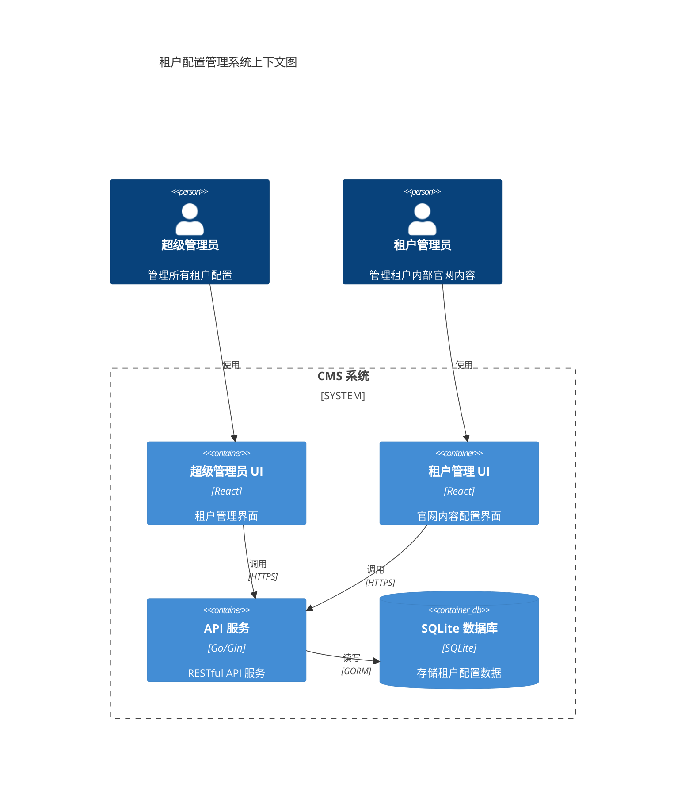
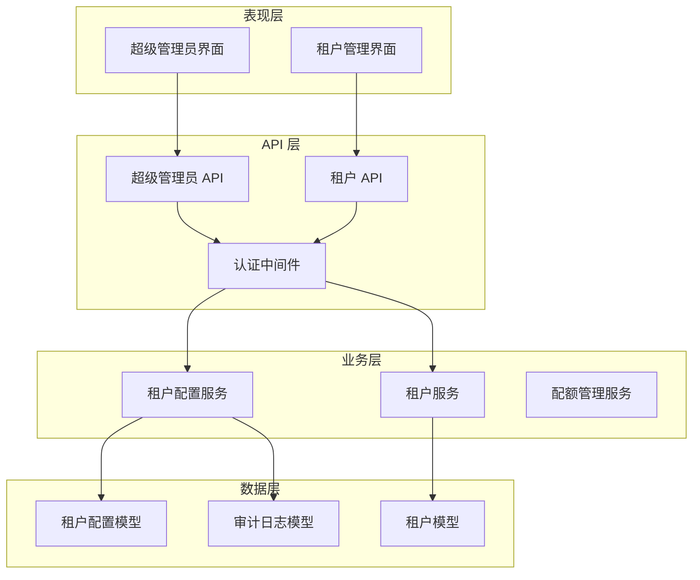
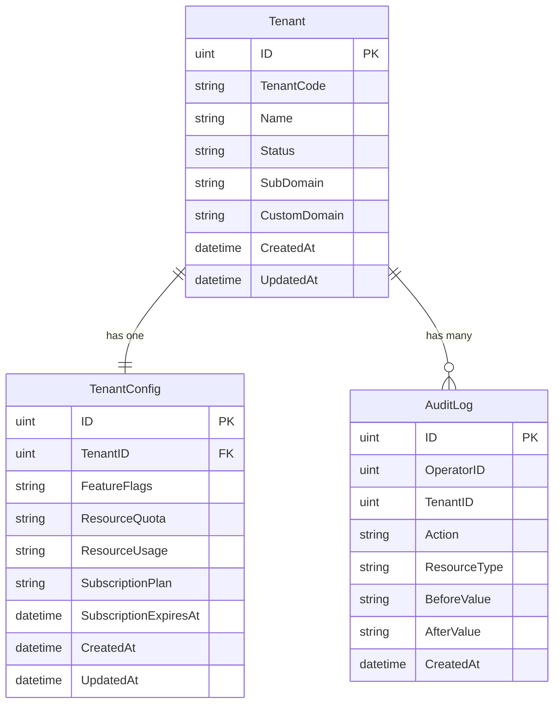
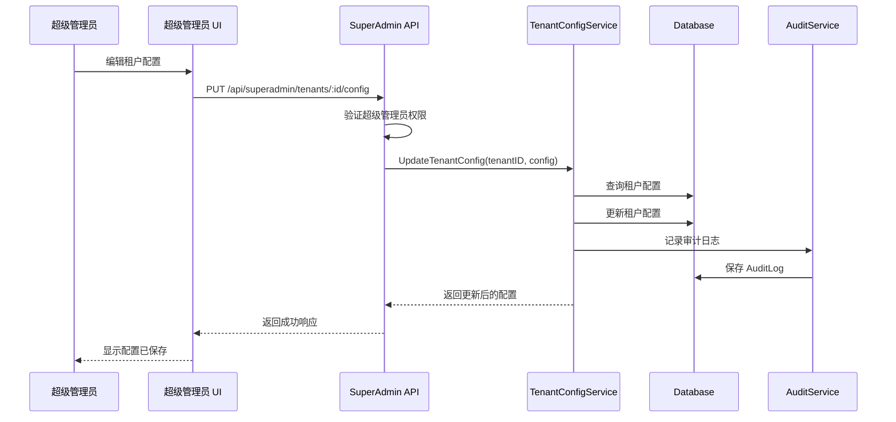
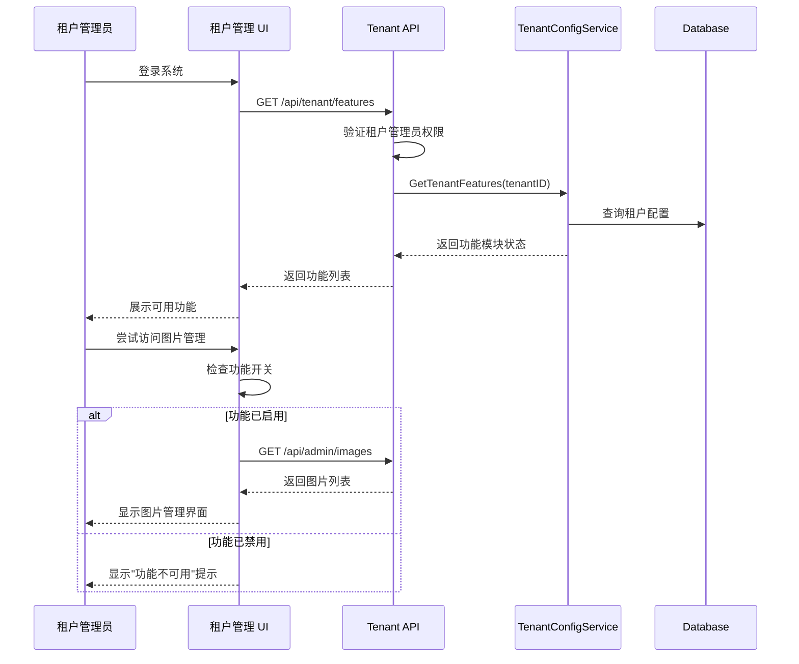
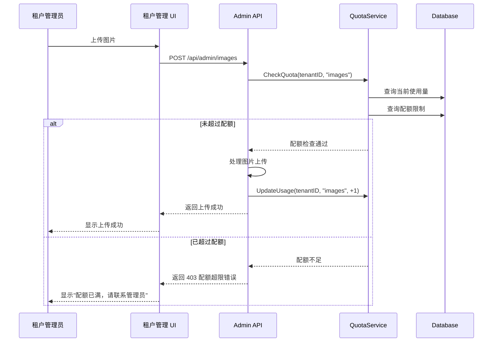
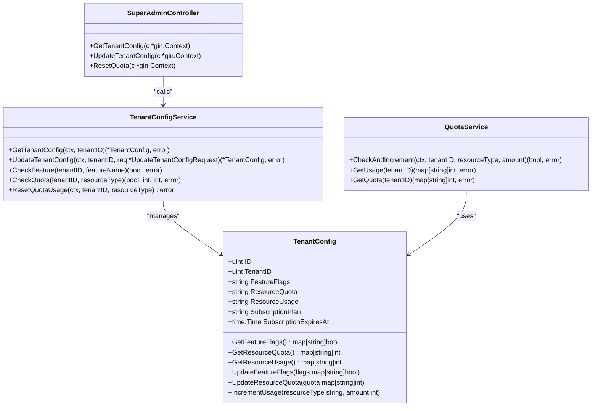

# 设计文档：超级管理员租户配置项优化

## 1. 概述

### 1.1 系统/功能总结

本设计文档描述了超级管理员租户配置功能的详细技术方案。核心目标是将超级管理员的可配置项从官网相关内容转变为租户级别的配置项，包括功能模块开关、资源配额和订阅计划管理。

### 1.2 目的与价值

- **职责分离**：明确超级管理员与租户管理员的职责边界
- **配置集中**：超级管理员可集中管理租户级别的配置
- **商业支持**：支持不同订阅计划的功能差异化配置

### 1.3 目标用户与使用场景

| 用户角色 | 使用场景 |
|----------|----------|
| 超级管理员 | 创建租户时配置初始功能和配额、调整租户订阅计划、启用/禁用租户功能模块 |
| 租户管理员 | 查看当前租户的配置状态和配额使用情况 |

### 1.4 关键技术与架构方法

- 后端：Go + Gin 框架，新增 TenantConfig 模型和相关 API
- 数据库：SQLite + GORM ORM
- 前端：React + TypeScript，新增租户配置管理组件
- 认证：JWT Token 角色权限控制

## 2. 技术架构

### 2.1 C4 组件图



### 2.2 系统分层架构



### 2.3 技术选型

| 层次 | 技术选型 | 说明 |
|------|----------|------|
| 前端框架 | React 18 + TypeScript | 类型安全，组件化开发 |
| 前端状态管理 | React Hooks | 轻量级状态管理 |
| 后端框架 | Gin v1.9+ | 高性能 Go Web 框架 |
| ORM | GORM v2 | Go 语言 ORM 库 |
| 数据库 | SQLite | 内嵌数据库，无需额外部署 |
| 认证 | JWT (golang-jwt/jwt/v5) | 无状态认证 |
| API 文档 | Swagger/OpenAPI | 自动生成 API 文档 |

## 3. 业务实现

### 3.1 模块/服务职责

| 模块/服务 | 职责 |
|-----------|------|
| `TenantConfig` 模型 | 存储租户配置数据（功能模块、资源配额、订阅计划） |
| `TenantConfigService` | 处理租户配置的 CRUD 业务逻辑 |
| `QuotaService` | 管理资源配额的使用统计和限制检查 |
| `SuperAdminController` | 处理超级管理员的 HTTP 请求 |
| `TenantController` | 处理租户管理员获取自身配置的请求 |

### 3.2 数据模型设计

#### 3.2.1 TenantConfig 模型

```go
// TenantConfig 租户配置模型
// @Description 存储租户级别的配置信息，包括功能模块开关、资源配额、订阅计划
type TenantConfig struct {
    // GORM 自动管理的 ID
    gorm.Model
    // 租户 ID（唯一关联）
    TenantID uint `gorm:"uniqueIndex;not null" json:"tenant_id" example:"1"`
    // 功能模块配置（JSON 格式）
    // 结构：{"image_management": true, "page_config": true, "multi_language": false, ...}
    FeatureFlags string `gorm:"type:text" json:"feature_flags" example:"{\"image_management\":true,\"page_config\":true}"`
    // 资源配额配置（JSON 格式）
    // 结构：{"max_images": 100, "max_storage_mb": 1024, "max_content_items": 50, "max_users": 5}
    ResourceQuota string `gorm:"type:text" json:"resource_quota" example:"{\"max_images\":100,\"max_storage_mb\":1024}"`
    // 资源使用统计（JSON 格式）
    // 结构：{"used_images": 45, "used_storage_mb": 512, "used_content_items": 20, "used_users": 3}
    ResourceUsage string `gorm:"type:text" json:"resource_usage" example:"{\"used_images\":45,\"used_storage_mb\":512}"`
    // 订阅计划（free/pro/enterprise）
    SubscriptionPlan string `gorm:"default:'free'" json:"subscription_plan" example:"pro"`
    // 订阅过期时间
    SubscriptionExpiresAt *time.Time `json:"subscription_expires_at,omitempty" example:"2025-12-31T23:59:59Z"`
    // 租户关联
    Tenant Tenant `gorm:"foreignKey:TenantID" json:"tenant,omitempty"`
}
```

#### 3.2.2 实体关系图



### 3.3 API 端点设计

#### 3.3.1 超级管理员 API

| 方法 | 路径 | 描述 | 请求体 | 响应 |
|------|------|------|--------|------|
| GET | `/api/superadmin/tenants/:id/config` | 获取租户配置 | - | `TenantConfig` |
| PUT | `/api/superadmin/tenants/:id/config` | 更新租户配置 | `UpdateTenantConfigRequest` | `TenantConfig` |
| POST | `/api/superadmin/tenants/:id/quota/reset` | 重置租户配额使用统计 | `ResetQuotaRequest` | `{"message": "配额重置成功"}` |
| GET | `/api/superadmin/tenants/:id/quota/usage` | 获取租户配额使用情况 | - | `ResourceUsage` |

#### 3.3.2 租户 API

| 方法 | 路径 | 描述 | 请求体 | 响应 |
|------|------|------|--------|------|
| GET | `/api/tenant/config` | 获取当前租户配置 | - | `TenantConfig`（隐藏敏感字段） |
| GET | `/api/tenant/features` | 获取当前租户功能模块状态 | - | `FeatureFlags` |
| GET | `/api/tenant/quota` | 获取当前租户配额使用情况 | - | `ResourceUsageWithLimit` |

### 3.4 时序图

#### 3.4.1 超级管理员更新租户配置



#### 3.4.2 租户管理员检查功能权限



#### 3.4.3 资源配额检查流程



### 3.5 类图



### 3.6 核心业务方法示例

```typescript
// TypeScript 接口定义
interface TenantConfig {
  id: number;
  tenantId: number;
  featureFlags: Record<string, boolean>;
  resourceQuota: Record<string, number>;
  resourceUsage: Record<string, number>;
  subscriptionPlan: string;
  subscriptionExpiresAt?: string;
}

interface UpdateTenantConfigRequest {
  featureFlags?: Record<string, boolean>;
  resourceQuota?: Record<string, number>;
  subscriptionPlan?: string;
  subscriptionExpiresAt?: string;
}

// 默认订阅计划配置
const DEFAULT_SUBSCRIPTION_CONFIG: Record<string, { quota: Record<string, number>; features: Record<string, boolean> }> = {
  free: {
    quota: {
      max_images: 50,
      max_storage_mb: 512,
      max_content_items: 20,
      max_users: 3
    },
    features: {
      image_management: true,
      page_config: true,
      multi_language: false,
      contact_form: true,
      content_management: true
    }
  },
  pro: {
    quota: {
      max_images: 500,
      max_storage_mb: 5120,
      max_content_items: 100,
      max_users: 10
    },
    features: {
      image_management: true,
      page_config: true,
      multi_language: true,
      contact_form: true,
      content_management: true
    }
  },
  enterprise: {
    quota: {
      max_images: -1, // 无限制
      max_storage_mb: -1,
      max_content_items: -1,
      max_users: -1
    },
    features: {
      image_management: true,
      page_config: true,
      multi_language: true,
      contact_form: true,
      content_management: true,
      advanced_analytics: true
    }
  }
};
```

### 3.7 与外部服务的通信

本系统为独立 CMS 系统，暂无外部服务集成需求。未来可扩展：
- 邮件服务：订阅到期提醒通知
- 支付服务：订阅计划升级/续费

## 4. 数据设计

### 4.1 数据库表结构

```sql
-- TenantConfig 表
CREATE TABLE IF NOT EXISTS tenant_configs (
    id INTEGER PRIMARY KEY AUTOINCREMENT,
    tenant_id INTEGER UNIQUE NOT NULL,
    feature_flags TEXT NOT NULL DEFAULT '{}',
    resource_quota TEXT NOT NULL DEFAULT '{}',
    resource_usage TEXT NOT NULL DEFAULT '{}',
    subscription_plan TEXT NOT NULL DEFAULT 'free',
    subscription_expires_at DATETIME,
    created_at DATETIME NOT NULL,
    updated_at DATETIME NOT NULL,
    FOREIGN KEY (tenant_id) REFERENCES tenants(id) ON DELETE CASCADE
);

-- 创建索引
CREATE INDEX idx_tenant_configs_subscription_plan ON tenant_configs(subscription_plan);
CREATE INDEX idx_tenant_configs_subscription_expires_at ON tenant_configs(subscription_expires_at);
```

### 4.2 数据一致性要求

1. **租户配置与租户同步创建**：创建租户时自动创建默认配置记录
2. **租户删除级联**：删除租户时自动删除对应配置记录
3. **配额使用统计原子性**：使用数据库事务保证配额更新的原子性

### 4.3 核心 SQL 实现

```sql
-- 初始化租户配置（创建租户时调用）
INSERT INTO tenant_configs (
    tenant_id, 
    feature_flags, 
    resource_quota, 
    resource_usage, 
    subscription_plan,
    created_at, 
    updated_at
) VALUES (
    ?, 
    '{"image_management":true,"page_config":true,"multi_language":false,"contact_form":true,"content_management":true}',
    '{"max_images":50,"max_storage_mb":512,"max_content_items":20,"max_users":3}',
    '{"used_images":0,"used_storage_mb":0,"used_content_items":0,"used_users":0}',
    'free',
    datetime('now'),
    datetime('now')
);

-- 更新租户配置
UPDATE tenant_configs 
SET 
    feature_flags = ?,
    resource_quota = ?,
    subscription_plan = ?,
    subscription_expires_at = ?,
    updated_at = datetime('now')
WHERE tenant_id = ?;

-- 增加资源使用量
UPDATE tenant_configs 
SET 
    resource_usage = json_patch(resource_usage, json_object('used_images', json_extract(resource_usage, '$.used_images') + 1)),
    updated_at = datetime('now')
WHERE tenant_id = ?;

-- 查询租户配额使用情况
SELECT 
    tenant_id,
    json_extract(resource_quota, '$.max_images') as max_images,
    json_extract(resource_usage, '$.used_images') as used_images,
    json_extract(resource_quota, '$.max_storage_mb') as max_storage_mb,
    json_extract(resource_usage, '$.used_storage_mb') as used_storage_mb
FROM tenant_configs
WHERE tenant_id = ?;
```

## 5. 错误处理

### 5.1 错误分类与响应格式

| 错误类型 | HTTP 状态码 | 错误代码 | 说明 |
|----------|-------------|----------|------|
| 验证错误 | 400 | `INVALID_REQUEST` | 请求参数格式错误或必填字段缺失 |
| 租户不存在 | 404 | `TENANT_NOT_FOUND` | 指定 ID 的租户不存在 |
| 配置不存在 | 404 | `CONFIG_NOT_FOUND` | 租户配置记录不存在 |
| 权限不足 | 403 | `FORBIDDEN` | 非超级管理员尝试访问配置接口 |
| 配额超限 | 403 | `QUOTA_EXCEEDED` | 租户资源使用已超过配额限制 |
| 订阅过期 | 403 | `SUBSCRIPTION_EXPIRED` | 租户订阅已过期 |
| 服务器错误 | 500 | `INTERNAL_ERROR` | 数据库操作失败等内部错误 |

### 5.2 错误响应格式

```json
{
  "code": "QUOTA_EXCEEDED",
  "message": "资源配额已超限",
  "details": {
    "resource_type": "images",
    "used": 100,
    "limit": 100
  }
}
```

### 5.3 错误处理策略

1. **业务错误**：返回明确的错误代码和消息，便于前端展示
2. **系统错误**：记录详细日志，返回通用错误消息
3. **审计日志**：所有配置变更操作记录审计日志

## 6. 测试策略

### 6.1 单元测试

| 测试对象 | 测试内容 |
|----------|----------|
| `TenantConfigService.GetTenantConfig` | 正常获取、租户不存在、配置不存在 |
| `TenantConfigService.UpdateTenantConfig` | 正常更新、验证失败、并发更新 |
| `QuotaService.CheckQuota` | 配额充足、配额不足、无限制配额 |
| `SuperAdminController.UpdateTenantConfig` | 权限验证、参数验证、成功更新 |

### 6.2 集成测试

| 测试场景 | 测试内容 |
|----------|----------|
| 租户创建流程 | 创建租户时自动创建配置记录 |
| 配额限制流程 | 上传图片时检查配额限制 |
| 功能开关流程 | 禁用功能后租户无法访问 |
| 订阅过期流程 | 订阅过期后限制功能访问 |

### 6.3 端到端测试

| 测试场景 | 步骤 |
|----------|------|
| 超级管理员配置租户 | 登录→选择租户→修改配置→保存→验证 |
| 租户配额超限处理 | 上传多张图片→达到配额→继续上传→验证错误提示 |

## 7. 安全考虑

### 7.1 认证与授权

1. **JWT Token 验证**：所有配置 API 需要有效的 JWT Token
2. **角色权限校验**：租户配置 API 仅限超级管理员访问
3. **租户隔离**：租户管理员只能访问自己租户的配置

### 7.2 输入验证与清理

1. **JSON 格式验证**：功能模块和配额配置必须是有效的 JSON
2. **数值范围验证**：配额值必须为正整数或 -1（无限制）
3. **模块名称白名单**：功能模块名称必须是预定义的有效值

### 7.3 安全审计

1. **配置变更日志**：所有配置变更记录到 AuditLog
2. **敏感操作日志**：配额重置、订阅变更等操作记录详细日志
3. **日志保留策略**：审计日志至少保留 180 天

## 8. 部署与迁移

### 8.1 数据库迁移

```go
// 在 database.go 的 AutoMigrate 中添加
db.AutoMigrate(&TenantConfig{})
```

### 8.2 数据初始化

系统启动时检查现有租户，为没有配置记录的租户创建默认配置：

```go
// 初始化所有租户的默认配置
func InitializeTenantConfigs() error {
    var tenants []models.Tenant
    if err := db.Find(&tenants).Error; err != nil {
        return err
    }
    
    for _, tenant := range tenants {
        var config TenantConfig
        result := db.Where("tenant_id = ?", tenant.ID).First(&config)
        if result.Error == gorm.ErrRecordNotFound {
            // 创建默认配置
            db.Create(&TenantConfig{
                TenantID: tenant.ID,
                // ... 默认配置值
            })
        }
    }
    return nil
}